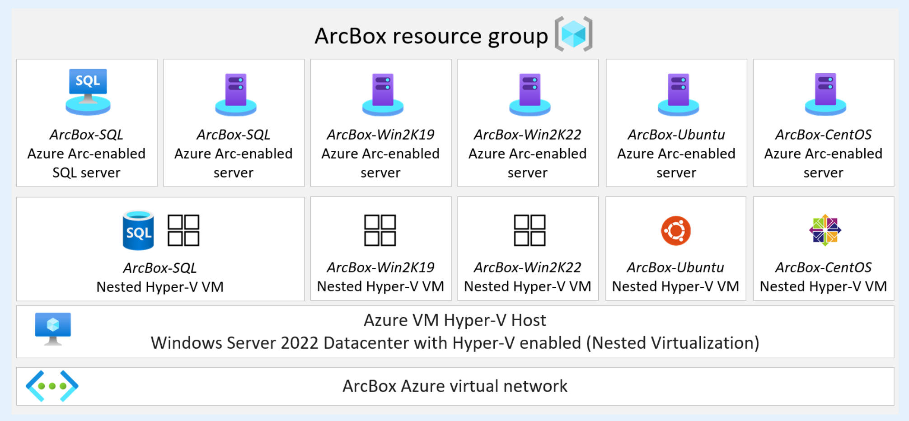

# Azure Arc-enabled Kubernetes Azure landing zone sandbox

With Azure Arc, you are onboarding infrastructure assets that are located outside of Azure, or deploying Azure services to any infrastructure, either on-premises or in a multicloud environment.

With Azure Arc-enabled Kubernetes, you can attach and configure Kubernetes clusters running anywhere. You can connect your clusters running on other public cloud providers or clusters running on your on-premises datacenter to Azure Arc.

To practice your skills in an Azure Arc-enabled Kubernetes environment, we created an automated, easy-to-deploy sandbox solution for all things Azure Arc named "ArcBox", which is powered by Azure Arc Jumpstart. ArcBox is designed to be entirely self-contained within a single Azure subscription and resource group. ArcBox makes it easy for a user to get hands-on with the Azure Arc-enabled servers technology, with nothing more than an Azure subscription.

## Azure landing zone sandbox subscription

The ArcBox solution is designed to run in your Azure landing zone sandbox subscription and will bootstrap all the required Azure resources inside a single resource group.

[ .](../media/arcbox-sandbox-subscription.png#lightbox)

[ .](../media/arcbox-resource-group.png#lightbox)

Once deployed, the resource group will contain two Azure Arc-enabled Kubernetes clusters. A "unified operations" resource layer will also be included, so you will be able to start integrating with Azure services and understand Azure Arc-enabled Kubernetes value proposition.

## Deployment options and prerequisites

The ArcBox solution can be deployed using one of the four methods:

- Azure Bicep using the Azure CLI
- Terraform using the Terraform CLI
- Azure Resource Manager (ARM) template using the Azure CLI
- Azure Resource Manager (ARM) template using the Azure portal

Based on the desired deployment method, you are required to install either [Azure CLI](/cli/azure/install-azure-cli) or [Terraform CLI](https://learn.hashicorp.com/tutorials/terraform/install-cli).

## Next steps

As mentioned, the Azure Arc-enabled Kubernetes landing zone accelerator sandbox implementation is based on the fully automated Jumpstart ArcBox solution. For more information and guidance on how to get started, open the [Jumpstart ArcBox website page](https://aka.ms/JumpstartArcBox).
