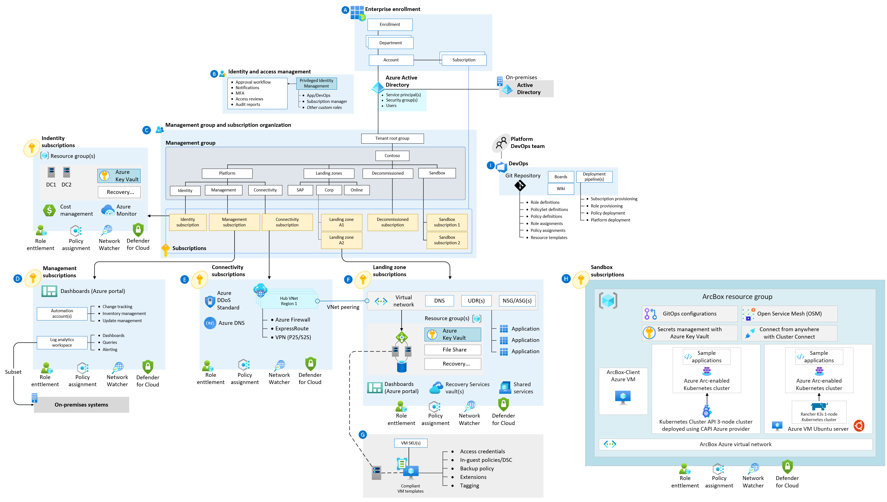
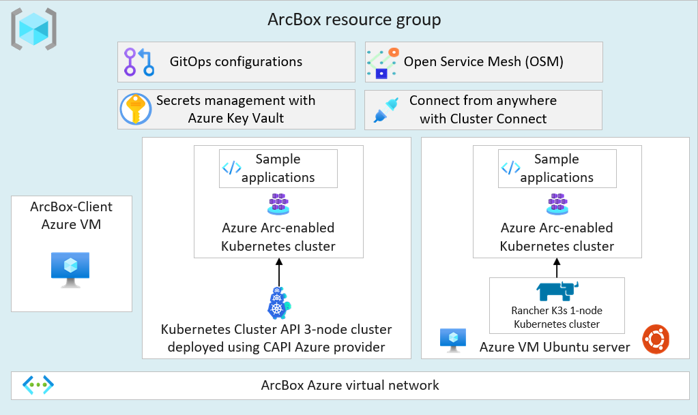

# Azure Arc-enabled Kubernetes Azure landing zone sandbox

Azure Arc helps you onboard infrastructure assets outside of Azure and deploy Azure services to your infrastructure, whether on-premises or in a multicloud environment.

With Azure Arc-enabled Kubernetes, you can attach and configure Kubernetes clusters from any location.
You can connect clusters on public cloud providers or your on-premises datacenter to Azure Arc.

## Azure landing zone sandbox subscription

ArcBox runs in your Azure landing zone sandbox subscription and bootstraps all Azure resources in a single resource group.

*For more information on the design areas labeled A-I in the visual, see [environment design areas](../../../ready/landing-zone/design-areas.md#environment-design-areas).*

The ArcBox resource group contains two Azure Arc-enabled Kubernetes clusters. It also includes a *unified operations* resource layer to integrate with Azure services and understand the Azure Arc-enabled Kubernetes value proposition.

## Deployment options and prerequisites

ArcBox supports four deployment methods:

- Azure Bicep using the Azure CLI
- Terraform using the Terraform CLI
- Azure Resource Manager (ARM) template using the Azure CLI
- Azure Resource Manager (ARM) template using the Azure portal

Depending on your deployment method, install either [Azure CLI](/cli/azure/install-azure-cli) or [Terraform CLI](https://learn.hashicorp.com/tutorials/terraform/install-cli).

You can practice your skills with an automated, easy-to-deploy Azure Arc sandbox solution named ArcBox. The Azure sandbox solution is powered by Azure Arc Jumpstart. ArcBox is self-contained in a single Azure subscription and resource group. It lets you get hands-on with the Azure Arc-enabled Kubernetes technology requiring only an Azure subscription.

## Next steps

The Azure Arc-enabled Kubernetes landing zone accelerator sandbox is based on the fully automated Jumpstart ArcBox solution. To get started, refer to the [Jumpstart ArcBox website page](https://aka.ms/JumpstartArcBox).
