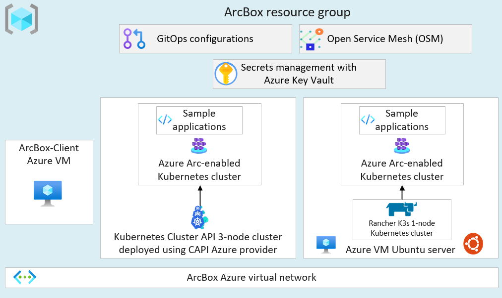

# Azure Arc-enabled Kubernetes Azure landing zone sandbox

Azure Arc helps you onboard infrastructure assets outside of Azure and deploy Azure services to your infrastructure, whether on-premises or in a multicloud environment.

With Azure Arc-enabled Kubernetes, you can attach and configure Kubernetes clusters from any location.
You can connect clusters on public cloud providers or your on-premises datacenter to Azure Arc.

## Azure landing zone sandbox subscription

ArcBox runs in your Azure landing zone sandbox subscription and bootstraps all required Azure resources within a single resource group.

[.](./media/arcbox-sandbox-subscription.png#lightbox)

_For more information on the design areas labeled A-I in the visual, see [environment design areas](/azure/cloud-adoption-framework/ready/landing-zone/design-areas#environment-design-areas)._

The single resource group ArcBox deploys contains two Azure Arc-enabled Kubernetes clusters. It also includes a *unified operations* resource layer to integrate with Azure services and understand Azure Arc-enabled Kubernetes value proposition.

## Deployment options and prerequisites

The ArcBox solution can be deployed using one of the four methods:

- Azure Bicep using the Azure CLI
- Terraform using the Terraform CLI
- Azure Resource Manager (ARM) template using the Azure CLI
- Azure Resource Manager (ARM) template using the Azure portal

Based on the desired deployment method, you can install either [Azure CLI](/cli/azure/install-azure-cli) or [Terraform CLI](https://learn.hashicorp.com/tutorials/terraform/install-cli).

You can practice your skills with an automated, easy-to-deploy sandbox solution in Azure Arc named "ArcBox" using an Azure Arc-enabled Kubernetes environment. Azure sandbox solution is powered by Azure Arc Jumpstart. ArcBox is entirely self-contained within a single Azure subscription and resource group. It lets you get hands-on with the Azure Arc-enabled servers technology while needing nothing more than an Azure subscription.

## Next steps

The Azure Arc-enabled Kubernetes landing zone accelerator sandbox is based on the fully automated Jumpstart ArcBox solution. For more information and guidance on how to get started, refer to the [Jumpstart ArcBox website page](https://aka.ms/JumpstartArcBox).
