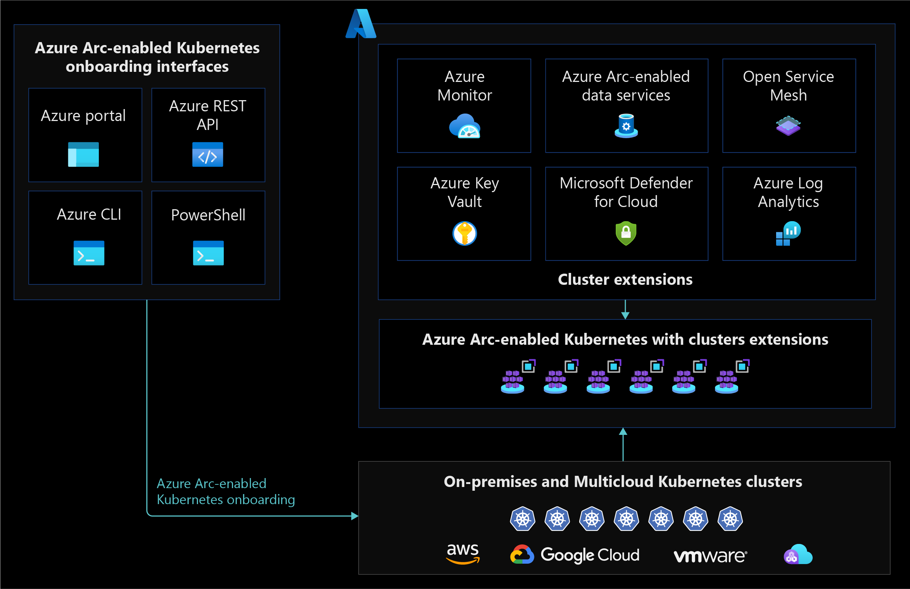

# Automation for Azure Arc-enabled Kubernetes

Azure Arc-enabled Kubernetes clusters allow you to manage Kubernetes clusters that are hosted outside Azure, on your corporate network, or on another cloud provider. This article provides an overview of automation for cluster onboarding and adding extra capabilities through cluster extensions. The following sections contain considerations and recommendations for your operations team(s) to use when onboarding and automating Azure Arc-enabled clusters throughout their lifecycles.

## Architecture

The following diagram contains a conceptual reference architecture that highlights onboarding and automation design areas for Azure Arc-enabled Kubernetes:

## Design Considerations

Consider the following before you onboard Azure Arc-enabled Kubernetes clusters to Azure:

### Requirements

- Review the list of [validated distributions](/azure/azure-arc/kubernetes/validation-program#validated-distributions) for the [Cloud Native Computing Foundation (CNCF)](/azure/azure-arc/kubernetes/overview#supported-kubernetes-distribution) distribution your cluster runs.
- Review the Azure Arc-enabled Kubernetes [agent overview](/azure/azure-arc/kubernetes/conceptual-agent-overview).

### Environment Preparation

- You must have a cluster admin role on your Kubernetes cluster before you can deploy and configure the Azure Arc-enabled Kubernetes agent.

### Onboard Azure Arc-enabled Kubernetes

- Decide on a plan to install and configure the Azure Arc-enabled Kubernetes agent on your cluster. You should usually deploy this agent using your organization's standard automation tool(s).

### Cluster Extensions

- Determine which Azure capabilities you want to have on your Azure Arc-enabled Kubernetes cluster. Some services require a cluster extension to be deployed.
  - For more information specific to extensions, see the [Extensions management critical design area](./eslz-arc-kubernetes-extensions-management.md).

### Network Connectivity

- Your cluster has connectivity from your on-premises network or third-party cloud providers to Azure, directly connected via a proxy server or private endpoint.
  - For specific design considerations and recommendations, see the [Network connectivity for Azure Arc-enabled Kubernetes critical design area](./eslz-arc-kubernetes-network-connectivity.md).

### Agent lifecycle automation

- Create an Azure Arc agent and Azure Arc-enabled Kubernetes extensions update management strategy.

## Design recommendations

The following sections contain design recommendations for Azure Arc-enabled Kubernetes clusters.

### Environment preparation

- Review the [requirements](/azure/azure-arc/kubernetes/quickstart-connect-cluster?tabs=azure-cli#prerequisites) for onboarding Kubernetes clusters onto Azure Arc.
- Review the [Identity and access management critical design area](./eslz-arc-kubernetes-identity-access-management.md) for more information surrounding required permissions.

### Onboard Azure Arc-enabled Kubernetes clusters

- When onboarding multiple clusters, create a service principal and onboard your clusters using a tooling like Azure DevOps, GitHub Actions, or another automation tool you use to manage Kubernetes clusters.

### Arc-enabled Kubernetes extensions

- If you're deploying an extension only to a specific Azure Arc-enabled Kubernetes cluster or clusters, automate the installation of these extensions through Azure CLI and/or ARM templates using tools such as Azure DevOps or GitHub Actions.
- If an extension is common across all your Arc-enabled Kubernetes clusters or large groups of Arc-enabled Kubernetes clusters, use [Azure Policy](/azure/governance/policy/overview) to automate the deployment of Arc extensions at scale.
  - Review the [Extensions Management critical design area](./eslz-arc-kubernetes-extensions-management.md). The following is an overview of its steps:
    - Create an [initiative](/azure/security-center/security-policy-concept#what-is-a-security-initiative) to deploy Azure Arc-enabled Kubernetes extensions at scale.
    - Use a "[DeployIfNotExists](/azure/governance/policy/concepts/effects#deployifnotexists)" policy effect to ensure your Azure Arc-enabled Kubernetes extensions are deployed automatically. As you onboard more Kubernetes clusters, use Azure Policy to remediate any clusters where the extensions have been removed.
  - For more details on using Azure Policy with Azure Arc-enabled Kubernetes clusters, review the [Governance and security disciplines critical design area](./eslz-arc-kubernetes-governance-disciplines.md).

### Agent and extensions lifecycle automation

During the onboarding process, Azure Arc-enabled Kubernetes provisions agents into your Kubernetes cluster. Agent versions change as Azure Arc technologies evolve, so it's important for your agents to be frequently updated.

- Enable the auto-upgrade feature for Azure Arc agents running inside your cluster, which is the default behavior when onboarding a cluster to Azure Arc. 
  - For more information on the auto-upgrade feature and version support policy, review the [Upgrade Agents guidance](/azure/azure-arc/kubernetes/agent-upgrade) and the [extensions management design area](./eslz-arc-kubernetes-extensions-management.md).

- Extensions also require updates in your cluster. For any extension installed on your cluster, we recommend that you leave the default behavior to automatically upgrade the extension minor version enabled during provisioning. For major version upgrades, a migration path is documented to move to the extension major release.
  - For more information, review the [Extensions management critical design area](./eslz-arc-kubernetes-extensions-management.md).

## Next steps

For more information about your hybrid and multicloud cloud journey, see the following articles.

- Review the [prerequisites](/azure/azure-arc/kubernetes/quickstart-connect-cluster?tabs=azure-cli#prerequisites) for Azure Arc-enabled Kubernetes.
- Review the [validated Kubernetes distributions](/azure/azure-arc/kubernetes/validation-program#validated-distributions) for Azure Arc-enabled Kubernetes.
- Learn how to [Manage hybrid and multicloud environments](../manage.md).
- Learn about [GitHub Actions for Azure](/azure/developer/github/github-actions) to understand how you can use GitHub Actions to automate Azure resource deployments.
- Learn about [Azure Pipelines](/azure/devops/pipelines/get-started/what-is-azure-pipelines) to understand you can use Azure Pipelines for automation.
- Experience Azure Arc-enabled Kubernetes automated scenarios with [Azure Arc Jumpstart](https://azurearcjumpstart.io/azure_arc_jumpstart/azure_arc_k8s/).
- Learn about Azure Arc via the [Azure Arc learning path](/training/paths/manage-hybrid-infrastructure-with-azure-arc/).
- See [Frequently Asked Questions - Azure Arc-enabled](/azure/azure-arc/kubernetes/faq) to find answers to most common questions.
