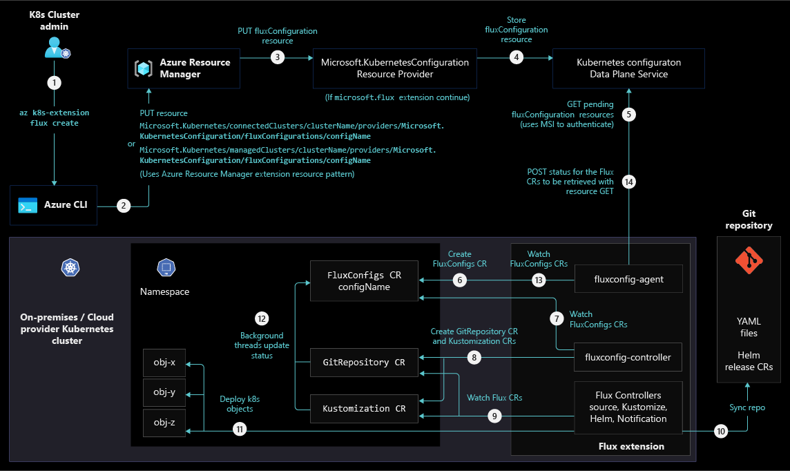

# CI/CD and GitOps disciplines with Azure Arc-enabled Kubernetes

As a cloud-native construct, Kubernetes requires a cloud-native approach for deployment and operations. With GitOps, you declare the desired state of your application-based deployments in files that are stored in Git repositories. Applications have Kubernetes objects they need to run, which can include Deployments, Horizontal-Pod-Autoscalers, Services, and ConfigMaps. Kubernetes operators run in the clusters and continually reconcile each cluster's state with the desired state declared in your Git repository. These operators pull files from your Git repositories and apply the desired state to your clusters. The operators also continuously assure that your cluster remains in the desired state.

Implementing GitOps lets you:

- Improve the overall visibility of your Kubernetes cluster state and configuration.
- Have a simple audit and version history of changes to your cluster through Git change history that shows who made changes, when those changes were made, and why.
- Automatically correct drift that can occur to your cluster.
- Roll back your Kubernetes configuration to a previous version through Git revert or Git rollback commands. Cluster deployment re-creation for disaster recovery scenarios also becomes a quick, straightforward process because your Kubernetes desired cluster configuration is stored in Git.
- Improve security by reducing the number of service accounts that are required to have deployment permissions to your cluster.
- Implement a CI/CD pipeline for deploying applications to your cluster.

GitOps on Azure Arc-enabled Kubernetes uses an extension that implements [Flux](https://fluxcd.io/flux/), a popular open-source tool set. Flux is an operator that automates GitOps configuration deployments in your cluster. Flux provides support for common file sources (Git repositories, Helm repositories, Buckets) and template types (YAML, Helm, and Kustomize). Flux also supports multi-tenancy and deployment dependency management among other features.

## Architecture

The following diagrams illustrate a conceptual reference architecture that highlights the Flux cluster extension installation provisioning in a cluster, GitOps configuration process for an Azure Arc-enabled Kubernetes cluster, and GitOps Flow.

Flux v2 Cluster Extension provisioning process:

GitOps Configuration process:

GitOps Flow showing an application update:

## Design considerations

Review the following design considerations when planning to implement GitOps for Azure Arc-enabled Kubernetes.

### Configuration

Consider the different layers of configuration in your Kubernetes cluster and the responsibilities involved in provisioning them.

#### Configuration layers

- Application configuration needed to deploy an application and its related Kubernetes objects to the cluster such as Deployment, Service, HPA, and ConfigMap resources. Application configurations are typically applied to a namespace-level GitOps configuration, requiring the application components only to be configured within a single namespace.
- Cluster-wide configuration for creation of Kubernetes objects such as Namespaces, ServiceAccounts, Roles and RoleBindings, and other cluster-wide policies.
- Cluster-wide components such as an Ingress Controller, monitoring and security stack, and various agents that operate across the cluster.

#### Responsibilities

- Application Developers are responsible for pushing their source code, triggering builds, and creating container images.
- Application Operators are responsible for maintaining the application repositories, configurations, environment variables, app-specific helm charts, Kustomizations etc.
  - [Apply a Flux configuration by using the Azure CLI](/azure/azure-arc/kubernetes/tutorial-use-gitops-flux2#apply-a-flux-configuration-by-using-the-azure-cli)
  - [Flux2 helm and kustomize example](https://github.com/fluxcd/flux2-kustomize-helm-example)
- Cluster Operators are responsible for setting up your cluster baseline. They're typically concerned with setting up cluster-wide components and policies. They maintain a Git repo directory or directories containing common infrastructure tools such as Namespaces, Service Accounts, RoleBindings, CRDs, cluster-wide policies, Ingress components, etc.

### Repository Structure

Consider tradeoffs when choosing a Git repository structure. The structure you choose will define your Kubernetes cluster state, which includes applications and cluster-wide components. Depending on which responsibilities and personas you identify, it's important to consider any necessary collaboration or desired team independence required for different repository structure options.

You can use any branching strategy you like for your code repositories, as it's only used by your Continuous Integration (CI) process.

For your GitOps configuration repositories, consider the following strategies based on your organization's business needs, size, and tooling:

- **Single repository (Branch per environment):**
  - Allows the most flexibility for controlling Git policies and permissions for each branch that represents an environment.
  - The drawback is that there's no sharing of the common config among environments, since tooling such as [Kustomize](https://kustomize.io/) doesn't work with Git branches.
- **Single repository (Directory per environment):**
  - You can implement this approach using tooling like Kustomize, which allows you to define a base configuration for Kubernetes objects and a set of artifacts (i.e patches) for your environment that overrides configurations in the base.
  - This approach can reduce duplicate YAML files for each environment, but also reduces the configuration separation between environments. Making a single change to the repository has the potential to affect all environments at once, so understanding the effect of changes to base directories must be fully understood and taken with care.
- **Multiple repositories (each serving a specific purpose):**
  - This could be used for separating configuration repositories for each application, team, layer, or tenant.
  - This allows teams to have more independent control but moves away from the principle of defining your system state in a single repository to improve the central configuration, visibility and control of deployments to a cluster.
  - Setting up multiple repositories should be considered for multi-tenancy needs. There's role-based access control (RBAC) and security built in to limit what configuration a team/tenant assigned to a specific repository can apply, such as only allowing deployment to certain namespaces.

See more ways of structuring your repository in the [Flux Guide](https://fluxcd.io/docs/guides/repository-structure/).

### Application and platform configuration

Platform Operators and Application Operators have several options for managing Kubernetes configuration:

- Raw Kubernetes YAML files that represent YAML specs for each Kubernetes API object you're deploying can work well for single environments. The drawback to using raw YAML files is that customizing becomes difficult when you begin to incorporate multiple environments, since you need to then duplicate YAML files and there isn't a good reuse method.
- [Helm](https://helm.sh/) is a package management tool for Kubernetes objects. It’s a valid option Cluster Operators can use for installing third-party off-the-shelf applications. Make sure you don't use templating too heavily as a configuration management tool for internal applications, because it can become complex to manage as your templates grow.
  - If using Helm, Flux includes a Helm Controller that lets you declaratively manage Helm Chart releases with Kubernetes manifests. You can create a *HelmRelease* object to manage that process.
- Kustomize is a Kubernetes native configuration management tool that introduces a template-free way to customize application configuration.
  - If using Kustomize, Flux includes a Kustomize controller that specializes in running continuous delivery pipelines for infrastructure and workloads defined with Kubernetes manifests and assembled with Kustomize. You can create a Kustomization object to manage that process.
- With Azure Arc-enabled Kubernetes, instead of needing to manage the lifecycle and support of components yourself, you can use a [list of available extensions](/azure/azure-arc/kubernetes/extensions#currently-available-extensions) that Microsoft manages and supports. These extensions are managed through [Azure Resource Manager](/azure/azure-resource-manager/management/overview). Some of these extensions, like Azure Key Vault Secrets Provider, have open source alternatives. Managing components outside of the extension process gives you more control over the components, but also requires more overhead for support and lifecycle management.

### Continuous Integration and Continuous Delivery (CI/CD) flow

The following sections provide considerations for your application pipeline and component update process.

#### Application pipeline

- Consider the application build, testing, and validations that you need to include in your CI process. These can include linting and testing related to security, integration, and performance, which you need in order to create a release candidate (RC) for environment deployments.
- You can use a traditional push deployment method to bridge the gap between a build container image in your CI pipeline and its deployment in a cluster by calling the Kubernetes API directly from your deployment pipeline.

To avoid manual configuration modifications to your GitOps repository, you can run your CD pipeline as a service account, which has permission to open pull requests (PRs) or commit a new container image change directly to a configuration repository. These changes can also provision all YAML objects required for your application.

The following process diagram illustrates the traditional application CI process incorporated with changes that support GitOps.

#### Cluster-wide component update process

- Cluster Operators need to manage cluster-wide components, so this likely won't originate from the CD pipeline used to deploy your applications and services. Consider defining a promotion process specific to Cluster Operators to ensure changes are able to smoothly transition from one environment to another.
- If you need to apply identical GitOps configuration at scale to your Azure Arc-enabled Kubernetes clusters, consider applying an Azure Policy that can automatically install the Flux extension and apply your GitOps configuration to existing Azure Arc-enabled Kubernetes clusters or to new clusters as they're onboarded to Azure Arc.

When updating your configuration, you likely want to verify that changes have been successfully applied to your desired environment. You can define notifications in Flux to integrate with your CI/CD tools, email, or ChatOps tools and automatically send out alerts regarding successful changes and deployment failures. You can also find deployment status information in the Azure portal and through the k8s-configuration CLI and ARM API.

## Security considerations

Review the following security considerations when planning to implement GitOps for Azure Arc-enabled Kubernetes.

### Repository auth

- You can use a public or private Git repository with GitOps, but due to the sensitive nature of Kubernetes configurations, we recommend you use a private repository that requires authentication by SSH key or API key. GitOps also work with Git repositories that are only accessible within a private network as long as your Kubernetes cluster can access it, but this setup limits your ability to use cloud-based Git providers like Azure Repos or GitHub.
- Both HTTPS and SSH protocols offer a reliable and secure connection you can use to connect to your source control tool. However, HTTPS is often easier to set up, and uses a port that rarely requires you to open more ports in your firewalls.

### Repo and branch security

- Set branch permissions and policies on your configuration repository. As your Git repo becomes the central piece of your Kubernetes deployments, it's critical that you set up permissions to control who can read and update the code in a branch and that you implement policies to enforce your team's code quality and change management. Otherwise, your GitOps workflow can ship code that isn't up to your organizations' standards.
- Pull request (PR) Pipelines can work with your branch policies to validate YAML configuration and/or deploy test environments as needed. Gates help eliminate configuration errors and increase deployment security and confidence.
- When assigning access permissions, consider which users in your organization should have repository read access, PR creation access, and PR approval access.

### Secret management

- Avoid storing plain text or base64 encoded secrets in your Git repository. Instead, consider using an external secrets provider such as Azure Key Vault. The [Azure Key Vault Provider for Secrets Store CSI Driver](/azure/azure-arc/kubernetes/tutorial-akv-secrets-provider) allows you to integrate an Azure key vault as a secrets store with an Azure Kubernetes Service (AKS) cluster using a CSI volume. This service is available through the Azure Arc-enabled Kubernetes extension. [HashiCorp Vault](https://www.vaultproject.io/) is a third party managed secret provider alternative.
- Another alternative way to manage secrets is to use [Bitnami's Sealed Secrets](https://github.com/bitnami-labs/sealed-secrets/releases), which operated from the concept of public and private keys. This allows operators to store a one-way encrypted secret using a public key in Git, which can only be decrypted through the private key, which is used by a SealedSecrets controller running in your cluster.

## Design recommendations

Review the following design recommendations when planning to implement GitOps for Azure Arc-enabled Kubernetes.

The following diagram contains reference architecture that illustrates the responsibilities, repositories, and pipelines needed to implement a GitOps process using the Azure Arc-enabled Kubernetes [Flux Extension](/azure/azure-arc/kubernetes/tutorial-use-Gitops-flux2).

### Repositories

Three Git repositories are included in the design:

- **Application code repository**
  - This repository stores application code and any pipeline definition and configuration scripts.
  - Use a development branching strategy that is easy to understand and limits the number of undesired long-running branches.
- **Application configuration repository**
  - This repository stores application configurations, including Kubernetes objects such as ConfigMaps, Deployments, Services, and HPA objects. Structure this repository with different directories for each application. Flux will synchronize changes from this repository and target branch to your cluster.
  - Incorporate tools that make it easier for application developers and operators to build initial configurations per environment. Application Operators should define a Kubernetes specific application configuration that uses package managers like Helm or configuration tools like Kustomize to make configuration simpler.
  - Create a branch to represent each environment type. This allows fine-grain control of changes into each specific environment, such as non-prod and production environments.
  - When an application is deployed to a particular namespace, use the namespace scope feature within the GitOps configuration to enforce configuration for only a certain namespace.
- **Cluster-wide configuration repository**
  - Define cluster-wide components like Ingress Controller, Namespaces, RBAC, monitoring, and security stack for Cluster Operator management. Flux synchronizes changes from this repository and target branch to your cluster.
  - Structure this repository with different directories representing different components.
  - Create a branch to represent each environment type. This allows fine-grain control of changes into each specific environment, such as non-prod and production environments.
  - Cluster Operators should use package managers like Helm or configuration tools like Kustomize overlays to make configuration simpler.

### CI/CD and configuration update process

#### CI/CD and container image updates

- **CI Pipeline**
  - Development teams should define a CI pipeline through process that includes building, linting, testing, and pushing an application to your container registry.
- **CD Pipeline**
  - Create a CD pipeline that runs a script targeting changes against your application configuration repository. This script creates a temporary branch sourced from your target environment, makes a change to the image tag version, commits the change, and opens a pull request against your target environment branch. This CD pipeline can have environment stages with appropriate environment variables to target the correct GitOps Configuration repository and branch.
  - Define manual approval steps for environment stages to limit unwanted pull requests to all environments.
- Enable branch policies on your application configuration repository to enforce peer review or approvals for environments. This can involve a minimum number of required reviews or an auto-approval for lower environments. Also consider third party integrations and approvals as needed to meet your organization's standards.

#### Cluster-wide and application configuration updates

- Cluster Operators and Application Operators each define configuration in their respective configuration repositories. These users don't require pipeline tooling to push configurations. They instead use native Git commit and PR processes to define a configuration and push changes to a branch representing an environment.
- For new configuration definitions, start by defining configuration in lower environments, such as Dev, then promote to higher environments through merges and pull requests. Cherry-pick configuration updates specific to certain environments as needed.
<!-- The following section is commented until support/documentation is added -->
<!-- 
- For implementing at-scale GitOps Configurations which require a Kubernetes configuration to be applied to all Azure Arc-enabled Kubernetes clusters, create an Azure Policy to automatically apply this configuration at scale.
-->

#### Feedback and alerting

- Configure [Flux Notifications](https://fluxcd.io/docs/guides/notifications/) to alert when GitOps configurations are unable to synchronize or are throwing errors. Application Operators should configure alerts to determine when an application deployment has succeeded and is healthy. Cluster Operators should configure alerts to determine when cluster-wide component reconciliation has failed and when there are synchronization issues with your Git repository.
- Implement [GitOps Connector](https://github.com/microsoft/Gitops-connector) to integrate feedback from the Flux agent to your CI/CD tooling.
  
## Security recommendations

- Review the [governance and security recommendations](./eslz-arc-kubernetes-governance-disciplines.md) for your Azure Arc-enabled Kubernetes clusters.
- Avoid unwanted access to any cluster configuration by using a private Git repository with authentication and authorization you can use to define any configuration repository.
  - [Connect to GitHub with SSH](https://docs.github.com/en/authentication/connecting-to-github-with-ssh)
  - [Choose the right authentication mechanism for Azure DevOps](/azure/devops/integrate/get-started/authentication/authentication-guidance)
- Access your Git repository through SSH protocol and an SSH key if your Git provider supports it. If SSH is unusable due to outbound connectivity restrictions, or if your Git provider doesn't support the required SSH libraries, use a dedicated service account and associate an API key with that account for Flux to use. If you need an alternative to SSH when using GitHub, you can [Create a personal access token](https://docs.github.com/en/authentication/keeping-your-account-and-data-secure/creating-a-personal-access-token) for authentication.
- Configure branch policies and permissions that match the responsibilities of your cluster. Set a minimum number of reviewers to approve changes.
- Configure a PR pipeline to validate YAML configurations and syntax and optionally deploy a test Kubernetes cluster. Set up a branch policy that requires this pipeline to run successfully before any merge can be accepted.
- Implement secrets using the [Azure Key Vault Provider for Secrets Store CSI Driver](/azure/azure-arc/kubernetes/tutorial-akv-secrets-provider), which will allow for the integration of an Azure Key Vault as a secrets store with an Azure Arc-enabled Kubernetes cluster via a CSI volume.
- The Flux extension supports namespace and cluster scoped configurations. Choose the namespace scope when your configuration shouldn't have access beyond a single namespace.

## Next steps

For more information about your hybrid and multicloud cloud journey, see the following articles.

- Review the [prerequisites](/azure/azure-arc/kubernetes/quickstart-connect-cluster?tabs=azure-cli#prerequisites) for Azure Arc-enabled Kubernetes.
- Review the [validated Kubernetes distributions](/azure/azure-arc/kubernetes/validation-program#validated-distributions) for Azure Arc-enabled Kubernetes.
- Learn how to [Manage hybrid and multicloud environments](../manage.md).
- To learn more about GitOps with Azure Arc-enabled Kubernetes:
  - Review [Conceptual GitOps with Flux v2](/azure/azure-arc/kubernetes/conceptual-Gitops-flux2).
  - Learn how to [Use GitOps with Flux v2](/azure/azure-arc/kubernetes/tutorial-use-Gitops-flux2).
  - Review the [Conceptual GitOps Flux v2 CI/CD Process](/azure/azure-arc/kubernetes/conceptual-Gitops-flux2-ci-cd).
  - Follow the [Tutorial to implement Flux v2 CI/CD](/azure/azure-arc/kubernetes/tutorial-Gitops-flux2-ci-cd).
- Experience Azure Arc-enabled Kubernetes with a GitOps flow from [Azure Arc Jumpstart](https://azurearcjumpstart.io/azure_arc_jumpstart/azure_arc_k8s/day2/cluster_api/cluster_api_gitops_basic/#deploy-gitops-configurations-and-perform-basic-gitops-flow-on-cluster-api-as-an-azure-arc-connected-cluster-flux-v2).
- Learn about Azure Arc via the [Azure Arc learning path](/training/paths/manage-hybrid-infrastructure-with-azure-arc/).
- See [Frequently Asked Questions - Azure Arc-enabled](/azure/azure-arc/kubernetes/faq) to find answers to most common questions.
