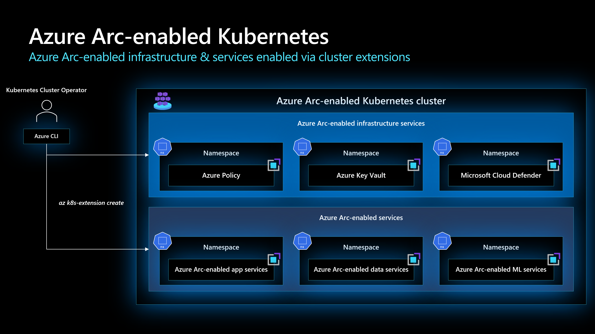

# Extensions management for Azure Arc-enabled Kubernetes

This article contains key design considerations and best practices for managing extensions of Azure Arc-enabled Kubernetes deployments.

Before you read this article, be sure you understand governance principles and review [Enterprise-scale for AKS](/azure/cloud-adoption-framework/scenarios/aks/enterprise-scale-landing-zone) so you understand the relevant concepts for using Azure landing zones in a container environment.

## Architecture

You can think of extensions for Azure Arc-enabled Kubernetes as being split into two categories: extensions for Azure Arc-enabled infrastructure services and extensions for Azure Arc-enabled services. This distinction isn't explicit in individual extension names.

Keep these two categories in mind as you design your deployment of Azure Arc-enabled Kubernetes. For example, think of the Microsoft Defender for Cloud extension as an extension for Azure Arc-enabled infrastructure services, but consider the Azure App Service for Azure Arc extension as an Azure Arc-enabled services extension.

The following diagram illustrates overall integration for extensions for Azure Arc-enabled Kubernetes clusters.

## Design considerations

- **Extension Installation**
  - Extensions provide extra capability to Azure Arc-enabled Kubernetes clusters. Consider your specific use case along with the following factors as you decide how to use Azure Arc-enabled Kubernetes extensions:
    - Review which [extensions are currently available](/azure/azure-arc/kubernetes/extensions).
    - Review which [extensions are built on top of Helm](/azure/azure-arc/kubernetes/conceptual-extensions).

- **Update extensions**
  - Consider how to ensure extensions stay up-to-date over the lifespan of your cluster.

## Design recommendations

- **Extension installation**
  - Standardize the way extensions are installed, whether through the Portal, Azure Policy, CLI, ARM templates, or another mechanism. Verify that extensions have been properly installed after every installation.

- **Update extensions**
  - Extensions must be periodically updated. Use the `--auto-upgrade-minor-version` flag to automatically upgrade minor versions of extensions, as described in [Usage of Cluster Extensions](/azure/azure-arc/kubernetes/extensions#usage-of-cluster-extensions). Refer to each extension's documentation to learn which settings can be configured during creation and update.

## Next steps

For more information about your hybrid and multicloud cloud journey, see the following articles.

- Review the [prerequisites](/azure/azure-arc/kubernetes/quickstart-connect-cluster?tabs=azure-cli#prerequisites) for Azure Arc-enabled Kubernetes.
- Review the [validated Kubernetes distributions](/azure/azure-arc/kubernetes/validation-program#validated-distributions) for Azure Arc-enabled Kubernetes.
- Learn how to [Manage hybrid and multicloud environments](../manage.md).
- Learn how to [Connect an existing Kubernetes cluster to Azure Arc](/azure/azure-arc/kubernetes/quickstart-connect-cluster?tabs=azure-cli).
- Review [Cluster extensions](/azure/azure-arc/kubernetes/conceptual-extensions) to learn about Azure Arc-enabled cluster extension architecture.
- Learn how to [Deploy and manage Azure Arc-enabled Kubernetes cluster extensions](/azure/azure-arc/kubernetes/extensions).
- Experience Azure Arc-enabled Kubernetes automated scenarios with [Azure Arc Jumpstart](https://azurearcjumpstart.io/azure_arc_jumpstart/azure_arc_k8s/).
- Learn about Azure Arc via the [Azure Arc learning path](/training/paths/manage-hybrid-infrastructure-with-azure-arc/).
- See [Frequently Asked Questions - Azure Arc-enabled](/azure/azure-arc/kubernetes/faq) to find answers to most common questions.
