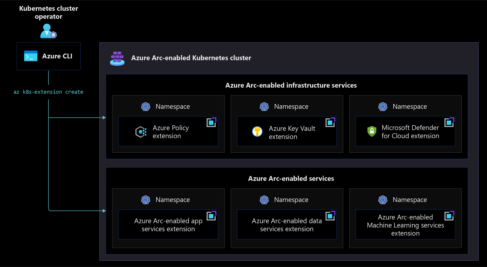

# Extensions management for Azure Arc-enabled Kubernetes

This article walks through the key design considerations and best practices for managing extensions of Azure Arc-enabled Kubernetes deployments.

Before going through this document it is important to understand governance principles because of the effect of the decisions made, also make sure to review [Enterprise-scale for AKS](/azure/cloud-adoption-framework/scenarios/aks/enterprise-scale-landing-zone) to understand the relevant concepts of Azure landing zones in a container environment.

## Architecture

Conceptually, extensions for Azure Arc-enabled Kubernetes can be thought of as those for Azure Arc-enabled infrastructure services and those for Azure Arc-enabled services.  While this distinction is not made explicitly for the name of each extension, it is helpful to consider keeping these two categories of extensions in mind when designing for deploying Azure Arc-enabled Kubernetes.  For example, the Microsoft Defender for Cloud extension can be thought of as an extension for Azure Arc-enabled infrastructure services, whereas the Azure App Service for Azure Arc extension can be thought of as an Azure Arc-enabled services extension.

the following image illustrates the overall integration for extensions for Azure Arc-enabled Kubernetes clusters.

## Design Considerations

- **Extension Installation**
  - While extensions provide additional capability for Azure Arc-enabled Kubernetes clusters, consider your specific use case and the following factors when designing how to use Azure Arc-enabled Kubernetes extensions:
    - Review which [extensions are currently available](/azure/azure-arc/kubernetes/extensions)
    - Review which [extensions are built on top of Helm](/azure/azure-arc/kubernetes/conceptual-extensions)

- **Update extensions**
  - Consider how extensions will be kept up-to-date over the lifespan of your cluster.

## Design Recommendations

- **Extension installation**
  - Standardize the way in which extensions are installed, whether that is through the Portal, Azure Policy, CLI, ARM templates, or another mechanism.  After installation, verify that the extension(s) have installed properly.

- **Update extensions**
  - Extensions are periodically updated.  Use the `--auto-upgrade-minor-version` flag to automatically upgrade minor versions of the extension as described in [Usage of Cluster Extensions](/azure/azure-arc/kubernetes/extensions#usage-of-cluster-extensions). Please refer to the specific extension's documentation to know what settings can be configured during creation and update.

## Next steps

For more information about your hybrid and multicloud cloud journey, see the following articles:

- Review the [prerequisites](/azure/azure-arc/kubernetes/quickstart-connect-cluster?tabs=azure-cli#prerequisites) for Azure Arc-enabled Kubernetes.
- Review [validated Kubernetes distributions](/azure/azure-arc/kubernetes/validation-program#validated-distributions) for Azure Arc-enabled Kubernetes.
- Review [Manage hybrid and multicloud environments](/azure/cloud-adoption-framework/scenarios/hybrid/manage).
- [Connect an existing Kubernetes cluster to Azure Arc](/azure/azure-arc/kubernetes/quickstart-connect-cluster?tabs=azure-cli).
- To learn about Azure Arc-enabled Kubernetes cluster extension architecture, review [Cluster extensions](/azure-arc/kubernetes/conceptual-extensions).
- To learn how to install Azure Arc-enabled Kubernetes cluster extension, review [Deploy and manage Azure Arc-enabled Kubernetes cluster extensions](/azure/azure-arc/kubernetes/extensions).
- Experience Azure Arc-enabled Kubernetes automated scenarios with the [Azure Arc Jumpstart](https://azurearcjumpstart.io/azure_arc_jumpstart/azure_arc_k8s/).
- To learn more about Azure Arc, review the [Azure Arc learning path on Microsoft Learn](/learn/paths/manage-hybrid-infrastructure-with-azure-arc/).
- Review [Frequently Asked Questions - Azure Arc-enabled](/azure/azure-arc/kubernetes/faq) to get answers to most common questions.
