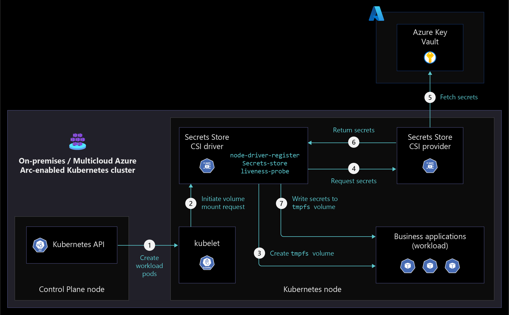
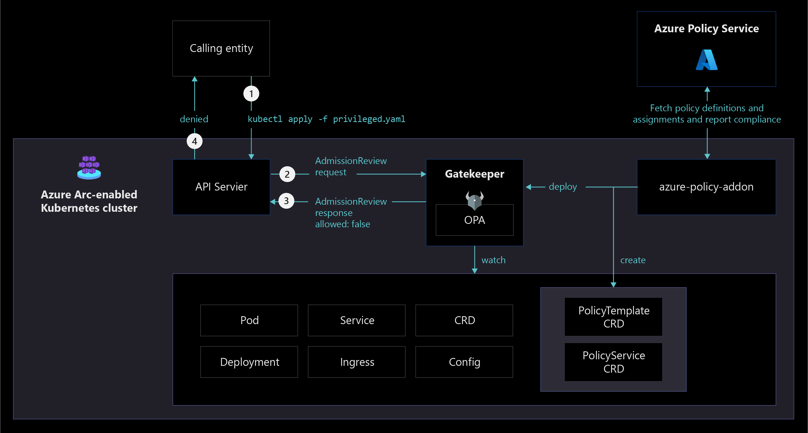
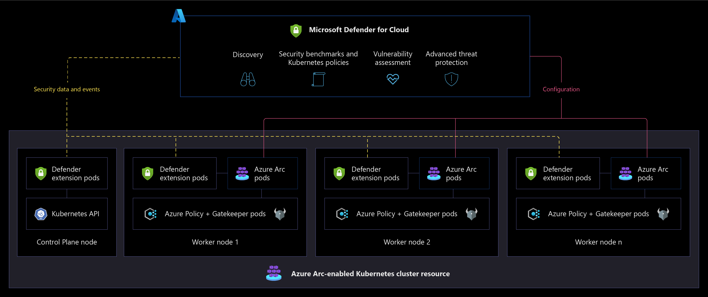

# Governance, security, and compliance baseline for Azure Arc-enabled Kubernetes

This article provides key design considerations and best practices for security, governance, and compliance that you should use when building your Azure Arc-enabled Kubernetes deployment. While the enterprise-scale landing zone documentation covers [Governance](../../../ready/landing-zone/design-area/governance.md) and [Security](../../../ready/landing-zone/design-area/security.md) as separate topics, these critical design areas are consolidated into a single topic for Azure Arc-enabled Kubernetes.

[Azure Policy](/azure/governance/policy/overview) and [Microsoft Defender for Cloud](/azure/defender-for-cloud/defender-for-cloud-introduction) are cloud-native tools that allow you to implement implementation of guardrails, controls, reports, alerts and remediation tasks in an automated fashion at scale. By combining them with Azure Arc-enabled Kubernetes, you can extend governance policies and security checks to any Kubernetes cluster in your on-premises and/or multicloud environment.

## Architecture

The following diagram shows a conceptual reference architecture depicting the security, compliance, and governance design areas for Azure Arc-enabled Kubernetes:

## Design considerations

As your hybrid and multicloud resources become part of Azure Resource Manager, you can manage and govern them from Azure. This section contains design considerations you should keep in mind while planning the security and governance of your Azure Arc-enabled Kubernetes cluster resources.

Review the [security](../../../ready/landing-zone/design-area/security.md) and [governance](../../../ready/landing-zone/design-area/governance.md) design areas of the Azure landing zones to assess the effect of Azure Arc-enabled Kubernetes on your overall governance and security models.

### Agent provisioning

Define a strategy for provisioning the [Azure Arc-enabled Kubernetes agent](/azure/azure-arc/kubernetes/conceptual-agent-overview) and use the least privilege principle when creating the onboarding service principal. Consider using automation for bulk enrollment.

### Agent management

Azure Arc-enabled Kubernetes agents play a critical role in the hybrid operations of your Azure Arc-enabled Kubernetes clusters, as they let you manage clusters from Azure. Implement solutions that keep track of [agent connectivity status](/azure/azure-arc/kubernetes/conceptual-agent-architecture#connectivity-status). Make sure you define a process for upgrading your Azure Arc-enabled Kubernetes agents.

### Role-based access controls (RBAC)

Define administrative, operations, and developer roles within your organization that are responsible for day-to-day operations in your hybrid clusters. Mapping each team to actions and responsibilities determines Azure role-based access control (RBAC) roles and Kubernetes ClusterRoleBinding and RoleBinding.

Consider using a [RACI](../../../organize/raci-alignment.md) matrix to support this effort and build controls into the management scope hierarchy that you define based on resource consistency and inventory management guidance.

For more information, see [Identity and access management for Azure Arc-enabled Kubernetes](./eslz-arc-kubernetes-identity-access-management.md).

### Secret and certificate management

Secure secrets and certificates by [using Azure Key Vault and deploying its extension](/azure/azure-arc/kubernetes/tutorial-akv-secrets-provider) in your Azure Arc-enabled kubernetes clusters through the Container Storage Interface (CSI).

### Data residency

Consider which Azure region you plan to provision your Azure Arc-enabled Kubernetes cluster within. Understand [what data is collected from your resources](/azure/azure-arc/kubernetes/faq#does-azure-arc-enabled-kubernetes-store-any-customer-data-outside-of-the-clusters-region) and plan accordingly based on data residency requirements for your organization.

### Enable and secure GitOps configurations

GitOps configurations enforce a desired system state and are an important tool for tracking Arc-enabled Kubernetes cluster compliance. When working with [GitOps configurations](./eslz-arc-kubernetes-cicd-gitops-disciplines.md), consider securing access to your source control system through appropriate network and access controls.

### Policy management and reporting

Define a governance plan for your hybrid Kubernetes clusters that translates into Azure policies that audit and enforce organizational standards at-scale. For example, you might enforce a *sourceControlConfiguration* policy to Kubernetes clusters to ensure the clusters get their source of truth for workloads and configurations from a defined git repo and track compliance using Azure Policy.

### Log management strategy

Review the [management disciplines critical design area design considerations and recommendations](./eslz-arc-kubernetes-management-disciplines.md) and plan to collect metrics and logs from your hybrid resources into a Log Analytics workspace for further analysis and auditing.

### Threat protection and cloud security posture management

Enforce threat protection and introduce controls to detect security misconfigurations and track compliance. Use [Azure's intelligence](/azure/sentinel/overview) to protect your hybrid workloads against threats. Enable security baseline monitoring, security posture management, and threat protection for all subscriptions containing Azure Arc-enabled Kubernetes by enabling [Microsoft Defender for Containers](/azure/defender-for-cloud/defender-for-containers-introduction?tabs=defender-for-container-arch-aks).

### Secure cluster access

Plan to secure access to your Kubernetes API. The Azure Arc-enabled Kubernetes [cluster connect feature](/azure/azure-arc/kubernetes/cluster-connect) provides connectivity to the API server without needing any inbound port enabled.

### Improve microservices observability and security

The implementation of a service mesh can help with authentication, authorization, security, and visibility of microservice-based applications. Azure Arc-enabled Kubernetes simplifies the deployment of [Open Service Mesh (OSM) as an extension](./eslz-arc-kubernetes-services-observability.md).

## Design recommendations

This section contains design recommendations you should follow while planning the security and governance of your Azure Arc-enabled Kubernetes cluster resources.

### Agent provisioning

- Define a strategy for onboarding your clusters into Azure Arc, including a method of automation for bulk enrollment. Establish a formal plan that takes into account the scope of your deployment and includes objectives, selection criteria, success criteria, training plans, rollback, and risks.

- You can [using a service principal](/azure/azure-arc/servers/onboard-service-principal#create-a-service-principal-for-onboarding-at-scale) to integrate agent provisioning as part of your continuous integration and continuous deployment (CI/CD) pipelines. You should limit the privileges of this service principal and only assign the roles required to onboard Kubernetes to Azure (the "Kubernetes Cluster - Azure Arc Onboarding" role), since it can only be used to onboard Kubernetes, not undoing the process or deleting the resource.

### Agent management

Azure Arc agents are key components of Azure Arc-enabled Kubernetes, containing several logical components that play a role in security, governance, and management operations.

If an agent stops sending heartbeats to Azure, goes offline, or loses connectivity to Azure, you can't perform operational tasks on it. Develop a plan for how you'll be notified if these scenarios happen and how your organization should respond.

You can use Azure Activity Log to set up [resource health alerts](/azure/service-health/resource-health-alert-monitor-guide) and remain informed on the current and historical health status of your [agent's pods](/azure/azure-arc/kubernetes/quickstart-connect-cluster?tabs=azure-cli#6-view-azure-arc-agents-for-kubernetes). To understand how to properly manage your agent, review the [management critical design area](./eslz-arc-kubernetes-management-disciplines.md).

If the service hasn't received an agent heartbeat for 15 minutes, [Azure Arc-enabled Kubernetes cluster show as offline](/azure/azure-arc/kubernetes/conceptual-agent-architecture). To ensure your agent can securely connect to Azure Arc endpoints, review the [Azure Arc-enabled Kubernetes connectivity critical design area](./eslz-arc-kubernetes-network-connectivity.md).

### Role-based access controls (RBAC)

Once you onboard a Kubernetes cluster, you can assign [Azure RBAC](/azure/role-based-access-control/overview) to your Azure Arc-enabled Kubernetes cluster resource.

Follow the [least privilege principle](/security/benchmark/azure/baselines/arc-enabled-security-baseline#pa-7-follow-just-enough-administration-least-privilege-principle) when assigning roles like "Contributor" or "Owner" that can perform operations like deploying extensions that perform actions as "ClusterAdmin" and have a cluster-wide effect. These roles should be used with caution to limit the possible "blast radius" or eventually be replaced by custom roles.

You should apply the same RBAC principle to the sensitive data that is sent to the Azure Monitor Log Analytics workspace. Azure Arc-enabled Kubernetes provides RBAC access to log data collected by your Log Analytics agent, stored in the Log Analytics workspace your cluster is registered to. To learn how to implement granular Log Analytics Workspace access, review [Designing your Azure Monitor Logs deployment](/azure/azure-monitor/logs/design-logs-deployment#access-control-overview).

[Integrating your Azure Arc-enabled Kubernetes cluster with Microsoft Entra ID](/azure/azure-arc/kubernetes/azure-rbac) allows you to use Azure role assignments for more granular control over who has access to and permissions for Azure Arc-enabled Kubernetes cluster resources.

  >[!Note]
  >This integration works natively with Kubernetes *ClusterRoleBinding* and *RoleBinding* object types and effectively consolidates authorization to your Kubernetes cluster with Microsoft Entra ID as the central identity and access management service. By using Microsoft Entra ID, you get full auditing and tracing of changes made in your cluster as well as any authorization events.

Integrating with Microsoft Entra ID also lets you access advanced security capabilities, which you should use to configure:

- [Conditional Access with Microsoft Entra ID](/azure/azure-arc/kubernetes/azure-rbac#use-conditional-access-with-azure-ad). You can find more information on Conditional Access can be found in the [Conditional Access overview](/entra/identity/conditional-access/overview).
- [Just-In-Time (JIT)](/azure/azure-arc/kubernetes/azure-rbac#configure-just-in-time-cluster-access-with-azure-ad) access rules for tasks that need elevated permissions. Having standing access for some users to sensitive information or critical network configuration settings in Kubernetes creates a potential pathway to compromised accounts or internal threat activities. Privileged access management can help you protect your organization from breaches and helps you meet compliance best practices by limiting standing access to sensitive data or access to critical configuration settings.

### Secret and certificate management

Don't store secrets or certificates in application code or file systems. Secrets should be stored in key stores and provided to containers at runtime as needed.

Consider using the [Azure Key Vault extension](/azure/azure-arc/kubernetes/tutorial-akv-secrets-provider) to manage secrets and certificates on your Azure Arc-enabled Kubernetes clusters. The Key Vault extension allows you to manage the certificate lifecycle on your Kubernetes deployments as shown in the following diagram.

  

### Enable and secure GitOps configurations

GitOps is an essential component of any IT strategy that takes a fully automated approach to operations. GitOps provides scale, consistency, tracking, and auditing capabilities for any deployment.

Using GitOps can simplify the deployment of multiple applications across clusters and environments while tracking and enforcing the desired state of the system declaratively with Git. When you use Git as your single source of truth and as the central tool for all deployments, it becomes the best way to track cluster states, account for changes and approvals over time, facilitate fault investigation, and enable automation across distributed environments.

When you add GitOps configurations, make sure you secure access to the repository and its keys and set branch permissions. For more information, review [the critical design area for GitOps](./eslz-arc-kubernetes-cicd-gitops-disciplines.md).

### Policy management and reporting

Policy-driven governance is a foundational principle of cloud-native operations and the Microsoft Cloud Adoption Framework for Azure. [Azure Policy](/azure/governance/policy/) provides the mechanism to enforce corporate standards and to assess compliance at scale. Through Azure Policy, you can implement governance for consistency of deployments, compliance, control costs, security posture. In its compliance dashboard, you can see an aggregated view of the overall state of your environment at scale and find cluster-level remediation capabilities.

Azure Arc-enabled Kubernetes supports [Azure Policy](/azure/governance/policy/overview) at the Azure Resource Management layer, and also in-cluster policy enforcements by extending [Gatekeeper for Open Policy Agent](/azure/governance/policy/concepts/policy-for-kubernetes?toc=/azure/azure-arc/kubernetes/toc.json). You can implement any of the [built-in policies](/azure/governance/policy/samples/built-in-policies#kubernetes) to quickly achieve compliance and enforcement at scale. The following diagram illustrates how Azure Policy applies at-scale enforcements and safeguards to Azure Arc-enabled Kubernetes clusters.

Understand the [scope of Azure policy](/azure/governance/policy/concepts/scope) and where you can apply it (management group, subscription, resource group or individual resource level). Use [Azure Policy's built-in library](/azure/governance/policy/samples/built-in-policies#kubernetes) for Azure Arc-enabled Kubernetes. Create a management group design in accordance with the recommended practices outlined in the [Cloud Adoption Framework enterprise scale guidance](../../../ready/landing-zone/design-area/resource-org.md).

- Determine what Azure policies you need in order to meet your organization's business, regulatory, and security requirements for Azure Arc-enabled Kubernetes at scale.
- Enforce tagging and implement [remediation tasks](/azure/governance/policy/how-to/remediate-resources).
- Use Azure Policy to [enforce GitOps](/azure/azure-arc/kubernetes/use-azure-policy) and apply configurations at scale.
- Understand and evaluate [Azure Policy built-in definitions for Azure Arc-enabled Kubernetes](/azure/azure-arc/kubernetes/policy-reference).
- Azure Policy's DeployIfNotExists policies programmatically deploy extensions/management service agents to your Arc-enabled clusters at scale, including Azure Monitor.
- Enable [Azure Monitor Container Insights](/azure/azure-monitor/containers/container-insights-enable-arc-enabled-clusters?toc=/azure/azure-arc/kubernetes/toc.json) for compliance and operational monitoring of Azure Arc-enabled Kubernetes clusters.

### Log management strategy

Design and plan your Log Analytics Workspace deployment, which is the storage where data is collected, aggregated, and later analyzed. Since the Log Analytics workspace represents a geographical location of your data, to support a level of isolation and scope for configurations like data retention, you must determine the number of workspaces needed and how they map to your organizational structure.

Use a single Azure Monitor Log Analytics workspace to manage centralized RBAC, visibility, and reporting, as described in the [Management and monitoring best practices of Cloud Adoption Framework](../../../ready/landing-zone/design-area/management.md).

For more information, review the best practices for [designing your Azure Monitor Logs deployment](/azure/azure-monitor/logs/design-logs-deployment).

### Threat protection and cloud security posture management

- [Microsoft Defender for Cloud](/azure/defender-for-cloud/defender-for-cloud-introduction) provides a unified security management platform segmented as a cloud security posture management (CSPM) and cloud workload protection platform (CWPP). To increase security in your hybrid landing zone, you need to protect the data and assets hosted in Azure and elsewhere.
- Microsoft Defender for Containers extends the capabilities of Microsoft Defender for Cloud to Azure Arc-enabled Kubernetes. To heighten security on your hybrid landing zone, consider:
  - Using Azure Arc-enabled Kubernetes extension to onboard Arc-enabled Kubernetes resources in Microsoft Defender for Cloud.
  - Enabling the Microsoft Defender for Containers plan for all subscriptions. By default, the plan is configured to automatically deploy the Defender extension on any Arc-enabled Kubernetes cluster that is onboarded to the same subscription. You can optionally modify this configuration.
  - Verifying that the Defender extension is deployed on your clusters.
  - Using security information and event management (SIEM) integration with Microsoft Defender for Cloud and Microsoft Sentinel.

The following diagram illustrates a conceptual reference architecture for Microsoft Defender for Cloud on an Azure Arc-enabled Kubernetes cluster resource.

If you use Microsoft Container Registry as a central private Docker registry for storing and managing your container images, you should [Use Microsoft Defender for Containers to scan the images for vulnerabilities](/azure/defender-for-cloud/defender-for-container-registries-usage).

Make sure you review [the network topology and connectivity critical design area](./eslz-arc-kubernetes-network-connectivity.md).

## Secure cluster access

The Kubernetes API receives requests to perform actions in the cluster. As this is a central way to interact with and manage a cluster, the Kubernetes API is a key piece you should protect. Using [Azure Arc-enabled Kubernetes cluster connect](/azure/azure-arc/kubernetes/conceptual-cluster-connect), you can securely connect to Azure Arc-enabled Kubernetes clusters anywhere without needing to enable any inbound port on the firewall. Access to the API server of your Azure Arc-enabled Kubernetes provides the following benefits:

- Enables interactive debugging and troubleshooting.
- Enables the use of hosted agents/runners of Azure Pipelines, GitHub Actions, or any other hosted CI/CD service, without requiring self-hosted agents.
- Provides cluster access to Azure services for [custom locations](/azure/azure-arc/kubernetes/custom-locations) and other resources created on top of them.

## Microservices observability and security

Implementing a service mesh lets you introduce authentication and authorization to your services connections, which enforces the least privilege principle and creates a more secure environment. By default, pods sit on a flat trusted network. In a service mesh implementation, a set of sidecars is deployed that act as network proxies. These sidecars manage east-west communication, encrypt traffic, and improve traffic observability overall.

Service mesh implementations can protect against:

- Unauthorized accesses
- Sniffing attacks
- Data exfiltration
- Impersonations

For more information, review the [Open Service Mesh implementation critical design area.](./eslz-arc-kubernetes-services-observability.md)

## Next steps

For more information about your hybrid and multicloud cloud journey, see the following articles.

- Review the [prerequisites](/azure/azure-arc/kubernetes/quickstart-connect-cluster?tabs=azure-cli#prerequisites) for Azure Arc-enabled Kubernetes.
- Review the [validated Kubernetes distributions](/azure/azure-arc/kubernetes/validation-program#validated-distributions) for Azure Arc-enabled Kubernetes.
- Learn how to [Manage hybrid and multicloud environments](../manage.md).
- Learn how to [Connect an existing Kubernetes cluster to Azure Arc](/azure/azure-arc/kubernetes/quickstart-connect-cluster?tabs=azure-cli).
- Learn about [Secret and certificate management](https://azurearcjumpstart.io/azure_arc_jumpstart/azure_arc_k8s/day2/cluster_api/cluster_api_keyvault_extension/).
- Learn about [Threat protection and cloud security posture management](/azure/defender-for-cloud/).
- Learn how to [Apply GitOps configurations on GKE as an Azure Arc Connected Cluster using Azure Policy for Kubernetes](https://azurearcjumpstart.io/azure_arc_jumpstart/azure_arc_k8s/day2/gke/gke_policy/).
- Learn how to [Integrate Azure Defender with Cluster API as an Azure Arc Connected Cluster using Kubernetes extensions](https://azurearcjumpstart.io/azure_arc_jumpstart/azure_arc_k8s/day2/cluster_api/cluster_api_defender_extension/).
- Learn how to [Integrate Open Service Mesh (OSM) with Cluster API as an Azure Arc Connected Cluster using Kubernetes extensions](https://azurearcjumpstart.io/azure_arc_jumpstart/azure_arc_k8s/day2/cluster_api/cluster_api_osm_extension/).
- Learn more about Azure Arc via the [Azure Arc learning path](/training/paths/manage-hybrid-infrastructure-with-azure-arc/).
- See [Frequently Asked Questions - Azure Arc-enabled](/azure/azure-arc/kubernetes/faq) to find answers to most common questions.
