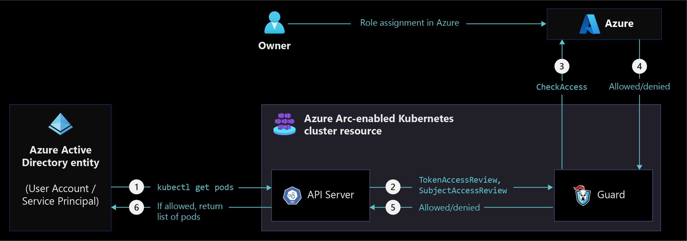
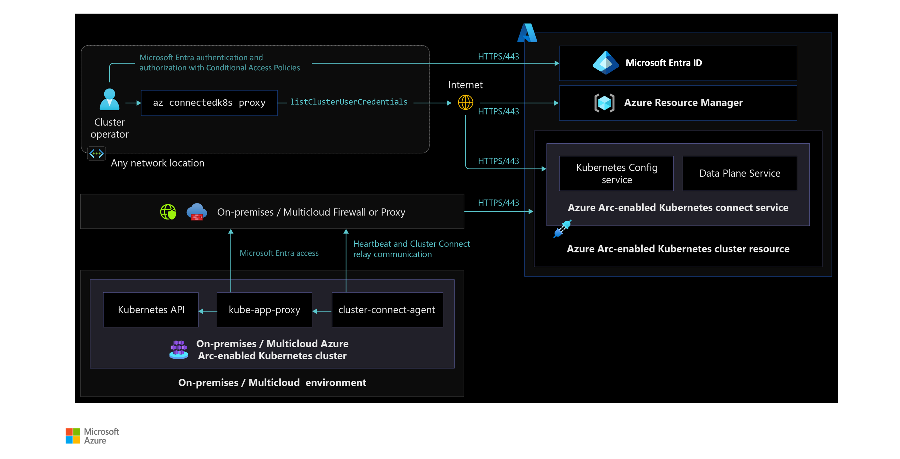

# Identity and access management for Azure Arc-enabled Kubernetes

Azure Arc-enabled Kubernetes supports on-premises and other cloud environments that are integrated with different identity and access management systems. In addition to existing Kubernetes cluster role-based access control (RBAC), Azure Arc-enabled Kubernetes supports Azure RBAC to unify access management across Kubernetes clusters and minimize operational overhead.

The combination RBAC models your organization should use depends on what usage needs your organization has. Some examples are:

- Onboarding a Kubernetes cluster to Azure Arc
- Managing an Arc-enabled Kubernetes cluster
- Installing Azure Arc cluster extensions
- Running applications on an Arc-enabled Kubernetes cluster
- Using Azure RBAC to access Azure resources

Understanding both your organization's needs and Azure Arc-enabled Kubernetes's capabilities allows you to choose the best RBAC models for your specific infrastructure, security, and governance requirements as you build an Arc-enabled Kubernetes cluster.

This article describes Azure Arc-enabled Kubernetes identity and access management (IAM) architecture, design considerations, recommendations, and role-based access controls for various scenarios.

## Architecture

To design the right architecture for your organization, you need to understand [Arc-enabled Kubernetes connectivity modes](/azure/azure-arc/kubernetes/conceptual-connectivity-modes#understand-connectivity-modes). Azure RBAC is supported only in the fully connected mode, not the semi-connected mode.

### Azure RBAC on Azure Arc-enabled Kubernetes

The following diagram shows various Azure Arc-enabled Kubernetes components and how they interact when [Azure RBAC](/azure/azure-arc/kubernetes/conceptual-azure-rbac#architecture---azure-rbac-on-azure-arc-enabled-kubernetes) is used to manage a Kubernetes cluster.

### Securely access Azure Arc-enabled Kubernetes cluster from anywhere

The following diagram displays [Azure Arc-enabled Kubernetes cluster access from anywhere](/azure/azure-arc/kubernetes/conceptual-cluster-connect) and shows how components interact with each other to manage a cluster using Azure RBAC.

## Design considerations

Review the [identity and access management design area](../../../ready/landing-zone/design-area/identity-access.md) of Azure landing zones to assess the effect of Azure Arc-enabled Kubernetes on your overall identity and access model.

**For Kubernetes cluster onboarding:**

- Decide between Microsoft Entra user (for manual onboarding of single cluster) vs service principal (for scripted and headless onboarding of multiple clusters) for onboarding Kubernetes clusters to Azure Arc individually or at scale. For more implementation details, refer to the [Automation disciplines critical design area](./eslz-arc-kubernetes-automation-disciplines.md).
- Identity of the onboarding entity needs to have cluster-admin ClusterRoleBinding on the cluster. Decide between using a user from your on-premises or other cloud identity provider or using a Kubernetes service account with cluster-admin role.

**For Kubernetes cluster management:**

- As Azure Arc-enabled Kubernetes brings Microsoft Entra authentication and Azure RBAC to on-premises or other cloud Kubernetes environments, you must decide between existing Kubernetes access management and [Azure RBAC](/azure/azure-arc/kubernetes/conceptual-azure-rbac), depending on your organization's security and governance requirements.
- Determine if Azure Arc-enabled Kubernetes Cluster Connect gives you the flexibility to [manage Kubernetes cluster](/azure/azure-arc/kubernetes/conceptual-cluster-connect) without your inbound firewall ports being open to your on-premises or other cloud networks.
- Determine if Azure RBAC is the right choice when you have many Kubernetes clusters running in on-premises and other cloud environments and you need to simplify cluster administration across all Kubernetes clusters.

## Design recommendations

**For Kubernetes cluster onboarding:**

- Use [Microsoft Entra security groups](/entra/fundamentals/how-to-manage-groups) to grant Azure Arc-enabled Kubernetes cluster RBAC roles for onboarding and managing Azure Arc-enabled Kubernetes clusters.
  
**For Kubernetes cluster management:**

- If your on-premises identities are synchronized with Microsoft Entra ID, use the same identities when using Azure RBAC for cluster management.
- Simplify your access management by creating [security groups](/entra/fundamentals/how-to-manage-groups) and map them to the Azure RBAC roles supported by Azure Arc-enabled Kubernetes. Assign permissions to these security groups at the resource group or subscription level depending on your resource organization and governance requirements. For more information, see the [Resource Organization critical design area](./eslz-arc-kubernetes-resource-organization.md).
  
  > [!NOTE]
  > Azure Arc-enabled Kubernetes does not support users with more than 200 security group memberships and will instead give an authentication error.

- Avoid direct user assignment to Azure RBAC roles, since it's difficult to govern access management.
- Decentralize and delegate access management responsibility and audit assignments by assigning security group owners.
- Enable periodic [access reviews](/entra/id-governance/privileged-identity-management/pim-create-roles-and-resource-roles-review) in Microsoft Entra ID to remove users that no longer need access to the Kubernetes clusters.
- Create [Conditional Access policies](/entra/identity/conditional-access/policy-admin-phish-resistant-mfa) when using Azure RBAC for cluster management to enforce various conditions to meet security and governance policies.
  
## Role based access controls

Azure Arc-enabled Kubernetes manages Kubernetes clusters using Azure RBAC and supports the following Roles for onboarding Kubernetes clusters to Azure Arc.

|Role|Description|
|-----------|------------|
|Azure Arc-enabled Kubernetes Cluster User Role|Lets you fetch the Cluster Connect based kubeconfig file to manage clusters from anywhere.|
|Azure Arc Kubernetes Admin|Lets you manage all resources under cluster/namespace, except update or delete resource quotas and namespaces.|
|Azure Arc Kubernetes Cluster Admin|Lets you manage all resources in the cluster.|
|Azure Arc Kubernetes Viewer|Lets you view all resources in cluster/namespace, except secrets.|
|Azure Arc Kubernetes Writer|Lets you update everything in cluster/namespace, except (cluster) roles and (cluster) role bindings.|
|Kubernetes Cluster - Azure Arc Onboarding|Role definition lets you authorize any user/service to create connected clusters resources|

## Next steps

For more information on your hybrid and multicloud cloud journey, see the following articles:

- Review the [prerequisites](/azure/azure-arc/kubernetes/quickstart-connect-cluster?tabs=azure-cli#prerequisites) for Azure Arc-enabled Kubernetes.
- Review the [validated Kubernetes distributions](/azure/azure-arc/kubernetes/validation-program#validated-distributions) for Azure Arc-enabled Kubernetes.
- Review [Manage hybrid and multicloud environments](../manage.md).
- Review [common Conditional Access policies](/entra/identity/conditional-access/concept-conditional-access-policy-common?tabs=secure-foundation#template-categories) to apply when using Azure RBAC for Azure Arc-enabled Kubernetes cluster.
- [Resource organization](./eslz-arc-kubernetes-resource-organization.md) can help you plan and apply governance and security using Azure RBAC.
- Learn how to [Integrate Microsoft Entra ID with Azure Arc-enabled Kubernetes clusters](/azure/azure-arc/kubernetes/azure-rbac).
- Learn how to [Access your cluster securely](/azure/azure-arc/kubernetes/conceptual-cluster-connect) from anywhere using Cluster connect.
- Review [Azure Landing Zones - Azure identity and access management design area](../../../ready/landing-zone/design-area/identity-access.md).
- Review the [Cloud Adoption Framework - Access Control](../../../secure/govern.md) methodology.
- Experience Azure Arc-enabled Kubernetes automated scenarios with [Azure Arc Jumpstart](https://azurearcjumpstart.io/azure_arc_jumpstart/azure_arc_k8s/).
- Learn more about Azure Arc via the [Azure Arc learning path](/training/paths/manage-hybrid-infrastructure-with-azure-arc/).
- Review [Frequently Asked Questions - Azure Arc-enabled](/azure/azure-arc/kubernetes/faq) to find answers to most common questions.
