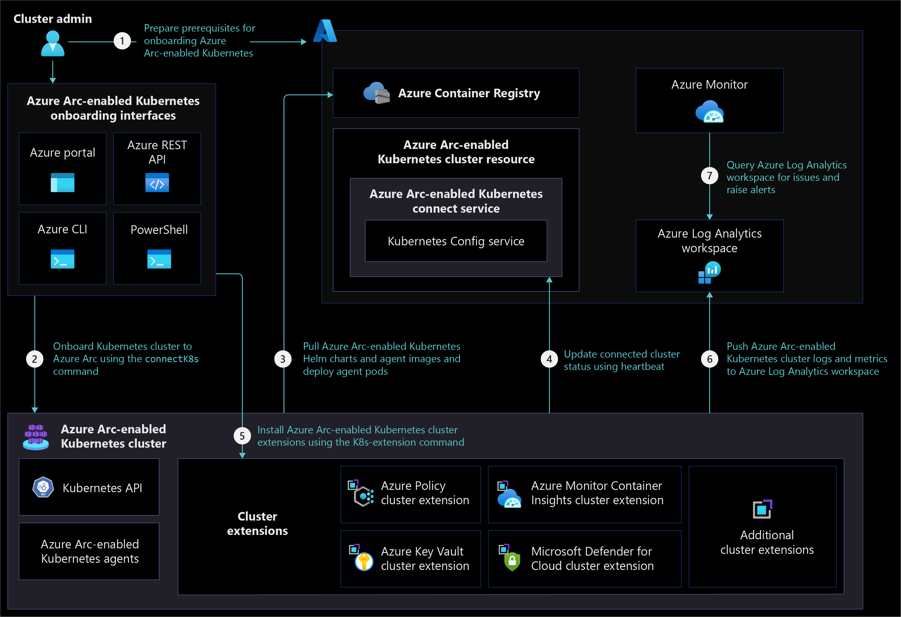
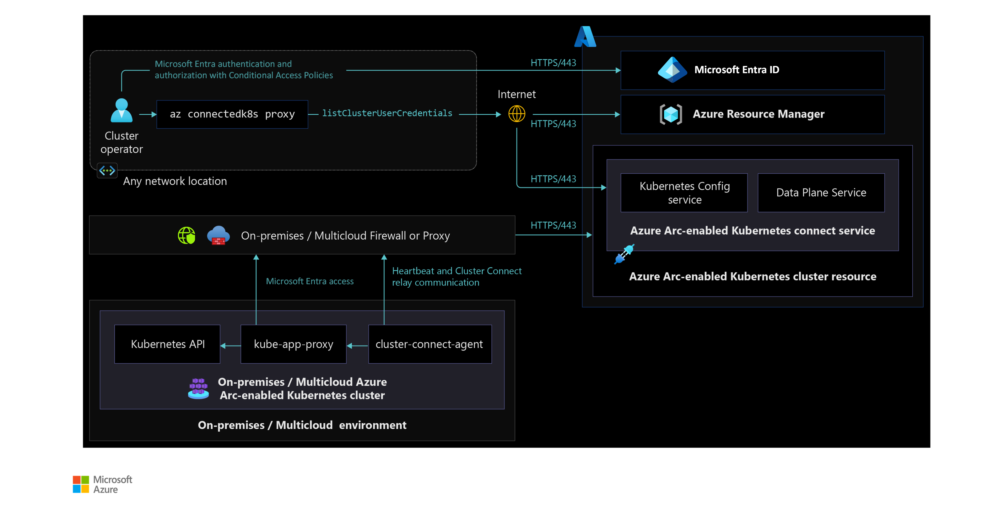

# Management and monitoring for Azure Arc-enabled Kubernetes

This article provides key design considerations and recommendations for managing and monitoring Azure Arc-enabled Kubernetes clusters that help you understand and design solutions for operational excellence. Use the guidance provided in this document and in other critical design areas referenced throughout it to better understand related design considerations and recommendations.

## Architecture

To build the right architecture for your organization to onboard on-premises or multicloud Kubernetes clusters, you need to understand Azure Arc-enabled Kubernetes architecture and [network connectivity modes](/azure/azure-arc/kubernetes/conceptual-connectivity-modes#understand-connectivity-modes). This understanding lets you implement Azure Arc and manage, monitor, and meet both your organization's architectural standards and your operational desired state.

### Cluster management

The following architecture diagram shows different Azure Arc-enabled Kubernetes components and how they interact when an organization onboards and manages an on-premises or multicloud Kubernetes cluster in a fully connected network connectivity mode.

The following diagram portrays [Azure Arc-enabled Kubernetes cluster access from anywhere](/azure/azure-arc/kubernetes/conceptual-cluster-connect) and how components interact with each other to manage clusters using Azure RBAC.

### Cluster monitoring

The following architecture diagram shows Azure Arc-enabled Kubernetes cluster monitoring in a fully connected network connectivity mode.

## Design considerations

- Review the [management design area](../../../ready/landing-zone/design-area/management.md) of the Azure landing zones to assess the effect of Azure Arc-enabled Kubernetes on your overall management model.

**Cluster onboarding:**

- Consider the recommendations in the [resource organization critical design area](./eslz-arc-kubernetes-resource-organization.md) and in [governance and security disciplines](./eslz-arc-kubernetes-governance-disciplines.md) as you design [enterprise scale landing zone subscriptions](../../../ready/landing-zone/index.md#azure-landing-zone-conceptual-architecture) to onboard and manage Azure Arc-enabled Kubernetes clusters and [extensions](/azure/azure-arc/kubernetes/extensions).
- Decide between [auto-upgrading and manual upgrading Azure Arc-enabled Kubernetes agents](/azure/azure-arc/kubernetes/agent-upgrade#toggle-auto-upgrade-on-or-off-when-connecting-cluster-to-azure-arc) depending on your organization's change management process whether you're onboarding on-premises or multicloud Kubernetes clusters to Azure Arc. If you reconsider this decision later on, you can change the auto-upgrade management behavior of Azure Arc-enabled Kubernetes agents at any point after your cluster is onboarded.
- Consider managing [Azure Arc-enabled Kubernetes network firewall rules](/azure/azure-arc/kubernetes/quickstart-connect-cluster?tabs=azure-cli#meet-network-requirements) by minimizing firewall or proxy management and designing source and destination groups. For more information, see your organization's on-premises or multicloud firewall or proxy management guidelines.

**Cluster management:**

- [Azure Arc-enabled Kubernetes extensions](/azure/azure-arc/kubernetes/extensions) require you to allow more URLs on firewalls or proxy servers. Depending on the extensions you're installing, planning ahead to accommodate extra URLs can help you minimize change management timelines.
- If you onboard an on-premises or multicloud Kubernetes cluster with the [auto-upgrade toggle off](/azure/azure-arc/kubernetes/agent-upgrade#toggle-auto-upgrade-on-or-off-when-connecting-cluster-to-azure-arc), consider upgrading Azure Arc-enabled Kubernetes agents regularly so they stay up to date with latest product releases and you avoid expensive upgrade processes in the future.
- Consider using [GitOps](/azure/azure-arc/kubernetes/tutorial-use-gitops-flux2) to manage Arc-enabled Kubernetes agent and cluster extension updates and maintain consistent deployments across all clusters and environments. For detailed guidance, see the [CI/CD workflow using GitOps](./eslz-arc-kubernetes-cicd-gitops-disciplines.md) and [platform disciplines](./eslz-arc-kubernetes-automation-disciplines.md) critical design areas.
- Consider using the [Azure Arc-enabled Kubernetes cluster connect](/azure/azure-arc/kubernetes/conceptual-cluster-connect) feature to connect to _apiserver_ without needing any inbound port to be enabled on your firewall. To understand how this feature works, review the [network connectivity critical design area](./eslz-arc-kubernetes-network-connectivity.md).

**Cluster monitoring:**

- Review and consider the [supported configuration for Azure Monitor Container insights](/azure/azure-monitor/containers/container-insights-enable-arc-enabled-clusters?toc=/azure/azure-arc/kubernetes/toc.json#supported-configurations) with Azure Arc-enabled Kubernetes. Decide if Azure Monitor Container insights meet your organization's needs for Azure Arc-enabled Kubernetes cluster monitoring or not.
- Consider using a dedicated Log Analytics workspace for each region to collect logs and metrics from Azure Arc-enabled Kubernetes clusters and monitor and report across multiple clusters in a specific environment. For more information, see [Designing your Azure Monitor Logs deployment](/azure/azure-monitor/logs/design-logs-deployment).
- Consider using Azure Monitor [ITSM connector integration](/azure/azure-monitor/alerts/itsmc-overview) with your organization's IT service management tools to raise incidents for Azure Monitor alerts and track issue resolution.
- If you use the [semi-connected network connectivity mode](/azure/azure-arc/kubernetes/conceptual-connectivity-modes#understand-connectivity-modes), consider using private endpoints to connect to [Azure Log Analytics](/azure/azure-monitor/logs/private-link-design) workspaces through Azure ExpressRoute or VPN connectivity so you can collect logs and metrics from Azure Arc-enabled Kubernetes clusters and monitors.

## Design recommendations

**Cluster onboarding:**

- Using shared administration terminal server(s) to [install required tools](/azure/azure-arc/kubernetes/quickstart-connect-cluster?tabs=azure-cli#prerequisites) lets you maintain consistent tools and versions across all users and prevent deployment and management issues for Azure Arc-enabled Kubernetes cluster.
- Make sure administration terminal servers and on-premises or multicloud Kubernetes clusters are in the allowlist to access [Azure Arc-enabled Kubernetes required URLs](/azure/azure-arc/kubernetes/quickstart-connect-cluster?tabs=azure-cli#meet-network-requirements) so you can use Azure Arc control plane for onboarding and management.
- Create a script to verify connectivity to [Azure Arc-enabled Kubernetes required URLs](/azure/azure-arc/kubernetes/quickstart-connect-cluster?tabs=azure-cli#meet-network-requirements) from your on-premises or multicloud Kubernetes cluster nodes. This script helps you minimize the need for troubleshooting and resolving connectivity issues.
- Create an onboarding deployment script using [PowerShell](/azure/azure-resource-manager/templates/deploy-powershell) or [Bash](/azure/azure-resource-manager/templates/deploy-cloud-shell?tabs=azure-cli). This script can help you onboard Arc-enabled Kubernetes clusters and install cluster extensions to prevent issues and consistent deployment across all environments and clusters.

**Cluster management:**

- Certain [Azure Arc-enabled Kubernetes extensions](/azure/azure-arc/kubernetes/conceptual-extensions) require [custom locations](/azure/azure-arc/kubernetes/conceptual-custom-locations) to deploy extension pods and configurations. Only one custom location is supported for each Kubernetes namespace. You should create each custom location in its own Kubernetes namespace and deploy an Azure Arc-enabled Kubernetes extension that relies on the custom location in the same namespace.
- Use the fully connected network connectivity model for your onboarded clusters. If you must use [the semi-connected network connectivity mode](/azure/azure-arc/kubernetes/conceptual-connectivity-modes#understand-connectivity-modes), you should connect your clusters to Azure Arc at least once every 30 days to export billing data, and once ever 90 days to renew managed identity certificates and update Azure Arc-enabled Kubernetes resources and agents.
- Deploy [Open Service Mesh (OSM)](/azure/azure-arc/kubernetes/tutorial-arc-enabled-open-service-mesh) to gain capabilities like mTLS security, fine-grained access control, traffic shifting, monitoring with Azure Monitor or with open source add-ons of Prometheus and Grafana, tracing with Jaeger, and integration with external certification management solutions.

**Cluster monitoring:**

- Collect logs and metrics using [Azure Monitor Container insights for Azure Arc-enabled Kubernetes clusters](/azure/azure-monitor/containers/container-insights-enable-arc-enabled-clusters). Use these logs and metrics to create dashboards and generate alerts for cluster related issues.
- Enable [recommended metric alert rules from Container insights](/azure/azure-monitor/containers/container-insights-metric-alerts) to receive notifications from Azure Monitor.
- Use [Azure Resource Graph](/azure/azure-arc/kubernetes/resource-graph-samples?tabs=azure-cli) or [Log Analytics queries](/azure/azure-monitor/logs/queries) to monitor cluster health and raise alerts.

The following diagram shows Azure Resource Graph being used for status monitoring:

## Next steps

For more information about your hybrid and multicloud cloud journey, see the following articles:

- Review the [prerequisites](/azure/azure-arc/kubernetes/quickstart-connect-cluster?tabs=azure-cli#prerequisites) for Azure Arc-enabled Kubernetes.
- Review the [validated Kubernetes distributions](/azure/azure-arc/kubernetes/validation-program#validated-distributions) for Azure Arc-enabled Kubernetes.
- Learn how to [Manage hybrid and multicloud environments](../manage.md).
- Learn the [Azure Arc-enabled Kubernetes network connectivity requirements](/azure/azure-arc/kubernetes/quickstart-connect-cluster?tabs=azure-cli#meet-network-requirements).
- Learn how to [Connect an existing Kubernetes cluster to Azure Arc](/azure/azure-arc/kubernetes/quickstart-connect-cluster).
- Learn how to [Upgrade Azure Arc-enabled Kubernetes agents](/azure/azure-arc/kubernetes/agent-upgrade).
- Learn how to [Use Cluster Connect to connect to Azure Arc-enabled Kubernetes clusters](/azure/azure-arc/kubernetes/cluster-connect) for cluster management.
- Experience Azure Arc-enabled Kubernetes automated scenarios with [Azure Arc Jumpstart](https://azurearcjumpstart.io/azure_arc_jumpstart/azure_arc_k8s/).
- Learn about Azure Arc via the [Azure Arc learning path](/training/paths/manage-hybrid-infrastructure-with-azure-arc/).
- See [Frequently Asked Questions - Azure Arc-enabled](/azure/azure-arc/kubernetes/faq) to find answers to most common questions.
