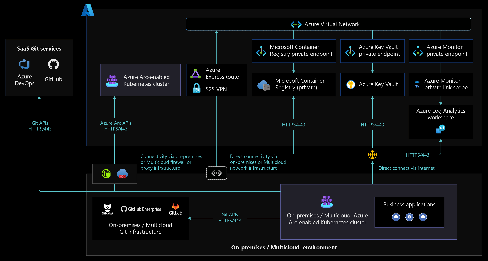
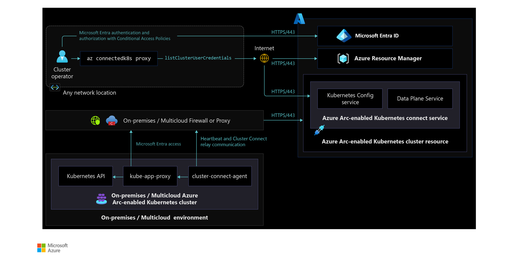

# Network connectivity for Azure Arc-enabled Kubernetes

Arc-enabled Kubernetes supports [fully connected and semi-connected modes](/azure/azure-arc/kubernetes/conceptual-connectivity-modes#understand-connectivity-modes) to onboard and manage Kubernetes clusters with Azure Arc's control plane. Azure Arc-enabled Kubernetes agents connect to Azure Arc endpoints to [exchange metadata](/azure/azure-arc/kubernetes/conceptual-data-exchange). They use pull and push methods from Kubernetes clusters.

This article covers tips to connect Arc-enabled Kubernetes clusters to the Azure control plane. It applies to on-premises and other cloud setups.

## Architecture

The following diagram shows an Azure Arc-enabled Kubernetes network layout that supports fully connected and semi-connected modes.

The following diagram shows a network layout that lets you reach clusters from any location. It uses the [Azure Arc-enabled Kubernetes Cluster Connect feature](/azure/azure-arc/kubernetes/conceptual-cluster-connect).

## Design considerations

- Review the [network topology and connectivity design area](../../../ready/landing-zone/design-area/network-topology-and-connectivity.md) of the Azure landing zones. Check how Azure Arc-enabled Kubernetes affects your network model.
- Review the [network requirements](/azure/azure-arc/kubernetes/quickstart-connect-cluster?tabs=azure-cli#meet-network-requirements) for Azure Arc-enabled Kubernetes. Learn how clusters connect to Azure from on-premises networks or other cloud providers.
- Balance your org's security and compliance needs with the benefits of Azure Arc-enabled Kubernetes. Then pick [fully connected mode or semi-connected mode](/azure/azure-arc/kubernetes/conceptual-connectivity-modes#understand-connectivity-modes) for your setup.
- Decide if you want to use public or [private endpoints](/azure/private-link/private-endpoint-overview) for Azure Log Analytics workspaces. Choose between ExpressRoute or VPN and the internet.
- Decide if you want to use public or private endpoints for [Azure Key Vaults](/azure/azure-arc/kubernetes/tutorial-akv-secrets-provider). Choose between ExpressRoute or VPN and the internet.
- Choose how to connect for Azure Arc-enabled Kubernetes cluster management. Azure Arc-enabled Kubernetes clusters support [cluster management from any network](/azure/azure-arc/kubernetes/conceptual-cluster-connect). For tips on network-independent cluster management, see [Identity and Access Management](./eslz-arc-kubernetes-identity-access-management.md).
- Consider using the [Cluster Connect feature](/azure/azure-arc/kubernetes/conceptual-cluster-connect). It removes the need to open inbound network ports. It allows only outbound traffic to Azure Arc services.
- Your on-premises or multicloud [firewalls or proxy servers might do TLS inspection](/azure/firewall/premium-features#tls-inspection) of outbound traffic. They might also run network intrusion detection and prevention (IDPS). If so, decide if you should exempt Azure Arc-enabled Kubernetes endpoints. These firewalls or proxy servers might not trust some server certificates.

## Design recommendations

- Use the fully connected mode for onboarded Kubernetes clusters. This keeps you current with product releases, security updates, policies, and extensions. It also helps bring Azure cloud services to on-premises or multicloud setups.
- Make sure you meet Azure Arc-enabled Kubernetes [network requirements](/azure/azure-arc/kubernetes/quickstart-connect-cluster?tabs=azure-cli#meet-network-requirements) for your chosen network model.
- Enable [Azure Private Link](/azure/private-link/private-link-overview) to reach Azure resources like [Key Vault](/azure/azure-arc/kubernetes/tutorial-akv-secrets-provider), [storage accounts](/azure/storage/common/storage-account-overview), [Microsoft Container Registry](/azure/container-registry/), and [Log Analytics](/azure/azure-monitor/logs/log-analytics-workspace-overview). Use Azure [ExpressRoute](/azure/expressroute/expressroute-introduction) or [VPN connections](/azure/vpn-gateway/vpn-gateway-about-vpngateways) from Kubernetes clusters in on-premises or other cloud setups.
  - Configure a [DNS forwarder](/azure/private-link/private-endpoint-dns#on-premises-workloads-using-a-dns-forwarder) to resolve the Azure service public DNS zone in Azure.
- If [Azure Arc-enabled Kubernetes agent](/azure/azure-arc/kubernetes/conceptual-agent-overview) traffic goes through your firewalls or proxy servers, create source and destination object groups or tags. This simplifies outbound traffic rules and supports URL allowlists for Azure Arc extensions.
- Use Azure Monitor to track [Azure Arc-enabled Kubernetes cluster connection status](/azure/azure-arc/kubernetes/conceptual-connectivity-modes#connectivity-status). Set up alerts when the status changes. You can also use [Azure Resource Graph queries](/azure/azure-arc/kubernetes/resource-graph-samples?tabs=azure-cli) with Azure Monitor.
- When you use [the semi-connected network mode](/azure/azure-arc/kubernetes/conceptual-connectivity-modes#understand-connectivity-modes), connect your cluster to Azure Arc at least once every 30 days. This exports billing data. Also connect at least once every 90 days. This renews managed identity certificates and updates Azure Arc-enabled Kubernetes resources and agents.

## Next steps

For more info on your hybrid and multicloud journey, see these articles:

- Review the [prerequisites](/azure/azure-arc/kubernetes/quickstart-connect-cluster?tabs=azure-cli#prerequisites) for Azure Arc-enabled Kubernetes.
- Review [tested Kubernetes distributions](/azure/azure-arc/kubernetes/validation-program#validated-distributions) for Azure Arc-enabled Kubernetes.
- Learn how to [Connect an existing Kubernetes cluster to Azure Arc](/azure/azure-arc/kubernetes/quickstart-connect-cluster?tabs=azure-cli).
- Learn about [Azure Arc-enabled Kubernetes connectivity modes](/azure/azure-arc/kubernetes/conceptual-connectivity-modes).
- Learn about [data shared between Azure Arc-enabled Kubernetes clusters and Azure](/azure/azure-arc/kubernetes/conceptual-data-exchange).
- Learn how to [Apply configurations at-scale using Azure Policy](/azure/azure-arc/kubernetes/use-azure-policy).
- Review [Azure Resource Graph sample queries for Azure Arc-enabled Kubernetes](/azure/azure-arc/kubernetes/resource-graph-samples?tabs=azure-cli).
- Learn about [Azure Arc-enabled Open Service Mesh](/azure/azure-arc/kubernetes/tutorial-arc-enabled-open-service-mesh) to secure cluster traffic. Also see the [services observability](./eslz-arc-kubernetes-services-observability.md) critical design area.
- Learn how to [Access Azure Arc-enabled Kubernetes clusters from anywhere using Cluster Connect](/azure/azure-arc/kubernetes/conceptual-cluster-connect).
- Try Azure Arc-enabled Kubernetes automated scenarios with [Azure Arc Jumpstart](https://azurearcjumpstart.io/azure_arc_jumpstart/azure_arc_k8s/).
- Learn more about Azure Arc with the [Azure Arc learning path](/training/paths/manage-hybrid-infrastructure-with-azure-arc/).
- See [Frequently Asked Questions - Azure Arc-enabled](/azure/azure-arc/kubernetes/faq) for answers to most common questions.