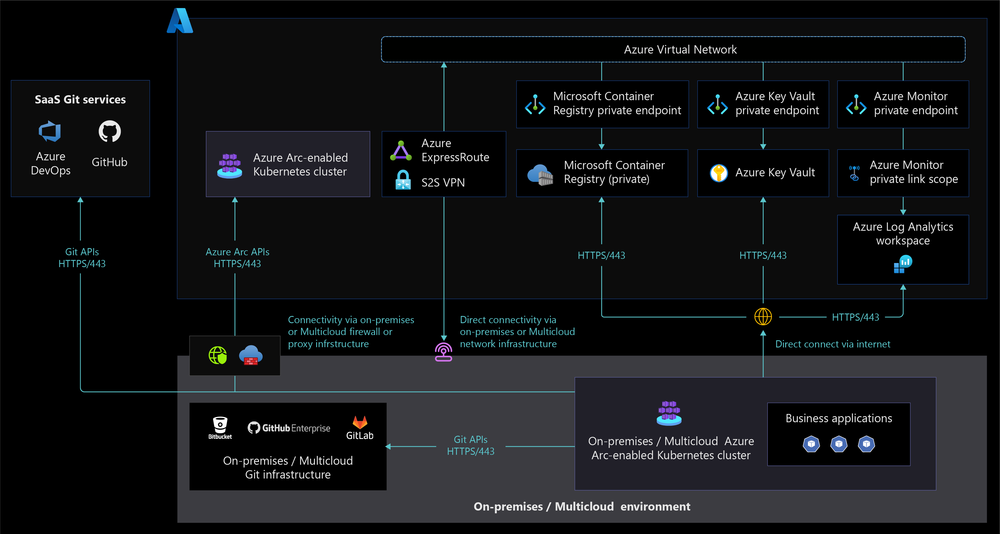

# Network connectivity for Azure Arc-enabled Kubernetes

Arc-enabled Kubernetes supports [fully connected and semi-connected modes](/azure/azure-arc/kubernetes/conceptual-connectivity-modes#understand-connectivity-modes) for onboarding and managing Kubernetes clusters with Azure Arc's control plane. Azure Arc-enabled Kubernetes agents communicate with Azure Arc endpoints to [exchange different types of metadata information](/azure/azure-arc/kubernetes/conceptual-data-exchange) using pull and push methods from Kubernetes clusters.

This document explains network architecture, design considerations, and design recommendations that help you enable connectivity to the Azure control plane so you can manage and operate Arc-enabled Kubernetes clusters running in on-premises and other cloud environments.

## Architecture

The following diagram displays an Azure Arc-enabled Kubernetes network architecture that supports fully connected and semi-connected network connectivity modes.

The following diagram displays a network architecture that allows cluster access from any network location using [Azure Arc-enabled Kubernetes Cluster Connect capability](/azure/azure-arc/kubernetes/conceptual-cluster-connect) feature.

## Design considerations

- Review the [network topology and connectivity design area](../../../ready/landing-zone/design-area/network-topology-and-connectivity.md) of the Azure landing zones to assess the effect of Azure Arc-enabled Kubernetes on your connectivity model.
- Review the [network requirements](/azure/azure-arc/kubernetes/quickstart-connect-cluster?tabs=azure-cli#meet-network-requirements) for Azure Arc-enabled Kubernetes to understand how clusters communicate with Azure from on-premises network or other cloud providers.
- Consider trade-offs between your organization's security and compliance requirements and the benefits Azure Arc-enabled Kubernetes offers your organization. Decide between [fully connected mode and semi-connected mode](/azure/azure-arc/kubernetes/conceptual-connectivity-modes#understand-connectivity-modes) for your implementation.
- Decide whether to use public or private endpoints when connecting to [Azure Log Analytics](/azure/azure-monitor/logs/private-link-design) workspaces through ExpressRoute or VPN versus internet connectivity.
- Decide whether to use public or private endpoints when connecting to [Azure Key Vaults](/azure/azure-arc/kubernetes/tutorial-akv-secrets-provider) through ExpressRoute or VPN versus internet connectivity.
- Choose your network connectivity options for Azure Arc-enabled Kubernetes cluster management, since Azure Arc-enabled Kubernetes clusters support [cluster management from any network](/azure/azure-arc/kubernetes/conceptual-cluster-connect). For design considerations and recommendations when deciding on network independent cluster management, see [Identity and Access Management](./eslz-arc-kubernetes-identity-access-management.md).
- Consider securely managing Azure Arc-enabled Kubernetes cluster through the [Cluster Connect capability to access anywhere](/azure/azure-arc/kubernetes/conceptual-cluster-connect), which eliminates inbound network port opening and allows only outbound communication to Azure Arc services in Azure.
- When using on-premises or multicloud [firewalls or proxy servers for TLS inspection](/azure/firewall/premium-features#tls-inspection) of your outbound traffic and network intrusion detection and prevention system (IDPS), decide whether or not to exempt Azure Arc-enabled Kubernetes endpoints, since some of the server certificates aren't trusted by these firewalls or proxy servers.

## Design recommendations

- Using the fully connected mode for onboarded Kubernetes clusters helps you stay current with the latest product releases, security updates, policies, and installed extensions for bringing Azure cloud services to on-premises or multicloud environments.
- Ensure you meet Azure Arc-enabled Kubernetes [network requirements](/azure/azure-arc/kubernetes/quickstart-connect-cluster?tabs=azure-cli#meet-network-requirements) based on your chosen connectivity model.
- Enable [Azure Private Link](/azure/azure-monitor/logs/private-link-security) to access Azure resources such as [Key Vault](/azure/azure-arc/kubernetes/tutorial-akv-secrets-provider), [storage accounts](/azure/storage/common/storage-account-overview), [Microsoft Container Registry](/azure/container-registry/), and [Log Analytics](/azure/azure-monitor/logs/log-analytics-workspace-overview) from Kubernetes clusters running in on-premises or other cloud environments through Azure [Express Route](/azure/expressroute/expressroute-introduction) or [VPN connections](/azure/vpn-gateway/vpn-gateway-about-vpngateways).
  - Configure a [DNS forwarder](/azure/private-link/private-endpoint-dns#on-premises-workloads-using-a-dns-forwarder) to resolve the Azure service public DNS zone in Azure.
- For [Azure Arc-enabled Kubernetes agents](/azure/azure-arc/kubernetes/conceptual-agent-overview) traffic going through your firewalls or proxy servers, create a source and some destination object groups and/or tags to simplify outbound internet traffic rules and support other URL allowlists for Azure Arc extensions.
- Use Azure Monitor track [Azure Arc-enabled Kubernetes cluster connectivity status](/azure/azure-arc/kubernetes/conceptual-connectivity-modes#connectivity-status) and raise alerts that notify administrators when connectivity states change. Consider using [Azure Resource Graph queries](/azure/azure-arc/kubernetes/resource-graph-samples?tabs=azure-cli) along with Azure Monitor.
- When using [the semi-connected network connectivity mode](/azure/azure-arc/kubernetes/conceptual-connectivity-modes#understand-connectivity-modes), connect your cluster to Azure Arc at least once every 30 days to export billing data, and at least once every 90 days to renew managed identity certificates and update Azure Arc-enabled Kubernetes resource and agents.

## Next steps

For more information about your hybrid and multicloud cloud journey, see the following articles:

- Review the [prerequisites](/azure/azure-arc/kubernetes/quickstart-connect-cluster?tabs=azure-cli#prerequisites) for Azure Arc-enabled Kubernetes.
- Review [validated Kubernetes distributions](/azure/azure-arc/kubernetes/validation-program#validated-distributions) for Azure Arc-enabled Kubernetes.
- Review [Manage hybrid and multicloud environments](../manage.md).
- Learn how to [Connect an existing Kubernetes cluster to Azure Arc](/azure/azure-arc/kubernetes/quickstart-connect-cluster?tabs=azure-cli).
- Learn about [Azure Arc-enabled Kubernetes connectivity modes](/azure/azure-arc/kubernetes/conceptual-connectivity-modes).
- Learn about [Data exchanged between Azure Arc-enabled Kubernetes clusters and Azure](/azure/azure-arc/kubernetes/conceptual-data-exchange).
- Learn how to [Apply configurations at-scale using Azure Policy](/azure/azure-arc/kubernetes/use-azure-policy).
- Review [Azure Resource Graph sample queries for Azure Arc-enabled Kubernetes](/azure/azure-arc/kubernetes/resource-graph-samples?tabs=azure-cli).
- Understand [Azure Arc-enabled Open Service Mesh](/azure/azure-arc/kubernetes/tutorial-arc-enabled-open-service-mesh) to secure Azure Arc-enabled Kubernetes cluster communication and the [services observability](./eslz-arc-kubernetes-services-observability.md) critical design area.
- Learn how to [Access Azure Arc-enabled Kubernetes clusters from anywhere using Cluster Connect](/azure/azure-arc/kubernetes/conceptual-cluster-connect).
- Experience Azure Arc-enabled Kubernetes automated scenarios with [Azure Arc Jumpstart](https://azurearcjumpstart.io/azure_arc_jumpstart/azure_arc_k8s/).
- Learn more about Azure Arc via the [Azure Arc learning path](/training/paths/manage-hybrid-infrastructure-with-azure-arc/).
- See [Frequently Asked Questions - Azure Arc-enabled](/azure/azure-arc/kubernetes/faq) for answers to most common questions.
