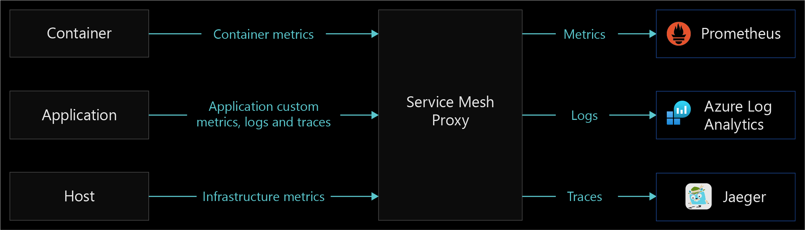

# Services observability for Azure Arc-enabled Kubernetes

Observability is an application characteristic that refers to how well a system’s internal state or status can be understood from its external outputs. We measure computer systems by observing CPU time, memory, disk space, latency, errors, and other metrics. The more observable a system is, the easier it's for us to understand what it’s doing by watching it.

A system's observability has a significant effect on its operating cost. Observable systems yield meaningful, actionable data to their operators, allowing them to achieve favorable outcomes and have less downtime. More information doesn't necessarily translate into a more observable system. In fact, sometimes the amount of information generated by a system can make it harder to identify valuable health signals from the noise generated by the application.

Service observability is important because it helps you understand performance of and issues in distributed and cloud systems based on dynamic architectures.

Implementing a solution to achieve services observability can help you:

- Ensure that end users can consume your application and your business expectations are met.
- Understand an entire system and how it works together using a single pane of glass.
- Establish a baseline for your system and understand how different circumstances affect your system's performance.
- Generate action items from unexpected scenarios and behaviors.

Azure Arc-enabled Kubernetes provides two integrated extension options to help you achieve services observability: [Open Service Mesh](/azure/azure-arc/kubernetes/tutorial-arc-enabled-open-service-mesh) and [Self-hosted API Management gateway](/azure/api-management/self-hosted-gateway-overview). These options are discussed in detail in the following design consideration sections.

## Architecture

The following diagram illustrates the three pillars of Services Observability with data volume impact.

The following diagram shows various Open Service Mesh components running in an Arc-enabled Kubernetes cluster. It also shows a sample application enabled in the service mesh, which is automatically configured with an Envoy side-car container.

## Design considerations

The three pillars of observability are metrics, logs, and traces. Incorporate them into your observability strategy to help make your system observable.

- **Metrics** are numerical values that describe some aspect of a system at a particular point in time, and they're always collected at regular intervals.

The following screenshot shows a visualization of an example HTTP request metric for a service. The metric in this example is displayed as HTTP request rate per minute over a specified time period.  

- **Logs** can store various data types that have their own structures. A log contains details about transactions that can allow you to obtain a more complete story for a given event. Application logs typically include timestamps, log levels, and any information necessary to understand the context of an event. Logs are collected and shipped to a log service for storage and analysis.

- **Distributed tracing** is a diagnostic technique that helps users localize failures and performance issues within applications, especially any that are distributed across multiple machines or processes. This technique tracks requests through an application, correlating work done by different application components and separating that from other work the application might be doing for concurrent requests.

The following screenshot shows a visualization of an end-to-end transaction using Application Insights. This visual allows for easy understanding of response times, response codes, and any exceptions that occur between requests in a transaction chain.  

The three pillars of metrics, logs, and distributed tracing are interconnected. Metrics are stored as numerical values in a time-series database. They're also much smaller than logs, which makes them easier to evaluate and useful for near-real-time alerting. Logs capture and convey much more information than metrics, which makes them useful for deeper debugging. Traces are request-scoped, and useful for getting visibility into a request as it traverses various components of a distributed system.

The following table shows collection impact for the three pillars.

| Collection characteristic        | Metrics           | Logs  | Distributed Tracing  |
| ------------- |:-------------:| -----:| -----:|
| Accounts for every transaction      | Yes | Yes | No (sampled) |
| Immune to cardinality issues      | No      |   Yes |   Yes |
| Cost  | Low      |    High |    Low |

There are different ways you can achieve service observability. You can use a service mesh to do it at the platform layer, where your application is unaware and unchanged. You can also instrument an application with a library, which is commonly done using an Application Performance Monitoring (APM) tool like [Application Insights](/azure/azure-monitor/app/app-insights-overview). API gateways provide observability into north-south traffic, but lacks observability into pod to pod communication and ease of configuration at scale.

The following sections explain how you can use a service mesh and the self-hosted API Gateway available for Azure Arc to achieve services observability.

## Service mesh

A service mesh provides capabilities like traffic management, resiliency, policy enforcement, transport security, identity security, and observability to your workloads. Your application is decoupled from these operational capabilities; the service mesh moves them out of the application layer and down into the infrastructure layer. This is done through a high-performance proxy that mediates all inbound and outbound traffic to your service.

- Azure Arc-enabled Kubernetes supports [Open Service Mesh (OSM)](https://openservicemesh.io/), a Cloud Native Computing Foundation (CNCF) project, which is deployed as an [extension](/azure/azure-arc/kubernetes/tutorial-arc-enabled-open-service-mesh). Open Service Mesh is a lightweight, extensible, cloud native service mesh that allows users to uniformly manage, secure, and gain out-of-the-box observability features for highly dynamic microservice environments.
- Other popular Service Meshes that require vendor support include [Istio](https://istio.io/), [Consul Connect](https://www.hashicorp.com/products/consul/multi-platform-service-mesh/), and [Linkerd](https://linkerd.io/2.11/overview/).
- Depending on what features you use when implementing a service mesh, extra responsibility might be put on Application Operators to define a configuration for each service (such as access rules and onboarding services). Also, Cluster Operators must manage and be aware of the service mesh controller. Due to the way service mesh uses the [side-car pattern](/azure/architecture/patterns/sidecar), access logs from the service mesh control plane and sidecar are needed when debugging Egress and Ingress.

## Service mesh observability

Observability is an important functionality among the many that service meshes provide. Choose a Service Mesh that meets your minimum observability requirements so you reduce the amount of complexity and components that the service mesh can come with and requires to be configured. Evaluate the following common features and use cases of observability that service meshes provide:

- Metrics generation, including the four golden signals: latency, traffic, errors, and saturation.
- The RED method (Rates-calls/sec, Errors, Duration-call latencies), which is a subset of the four golden signals and is used to measure services. Your service mesh should provide a standardized way to collect RED metrics, traces, etc.
- Observability increases, from increasing the breadth of coverage to all services that are part of your service mesh.
- Features that increase adoption of observability by auto-instrumenting all services.
- Strong integration with service observability pillars. Your service mesh should be able to scrape metrics and collect logs that are surfaced into your monitoring solution. Ensure your service mesh's telemetry collection supports your business needs and integrates well with your existing monitoring solution.

The following diagram shows an example of the Service Mesh Proxy functionality of data collection and forwarding.

## API management self-hosted gateway

With the integration between Azure API Management and Azure Arc on Kubernetes, you can deploy the API Management gateway component as an extension in your Azure Arc-enabled Kubernetes cluster. This allows a containerized version of API Management gateway to run in your cluster. All self-hosted gateways are managed from the API Management service they're federated with, providing you with visibility and a unified management experience across all internal and external APIs.

Configuring the self-hosted gateway to accept incoming traffic to direct to your services requires policy creation. Its management can become more complex as your service scale grows.

For more information, see the [self-hosted gateway overview](/azure/api-management/self-hosted-gateway-overview)

## API Management Self-hosted gateway Observability

The self-hosted gateway emits metrics, stdout logs, and stderr logs. It's emitted metrics can be configured by a ConfigMap in your cluster. For information on advanced monitoring with API Management, see [Advanced monitoring](/azure/api-management/api-management-log-to-eventhub-sample).

Self-hosted gateway observability accounts for external traffic (north-south) coming into your cluster, but doesn't provide any observability for pod-to-pod traffic inside your cluster (east-west).

**Cloud Metrics and Logs:**
Metrics are emitted to Azure Monitor by default. Log Analytics lets you collect and view self-hosted gateway container logs using Azure Monitor for containers. For more information, see [Configure local metrics and logs for Azure API Management self-hosted gateway](/azure/api-management/how-to-configure-cloud-metrics-logs).

**Local Metrics and Logs:**
Metrics and logs from your self-hosted gateway can be integrated with your local monitoring tooling or emitted by Config Map. Metrics can be configured for publishing to metric servers. Gateway Logs are emitted by default to stdout and stderr. For more information, see [Configure local metrics and logs for Azure API Management self-hosted gateway](/azure/api-management/how-to-configure-local-metrics-logs).

### Technology comparison table

The following table shows differences between implementation options to help you choose a method for obtaining services observability.

| Capability        | Service Mesh           | Application Performance Monitoring  | Self-hosted API Gateway |
| ------------- |:-------------:| -----:| -----:|
| East-West Traffic supported    | Yes | Yes | No |
| Metrics capability     | Yes | Yes | Yes |
| Logging capability     | Yes      |   Yes |   Custom implementation |
| Distributed Traces capability  | Yes      |    Yes |    Yes |
| Implementation layer  | Network      |    Application |    Network |
| Protocols supported | HTTP(S), TCP, gRPC      |    N/A |    HTTP(S), websockets |
| Configuration responsibility | Cluster Operators      |    Application Developers |   Application Operators & Cluster Operators  |
| Configuration complexity for observability | Low      |    High |    Medium |

## Design recommendations

Implement Open Service Mesh to gain observability into the health and performance of your services. Open Service Mesh uses sidecar proxies injected as a separate container into the same pods as your workloads to obtain telemetry data. These proxies intercept all inbound and outbound HTTP traffic to your workloads and report the data to Open Service Mesh. With this system, service developers don't need to instrument their code to collect telemetry data.

Enable Open Service Mesh by using the Azure Arc-enabled Kubernetes cluster extension capability, which allows Microsoft to manage the control plane for you. For more information, see [Deploy Azure Arc-enabled Open Service Mesh (Preview)](/azure/azure-arc/kubernetes/tutorial-arc-enabled-open-service-mesh).

To maximize the availability and performance of your applications and services, enable [Azure Monitor Container Insights](/azure/azure-monitor/containers/container-insights-enable-arc-enabled-clusters). It provides a comprehensive solution for collecting, analyzing, and acting on telemetry from your cloud and on-premises environments. Azure Arc-enabled Open Service Mesh integrates deeply with Azure Monitor, giving you a seamless method of viewing and responding to critical KPIs provided by OSM metrics and application container logs. You can enable OSM metrics by following [these steps](/azure/azure-arc/kubernetes/tutorial-arc-enabled-open-service-mesh#monitoring-application-using-azure-monitor-and-applications-insights). For distributed tracing, we recommend [Jaeger](https://docs.openservicemesh.io/docs/guides/observability/tracing/), which can integrate with your OSM control plane.

Open Service Mesh also provides documented [observability integrations](https://docs.openservicemesh.io/docs/guides/observability/) for metrics with Prometheus and Grafana, tracing with Jaeger, and log forwarding with Fluent Bit. These integrations provide alternative options if you aren't using Azure monitoring solutions. You can use these integrations to extend to other in-house monitoring tools as needed.

At minimum, you should define the following three RED metrics and measure them for all services:

- **Request Rate:** The number of requests the service is receiving per second.
- **Errors:** The number of failed requests or rate of failed requests per second.
- **Duration:** The amount of time it takes for a service to handle a request.

Open Service Mesh provides several pre-configured service workbooks in Azure Monitor so you don't have to manually set up dashboards and charts. This detailed telemetry lets you observe service behavior and empowers you to troubleshoot, maintain, and optimize your applications. Using the OSM monitoring workbook in Azure Monitor allows you to:

- Get an overview of all services in your mesh, and gain critical service-level metrics for three of the four golden signals of monitoring: latency, requests, and errors.
- Define, review and set [alerts](/azure/azure-monitor/alerts/alerts-overview) against service level objectives (SLOs), which summarize your service's user-visible performance.
- View metric charts for individual services so you can deeply analyze them using filtering and breakdowns, sifting data by response code, protocol, destination pod, traffic source, and more.

Use visualizations from the Jaeger UI to:

- Observe a topology graph visualization that shows which microservices communicate with each other, where requests go, and how long they take.
- Inspect for specific requests and responses to see how and when they happen for monitoring and troubleshooting distributed systems.
  
Services observability just one discipline of your cloud monitoring strategy. For more information on management disciplines, review the [Management disciplines critical design area](./eslz-arc-kubernetes-management-disciplines.md).

## Next steps

For more information about your hybrid and multicloud cloud journey, see the following articles:

- Review the [prerequisites](/azure/azure-arc/kubernetes/quickstart-connect-cluster?tabs=azure-cli#prerequisites) for Azure Arc-enabled Kubernetes.
- Review the [validated Kubernetes distributions](/azure/azure-arc/kubernetes/validation-program#validated-distributions) for Azure Arc-enabled Kubernetes.
- Learn how to [Manage hybrid and multicloud environments](../manage.md).
- To learn more about Azure Arc-enabled Open Service Mesh, see:
  - [Deploy Azure Arc-enabled Open Service Mesh (Preview)](/azure/azure-arc/kubernetes/tutorial-arc-enabled-open-service-mesh).
  - [Open Service Mesh AKS add-on](/azure/aks/open-service-mesh-about).
  - [Open Service Mesh Upstream documentation](https://docs.openservicemesh.io/)
- Learn how you can [Configure Monitoring and Observability with Open Service Mesh on Azure Kubernetes Service (AKS)](/azure/aks/open-service-mesh-azure-monitor)
- Learn about [Management and monitoring for Azure Arc-enabled Kubernetes](./eslz-arc-kubernetes-management-disciplines.md).
- Learn [About service meshes](/azure/aks/servicemesh-about).
- Experience Azure Arc-enabled Kubernetes with the Open Service Mesh extension from [Azure Arc Jumpstart](https://azurearcjumpstart.io/azure_arc_jumpstart/azure_arc_k8s/day2/cluster_api/cluster_api_osm_extension/#integrate-open-service-mesh-osm-with-cluster-api-as-an-azure-arc-connected-cluster-using-kubernetes-extensions).
- Learn more about Azure Arc via the [Azure Arc learning path](/training/paths/manage-hybrid-infrastructure-with-azure-arc/).
- See [Frequently Asked Questions - Azure Arc-enabled](/azure/azure-arc/kubernetes/faq) to find answers to most common questions.
