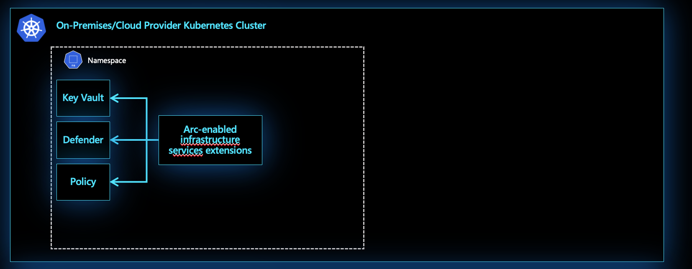
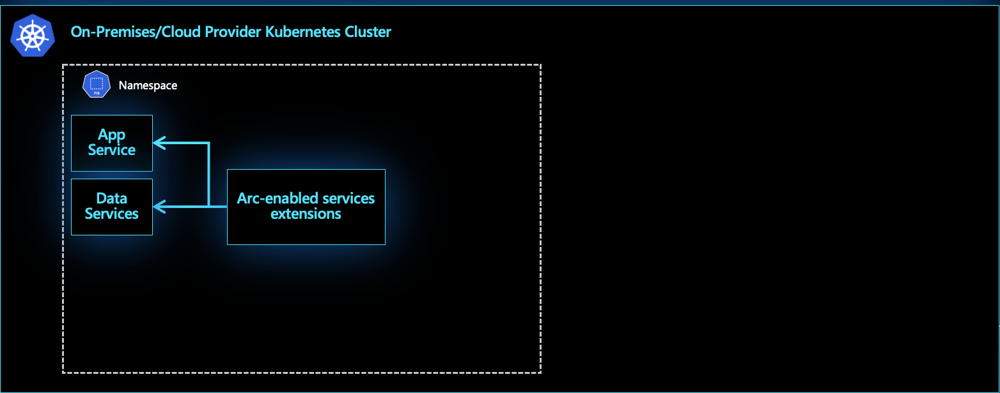
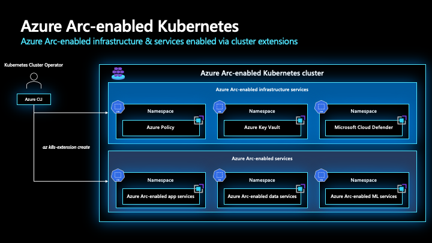

# Extensions Management for Azure Arc-enabled Kubernetes

This article walks through the key design considerations and best practices for managing extensions of Azure Arc-enabled Kubernetes deployments.

Before going through this document it is important to understand governance principles because of the effect of the decisions made, also make sure to review [Enterprise-scale for AKS](/azure/cloud-adoption-framework/scenarios/aks/enterprise-scale-landing-zone) to understand the relevant concepts of Enterprise Scale in a container environment.

## Design Considerations

Consider the following factors when designing how to use Azure Arc-enabled Kubernetes extensions:

- Review which [extensions are currently available](/azure/azure-arc/kubernetes/extensions)
- Review which [extensions are built on top of Helm](/azure/azure-arc/kubernetes/conceptual-extensions)

Conceptually, extensions for Azure Arc-enabled Kubernetes can be thought of as those for Azure Arc-enabled infrastructure services and those for Azure Arc-enabled services.  While this distinction is not made explicitly for the name of each extension, it is helpful to consider keeping these two categories of extensions in mind when designing for deploying Azure Arc-enabled Kubernetes.  For example, the Microsoft Defender for Cloud extension can be thought of as an extension for Azure Arc-enabled infrastructure services, whereas the Azure App Service for Azure Arc extension can be thought of as an Azure Arc-enabled services extension.

Additionally, while extensions provide additional capability for Azure Arc-enabled Kubernetes clusters, consider your specific use case and needs before installing any extensions.  Furthermore, consider how extensions will be kept up-to-date over the lifespan of your cluster.

## Design Recommendations

### Extension installation

Standardize the way in which extensions are installed, whether that is through the Portal, CLI, ARM templates, or another mechanism.  After installation, verify that the extension(s) have installed properly.

### Update extensions

Extensions are periodically updated.  Use the `--auto-upgrade-minor-version` flag to automatically upgrade minor versions of the extension as described in [Usage of Cluster Extensions](/azure/azure-arc/kubernetes/extensions#usage-of-cluster-extensions). Please refer to the specific extension's documentation to know what settings can be configured during creation and update.

## Next steps

For more guidance for your cloud adoption journey, see the following article:

- [Connect an existing Kubernetes cluster to Azure Arc](/azure/azure-arc/kubernetes/quickstart-connect-cluster?tabs=azure-cli)