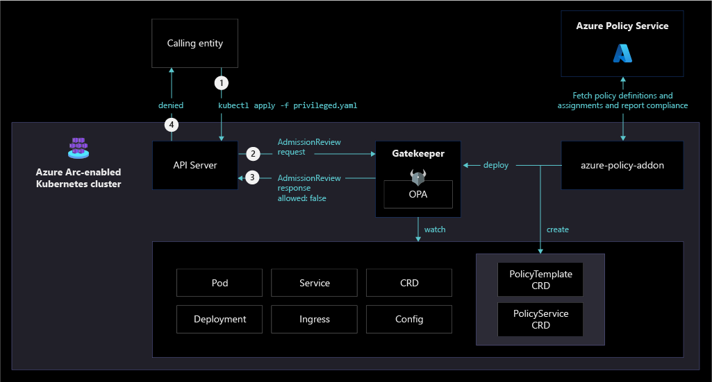

# Security, governance and compliance baseline for hybrid, multicloud, and edge Kubernetes deployments

This article walks through the key design considerations and best practices for the topics of security, governance, and compliance of Azure Arc-enabled Kubernetes deployments that should be in place as part of a CAF enterprise-scale landing zone implementation.

Azure Policy and Azure Security Center are cloud-native tools that allow the implementation of guardrails, controls, reports, alerts and remediation tasks in an automated fashion. By combining them with Azure Arc-enabled Kubernetes, your governance policies and security checks are extended to any Kubernetes cluster in public or private clouds.

Before going through this document its important to understand governance principles because of the effect of the decisions made, also make sure to review [Enterprise-scale for AKS](/azure/cloud-adoption-framework/scenarios/aks/enterprise-scale-landing-zone) to understand the relevant concepts of Enterprise Scale in a container environment.

By the end of this article, you will understand the critical design areas for security, governance, and compliance with clear Microsoft guidance.

## Architecture

The following image shows a conceptual reference architecture that demonstrates the security, compliance and governance design areas for Azure Arc-enabled Kubernetes:

## Design considerations

As your hybrid and multicloud resources become part of Azure Resource Manager, they can be managed and governed with Azure tools just as [Azure Kubernetes Service(AKS)](/azure/aks):

- **Agent Provisioning:** Define a strategy for provisioning the Azure Arc-enabled Kubernetes agent and use the least privilege principle to create the onboarding service principal. Consider a method of automation for bulk enrollment.
- **Agent Management:** The Arc agent plays a critical role in the hybrid operations of your Azure Arc-enabled Kubernetes clusters as it enables you to manage them from Azure, create GitOps configurations and enforce governance policies, it is important to implement solutions that keep track of the [agent's connectivity status](/azure/azure-arc/kubernetes/conceptual-agent-architecture#connectivity-status). Also it is critical to define a process for upgrading the Azure Arc-enabled Kubernetes agents.
- **Role based access controls:** Define administrative, operations, and developer roles within the organization that will take care of day-to-day operations in the hybrid clusters. Mapping each team to actions and responsibilities will determine Azure role-based access control (RBAC) roles and Kubernetes ClusterRoleBinding and RoleBinding. Consider using a [RACI](/azure/cloud-adoption-framework/organize/raci-alignment) matrix to support this effort and build controls into the management scope hierarchy that you define following the resource consistency and inventory management guidance. For more information, review the [Identity and access management for Azure Arc-enabled kubernetes section of this guide](PLACEHOLDER IDENTITY CDA).
- **Secret and certificate management:** secure secrets and certificates using Azure Key Vault and deploying its extension on your Azure Arc-enabled kubernetes clusters via Container Storage Interface (CSI).
- **Enable and secure GitOps configurations:** GitOps configurations enforce the desired state of the system so it is an important tool for compliance as there is tracking of all the changes made overtime. When working with GitOps configurations you need to thing about how to secure access to your source control tool.
- **Secure cluster access:** plan how to secure access to the Kubernetes API. Azure Arc-enabled Kubernetes provides the cluster connect feature that provides connectivity to the apiserver without having to enable any inbound port.
- **Improve microservices observability and security:** the implementation of a service mesh can help with authentication, authorization, security and visibility of microservice-based applications. Azure Arc-enabled Kubernetes simplifies the deployment of Open Service Mesh as an extension.
- **Registry Security:** the container registry is another element that should be considered in the context of governance and security of an Azure Arc-enabled Kubernetes cluster as it holds the application images that can be a confidentiality risk and is another attack vector.
- **Policy management and reporting:** Define a governance plan for your hybrid Kubernetes that translates into Azure Policies and remediation tasks.
- **Log management strategy:** Plan for metrics and log collection of your hybrid resources into a Log Analytics workspace for further analysis and auditing. Review the recommendations for [monitoring in this guide](./management-disciplines.md).
- **Threat protection and cloud security posture management:** enforce thread protection and introduce controls to detect security misconfigurations and track compliance. Also, use [Azure's intelligence](/azure/sentinel/overview) to protect your hybrid workloads against threats. [Enable Azure Defender for Kubernetes](/azure/security-center/security-center-get-started) for all subscriptions containing Azure Arc-enabled Kubernetes for security baseline monitoring, security posture management and threat protection.

## Design recommendations

### Agent Provisioning

Define a strategy for onboarding your clusters in Azure Arc, including a method of automation for bulk enrollment and establish a formal plan that takes into account the scope and plan for a deployment including objectives, selection criteria, success criteria, training plans, rollback and risks.

It is possible to integrate the agent provisioning as part of your continuous integration and continuous deployment (CI/CD) pipelines by [using a service principal](/azure/azure-arc/kubernetes/create-onboarding-service-principal). It is recommended to limit the privileges of this service principal and only asign the roles required to onboard Kubernetes to Azure, the "Kubernetes Cluster - Azure Arc Onboarding" role, as this can only be used to onboard Kubernetes and cannot re-onboard or delete the resource.

### Agent Management

The Azure Arc agent is the key piece for Azure Arc-enabled Kubernetes, it contains several logical components that play a role in security, governance and management operations. If the agent stops sending heartbeats to Azure, goes offline or looses connectivity to Azure you will not be able to perform operational tasks on it. Hence, it is necessary to develop a plan to get notified and how you will respond.

Azure Activity Log can be used to set up [resource health notifications](/azure/service-health/resource-health-alert-monitor-guide) and remain informed on current and historical health status of the [agent's pods](/azure/azure-arc/kubernetes/quickstart-connect-cluster?tabs=azure-cli#6-view-azure-arc-agents-for-kubernetes), review [management best practices](management-disciplines.md). An [Azure Arc-enabled Kubernetes cluster will be shown offline](/azure/azure-arc/kubernetes/conceptual-agent-architecture) if the service has not received an agent heartbeat for 15 minutes, review the [Azure Arc-enabled Kubernetes connectivity best practices](PLACEHOLDER NETWORKING CDA) to make sure the agent can connect to Azure's endpoints securely.

### Role based access controls

Once a Kubernetes cluster is onboarded you will be able to assign [Azure Role Based Access Controls](/azure/role-based-access-control/overview/) to the Azure Arc-enabled resource, follow the [least privilege principle](/security/benchmark/azure/baselines/arc-enabled-security-baseline#pa-7-follow-just-enough-administration-least-privilege-principle) users, groups or applications assigned with roles like "Contributor" or "Owner" are able to execute operations like deploying extensions which basically has the power to do anything on Arc-enabled Kubernetes. These roles should be used with caution to limit possible blast radius or eventually replaced by custom roles.

Also consider the sensitive data that is sent to the Azure Monitor Log Analytics workspace, the same RBAC principle should be applied to the data itself. Azure Arc-enabled Kubernetes provides RBAC access to log data collected by the Log Analytics agent, stored in the Log Analytics workspace the machine is registered to. Review how to implement granular Log Analytics Workspace access in the [designing your Azure Monitor Logs deployment documentation](/azure/azure-monitor/logs/design-logs-deployment#access-control-overview).

Consider [integrating your Azure Arc-enabled Kubernetes cluster with Azure Active Directory](/azure/azure-arc/kubernetes/azure-rbac) this will allow you to use Azure role assignments to granulary control who has access an permissions on Kubernetes objects. This integration works natively with Kubernetes ClusterRoleBinding and RoleBinding object types and effectively consolidates authorization to your Kubernetes cluster with Azure AD as the central identity and access management service. By using Azure AD you get full auditing and tracing of changes done in the cluster as well as any authorization event.

The following image shows a conceptual reference architecture that demonstrates the Azure AD integration for Azure Arc-enabled Kubernetes:

### Secret and certificate management

Consider using the Azure Key Vault extension to manage secrets and certificates on your Azure Arc-enabled Kubernetes clusters. The Key Vault extension allows you to manage the certificate lifecycle on your Kubernetes deployments. [PLACEHOLDER](Jumpstart scenario)

### Enable and secure GitOps configurations

GitOps is an essential component of any IT strategy that follows a fully automated approach to operations, it provides scale, consistency, tracking and auditing capabilities to any deployment.
This GitOps approach simplifies the deployment of multiple aplications, accross clusters and environments while tracking and enforcing the desired state of the system declaratively with Git. By using Git as your single source of truth and as the central tool for all deployments it becomes the best way to track cluster state, account for changes and approvals overtime, facilitate fault investigation while enabling automation across distributed environments.

Make sure to review best practices on [implementing CI/CD workflows with GitOps](PLACEHOLDER_CDA)

### Policy management and reporting

Having a policy-driven governance is a foundational principle of cloud-native operations and Cloud Adoption Framework. [Azure Policy](/azure/governance/policy/) provides the mechanism to enforce corporate standards and to assess compliance at scale. Through it, you can implement governance for consistency of deployments, compliance, control costs, and improve your security posture; with its compliance dashboard, you will get an aggregated view of the overall state as well as remediation capabilities. Azure Arc-enabled Kubernetes supports [Azure Policy](/azure/governance/policy/overview) at the Azure Resource Management layer, and also within the individual server machine using [Guest Configuration Policies](/azure/governance/policy/concepts/guest-configuration).

Understand the [scope of Azure policy](/azure/role-based-access-control/scope-overview) and where it can be applied (Management Group, subscription, resource group or individual resource level). Create a Management Group design in accordance with the recommended practices outlined in the [Cloud Adoption Framework Enterprise Scale](/azure/cloud-adoption-framework/ready/enterprise-scale/management-group-and-subscription-organization)

- Determine what Azure policies are required by defining business, regulatory and security requirements for Azure Arc-enabled Kubernetes.
- Enforce tagging and implement [remediation tasks](/azure/governance/policy/how-to/remediate-resources).
- Understand and evaluate the [Azure Policy built-in definitions for Azure Arc-enabled Kubernetes](/azure/azure-arc/kubernetes/policy-reference)
- Understand and evaluate the built-in [Guest Configuration policies](/azure/governance/policy/samples/built-in-policies#guest-configuration) and [initiatives](/azure/governance/policy/samples/built-in-initiatives#guest-configuration).
- Evaluate the need for creating [custom Guest configuration policies](/azure/governance/policy/how-to/guest-configuration-create)
- Define a monitoring and alerting policy that identifies [unhealthy Azure arc-enabled Kubernetes](/azure/azure-arc/kubernetes/plan-at-scale-deployment#phase-3-manage-and-operate).
- Enable Azure Advisor alerts to identify Azure arc-enabled Kubernetes with [outdated agents installed](/azure/azure-arc/kubernetes/plan-at-scale-deployment#phase-3-manage-and-operate).
- [Enforce organization standards and assess compliance at scale](/azure/azure-arc/kubernetes/security-controls-policy).
- Use an Azure Policy and Remediation tasks to onboard management services agents via the extension management feature.
- Enable [Azure Monitor](/azure/azure-arc/Kubernetes/learn/tutorial-enable-vm-insights) for compliance and operational monitoring of Azure Arc-enabled Kubernetes.

The following image shows a conceptual reference architecture that demonstrates the policy and compliance reporting design areas for Azure Arc-enabled Kubernetes:

### Log management strategy

Design and plan your Log Analytics Workspace deployment, as it will be the container where data is collected, aggregated, and later analyzed. As the Log Analytics Workspace represents a geographical location of your data, a level of isolation and scope for configurations like data retention you will have to identify the number of workspaces needed and how it maps to your organizational structure. It is recommended to use a single Azure Monitor Log Analytics workspace to manage centrally RBAC, visibility and reporting as it is described in the [Management and monitoring best practices of Cloud Adoption Framework](/azure/cloud-adoption-framework/ready/enterprise-scale/management-and-monitoring).

Review the best practices in [designing your Azure Monitor Logs deployment](/azure/azure-monitor/logs/design-logs-deployment).

### Threat protection and cloud security posture management

Azure Security Center provides a unified security-management platform segmented as a cloud security posture management (CSPM) and cloud workload protection platform (CWPP). To increase security on your hybrid landing zone it is important to protect the data and assets hosted in Azure and elsewhere, Azure Defender for Kubernetes extends these capabilities to Azure Arc-enabled Kubernetes and together with Microsoft Defender for Endpoint provide a comprehensive EDR.  To heighten security on your hybrid landing zone consider the following:

- Use Azure Arc-enabled Kubernetes to onboard hybrid resources in Azure Defender.
- Implement an Azure Policy to make sure all resources are compliant and its security data is collected into the Log Analytics workspaces.
- Enable Azure Defender for all subscriptions and use Azure Policy to ensure compliance.
- Use security information and event management integration with Microsoft Defender for Cloud and Azure Sentinel.
- Protect your endpoints with AMicrosoft Defender for Cloud's integration with Microsoft Defender for Endpoint.

[Connect your non-Azure machines to Microsoft Defender for Cloud](/azure/security-center/quickstart-onboard-machines?pivots=azure-portal)

[PLACEHOLDER](Network Security)

### Change Tracking and Inventory

Centralizing logs drives additional reports that can be used as additional layers of security and reduces the chances for gaps in observability. [Change Tracking and Inventory in Azure Automation](/azure/automation/change-tracking/overview) forwards and collects the data in a Log Analytics workspace. When using  Azure Defender for Kubernetes you get File Integrity Monitoring (FIM) to examine and track software changes, Windows services and Linux daemons on your Azure Arc-enabled Kubernetes.

### Software Updates

With Azure Arc-enabled server it is possible to manage in Azure your enterprise estate with centralized management and monitoring at scale. More specifically, it provides alerts and recommendations to IT teams with full operational visibility that includes managing the updates of your Windows and Linux VM.

Assessing and updating your operating systems should be part of your overall management strategy to maintain security compliance with Critical and Security updates as they are released. Use Update Management in Azure Automation as a long-term patching mechanism for both Azure and hybrid resources and use Azure Policy to ensure and enforce the Update Management configurations to all VMs, including your [Azure Arc-enabled Kubernetes](/azure/cloud-adoption-framework/manage/hybrid/server/best-practices/arc-update-management).

You can also use [Azure Automanage](/azure/automanage/automanage-virtual-machines), so there is no need to worry about the details of onboarding and maintaining best practices for Update Management on your Arc resources.

### Secure public key

The Azure Connected Machine agent uses public key authentication to communicate with the Azure service. After you onboard a server to Azure Arc, a private key is saved to the disk and used whenever the agent communicates with Azure.

If stolen, the private key can be used on another server to communicate with the service and act as if it were the original server. This includes getting access to the system-assigned identity and any resources that identity has access to. 

The private key file is protected to only allow the HIMDS account access to read it. To prevent offline attacks, we strongly recommend the use of full disk encryption (for example, BitLocker, dm-crypt, etc.) on the operating system volume of your server.

## Next steps

For more guidance for your cloud adoption journey, see the following article:

- [Manage hybrid and multicloud environments](./manage.md)
- [Agent security permissions](/azure/azure-arc/kubernetes/agent-overview)
- [Secret and certificate management](https://azurearcjumpstart.io/azure_arc_jumpstart/azure_arc_kubernetes/day2/arc_keyvault#deploy-azure-key-vault-extension-to-azure-arc-enabled-ubuntu-server-and-use-a-key-vault-managed-certificate-with-nginx)
- [Threat protection and cloud security posture management](/azure/security-center/)
- [Threat protection with Azure Defender](https://azurearcjumpstart.io/azure_arc_jumpstart/azure_arc_kubernetes/day2/arc_securitycenter/#onboarding-azure-defender)
