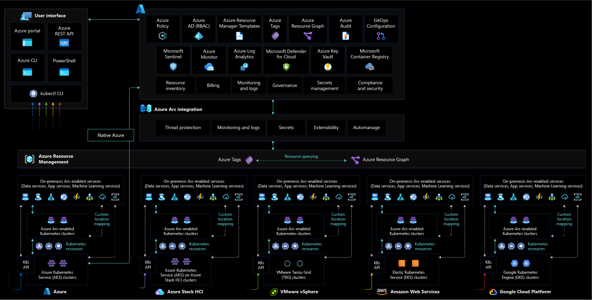

# Security, governance and compliance baseline for hybrid, multicloud, and edge Kubernetes deployments

## Overview

This article walks through the key design considerations and best practices for the topics of security, governance, and compliance of Azure Arc-enabled Kubernetes deployments that should be in place as part of a CAF enterprise-scale landing zone implementation.

[Azure Policy](/azure/governance/policy/overview) and [Microsoft Defender for Cloud](/azure/defender-for-cloud/defender-for-cloud-introduction) are cloud-native tools that allow the implementation of guardrails, controls, reports, alerts and remediation tasks in an automated fashion. By combining them with Azure Arc-enabled Kubernetes, your governance policies and security checks are extended to any Kubernetes cluster on-premises and/or multi-cloud environments.

Before going through this document, it is important to understand governance principles to better align with your organization's security policies.

By the end of this article, you will understand the critical design considerations and recommendations for governance, security, and compliance with clear Microsoft guidance for Azure Arc-enabled Kubernetes.

## Architecture

The following image shows a conceptual reference architecture that demonstrates the security, compliance, and governance design areas for Azure Arc-enabled Kubernetes:

## Design considerations

As your hybrid and multicloud resources become part of Azure Resource Manager, they can be managed and governed from Azure, this article provides guidance for creating your landing zone when working with Azure Arc-enabled Kubernetes:

- **Agent Provisioning:** Define a strategy for provisioning the [Azure Arc-enabled Kubernetes agent](/azure/azure-arc/kubernetes/conceptual-agent-overview) and use the least privilege principle when creating the onboarding service principal. Consider a method of automation for bulk enrollment.
- **Agent Management:** The Arc-enabled Kubernetes agent plays a critical role in the hybrid operations of your Azure Arc-enabled Kubernetes clusters as it enables you to manage them from Azure. It is important to implement solutions that keep track of the [agent's connectivity status](/azure/azure-arc/kubernetes/conceptual-agent-architecture#connectivity-status). Also it is critical to define a process for upgrading the Azure Arc-enabled Kubernetes agents.
- **Role based access controls:** Define administrative, operations, and developer roles within the organization that will take care of day-to-day operations in the hybrid clusters. Mapping each team to actions and responsibilities will determine Azure role based access control (RBAC) roles and Kubernetes ClusterRoleBinding and RoleBinding. Consider using a [RACI](/azure/cloud-adoption-framework/organize/raci-alignment) matrix to support this effort and build controls into the management scope hierarchy that you define following the resource consistency and inventory management guidance. For more information, review the [Identity and access management for Azure Arc-enabled Kubernetes section of this guide](PLACEHOLDER IDENTITY CDA).
- **Secret and certificate management:** Secure secrets and certificates using [Azure Key Vault and deploying its extension](/azure/azure-arc/kubernetes/tutorial-akv-secrets-provider) on your Azure Arc-enabled kubernetes clusters via Container Storage Interface (CSI).
- **Data Residency:** Consider which Azure region you wish your Azure Arc-enabled Kubernetes clusters to be provisioned into, and understand [the data that is collected from these resources.](/azure/azure-arc/kubernetes/faq#does-azure-arc-enabled-kubernetes-store-any-customer-data-outside-of-the-clusters-region)
- **Enable and secure GitOps configurations:** GitOps configurations enforce the desired state of the system and are an important tool for compliance tracking of Arc-enabled Kubernetes clusters. When working with [GitOps configurations](./cicd-workflow.md) consider securing access to your source control system with appropriate network and access controls.
- **Policy management and reporting:** Define a governance plan for your hybrid Kubernetes that translates into Azure Policies and remediation tasks.
- **Log management strategy:** Plan for metrics and log collection of your hybrid resources into a Log Analytics workspace for further analysis and auditing. Review the recommendations for [monitoring in this guide](./management-disciplines.md).
- **Threat protection and cloud security posture management:** Enforce threat protection and introduce controls to detect security misconfigurations and track compliance. Also, use [Azure's intelligence](/azure/sentinel/overview) to protect your hybrid workloads against threats. [Enable Microsoft Defender for Containers](/azure/defender-for-cloud/defender-for-containers-introduction?tabs=defender-for-container-arch-aks) for all subscriptions containing Azure Arc-enabled Kubernetes for security baseline monitoring, security posture management, and threat protection.
- **Secure cluster access:** Plan how to secure access to the Kubernetes API. Azure Arc-enabled Kubernetes provides the [cluster connect feature](/azure/azure-arc/kubernetes/cluster-connect) that provides connectivity to the apiserver without having to enable any inbound port.
- **Improve microservices observability and security:** The implementation of a service mesh can help with authentication, authorization, security, and visibility of microservice-based applications. Azure Arc-enabled Kubernetes simplifies the deployment of [Open Service Mesh (OSM) as an extension](./services-observability.md).

## Design recommendations

### Agent Provisioning

Define a strategy for onboarding your clusters onto Azure Arc, including a method of automation for bulk enrollment, and establish a formal plan that takes into account the scope and plan for the deployment, including objectives, selection criteria, success criteria, training plans, rollback, and risks.

It is possible to integrate the agent provisioning as part of your continuous integration and continuous deployment (CI/CD) pipelines by [using a service principal](/azure/azure-arc/kubernetes/create-onboarding-service-principal). It is recommended to limit the privileges of this service principal and only assign the roles required to onboard Kubernetes to Azure, the "Kubernetes Cluster - Azure Arc Onboarding" role, as this can only be used to onboard Kubernetes and cannot re-onboard or delete the resource.

### Agent Management

The Azure Arc agent is the key component for Azure Arc-enabled Kubernetes, it contains several logical components that play a role in security, governance, and management operations. If the agent stops sending heartbeats to Azure, goes offline or loses connectivity to Azure, you will not be able to perform operational tasks on it. Hence, it is necessary to develop a plan to get notified and how you will respond.

Azure Activity Log can be used to set up [resource health alerts](/azure/service-health/resource-health-alert-monitor-guide) and remain informed on current and historical health status of the [agent's pods](/azure/azure-arc/kubernetes/quickstart-connect-cluster?tabs=azure-cli#6-view-azure-arc-agents-for-kubernetes), review [management best practices](management-disciplines.md). An [Azure Arc-enabled Kubernetes cluster will be shown offline](/azure/azure-arc/kubernetes/conceptual-agent-architecture) if the service has not received an agent heartbeat for 15 minutes, review the [Azure Arc-enabled Kubernetes connectivity best practices](./network-connectivity.md) to make sure the agent can connect to Azure's endpoints securely.

### Role-based access controls

Once a Kubernetes cluster is onboarded you will be able to assign [Azure Role Based Access Controls](/azure/role-based-access-control/overview) to the Azure Arc-enabled resource, follow the [least privilege principle](/security/benchmark/azure/baselines/arc-enabled-security-baseline#pa-7-follow-just-enough-administration-least-privilege-principle) users, groups or applications assigned with roles like "Contributor" or "Owner" are able to execute operations like deploying extensions which perform actions as ClusterAdmin and can have a cluster-wide impact. These roles should be used with caution to limit possible blast radius or eventually replaced by custom roles.

Consider the sensitive data that is sent to the Azure Monitor Log Analytics workspace, the same RBAC principle should be applied to the data itself. Azure Arc-enabled Kubernetes provides RBAC access to log data collected by the Log Analytics agent, stored in the Log Analytics workspace the cluster is registered to. Review how to implement granular Log Analytics Workspace access in the [designing your Azure Monitor Logs deployment documentation](/azure/azure-monitor/logs/design-logs-deployment#access-control-overview).

[Integrate your Azure Arc-enabled Kubernetes cluster with Azure Active Directory](/azure/azure-arc/kubernetes/azure-rbac) this will allow you to use Azure role assignments for a more granular control on who has access and permissions on Azure Arc-enabled Kubernetes cluster resources. 

This integration works natively with Kubernetes _ClusterRoleBinding_ and _RoleBinding_ object types and effectively consolidates authorization to your Kubernetes cluster with Azure AD as the central identity and access management service. By using Azure AD you get full auditing and tracing of changes done in the cluster as well as any authorization event.

The following image shows a conceptual reference architecture that demonstrates the Azure AD integration for Azure Arc-enabled Kubernetes:

Integrating with Azure AD also enables the use of Azure AD advance security capabilities, which are recommended to configure:

- Use [Conditional Access with Azure AD](/azure/azure-arc/kubernetes/azure-rbac#use-conditional-access-with-azure-ad). Additional information on Conditional Access can be found [here](/azure/active-directory/conditional-access/overview).
- Implement [Just-In-Time (JIT)](/azure/azure-arc/kubernetes/azure-rbac#configure-just-in-time-cluster-access-with-azure-ad) access rules for tasks that need elevated permissions. Having standing access by some users to sensitive information or critical network configuration settings in Kubernetes is a potential pathway to compromised accounts or internal threat activities. Privileged access management helps protect your organization from breaches and helps to meet compliance best practices by limiting standing access to sensitive data or access to critical configuration settings.

Make sure to review [more specific identity recommendations for Azure Arc-enabled Kubernetes](IdentityCDA).

### Secret and certificate management

Do not store secrets or certificates in application code or file systems. Secrets should be stored in key stores and provided to containers at runtime as they are needed.

Consider using the [Azure Key Vault extension](/azure/azure-arc/kubernetes/tutorial-akv-secrets-provider) to manage secrets and certificates on your Azure Arc-enabled Kubernetes clusters. The Key Vault extension allows you to manage the certificate lifecycle on your Kubernetes deployments.

### Enable and secure GitOps configurations

GitOps is an essential component of any IT strategy that follows a fully automated approach to operations, it provides scale, consistency, tracking, and auditing capabilities to any deployment.

This GitOps approach simplifies the deployment of multiple applications, across clusters and environments while tracking and enforcing the desired state of the system declaratively with Git. By using Git as your single source of truth and as the central tool for all deployments it becomes the best way to track cluster state, account for changes and approvals overtime, facilitate fault investigation while enabling automation across distributed environments.

The following image shows how the GitOps flow looks like in the context of Arc-enabled Kubernetes:

When adding GitOps configurations it is important to secure access to the repository, its keys and set branch permissions, make sure to review [best practices for GitOps](PLACEHOLDER_CDA).

### Policy management and reporting

Having policy-driven governance is a foundational principle of cloud-native operations and Microsoft Cloud Adoption Framework for Azure. [Azure Policy](/azure/governance/policy/) provides the mechanism to enforce corporate standards and to assess compliance at scale. Through it, you can implement governance for consistency of deployments, compliance, control costs, and improve your security posture; with its compliance dashboard, you will get an aggregated view of the overall state as well as remediation capabilities. 

Azure Arc-enabled Kubernetes supports [Azure Policy](/azure/governance/policy/overview) at the Azure Resource Management layer, and also in-cluster policy enforcements by extending [Gatekeeper for Open Policy Agent](/azure/governance/policy/concepts/policy-for-kubernetes?toc=/azure/azure-arc/kubernetes/toc.json). The following image illustrates how Azure Policy applies at-scale enforcements and safeguards on Azure Arc-enabled Kubernetes clusters:

Understand the [scope of Azure policy](/azure/governance/policy/concepts/scope) and where it can be applied (Management Group, subscription, resource group or individual resource level). Create a Management Group design in accordance with the recommended practices outlined in the [Cloud Adoption Framework Enterprise Scale](/azure/cloud-adoption-framework/ready/enterprise-scale/management-group-and-subscription-organization).

- Determine what Azure policies are required to meet your organization business, regulatory, and security requirements for Azure Arc-enabled Kubernetes.
- Enforce tagging and implement [remediation tasks](/azure/governance/policy/how-to/remediate-resources).
- Use an Azure Policy to [enforce GitOps](/azure/azure-arc/kubernetes/use-azure-policy) and apply configurations at scale.
- Understand and evaluate the [Azure Policy built-in definitions for Azure Arc-enabled Kubernetes](/azure/azure-arc/kubernetes/policy-reference).
- Use an Azure Policy and Remediation tasks to onboard management services agents via the extension management feature, including Microsoft Defender for Cloud.
- Enable [Azure Monitor Container Insights](/azure/azure-monitor/containers/container-insights-enable-arc-enabled-clusters?toc=/azure/azure-arc/kubernetes/toc.json) for compliance and operational monitoring of Azure Arc-enabled Kubernetes clusters.

### Log management strategy

Design and plan your Log Analytics Workspace deployment, as it is the storage where data is collected, aggregated, and later analyzed. As the Log Analytics workspace represents a geographical location of your data, to support a level of isolation and scope for configurations like data retention, determine the number of workspaces needed and how it maps to your organizational structure. It is recommended to use a single Azure Monitor Log Analytics workspace to manage centralized RBAC, visibility, and reporting as described in the [Management and monitoring best practices of Cloud Adoption Framework](/azure/cloud-adoption-framework/ready/enterprise-scale/management-and-monitoring).

Review the best practices in [designing your Azure Monitor Logs deployment](/azure/azure-monitor/logs/design-logs-deployment).

### Threat protection and cloud security posture management

[Microsoft Defender for Cloud](/azure/defender-for-cloud/defender-for-cloud-introduction) provides a unified security-management platform segmented as a cloud security posture management (CSPM) and cloud workload protection platform (CWPP). To increase security on your hybrid landing zone it is important to protect the data and assets hosted in Azure and elsewhere, Microsoft Defender for Containers extends these capabilities to Azure Arc-enabled Kubernetes. To heighten security on your hybrid landing zone, consider the following:

- Use Azure Arc-enabled Kubernetes extension to onboard Arc-enabled Kubernetes resources in Microsoft Defender for Cloud.
- Enable Microsoft Defender for Containers plan for all subscriptions. By default, the plan is configured to automatically deploy the Defender extension on any Arc-enabled Kubernetes cluster that is onboarded to this subscription. You can optionally modify this configuration.
- Verify that the Defender extension is deployed on your clusters.
- Use security information and event management (SIEM) integration with Microsoft Defender for Cloud and Azure Sentinel.

The following image shows a conceptual reference architecture for Microsoft Defender for Cloud on an Azure Arc-enabled Kubernetes:

If Azure Container Registry is used as the central private Docker registry to store and manage your container images, [Use Microsoft Defender for Containers to scan the images for vulnerabilities](/azure/defender-for-cloud/defender-for-container-registries-usage).

Make sure to review [the best practices for a secure network connectivity](./network-connectivity.md).

### Secure cluster access

The Kubernetes API receives requests to perform actions in the cluster, so it is the central way to interact with and manage a cluster, therefore it is a key piece to protect. With [Azure Arc-enabled Kubernetes cluster connect](/azure/azure-arc/kubernetes/conceptual-cluster-connect), you can securely connect to Azure Arc-enabled Kubernetes clusters anywhere without requiring any inbound port to be enabled on the firewall. Access to the _apiserver_ of the Azure Arc-enabled Kubernetes cluster enables the following scenarios:

- Enable interactive debugging and troubleshooting.
- Enable the use of hosted agents/runners of Azure Pipelines, GitHub Actions, or any other hosted CI/CD service without requiring self-hosted agents.
- Provide cluster access to Azure services for [custom locations](/azure/azure-arc/kubernetes/custom-locations) and other resources created on top of it.

### Microservices observability and security

The implementation of a service mesh provides the ability to introduce authentication and authorization on your services connections, this creates a more secure environment by enforcing the least privilege principle. By default, pods sit on a flat trusted network, whereas on a service mesh implementation a set of sidecars that act as network proxies are deployed, these sidecars manage east-west communication, encrypt traffic and improve traffic observability overall.

A Service Mesh implementation can protect against:

- Unauthorized accesses
- Sniffing attacks
- Data exfiltration
- Impersonations

With Azure Arc-enabled Kubernetes extension management capabilities you can deploy Open Service Mesh anywhere as shown in the diagram

Make sure to review the [best practices for Open Service Mesh implementation.](PLACEHOLDERopen_service_meshCDA)

## Next steps

For more guidance for your cloud adoption journey, see the following articles:

- [Manage hybrid and multicloud environments](/azure/cloud-adoption-framework/scenarios/hybrid/manage)
- [Connect an existing Kubernetes cluster to Azure Arc](/azure/azure-arc/kubernetes/quickstart-connect-cluster?tabs=azure-cli)
- [Secret and certificate management](https://azurearcjumpstart.io/azure_arc_jumpstart/azure_arc_k8s/day2/cluster_api/cluster_api_keyvault_extension/)
- [Threat protection and cloud security posture management](/azure/defender-for-cloud/)
- [Apply GitOps configurations on GKE as an Azure Arc Connected Cluster using Azure Policy for Kubernetes](https://azurearcjumpstart.io/azure_arc_jumpstart/azure_arc_k8s/day2/gke/gke_policy/)
- [Integrate Azure Defender with Cluster API as an Azure Arc Connected Cluster using Kubernetes extensions](https://azurearcjumpstart.io/azure_arc_jumpstart/azure_arc_k8s/day2/cluster_api/cluster_api_defender_extension/)
- [Integrate Open Service Mesh (OSM) with Cluster API as an Azure Arc Connected Cluster using Kubernetes extensions](https://azurearcjumpstart.io/azure_arc_jumpstart/azure_arc_k8s/day2/cluster_api/cluster_api_osm_extension/)
