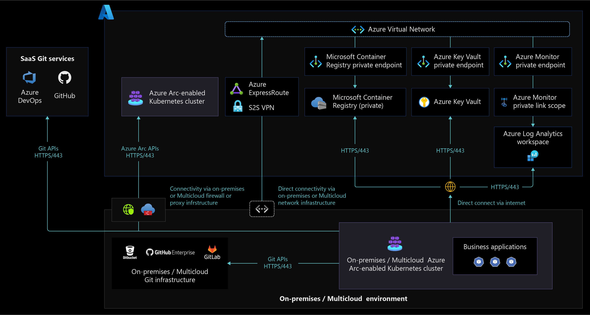

# Network connectivity for Azure Arc-enabled Kubernetes

## Overview

Arc-enabled Kubernetes supports [fully connected and semi-connected modes](/azure/azure-arc/kubernetes/conceptual-connectivity-modes#understand-connectivity-modes) to onboard and manage Kubernetes cluster with Azure Arc control plane. Azure Arc-enabled Kubernetes agents communicates with Azure Arc endpoints to [exchange different types of metadata information](/azure/azure-arc/kubernetes/conceptual-data-exchange) using pull and push methods from the Kubernetes cluster. This document explains network architecture to support these connectivity modes, design considerations, and recommendations when enabling connectivity to Azure control plane to manage and operate Arc-enabled Kubernetes clusters running on-premises and other cloud environments.

## Architecture

The following is an Azure Arc-enabled Kubernetes network architecture diagram to support fully connected and semi-connected network connectivity modes.

The following is a network architecture diagram that supports cluster access from any network location using [Azure Arc-enabled Kubernetes Cluster Connect](/azure/azure-arc/kubernetes/conceptual-cluster-connect) feature.

## Design considerations

- Review Arc-enabled Kubernetes [network requirements](/azure/azure-arc/kubernetes/quickstart-connect-cluster?tabs=azure-cli#meet-network-requirements) to before making decision to decide between fully connected vs semi-connected mode.
- Considering the trade offs between the organization security and compliance requirements versus Arc-enabled Kubernetes benefits that offer to the organizations, decide between fully connected vs semi-connected mode.
- Decide between public or private endpoints to connect to Azure Log Analytics workspaces through ExpressRoute or VPN versus internet connectivity.
- Decide between public or private endpoints to connect to [Azure Key Vaults](/azure/azure-arc/kubernetes/tutorial-akv-secrets-provider) through ExpressRoute or VPN versus internet connectivity.
- Decide network connectivity options for Azure Arc-enabled Kubernetes cluster management as Azure Arc-enabled Kubernetes cluster supports [cluster management from any network](/azure/azure-arc/kubernetes/conceptual-cluster-connect). Refer [Identity and Access Management](./identity-access-management.md) for design considerations and recommendations when deciding the network independent cluster management.
- Consider managing Arc-enabled Kubernetes cluster securely using [Cluster Connect feature to access anywhere](/azure/azure-arc/kubernetes/conceptual-cluster-connect) by eliminating opening inbound network ports and allowing only outbound communication to Azure Arc services in Azure.
- When using on-premises or multi-cloud [firewalls or proxy servers for TLS inspection](/azure/firewall/premium-features#tls-inspection) outbound traffic, when acting as network intrusion detection and prevention system (IDPS), decide whether to exempt Azure Arc-enabled Kubernetes endpoints as some of the server certificates could not have been trusted by these firewalls or proxy servers.

## Design recommendations

- Considering the benefits of Azure Arc-enabled Kubernetes capabilities, use fully connected mode for Kubernetes cluster onboarding to stay current with latest product releases, security updates, policies, and install extensions to bring Azure cloud services to on-premises or multi-cloud environments.
- Enable [private links](/azure/azure-monitor/logs/private-link-security) to access Azure resources such as [Key Vault](/azure/azure-arc/kubernetes/tutorial-akv-secrets-provider), Storage Accounts, Azure Container Registry, and Log Analytics from Kubernetes cluster running on-premises or other cloud environments through Azure Express Route or VPN connection.
- Configure on-premises or non-azure cloud DNS servers to forward [Azure private endpoint DNS](/azure/private-link/private-endpoint-dns#on-premises-workloads-using-a-dns-forwarder) resolution to Azure Private DNS zone.
- When [Azure Arc-enabled Kubernetes agents](/azure/azure-arc/kubernetes/conceptual-agent-overview) traffic is going through the firewalls or proxy servers, create source and destination object groups or tags to simplify outbound internet traffic rules to support additional URL whitelisting for Azure Arc extensions.
- Use Azure Monitor to keep track of [Arc-enabled Kubernetes connectivity status](/azure-arc/kubernetes/conceptual-connectivity-modes#connectivity-status) and raise alerts to notify Kubernetes cluster administrators when connectivity state changes. Use [Azure Resource Graph queries](/azure/azure-arc/kubernetes/resource-graph-samples?tabs=azure-cli) along with Azure Monitor.
- When organizations using [semi-connected network connectivity mode](/azure/azure-arc/kubernetes/conceptual-connectivity-modes#understand-connectivity-modes), it is recommended to connect the cluster to Azure Arc at least once in 30 days to export billing data and once in 90 days to renew managed identity certificates, update Azure Arc-enabled Kubernetes resource and agents.

## Next steps

- [Connect an existing Kubernetes cluster to Azure Arc](/azure/azure-arc/kubernetes/quickstart-connect-cluster?tabs=azure-cli).
- [Azure Arc-enabled Kubernetes connectivity modes](/azure/azure-arc/kubernetes/conceptual-connectivity-modes).
- [Data exchanged between Azure Arc-enabled Kubernetes cluster and Azure](/azure/azure-arc/kubernetes/conceptual-data-exchange).
- [Apply configurations at-scale using Azure Policy](/azure/azure-arc/kubernetes/use-azure-policy).
- [Azure Resource Graph sample queries for Azure Arc-enabled Kubernetes](/azure/azure-arc/kubernetes/resource-graph-samples?tabs=azure-cli).
- Understand [Azure Arc-enabled Open Service Mesh](/azure/azure-arc/kubernetes/tutorial-arc-enabled-open-service-mesh) to secure Arc-enabled Kubernetes cluster communication and [services observability](./services-observability.md) CDA.
- [Access Azure Arc-enabled Kubernetes cluster from anywhere using Cluster Connect](/azure/azure-arc/kubernetes/conceptual-cluster-connect).
