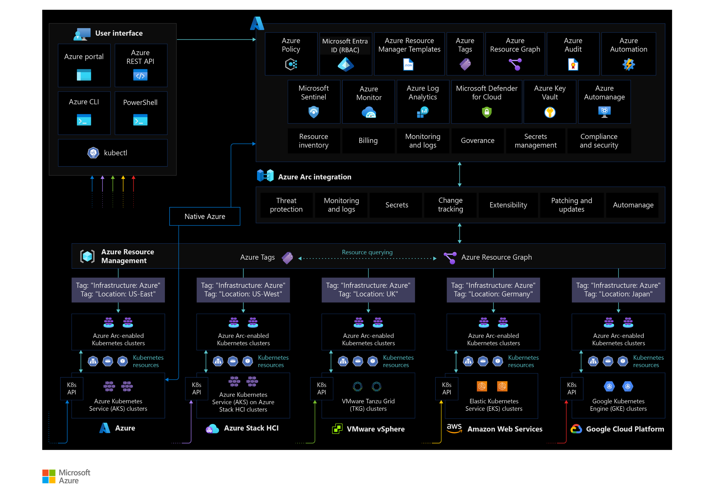

# Resource organization for Azure Arc-enabled Kubernetes

To align with the [Ready methodology](../../ready/index.md) of the Cloud Adoption Framework, implement a resource consistency and tagging strategy that includes your hybrid and multicloud resources and add business and operational details as components of inventory management and metadata tags.

## Resource consistency and organization

Before onboarding any Kubernetes cluster onto Azure Arc, it is important to define a structure on how these resources will be projected to Azure management scopes (management groups, subscriptions, and resource groups). This mapping is key, as it will determine how you will be able to interact with these resources when applying [role-based access control (RBAC)](/azure/active-directory/roles/best-practices) roles and while assigning Azure policies as part of your governance model. Review the Cloud Adoption Framework recommendations on how to [organize resources](/azure/cloud-adoption-framework/ready/azure-setup-guide/organize-resources?tabs=AzureManagementGroupsAndHierarchy).

When designing this structure, be aware of [Azure Resource Manager service limits](/azure/azure-arc/servers/agent-overview#azure-subscription-and-service-limits), as they are also applicable to Azure Arc-enabled kubernetes. It is important to plan for the number of clusters to be connected to a specific [resource group](/azure/azure-resource-manager/management/azure-subscription-service-limits#resource-group-limits) or [subscription](/azure/azure-resource-manager/management/azure-subscription-service-limits#subscription-limits).

After you have created a taxonomy structure and agreed on naming standards, it is recommended to apply tags to the Azure Arc-enabled Kubernetes resources. Once a cluster is registered in Azure (it has a resource ID and becomes part of the resource group within a subscription), it can benefit from standard Azure constructs such as [resource tags](/azure/cloud-adoption-framework/manage/hybrid/server/best-practices/arc-inventory-tagging).

Resource tags provide the ability to add metadata to a resource to quickly locate it and automate operational tasks, which is important to your day-to-day tasks as described in the [Cloud Adoption Framework tagging strategy](/azure/cloud-adoption-framework/ready/azure-best-practices/naming-and-tagging). Specifically for Arc-enabled Kubernetes, it is a good practice to include a tag that reflects the "hosting platform" for Azure Arc-enabled resources as well as the physical "location".

The following image shows a conceptual reference for resource tagging for Azure Arc-enabled Kubernetes:

## Next steps

For more guidance for your hybrid cloud adoption journey, please review the following:

- Understand how to manage [hybrid and multicloud](./manage.md) environments
- Review [Azure Arc Jumpstart](https://azurearcjumpstart.io/azure_arc_jumpstart/azure_arc_k8s/day2/) scenarios
- Review the [prerequisites](/azure/azure-arc/kubernetes/quickstart-connect-cluster?tabs=azure-cli#prerequisites) for Azure Arc-enabled Kubernetes
