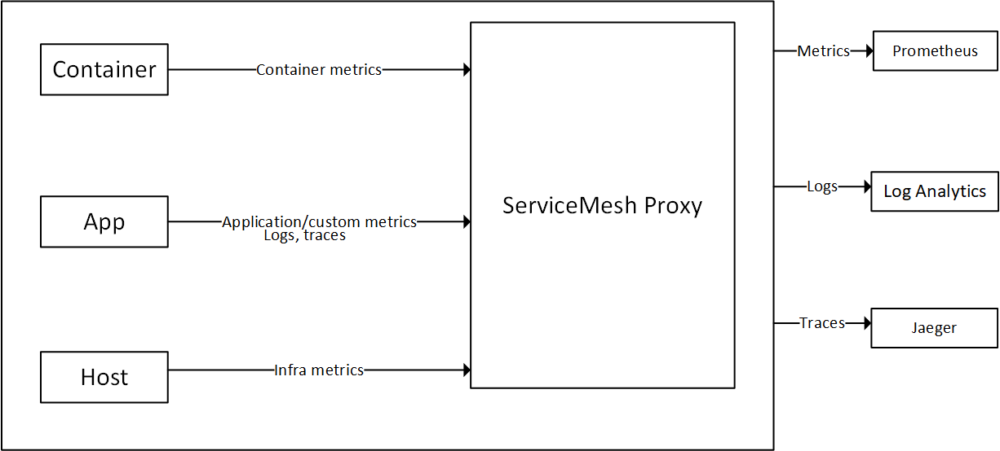

# Overview

[Observability](/azure/cloud-adoption-framework/manage/monitor/observability) is a characteristic of an application that refers to how well a system’s internal state or status can be understood from its external outputs. Computer systems are measured by observing CPU time, memory, disk space, latency, errors, etc. The more observable a system is, the easier it is to understand what it’s doing by looking at it.

The observability of a system has a significant impact on its operating cost. Observable systems yield meaningful, actionable data to their operators, allowing them to achieve favorable outcomes and less downtime. Note that more information does not necessarily translate into a more observable system. In fact, sometimes the amount of information generated by a system can make it harder to identify valuable health signals from the noise generated by the application.

Service Observability is important as it allows you to understand performance and issues that are occurring with distributed and cloud systems that are based on dynamic architectures. Implementing a solution to achieve service observability will gain the following benefits:

- Ensure end users can consume an application and business expectations are met. 
- Understand an entire system and how it is working together by using a single pane of glass.
- Establish a baseline for your system and understand how it changes with different circumstances.
- Be able to generate action items from unexpected scenarios and behaviors.

## Design considerations

Metrics, logs, and traces are the three pillars of observability. For a system to be observable, metrics, logs, and traces should be incorporated into your observability strategy.

- **Metrics** are numerical values that are collected at regular intervals and describe some aspect of a system at a particular point in time.
- **Logs** can store a variety of data types that have their own structures. A log gives you details on a transaction which may allow you to get a more complete story for a given event.
- **Distributed tracing** is a diagnostic technique that helps users localize failures and performance issues within applications, especially those that may be distributed across multiple machines or processes. This technique tracks requests through an application, correlating together work done by different application components and separating it from other work the application may be doing for concurrent requests.

All the three above pillars are interconnected. Metrics are stored as numerical values in a time-series database. They are also incredibly smaller in size compared to logs and hence easier to evaluate and useful for near-real-time alerting. Logs capture and convey much more information and hence are useful for deeper debugging. Traces are request-scoped and useful to get visibility into a request as it traverses across various components of a distributed system.

The following is a table showing collection impact for the three pillars.

|         | Metrics           | Logs  | Distributed Tracing  |
| ------------- |:-------------:| -----:| -----:|
| Accounts for every transaction      | yes | yes | no (sampled) |
| Immune to cardinality issues      | no      |   yes |   yes |
| Cost  | low      |    high |    low |

There are different ways to achieve service observability. For example, you could do it at the platform layer where the application is unaware and unchanged, by using a Service Mesh. You could also instrument an application with a library. This is more commonly done using an Application Performance Monitoring (APM) tooling such as [Application Insights](/azure/azure-monitor/app/app-insights-overview). An API gateway provides observability into north-south traffic, but lacks observability into pod to pod communication and ease of configuration at scale.

The following sections provide an overview on service observability using a service mesh and the self-hosted API Gateway available for Azure Arc.

### Service Mesh

A service mesh provides capabilities like traffic management, resiliency, policy enforcement, transport security, identity security, and observability to your workloads. Your application is decoupled from these operational capabilities and the service mesh moves them out of the application layer, and down to the infrastructure layer. This is done by a high-performance proxy that mediates all the inbound and outbound traffic to a service.

- Azure Arc-enabled Kubernetes supports [Open Service Mesh (OSM)]( https://openservicemesh.io/), a CNCF project, to be deployed as an [extension](/azure/azure-arc/kubernetes/tutorial-arc-enabled-open-service-mesh). Open Service Mesh is a lightweight, extensible, Cloud Native service mesh that allows users to uniformly manage, secure and get out-of-the-box observability features for highly dynamic microservice environments. Other popular Service Mesh’s which will require vendor support include: [Istio](https://istio.io/), [Consul Connect](https://www.hashicorp.com/products/consul/multi-platform-service-mesh/), [Linkerd](https://linkerd.io/2.11/overview/).
- Depending on what features are used, when implementing a service mesh, there comes additional responsibility on Application Operators who may need to define a configuration for each service such as access rules and onboarding services. Additionally, Cluster Operators will need to manage and be aware of the Service Mesh controller. Due to how service mesh leverages the [side-car pattern](/azure/architecture/patterns/sidecar), when debugging Egress and Ingress, access logs from the service mesh control plane and sidecar will be required.

### Service Mesh Observability

Service Meshes come with different features, with observability being an important functionality it provides. It is recommended to choose a Service Mesh that meets your minimum requirements of observability to reduce the amount of complexity and components that a service mesh can come with and is required to be configured. Evaluate the common features and use cases of observability that a service mesh would provide:

- Metrics generation including the four golden signals: latency, traffic, errors, and saturation.
- The RED method (Rates-calls/sec, Errors, Duration-call latencies), which is a subset of the four golden signals and used for measuring services. It should provide a standardized way of collecting RED metrics, traces etc.
- The observability impact by increasing the breadth of coverage to all services which are part of the mesh.
- Features that can help increase adoption of observability by auto-instrumenting all services.
- Evaluate a service mesh that comes with an ability to scrape metrics and collect logs that can surface into your monitoring solution - which should be able to support ingestion and process of metrics and logs based on your needs.

The following diagram shows an example of a Service Mesh Proxy functionality of data collection and forwarding.

 

### API Management Self-hosted ateway

With the integration between Azure API Management and Azure Arc on Kubernetes, you can deploy the API Management gateway component as an extension in an Azure Arc-enabled Kubernetes cluster. This allows a containerized version of API Management gateway to run in your Arc-enabled Kubernetes cluster. All self-hosted gateways are managed from the API Management service they are federated with, thus providing you with the visibility and unified management experience across all internal and external APIs.

Configuring the self-hosted gateway to accept incoming traffic to direct to your services requires creating policies, this management can become complex when service scale grows.

For more information, please visit the [self-hosted gateway overview](/azure/api-management/self-hosted-gateway-overview)

### API Management Self-hosted gateway Observability

The self-hosted gateway emits metrics and stdout and stderr logs. The metrics emitted have the ability to be configured by a ConfigMap in your cluster. For information on advanced monitoring with API Management, see [Advanced Monitoring](azure/api-management/api-management-log-to-eventhub-sample). The Self-hosted gateway observability accounts for external traffic (North-South) coming into your cluster, it does not provide any observability for pod-to-pod traffic inside the cluster (East-West).

**Cloud Metrics and Logs:**
Metrics are emitted to Azure Monitor by default. Using Azure Monitor for containers, the self-hosted gateway container logs can be collected and viewed in Log Analytics. For more information, see [Configure local metrics and logs for Azure API Management self-hosted gateway](/azure/api-management/how-to-configure-cloud-metrics-logs)

**Local Metrics and Logs:** Metrics and logs from the self-hosted gateway can be integrated to your local monitoring tooling or emitted by Config Map. Metrics can be configured to publish metrics to metric servers. Gateway Logs by default are output to stdout and stderr. For more information, see [Configure local metrics and logs for Azure API Management self-hosted gateway](/azure/api-management/how-to-configure-local-metrics-logs)

### Technology comparison table

The following is a table to show the potential differences to guide in choosing an implementation for obtaining services observability.

|         | Service Mesh           | Application Performance Monitoring  | Self-hosted API Gateway |
| ------------- |:-------------:| -----:| -----:|
| East-West Traffic supported    | yes | yes | no |
| Metrics capability     | yes | yes | yes |
| Logging capability     | yes      |   yes |   custom implementation |
| Distributed Traces capability  | yes      |    yes |    yes |
| Implementation layer  | network      |    application |    network |
| Protocols supported | http(s), tcp, gRPC      |    N/A |    http(s), websockets |
| Configuration responsibility | Cluster Operators      |    Application Developers |   Application Operators & Cluster Operators  |
| Configuration complexity for observability | low      |    high |    medium |

## Design recommendations

It is recommended to use Open Service Mesh which provides observability into the health and performance of your services. To obtain telemetry data, Open Service Mesh relies on sidecar proxies that you inject as a separate container into the same pods as your workloads. The proxies intercept all inbound and outbound HTTP traffic to the workloads and report the data to Open Service Mesh. With this system, service developers don't have to instrument their code to collect telemetry data. Enable Open Service Mesh by using the Azure Arc-enabled Kubernetes cluster extension capability, this allows Microsoft to manage the control plane for you. You can learn more by visiting [Deploy Azure Arc-enabled Open Service Mesh (Preview)](/azure/azure-arc/kubernetes/tutorial-arc-enabled-open-service-mesh).

Both Azure Monitor and Azure Application Insights help you maximize the availability and performance of your applications and services by delivering a comprehensive solution for collecting, analyzing, and acting on telemetry from your cloud and on-premises environments. Azure Arc-enabled Open Service Mesh will have deep integrations into both of these Azure services, and provide a seamless Azure experience for viewing and responding to critical KPIs provided by OSM metrics. You can enable that by following the steps mentioned [here](https://docs.microsoft.com/en-us/azure/azure-arc/kubernetes/tutorial-arc-enabled-open-service-mesh#monitoring-application-using-azure-monitor-and-applications-insights). If you are not using Azure monitoring services, Open Service Mesh provides documented [observability integrations](https://release-v0-11.docs.openservicemesh.io/docs/guides/observability/) for metrics with Prometheus and Grafana, Tracing with Jaeger, and log forwarding with Fluent Bit. These integrations can be used to be extend to other in-house monitoring tools as needed.

As a minimum, it is recommended to define the following three RED metrics which you should measure for all services:

- **Request Rate**: The number of requests the service is receiving per second
- **Errors**: The number of failed requests or rate of failed requests per second
- **Duration**: The amount of time it takes for a service to handle a request

Open Service Mesh provides several pre-configured service workbooks in Azure Monitor so you don't have to manually set up dashboards and charts that are recommended to use. This detailed telemetry enables operators to observe service behavior and empowers them to troubleshoot, maintain, and optimize their applications. By using the OSM monitoring workbook and Azure Monitor, you can:

- Get an overview of all services in your mesh, providing critical service-level metrics on three of the four golden signals of monitoring: latency, requests, and errors.
- Define, review and set [alerts](/azure/azure-monitor/alerts/alerts-overview) against service level objectives (SLOs), which summarize your service's user-visible performance.
- View metric charts for individual services and deeply analyze them with filtering and breakdowns, including by response code, protocol, destination pod, traffic source, and more.
- Get detailed information about the endpoints for each service and see how traffic is flowing between services, and what performance looks like for each communication edge.
- Explore a service topology graph visualization that shows services and their relationships within the Mesh.

Services observability is a single discipline of your cloud monitoring strategy, to see additional monitoring considerations, visit [Management and monitoring for Azure Arc-enabled Kubernetes](./eslz-management-and-monitoring.md).

## Next steps

For more guidance for your hybrid cloud adoption journey, review the following:

- To learn more about Azure Arc-enabled Open Service Mesh, check out the following : [Deploy Azure Arc-enabled Open Service Mesh (Preview)](/azure/azure-arc/kubernetes/tutorial-arc-enabled-open-service-mesh)
- To learn more about Open Service Mesh, check out the following : [Open Service Mesh AKS add-on](/azure/aks/open-service-mesh-about)
- Experience Azure Arc-enabled Kubernetes with the Open Service Mesh extension from the [Azure Arc Jumpstart proof of concept](https://azurearcjumpstart.io/azure_arc_jumpstart/azure_arc_k8s/day2/cluster_api/cluster_api_osm_extension/#integrate-open-service-mesh-osm-with-cluster-api-as-an-azure-arc-connected-cluster-using-kubernetes-extensions)
- To learn more about Open Service Mesh, check out the following : [Open Service Mesh Upstream documentation](https://release-v0-11.docs.openservicemesh.io/)
- To learn more about Open Service Mesh Monitoring with Azure Monitor, check out the following : [Configure Monitoring and Observability with Open Service Mesh on Azure Kubernetes Service (AKS)](/azure/aks/open-service-mesh-azure-monitor)
- To learn more about Monitoring on Azure Arc enabled Kubernetes, check out the following: [Management and monitoring for Azure Arc-enabled Kubernetes](./eslz-management-and-monitoring.md)
