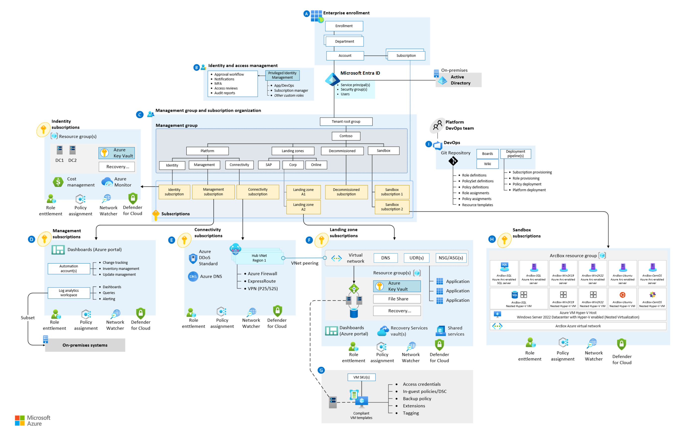
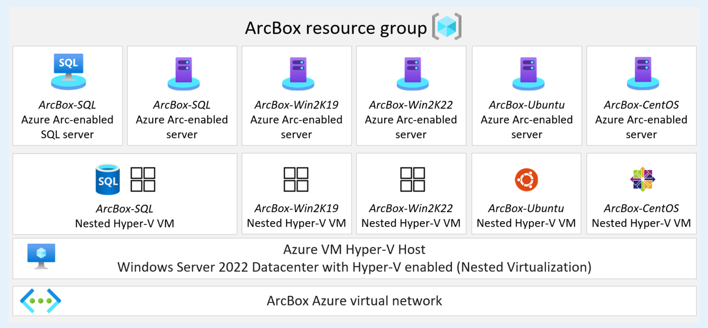

# Azure Arc-enabled servers Azure landing zone sandbox

With Azure Arc, you can onboard infrastructure assets outside of Azure or deploy Azure services to any infrastructure, on-premises or multicloud.

Azure Arc-enabled servers allow you to manage the following:

- Windows and Linux physical servers.
- Virtual machines hosted outside of Azure on your corporate network and other cloud providers.

This management experience is consistent with how you manage native Azure Virtual Machines.

To practice your skills in an Azure Arc-enabled servers environment, use ArcBox, a sandbox solution for features that are:

- Powered by Azure Arc Jumpstart.
- Entirely self-contained within a single Azure subscription and resource group.
- Easy to get hands-on experience with Azure Arc-enabled servers technology.

## Azure landing zone sandbox subscription

The ArcBox solution runs in your [Azure landing zone sandbox subscription](../../../ready/considerations/sandbox-environments.md) and bootstraps all required Azure resources inside a single resource group.

For more information on the design areas labeled A-I in the visual, see [environment design areas](../../../ready/landing-zone/design-areas.md#environment-design-areas).

Once deployed, the resource group contains six Azure Arc-enabled server resources: one Azure Arc-enabled SQL Server and five unified operations resources.

## Deployment options and prerequisites

Deploy the ArcBox solution using one of four methods:

- Azure Bicep using the Azure CLI.
- Terraform using the Terraform CLI.
- Azure Resource Manager (ARM) template using the Azure CLI.
- Azure Resource Manager (ARM) template using the Azure portal.

Based on your deployment method, install either [Azure CLI](/cli/azure/install-azure-cli) or [Terraform CLI](https://learn.hashicorp.com/tutorials/terraform/install-cli).

## Next steps

The Azure Arc-enabled servers landing zone accelerator sandbox is based on the fully automated Jumpstart ArcBox solution.

For more information, see [Jumpstart ArcBox](https://aka.ms/JumpstartArcBox).
