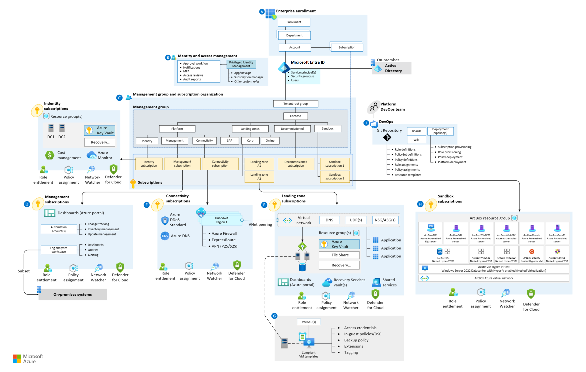
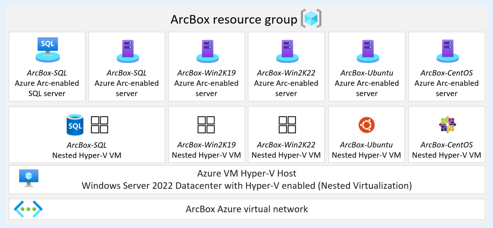

# Azure Arc-enabled servers Azure landing zone sandbox

With Azure Arc, you can onboard infrastructure assets that are located outside of Azure, or deploy Azure services to any infrastructure, either on-premises or in a multicloud environment.

Azure Arc-enabled servers allow you to manage:

- Windows and Linux physical servers.
- Virtual machines that are hosted outside of Azure on your corporate network and on other cloud providers.

This management experience is designed to be consistent with how you manage native Azure Virtual Machines.

To practice your skills in an Azure Arc-enabled servers environment, use ArcBox, a sandbox solution for features that are:
- Powered by Azure Arc Jumpstart.
- Entirely self-contained within a single Azure subscription and resource group.
- Easy to get hands-on experience with by using Azure Arc-enabled servers technology.

## Azure landing zone sandbox subscription

The ArcBox solution is designed to run in your [Azure landing zone sandbox subscription](/azure/cloud-adoption-framework/ready/considerations/sandbox-environments.md) and will bootstrap all the required Azure resources inside a single resource group.

[.](./media/arcbox-sandbox-subscription.png#lightbox)

Once the solution is deployed, the resource group contains six Azure Arc-enabled server resources out of which, one of them is Azure Arc-enabled SQL Server resource and the rest of the five resources are part of *unified operations* resource layer.

## Deployment options and prerequisites

The ArcBox solution is deployed using one of the four methods:

- Azure Bicep using the Azure CLI.
- Terraform using the Terraform CLI.
- Azure Resource Manager (ARM) template using the Azure CLI.
- Azure Resource Manager (ARM) template using the Azure portal.

Based on the desired deployment method, install either [Azure CLI](/cli/azure/install-azure-cli) or [Terraform CLI](https://learn.hashicorp.com/tutorials/terraform/install-cli).

## Next steps

The Azure Arc-enabled servers landing zone accelerator sandbox implementation is based on the fully automated Jumpstart ArcBox solution.

For more information and guidance on how to get started, see [Jumpstart ArcBox](https://aka.ms/JumpstartArcBox).
