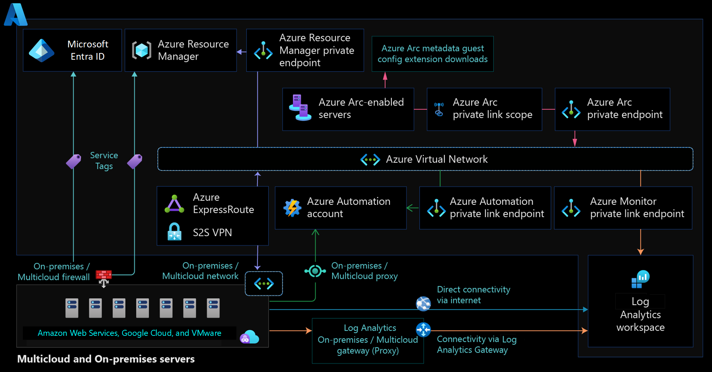

# Network topology and connectivity for Azure Arc-enabled servers

You can use Azure Arc-enabled servers to manage your Windows and Linux physical servers and virtual machines (hosted either in your on-premises environment or by a partner cloud provider) via the Azure control plane. This article describes key design considerations and best practices for Azure Arc-enabled servers connectivity as part of Cloud Adoption Framework enterprise-scale landing zone guidance.

This article assumes that you have successfully implemented an enterprise-scale landing zone and established hybrid network connections. The guidance focuses on the connectivity of the connected machine agent for Azure Arc-enabled servers. For more information, see [Enterprise-scale landing zones overview](../../../ready/enterprise-scale/index.md) and [Implement enterprise-scale landing zones](../../../ready/enterprise-scale/implementation.md).

## Architecture

The following diagram shows a conceptual reference architecture for the connectivity of Azure Arc-enabled servers.

## Design considerations

Consider the following network design considerations for Azure Arc-enabled servers.

- **Define the agent's connectivity method:** Review your existing infrastructure and security requirements. Decide how the connected machine agent should [communicate with Azure](/azure/azure-arc/servers/network-requirements) from your on-premises network or other cloud provider. This connection can go directly over the internet, through a proxy server, or you can [implement Azure Private Link](/azure/azure-arc/servers/private-link-security) for a private connection.

- **Manage access to Azure service tags:** Create an automated process to keep the firewall and proxy network rules updated according to the [connected machine agent network requirements](/azure/azure-arc/servers/network-requirements).
- **Secure your network connectivity to Azure Arc:** Configure the machine operating system to use Transport Layer Security (TLS) version 1.2. We don't recommend older versions because of known vulnerabilities.
- **Define an extensions connectivity method:** Azure extensions that you deploy on an Azure Arc-enabled server typically need to communicate with other Azure services. You can provide this connectivity directly through public networks, a firewall, or a proxy server. You must configure private endpoints for the Azure Arc agent. If your design requires private connectivity, you need to take [extra steps](/azure/azure-arc/servers/private-link-security#how-it-works) to enable private endpoint connectivity for each service that extensions access.
- **Review your overall connectivity architecture:** Review the [network topology and connectivity design area](../../../ready/landing-zone/design-area/network-topology-and-connectivity.md) to assess how Azure Arc-enabled servers affect your overall connectivity.

## Design recommendations

### Define an Azure Arc agent connectivity method

You can use Azure Arc-enabled servers to connect hybrid machines via:

- A direct connection, optionally from behind a firewall or a proxy server.
- Private Link.

#### Direct connection

Azure Arc-enabled servers offer [direct connectivity to Azure public endpoints](/azure/azure-arc/servers/network-requirements#networking-configuration). With this connectivity method, all machine agents use a public endpoint to open a connection to the internet. The connected machine agent for Linux and Windows securely communicates outbound to Azure via the HTTPS protocol (TCP/443).

When you use the direct connection method, review your internet access for the connected machine agent. We recommend that you configure the [required network rules](/azure/azure-arc/servers/network-requirements).

#### Proxy server or firewall connection (optional)

If your machine uses a firewall or a proxy server to communicate over the internet, the agent connects outbound via the HTTPS protocol.

If you use a firewall or a proxy server to restrict outbound connectivity, make sure to allow the IP ranges in accordance with the [connected machine agent network requirements](/azure/azure-arc/servers/network-requirements). When you allow only the required IP ranges or domain names for the agent to communicate with the service, use [service tags and URLs](/azure/azure-arc/servers/network-requirements#service-tags) to configure your firewall or proxy server.

If you deploy extensions on your Azure Arc-enabled servers, every extension connects to its own endpoint or endpoints. You must also allow all corresponding URLs in the firewall or proxy. Add these endpoints to ensure granular secured network traffic and to meet the principle of least privilege.

#### Private Link

To ensure that all traffic from your Azure Arc agents remains on your network, use an Azure Arc-enabled server with Azure Arc Private Link Scope. This configuration has security advantages. The traffic doesn't traverse the internet, and you don't need to open as many outbound exceptions on your datacenter firewall. But Private Link imposes a number of management challenges and increases the overall complexity and cost, especially for global organizations. Consider the following challenges:

- Azure Arc Private Link Scopes encompasses all Azure Arc clients under the same Domain Name System (DNS) scope. You can't have some Azure Arc clients that use private endpoints and some that use public endpoints when they share a DNS server. You can implement workarounds like [DNS policies](/windows-server/networking/dns/deploy/dns-policies-overview).

- Your Azure Arc clients can have either all private endpoints in a primary region, or you need to configure DNS so that the same private endpoint names resolve to different IP addresses. For example, you might use [selectively replicated DNS partitions for Active Directory-integrated DNS](/troubleshoot/windows-server/networking/create-apply-custom-application-directory-partition). If you use the same private endpoints for all your Azure Arc clients, you must have the ability to route traffic from all your networks to the private endpoints.
- You must do extra steps to use private endpoints for any Azure services that extensions software components, that you deploy via Azure Arc, access. These services include Log Analytics workspaces, Azure Automation accounts, Azure Key Vault, and Azure Storage.
- Connectivity to Microsoft Entra ID uses public endpoints, so clients require some internet access.

Because of these challenges, we recommend that you evaluate whether you need Private Link for your Azure Arc implementation. With public endpoints, the traffic is encrypted. Depending on how you use Azure Arc for Servers, traffic might also be limited to management and metadata traffic. To alleviate security concerns, implement [local agent security controls](/azure/azure-arc/servers/security-overview#local-agent-security-controls).

For more information, see the [restrictions and limitations](/azure/azure-arc/servers/private-link-security#restrictions-and-limitations) that are associated with Private Link support for Azure Arc.

> [!TIP]
> For more information, see [Private Link security](/azure/azure-arc/servers/private-link-security#how-it-works).

### Manage access to Azure service tags

We recommend that you implement an automated process to update the firewall and proxy network rules according to the [Azure Arc network requirements](/azure/azure-arc/servers/network-requirements).

### Define an extensions connectivity method

When you enable any of the Azure Arc-enabled servers supported VM extensions, those extensions connect to other Azure services. It's important to determine the connectivity method for those extensions: either directly, behind a proxy server/firewall, or using Private Link.

If your Azure Arc-enabled servers use a proxy or a firewall, you must also allow all URLs required for the extensions, as they'll communicate with their own endpoints.

If you use Private Link, you must configure [Private Link for each service](/azure/azure-arc/servers/private-link-security#how-it-works).

## Next steps

For more guidance for your hybrid cloud adoption journey,  review the following resources:

- Review [Azure Arc Jumpstart](https://azurearcjumpstart.io/azure_arc_jumpstart/azure_arc_servers/day2/) scenarios.
- Review the [prerequisites](/azure/azure-arc/servers/prerequisites) for Azure Arc-enabled servers.
- Review the required [network configuration](/azure/azure-arc/servers/private-link-security#network-configuration) for the Private Link connectivity method.
- Understand how Azure Arc-enabled servers [Private Link](/azure/azure-arc/servers/private-link-security#how-it-works) works.
- Plan an [at-scale deployment](/azure/azure-arc/servers/plan-at-scale-deployment) of Azure Arc-enable servers.
- Plan your [Private Link setup](/azure/azure-arc/servers/private-link-security#planning-your-private-link-setup).
- For solving any connectivity issues, review the [troubleshooting Azure Arc-enabled servers agent connection guide](/azure/azure-arc/servers/troubleshoot-agent-onboard).
- Learn more about Azure Arc via the [Azure Arc learning path](/training/paths/manage-hybrid-infrastructure-with-azure-arc/).
