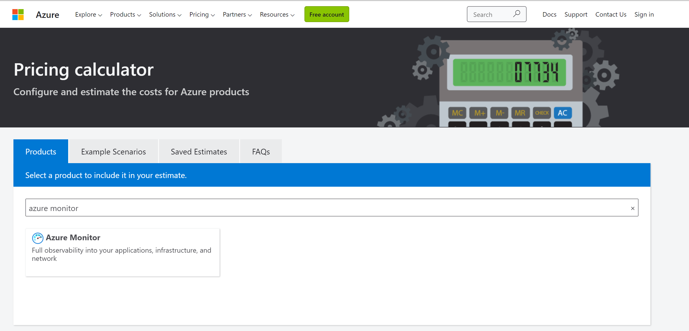
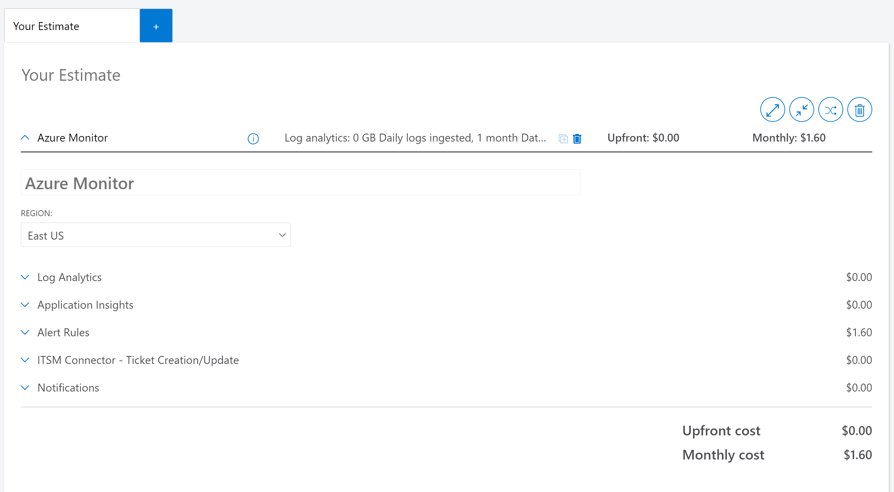

# Cost governance for Azure Arc-enabled servers

Cost governance is the continuous process of implementing policies, to control the costs of services you're using on Azure. This document walks you through the various cost governance considerations and recommendations, when using Azure Arc-enabled servers.

## How much does Azure Arc-enabled servers cost?

Azure Arc-enabled servers provide two types of services:

- **Azure Arc control plane functionality**, which is provided at no extra cost includes:
  - Resource organization through Azure management groups and tags.
  - Searching and indexing through Azure Resource Graph.
  - Access control through Azure role-based access control (RBAC) at subscription or resource group level.
  - Environments and automation through templates and extensions.

- **Azure services used in conjunction with Azure Arc-enabled servers** (but not limited to), which incur costs according to their usage includes:
  - Azure Monitor
  - Microsoft Defender for servers
  - Microsoft Sentinel
  - Azure Update Manager
  - Azure Policy machine configuration
  - Azure Automation State Configuration, change tracking, and inventory
  - Azure Automation hybrid runbook workers
  - Azure Key Vault
  - Azure Private Link

## Design considerations

- **Governance:** Define a governance model for your hybrid servers that translates into Azure policies, tags, naming standards, and least-privilege controls.
- **Azure Monitor:** [Azure Monitor](/azure/azure-monitor/overview) includes functionality for the collection and analysis of log data of your Azure Arc-enabled servers (billed by data ingestion, retention, and export), collection of metrics, health monitoring, alerts, and notifications. Features of Azure Monitor that are automatically enabled are provided at no cost - such as the collection of standard metrics, activity logs, and insights.
- **Microsoft Defender for Cloud** (formerly known as Azure Security Center): Microsoft Defender for Cloud is offered in [two modes](/azure/security-center/security-center-pricing):

   **Without enhanced security features (Free)** - [Defender for Cloud](/azure/security-center/defender-for-cloud-introduction) is enabled for free on all your Azure subscriptions when you visit the workload protection dashboard in the Azure portal for the first time, or if enabled programmatically via API. Using this free mode provides the secure score and its related features: security policy, continuous security assessment, and actionable security recommendations to help you protect your Azure resources.

   **Defender for Cloud with all enhanced security features (Paid)** - enabling [Microsoft Defender for Cloud](/azure/security-center/azure-defender) enhanced security extends the capabilities of the free mode to workloads running in private and other public clouds, providing unified security management and threat protection across your hybrid cloud workloads.

- **Microsoft Sentinel:** Microsoft Sentinel provides intelligent security analytics across your enterprise. The data for this analysis is stored in an Azure Monitor Log Analytics workspace. Microsoft Sentinel is billed based on the volume of data ingested for analysis in Microsoft Sentinel, and stored in the Azure Monitor Log Analytics workspace for your Azure Arc-enabled servers.
- **Azure Update Manager:** Azure Update Manager is a unified service to help manage and govern updates for all your machines. You can monitor Windows and Linux update compliance across your deployments in Azure, on-premises, and on other cloud platforms from a single dashboard. Azure Update Manager is billed per server per day.
- **Azure Policy machine configuration:** Azure Policy machine configuration can audit and enforce operating system and application settings across your fleet of servers. Azure Policy machine configuration is billed per server per month, and includes usage rights for Azure Automation State Configuration, change tracking, and inventory.
- **Azure Automation configuration management:** Azure Automation configuration management includes software Change Tracking and Inventory for your servers, as well as state configuration to configure your servers at-scale with PowerShell Desired State Configuration. Azure Automation configuration management is billed per server per month, and includes usage rights for Azure Policy machine configuration.
- **Azure Key Vault:** The Azure Key Vault VM extension allows you to manage the certificate lifecycle on [Windows](/azure/virtual-machines/extensions/key-vault-windows) and [Linux](/azure/virtual-machines/extensions/key-vault-linux) Azure Arc-enabled servers. Azure Key Vault is billed by the operations performed on the certificates, keys, and secrets.
- **Azure Private Link:** You can use [Azure Private Link](/azure/azure-arc/servers/private-link-security), to ensure data coming from your Azure Arc-enabled servers are only accessed through authorized private networks. Azure Private Link is billed by endpoint and inbound/outbound data processed.

## Design recommendations

Here are some general design recommendations for Azure Arc-enabled servers cost governance:

> [!Note]
> In this section, pricing information described in the provided screenshots are examples and provided to allow demonstrating the usage of the Azure Calculator and don't reflect the actual pricing information you might be seeing in your own Azure Arc deployments.

### Governance

- Ensure that all Azure Arc-enabled servers follow proper [naming and tagging conventions](/azure/cloud-adoption-framework/ready/azure-best-practices/resource-naming).
- Use least privilege Azure RBAC by assigning **Azure Connected Machine Onboarding role** to only administrators who onboards Azure Arc-enabled servers to avoid unnecessary costs.
- Use least privilege Azure RBAC by assigning **Azure Connected Machine Resource Administrator** to only administrators who need to read, write, delete, and re-onboard Azure connected machines.

### Azure Monitor

- Review [recommendations for monitoring](./eslz-management-and-monitoring-arc-server.md) to decide on your monitoring requirements and review [Azure Monitor pricing](https://azure.microsoft.com/pricing/details/monitor/).
- Decide on the [required logs and events](/azure/azure-monitor/agents/log-analytics-agent#data-collected) for Azure Arc-enabled Windows and Linux servers, to be collected in the Log Analytics workspace.
- Use the [Azure pricing calculator](https://azure.microsoft.com/pricing/calculator/) to estimate Azure Arc-enabled servers monitoring costs, for Azure Log Analytics ingestion, alerts, and notifications.

- Use [Microsoft Cost Management](/azure/azure-monitor/usage-estimated-costs#azure-cost-management--billing) to have visibility on Azure Monitor costs.

- Use [Log Analytics workspaces insights](/azure/azure-monitor/logs/log-analytics-workspace-insights-overview) solution to understand and monitor the collected logs and their ingestion rate on the Log Analytics workspace.

:::image type="content" source="./media/insights-log-analytics.png" alt-text="Screenshot that shows Log Analytics insights." lightbox="./media/insights-log-analytics.png":::

- Evaluate possible data ingestion volume reducing. Refer to [Tips for reducing data volume](/azure/azure-monitor/logs/manage-cost-storage#tips-for-reducing-data-volume) documentation, to help configure data ingestion properly.
- Consider how long you want to retain data on Log Analytics. Data ingested into Log Analytics workspace can be retained at no additional charge, up to the first 31 days. Consider general aspects to configure the [Log Analytics workspace level default retention](/azure/azure-monitor/logs/manage-cost-storage#workspace-level-default-retention), and specific needs to configure data [retention by data type](/azure/azure-monitor/logs/manage-cost-storage#retention-by-data-type), that can be as minimal as four days. Example: performance data doesn't usually need to be retained for long periods, but security logs might need to be retained for extended periods.
- To retain data longer than 730 days, consider using [Log Analytics workspace data export](/azure/azure-monitor/logs/logs-data-export).
- Consider using [commitment tier](/azure/azure-monitor/logs/manage-cost-storage#pricing-model) pricing based on your data ingestion volume.

### Microsoft Defender for Cloud (formerly Azure Security Center)

Review the [recommendations for security and compliance](./eslz-security-governance-and-compliance.md) and [Microsoft Defender for servers pricing](https://azure.microsoft.com/pricing/details/azure-defender/).

### Microsoft Sentinel

  >[!Note]
  > These images show pricing examples only.

- Review [Microsoft Sentinel pricing](https://azure.microsoft.com/pricing/details/azure-sentinel/).
- Use the Azure pricing calculator to estimate [Microsoft Sentinel costs](/azure/sentinel/azure-sentinel-billing).

:::image type="content" source="./media/azure-sentinel-costs.png" alt-text="Screenshot that shows and example Microsoft Sentinel costs." lightbox="./media/azure-sentinel-costs.png":::

- Use [Cost Management](/azure/sentinel/azure-sentinel-billing#manage-and-monitor-azure-sentinel-costs) to have visibility on Microsoft Sentinel analysis costs.

:::image type="content" source="./media/cost-management-azure-sentinel.png" alt-text="Screenshot that shows Microsoft Sentinel cost analysis." lightbox="./media/cost-management-azure-sentinel.png":::

- Review [data retention costs](/azure/sentinel/azure-sentinel-billing#data-retention-costs) for data ingested into the Log Analytics workspace used by Microsoft Sentinel.
- Filter the [right level of logs and events](/azure/azure-monitor/agents/log-analytics-agent#data-collected) for the Azure Arc-enabled Windows and Linux servers to be collected in the Log Analytics workspace.
- Use [Log Analytics queries](/azure/sentinel/azure-sentinel-billing#run-queries-to-understand-your-data-ingestion) and the [workspace usage report workbook](/azure/sentinel/azure-sentinel-billing#deploy-a-workbook-to-visualize-data-ingestion) to understand your data ingestion trends.
- Create a [cost management playbook](/azure/sentinel/azure-sentinel-billing#use-a-playbook-for-cost-management-alerts) to send notifications, if your Microsoft Sentinel workspace exceeds your budget.
- Microsoft Sentinel integrates with other Azure services to provide enhanced capabilities. Review the [pricing details](/azure/sentinel/azure-sentinel-billing#costs-for-other-services) for these services.
- Consider using [commitment tier](/azure/sentinel/azure-sentinel-billing#set-or-change-pricing-tier) pricing based on your data ingestion volume.
- Consider [separating non-security](/azure/sentinel/azure-sentinel-billing#separate-non-security-data-in-a-different-workspace) operational data into a different Azure Log Analytics workspace.

### Azure Update Manager

- Review the [recommendations for management and monitoring](./eslz-management-and-monitoring-arc-server.md) and [Azure Update Manager pricing](https://azure.microsoft.com/pricing/details/azure-update-management-center/).

### Azure Policy machine configuration

- Review the [recommendations for governance and compliance](./eslz-security-governance-and-compliance.md) and [Azure Policy machine configuration pricing](https://azure.microsoft.com/pricing/details/azure-policy/).
- Use Cost Management to understand the Azure Policy machine configuration costs by filtering the **Microsoft.HybridCompute/machines** resource type.
- All built-in machine configuration policies include a parameter that controls whether the policy will be assigned to Azure Arc-enabled servers machines. Review your policy assignments and set this parameter to "false" for policies that don't need to be evaluated on your hybrid servers.

:::image type="content" source="./media/cost-management-policy-azure.png" alt-text="Screenshot that shows an example of Azure Policy costs." lightbox="./media/cost-management-policy-azure.png":::

### Azure Automation configuration management

Review [recommendations for automation](./eslz-automation-arc-server.md) and [Azure Automation pricing](https://azure.microsoft.com/pricing/details/automation/).

### Azure Key Vault

- Review [Azure Key Vault pricing](https://azure.microsoft.com/pricing/details/key-vault/).
- Use [Azure Key Vault insights](/azure/azure-monitor/insights/key-vault-insights-overview) to monitor certificate renewal and secrets operations on your Azure Arc-enabled servers.

:::image type="content" source="./media/key-vault-insights.png" alt-text="Screenshot that shows Azure Key Vault insights." lightbox="./media/key-vault-insights.png":::

### Azure Private Link

- Review [recommendations for connectivity](./eslz-arc-servers-connectivity.md) and [Azure Private Link pricing](https://azure.microsoft.com/pricing/details/private-link/).
- Use [Cost Management](/azure/cost-management-billing/cost-management-billing-overview) to monitor the usage of Private Link, used with Azure Arc-enabled servers.

:::image type="content" source="./media/cost-private-endpoints.png" alt-text="Screenshot that shows an example of Azure Private Link costs." lightbox="./media/cost-private-endpoints.png":::

## Next steps

For more guidance for your hybrid cloud adoption journey, review the following resources:

- Review [Azure Arc Jumpstart](https://azurearcjumpstart.io/azure_arc_jumpstart/azure_arc_servers/day2/) scenarios.
- Review the [prerequisites](/azure/azure-arc/servers/agent-overview#prerequisites) for Azure Arc-enabled servers.
- Plan an [at-scale deployment](/azure/azure-arc/servers/plan-at-scale-deployment) of Azure Arc-enable servers.
- Learn more about Azure Arc via the [Azure Arc learning path](/training/paths/manage-hybrid-infrastructure-with-azure-arc/).
