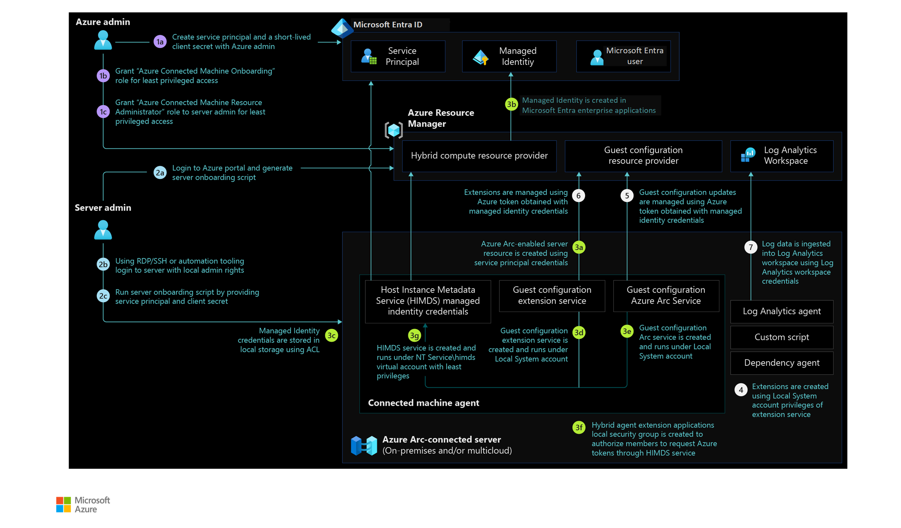

# Identity and access management for Azure Arc-enabled servers

Your organization needs to design the right access controls to secure hybrid environments using on-premises and cloud-based identity management systems.

These identity management systems play an important role. They help designing and implementing reliable access management controls for securing Azure Arc-enabled servers infrastructure.

## Managed identity

At creation, the Microsoft Entra ID system-assigned identity can only be used to update the status of the Azure Arc-enabled servers, for example, the 'last seen' heartbeat. Grant identity access to Azure resources to enable applications on your server to access Azure resources, for example, to request secrets from a Key Vault. You should:

- Consider which legitimate use-cases exist for server applications to [obtain access tokens](/azure/azure-arc/servers/managed-identity-authentication) and access Azure resources, while also planning for access control of these resources.
- Control privileged user roles on Azure Arc-enabled servers (members of the local administrators or [Hybrid Agent Extensions Applications group](/azure/azure-arc/servers/agent-overview#windows-agent-installation-details) on Windows and members of the [himds](/azure/azure-arc/servers/agent-overview#agent-component-details) group on Linux) to avoid system-managed identities being misused to gain unauthorized access to Azure resources.
- Use Azure RBAC to control and manage the permission for Azure Arc-enabled servers managed identities and perform periodic access reviews for these identities.

## Role-based access control (RBAC)

Following the [least privilege principle](/security/benchmark/azure/baselines/arc-enabled-security-baseline#pa-7-follow-just-enough-administration-least-privilege-principle), users, groups, or applications assigned with roles like "contributor" or "owner" or "Azure Connected Machine Resource Administrator" are able to execute operations like deploying extensions, effectively delegating root or administrator access on Azure Arc-enabled servers. These roles should be used with caution, to limit the possible blast radius or eventually replaced by custom roles.

To limit the privilege of a user and only allow them to onboard servers to Azure, the Azure Connected Machine Onboarding role is suitable. This role can only be used to onboard servers and can't re-onboard or delete the server resource. Make sure to review the [Azure Arc-enabled servers security overview](/azure/azure-arc/servers/security-overview) for more information about access controls.

Also consider the sensitive data that might be sent to the Azure Monitor Log Analytics workspace--the same RBAC principle should be applied to the data itself. Read access to Azure Arc-enabled servers can provide access to log data collected by the Log Analytics agent, stored in the associated Log Analytics workspace. Review how to implement granular Log Analytics workspace access in the [designing your Azure Monitor Logs deployment documentation](/azure/azure-monitor/logs/design-logs-deployment#access-control-overview).

## Architecture

The following diagram shows a reference architecture that demonstrates the roles, permissions, and flow of actions for Azure Arc-enabled servers:

## Design considerations

- Decide who from your organization should have access to onboarding servers to set up required permissions on the servers and in Azure.
- Decide who should manage Azure Arc-enabled servers. Then, decide who can view their data from Azure services and other cloud environments.
- Decide how many Arc onboarding service principals you need. Multiple of these identities can be used to onboard servers that are owned by different business functions or units in an enterprise that is based on operational responsibility and ownership.
- Review the [identity and access management design area](../../../ready/landing-zone/design-area/identity-access.md) of Azure landing zone enterprise-scale. Review the area to assess the impact of Azure Arc-enabled servers on your overall identity and access model.

## Design recommendations

- **Server onboarding and administration**
  - Use security groups to assign local administrator rights to the identified users or service accounts on the servers to onboard to Azure Arc at scale.
  - Use [Microsoft Entra service principal](/azure/azure-arc/servers/onboard-service-principal#create-a-service-principal-for-onboarding-at-scale) to onboard servers to Azure Arc. Consider using multiple Microsoft Entra service principals in a decentralized operating model, where servers are managed by different IT teams.
  - Use a short-lived Microsoft Entra service principal [client secrets](/azure/active-directory/develop/howto-create-service-principal-portal#option-2-create-a-new-application-secret).
  - Assign the [Azure Connected Machine Onboarding](/azure/azure-arc/servers/onboard-service-principal#create-a-service-principal-for-onboarding-at-scale) role at the resource group level.
  - Use Microsoft Entra security groups and grant the [Hybrid Server Resource Administrator](/azure/azure-arc/servers/plan-at-scale-deployment#prerequisites) role. Grant the role to teams and individuals that will manage Azure Arc-enabled server resources in Azure.
- **Microsoft Entra ID protected resource access**
  - Use [managed identities](/azure/azure-arc/servers/managed-identity-authentication) for applications running on your on-premises servers (and other cloud environments) to provide access to cloud resources protected by Microsoft Entra ID.
  - Restrict access to managed identities to [allow applications](/azure/active-directory/develop/v2-permissions-and-consent) that are authorized using Microsoft Entra application permissions.
  - Use [`Hybrid agent extension applications`](/azure/azure-arc/servers/security-overview#using-a-managed-identity-with-azure-arc-enabled-servers) local security group on Windows or the *himds* group on Linux to grant access to users to request Azure resource access tokens from the Azure Arc-enabled servers.

## Next steps

For more guidance for your hybrid cloud adoption journey, review the following resources:

- Review [Azure Arc Jumpstart](https://azurearcjumpstart.io/azure_arc_jumpstart/azure_arc_servers/day2/) scenarios.
- Review the [prerequisites](/azure/azure-arc/servers/agent-overview#prerequisites) for Azure Arc-enabled servers.
- Plan an [at-scale deployment](/azure/azure-arc/servers/plan-at-scale-deployment) of Azure Arc-enable servers.
- Learn more about Azure Arc via the [Azure Arc learning path](/training/paths/manage-hybrid-infrastructure-with-azure-arc/).
