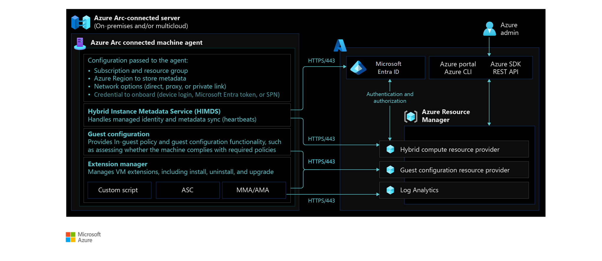

# Management and monitoring for Azure Arc-enabled servers

Azure Arc-enabled servers let you manage Windows and Linux servers and VMs hosted outside Azure. These can be on your corporate network or a third-party cloud provider.

This article helps you run Azure Arc-enabled servers on your Azure estate. It covers central management and monitoring at the [platform level](../../../ready/landing-zone/design-area/management.md) and gives key tips for your ops team.

## Architecture

This diagram shows how the Azure [connected machine agent](/azure/azure-arc/servers/agent-overview) connects to management and monitoring features in Azure.

## Design considerations

Here are some design factors for monitoring and managing Azure Arc-enabled servers:

- **Azure Monitor requirements:** Azure Monitor can [enable VM insights](/azure/azure-arc/servers/learn/tutorial-enable-vm-insights) for your Azure Arc-enabled servers in a Log Analytics workspace. This helps with deep analysis and data linking. You need to install agents like the Azure Monitor agent and the dependency agent.
- **Azure Monitor agents deployment:** Check the [install options](/azure/azure-arc/servers/concept-log-analytics-extension-deployment) for the Azure Monitor agents.
- **Azure Monitor configuration:** Plan your [data collection needs](/azure/azure-monitor/vm/data-collection#add-data-sources) for Azure Arc-enabled servers, such as metrics and logs.
- **Azure connected machine agent management:** The Azure connected machine agent is key to your hybrid tasks. It lets you manage your Windows and Linux machines hosted outside Azure and enforce policies. Set up tools to track idle agents, check for new versions, and automate upgrades.
- **Patch management for your hybrid resources:** Automate updates so your Azure Arc-enabled servers have the latest OS and security patches.

## Design recommendations

### Azure Monitor requirements

- Learn how the Azure Monitor agent [works and collects data](/azure/azure-monitor/agents/azure-monitor-agent-overview) before you deploy it.
- See the [Network connectivity for Azure Arc-enabled servers](./eslz-arc-servers-connectivity.md) section for network design tips.
- Before you add a machine to Azure Monitor, check the [supported operating systems](/azure/azure-monitor/agents/azure-monitor-agent-supported-operating-systems) and [network needs](/azure/azure-monitor/agents/azure-monitor-agent-network-configuration) for the agent.

### Azure Monitor agents deployment

- Auto-deploy the Azure Monitor agents to Azure Arc-enabled Windows and Linux servers through [Azure Policy](/azure/governance/policy/overview). Do this as part of the [enterprise-scale landing zone](../../../ready/landing-zone/design-area/management.md).
- Store logs in a central Log Analytics workspace. Control log access with Azure [role-based access control (RBAC)](/azure/azure-monitor/platform/design-logs-deployment#access-control-overview). A separate workspace for management, data sovereignty, or compliance can limit shared views. It can also reduce event linking across Azure Arc-enabled servers.

### Azure Monitor configuration

- Use [VM insights](/azure/azure-arc/servers/learn/tutorial-enable-vm-insights) to track the performance of your Azure Arc-enabled Windows and Linux servers. Track their processes and links to other resources and outside processes.
- Create [dashboards](/azure/azure-portal/azure-portal-dashboards) or [Azure Monitor workbooks](/azure/azure-monitor/visualize/workbooks-overview) to track key metrics and events across your Azure Arc-enabled servers. Find sample Log Analytics queries and VM insights in this [article](/azure/azure-monitor/vm/vminsights-log-query).
- Set up the needed [performance counters](/azure/azure-monitor/agents/data-sources-performance-counters) for Azure Arc-enabled Windows and Linux servers in your Log Analytics workspace.
- Set up the needed [logs](/azure/azure-monitor/vm/data-collection#add-data-sources) for Azure Arc-enabled Windows and Linux servers in your Log Analytics workspace.

### Azure connected machine agent management

- Create a [resource health alert](/azure/azure-arc/servers/plan-at-scale-deployment#phase-3-manage-and-operate) to monitor the Azure connected machine agent. This helps track Azure Arc-enabled servers that stop sending heartbeats.
- Create an [Azure Advisor alert](/azure/azure-arc/servers/plan-at-scale-deployment#phase-3-manage-and-operate) to find Azure Arc-enabled servers that don't run the latest Azure connected machine agent.
- Check the Azure connected machine agent [upgrade methods](/azure/azure-arc/servers/manage-agent#upgrading-agent). Automate agent upgrades to get the latest fixes and features.
- Learn how to update [VM extensions](/azure/azure-arc/servers/manage-vm-extensions) to keep other Azure Arc-managed agents up to date.
- Check [this article](/azure/azure-arc/servers/agent-release-notes) for the latest releases, known issues, and bug fixes for the Azure connected machine agent.

### Patch management for your hybrid resources

- Use [Azure Update Manager](/azure/update-manager/overview) to patch both Azure Arc-enabled Windows and Linux servers long term. You can view and schedule OS updates and patches for your Azure Arc-enabled servers at scale.
- On Azure Arc-enabled Windows servers, Azure Update Manager can also automate agent upgrades through Windows updates.
- Some Azure Arc-enabled Windows servers could have reached [End of Support](/lifecycle/faq/windows#when-a-windows-operating-system--os--reaches-the-end-of-its-lifecycle-or-is-no-longer-supported--does-that-mean-new-programs-will-not-run-on-that-os-). These servers can't move to Azure or upgrade. Enable [Extended Security Updates](/azure/azure-arc/servers/prepare-extended-security-updates) (ESUs) on those servers to keep getting critical security patches.

## Next steps

For more help with hybrid cloud setup, see these resources:

- See [Azure Arc Jumpstart](https://azurearcjumpstart.io/azure_arc_jumpstart/azure_arc_servers/day2/) scenarios.
- Check the [prerequisites](/azure/azure-arc/servers/agent-overview#prerequisites) for Azure Arc-enabled servers.
- Plan a [large-scale rollout](/azure/azure-arc/servers/plan-at-scale-deployment) of Azure Arc-enabled servers.
- Learn about Azure Arc through the [Azure Arc learning path](/training/paths/manage-hybrid-infrastructure-with-azure-arc/).