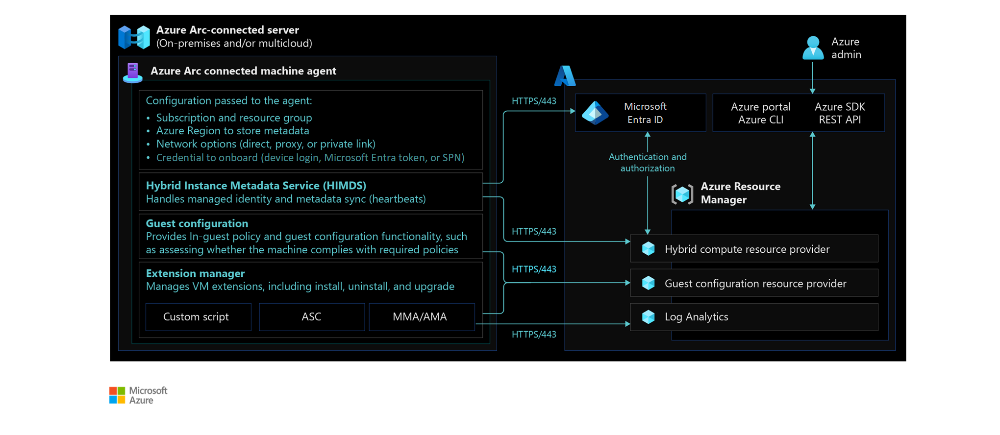

# Management and monitoring for Azure Arc-enabled servers

Azure Arc-enabled servers allow you to manage your Windows and Linux servers and virtual machines hosted outside of Azure. These can be on your corporate network or on a third-party cloud provider.

This article helps your operations team operate Azure Arc-enabled servers with centralized management and monitoring at the [platform level](../../../ready/landing-zone/design-area/management.md). It provides key recommendations to maintain these servers.

## Architecture

The following diagram shows the conceptual architecture of how the Azure [connected machine agent](/azure/azure-arc/servers/agent-overview) communicates with Azure's management and monitoring capabilities.

## Design considerations

Here are some general design considerations for Azure Arc-enabled servers monitoring and management:

- **Azure Monitor requirements:** Azure Monitor collects data from your Azure Arc-enabled servers into a Log Analytics workspace for detailed analysis and correlation. This requires installing monitoring agents such as the Azure Monitor Agent and Dependency Agent.
- **Azure Monitor agents deployment:** Review the [deployment options](/azure/azure-arc/servers/concept-log-analytics-extension-deployment) for Azure Monitor agents. The Azure Monitor Agent (AMA) has replaced the older Log Analytics agent for new deployments on Azure Arc-enabled servers. For migration guidance, see [Azure Monitor Agent migration](/azure/azure-arc/servers/migrate-legacy-agents).
- **Azure Monitor configuration:** Plan your Azure Arc-enabled servers [monitoring requirements](/azure/azure-monitor/vm/data-collection#add-data-sources), including metrics and log collection.
- **Azure connected machine agent management:** Implement solutions to track unresponsive agents, monitor new versions, and automate upgrade deployments.
- **Patch management for your hybrid resources:** Automate and install updates promptly to ensure your Azure Arc-enabled servers have the latest operating system and security updates.

## Design recommendations

### Azure Monitor requirements

- Review how the Azure Monitor agent [operates and collects data](/azure/azure-monitor/agents/azure-monitor-agent-overview) before deployment.
- Review the [Network connectivity for Azure Arc-enabled servers](./eslz-arc-servers-connectivity.md) section of this guide for network-specific design considerations and recommendations.
- Before onboarding any machine to Azure Monitor, review the [supported list of operating systems](/azure/azure-monitor/agents/azure-monitor-agent-supported-operating-systems) and the [network requirements](/azure/azure-monitor/agents/azure-monitor-agent-network-configuration) of the monitoring agent.

### Azure Monitor agents deployment

- Automatically deploy Azure Monitor agents to Azure Arc-enabled Windows and Linux servers using [Azure Policy](/azure/azure-monitor/deploy-scale) as part of the [enterprise-scale landing zone](../../../ready/landing-zone/design-area/management.md).
- Store logs centrally in a Log Analytics workspace and control access using Azure [role-based access control (RBAC)](/azure/azure-monitor/platform/design-logs-deployment#access-control-overview). If separate workspaces are required for management, data sovereignty, or compliance, note that this may limit unified visibility and event correlation across your Azure Arc-enabled servers.
- Use the Azure Monitor Agent (AMA) for new deployments, as the Log Analytics agent is deprecated and was retired on August 31, 2024. For more information, see [Azure Monitor Agent migration](/azure/azure-monitor/agents/azure-monitor-agent-migration).

### Azure Monitor configuration

- Use [VM insights](/azure/azure-arc/servers/learn/tutorial-enable-vm-insights) to analyze the performance of your Azure Arc-enabled Windows and Linux servers. Monitor their processes and dependencies on other resources and external processes.
- Create [dashboards](/azure/azure-portal/azure-portal-dashboards) or [Azure Monitor workbooks](/azure/azure-monitor/visualize/workbooks-overview) to track relevant metrics and events across your Azure Arc-enabled servers. Sample Log Analytics queries and VM insights are available in this [article](/azure/azure-monitor/vm/vminsights-log-query).
- Configure the needed [performance counters](/azure/azure-monitor/agents/data-sources-performance-counters) for the Azure Arc-enabled Windows and Linux servers in the dedicated Log Analytics workspace.
- Configure the needed [logs](/azure/azure-monitor/vm/data-collection#add-data-sources) for the Azure Arc-enabled Windows and Linux servers in the dedicated Log Analytics workspace.

### Azure connected machine agent management

- Monitor the Azure connected machine agent's health by creating a [resource health alert](/azure/azure-arc/servers/plan-at-scale-deployment#phase-3-manage-and-operate) to track Azure Arc-enabled servers that are not sending heartbeats.
- Create an [Azure Advisor alert](/azure/azure-arc/servers/plan-at-scale-deployment#phase-3-manage-and-operate) to identify Azure Arc-enabled servers that aren't using the latest version of the Azure connected machine agent.
- Review the Azure connected machine agent [upgrade methods](/azure/azure-arc/servers/manage-agent#upgrading-agent). Automate the upgrade process of the agent to ensure the latest fixes and features are applied.
- Understand how to upgrade [virtual machine extensions](/azure/azure-arc/servers/manage-vm-extensions) to keep other agents installed and managed by Azure Arc up to date.
- Monitor [this article](/azure/azure-arc/servers/agent-release-notes) for the latest releases, known issues, and bug fixes of the Azure connected machine agent.
- Indirectly connected mode for Azure Arc-enabled servers was retired in September 2025. All servers must now maintain a direct connection to Azure. For details, see [Azure Arc overview](/azure/azure-arc/servers/overview) and [connectivity design recommendations](/azure/cloud-adoption-framework/scenarios/hybrid/arc-enabled-servers/eslz-arc-servers-connectivity#design-recommendations).

### Patch management for your hybrid resources

- Use [Azure Update Manager](/azure/update-manager/overview) as a long-term patching mechanism for both Azure Arc-enabled Windows and Linux servers. This allows you to view and schedule operating system updates and patches for your Azure Arc-enabled servers at scale.
- Azure Update Manager also allows you to automate Azure connected machine agent upgrades via Windows updates on Azure Arc-enabled Windows servers.
- If your Azure Arc-enabled Windows servers have reached [End of Support](/lifecycle/faq/windows#when-a-windows-operating-system--os--reaches-the-end-of-its-lifecycle-or-is-no-longer-supported--does-that-mean-new-programs-will-not-run-on-that-os-) and cannot be migrated or upgraded, enable [Extended Security Updates](/azure/azure-arc/servers/prepare-extended-security-updates) (ESUs). ESUs provide critical and important security patches to maintain server security.
- Azure Update Manager supports hotpatching for Windows Server 2025 Datacenter and Standard Editions, allowing security updates without requiring a reboot. Hotpatching requires enabling the feature on the Azure Arc Portal and a monthly subscription fee applies. For more information, see [hotpatching overview](/azure/azure-arc/servers/cloud-native/patch-management#hotpatching) and [enable hotpatching](/windows-server/get-started/enable-hotpatch-azure-arc-enabled-servers).

## Next steps

For more guidance for your hybrid cloud adoption journey, review the following resources:

- Review [Azure Arc Jumpstart](https://azurearcjumpstart.io/azure_arc_jumpstart/azure_arc_servers/day2/) scenarios.
- Review the [prerequisites](/azure/azure-arc/servers/agent-overview#prerequisites) for Azure Arc-enabled servers.
- Plan an [at-scale deployment](/azure/azure-arc/servers/plan-at-scale-deployment) of Azure Arc-enabled servers.
- Learn more about Azure Arc via the [Azure Arc learning path](/training/paths/manage-hybrid-infrastructure-with-azure-arc/).
- Review the [Azure Arc overview](/azure/azure-arc/servers/overview) for the latest updates on Azure Arc-enabled servers.