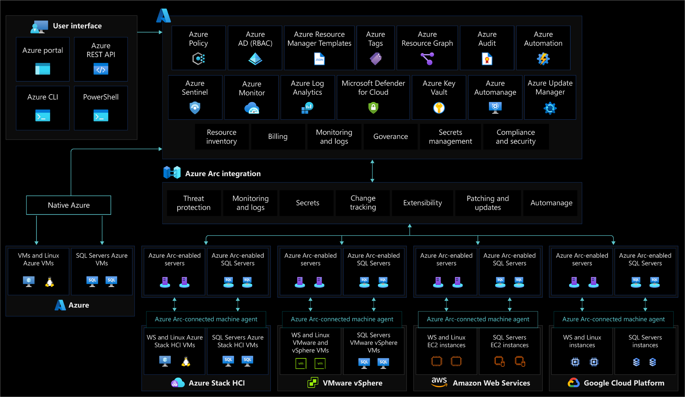
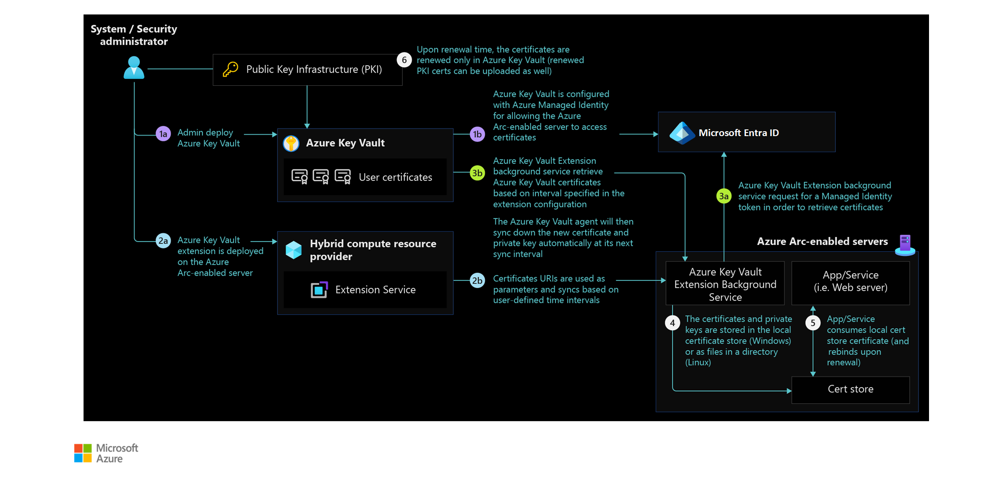
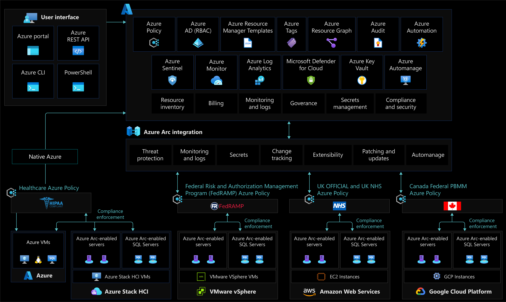

# Governance, security, and compliance baseline for Azure Arc-enabled servers

This article covers key design factors and best practices for setting up security, governance, and compliance for Azure Arc-enabled servers. The enterprise-scale landing zone docs cover "[Governance](../../../ready/landing-zone/design-area/governance.md)" and "[Security](../../../ready/landing-zone/design-area/security.md)" as separate topics. This article combines them for Azure Arc-enabled servers.

Setting up the right controls is key in any cloud deployment. Strong controls help you stay secure and compliant. In a traditional setup, these controls usually involve review steps and manual checks. But the cloud brought a new approach to IT governance with automated guardrails and checks. [Azure Policy](/azure/governance/policy/overview) and [Microsoft Defender for Cloud](/azure/defender-for-cloud/defender-for-cloud-introduction) are cloud-native tools. They automate these controls, reports, and fixes. With Azure Arc, you can extend your governance policies and security to any resource in any cloud.

This article explains the key design areas for security, governance, and compliance. It includes clear Microsoft guidance.

## Architecture

The following image shows the reference architecture for security, compliance, and governance design areas for Azure Arc-enabled servers:

## Design considerations

Your hybrid and multicloud resources become part of Azure Resource Manager. Then Azure tools can manage and govern them like native Azure VMs.

### Identity and access management

- **Agent security permissions:** Secure access to the Azure connected machine agent by reviewing users with local admin rights on the server.
- **Managed identity:** Use [managed identities with Azure Arc-enabled servers](/azure/azure-arc/servers/managed-identity-authentication). Decide which apps running on Azure Arc-enabled servers can use a Microsoft Entra token.
- **Azure role-based access control (RBAC):** Define admin, operations, and engineering roles within your organization. This helps assign day-to-day tasks in the hybrid setup. Map each team to actions and duties to set Azure RBAC roles and configurations. Consider using a [RACI](../../../organize/raci-alignment.md) matrix to support this effort. Build controls into the management scope levels you define. Follow the resource consistency and inventory management guidance. For more info, review [identity and access management for Azure Arc-enabled servers](./eslz-identity-and-access-management.md).

### Resource organization

- **Change Tracking and Inventory:** [Track changes](/azure/automation/change-tracking/overview-monitoring-agent) on the OS, app files, and registry. This helps find security and ops issues in on-premises and other cloud setups.

### Governance disciplines

- **Threat protection and cloud security posture management:** Add controls to detect security misconfigurations and track compliance. Also, use [Azure's intelligence](/azure/sentinel/overview) to protect your hybrid workloads against threats. [Enable Microsoft Defender for servers](/azure/security-center/security-center-get-started) for all subscriptions that contain Azure Arc-enabled servers. This provides security baseline monitoring, posture management, and threat protection.
- **Secret and certificate management:** Enable [Azure Key Vault](/azure/key-vault/general/basic-concepts) to protect service principal credentials. Consider using [Azure Key Vault](/azure/key-vault/general/basic-concepts) for certificate management on your Azure Arc-enabled servers.
- **Policy management and reporting:** Define a governance plan for your hybrid servers and machines. Translate it into Azure policies and remediation tasks.
- **Data residency:** Choose which Azure region to use for your Azure Arc-enabled servers. Also review the [metadata collected](/azure/azure-arc/servers/data-residency) from these machines.
- **Secure public key:** Secure the Azure connected machine agent public key used to connect to the Azure service.
- **Business continuity and disaster recovery:** Review the [business continuity and disaster recovery](../../../ready/landing-zone/design-area/management-business-continuity-disaster-recovery.md) guidance for enterprise-scale landing zones. Check if it meets your enterprise needs.
- Review the [security, governance, and compliance design area](../../../ready/landing-zone/design-area/governance.md) of Azure landing zone enterprise-scale. Check how Azure Arc-enabled servers affect your overall security and governance model.

### Management disciplines

- **Agent management:** The [Azure connected machine agent](/azure/azure-arc/servers/agent-overview) plays a key role in your hybrid operations. It lets you manage your Windows and Linux machines hosted outside of Azure and enforce governance policies. Set up solutions to track unresponsive agents.
- **Log management strategy:** Plan to collect metrics and logs from your hybrid resources into a Log Analytics workspace for review and audit.

### Platform automation

- **Agent provisioning:** Plan how to set up Azure Arc-enabled servers and protect access to onboarding credentials. Consider the level and method of automation for [bulk enrollment](/azure/azure-arc/servers/learn/quick-enable-hybrid-vm). Consider how to structure [pilot and production deployments](/azure/azure-arc/servers/plan-at-scale-deployment) and create a formal plan. The scope and plan should cover goals, selection and success criteria, training, rollback, and risks.
- **Software updates:**
  - Check available updates to maintain security compliance.
  - Plan to list Windows OS versions and track end-of-support deadlines. For servers that can't be moved to Azure or upgraded, plan for [Extended Security Updates](/azure/azure-arc/servers/prepare-extended-security-updates) (ESUs) through Azure Arc.

## Design recommendations

### Agent provisioning

You might use a [service principal](/azure/azure-arc/servers/onboard-service-principal) to set up Azure Arc-enabled servers. If so, plan how to safely store and share the password.

### Agent management

The Azure connected machine agent is the key piece for Azure Arc-enabled servers. It has parts that help with security, governance, and management. If the Azure connected machine agent stops sending heartbeats to Azure or goes offline, you can't perform tasks on it. So [develop a plan](/azure/azure-arc/servers/plan-at-scale-deployment#phase-3-manage-and-operate) for alerts and responses.

Use the Azure activity log to set up [resource health notifications](/azure/service-health/resource-health-alert-monitor-guide). Track the current and past health of the Azure connected machine agent by setting up a [query](/azure/azure-arc/servers/plan-at-scale-deployment#phase-3-manage-and-operate).

### Agent security permissions

Control who has access to the Azure connected machine agent on Azure Arc-enabled servers. The services that make up this agent handle all data flow between Azure Arc-enabled servers and Azure. Members of the local admin group on Windows and users with root access on Linux can manage the agent.

Consider limiting extensions and machine config features with [local agent security controls](/azure/azure-arc/servers/security-overview#local-agent-security-controls). Allow only needed actions, mainly for locked-down or sensitive machines.

## Managed identity

At creation, the Microsoft Entra system-assigned identity can only update the status of Azure Arc-enabled servers. An example is the 'last seen' heartbeat. If you grant this identity more access to Azure resources, apps on your server can use it to reach them. For example, an app could request secrets from a Key Vault. You should:

- Find valid use cases for server apps to [get access tokens](/azure/azure-arc/servers/managed-identity-authentication) and reach Azure resources. Also plan for access control of these resources.
- Control privileged user roles on Azure Arc-enabled servers. On Windows, this means members of the local admins or [Hybrid Agent Extensions Applications group](/azure/azure-arc/servers/agent-overview#windows-agent-installation-details). On Linux, this means members of the [himds](/azure/azure-arc/servers/agent-overview#agent-component-details) group. This stops misuse of system-managed identities to gain unwanted access to Azure resources.
- Use Azure RBAC to control permissions for Azure Arc-enabled servers managed identities. Run regular access reviews for these identities.

### Secret and certificate management

Consider using [Azure Key Vault](/azure/key-vault/general/basic-concepts) to manage certificates on your Azure Arc-enabled servers. Azure Arc-enabled servers have managed identity. The connected machine and other Azure agents use it to sign in to their services. The key vault VM extension lets you manage the certificate lifecycle on [Windows](/azure/virtual-machines/extensions/key-vault-windows) and [Linux](/azure/virtual-machines/extensions/key-vault-linux) machines.

The following image shows the reference architecture for Azure Key Vault integration with Azure Arc-enabled servers:

> [!TIP]
> Learn how to use Key Vault managed certificates with Azure Arc-enabled Linux servers in the [Azure Arc Jumpstart](https://azurearcjumpstart.io/azure_arc_jumpstart/azure_arc_servers/day2/arc_keyvault#deploy-azure-key-vault-extension-to-azure-arc-enabled-ubuntu-server-and-use-a-key-vault-managed-certificate-with-nginx) project.

### Policy management and reporting

Policy-driven governance is a core part of cloud-native tasks and the Cloud Adoption Framework. [Azure Policy](/azure/governance/policy/) lets you enforce company standards and check compliance at scale. You can set up governance for steady deployments, compliance, cost control, and a stronger security posture. Its compliance dashboard gives you a combined view of overall state and fix options.

Azure Arc-enabled servers support [Azure Policy](/azure/governance/policy/overview) at the Azure resource management layer. They also support policy within the machine OS using [machine configuration policies](/azure/governance/machine-configuration/overview).

Learn the [scope of Azure Policy](/azure/role-based-access-control/scope-overview) and where you can apply it. Scope levels include management group, subscription, resource group, or single resource. Create a management group design following the best practices in the [Cloud Adoption Framework enterprise-scale](../../../ready/landing-zone/design-area/resource-org.md).

- Find what Azure policies you need by defining business, regulatory, and security needs for Azure Arc-enabled servers.
- Enforce tagging and set up [remediation tasks](/azure/governance/policy/how-to/remediate-resources).
- Review the [Azure Policy built-in definitions for Azure Arc-enabled servers](/azure/azure-arc/servers/policy-reference).
- Review the built-in [machine configuration policies](/azure/governance/policy/samples/built-in-policies#guest-configuration) and [initiatives](/azure/governance/policy/samples/built-in-initiatives#guest-configuration).
- Decide if you need [custom machine configuration policies](/azure/governance/policy/how-to/guest-configuration-create).
- Define a monitoring and alerting policy to find [unhealthy Azure Arc-enabled servers](/azure/azure-arc/servers/plan-at-scale-deployment#phase-3-manage-and-operate).
- Enable Azure Advisor alerts to find Azure Arc-enabled servers with [outdated agents installed](/azure/azure-arc/servers/plan-at-scale-deployment#phase-3-manage-and-operate).
- [Enforce org standards and check compliance at-scale](/azure/azure-arc/servers/security-controls-policy).
- Use Azure Policy and remediation tasks to onboard service agents through the extension feature.
- Enable [Azure Monitor](/azure/azure-arc/servers/learn/tutorial-enable-vm-insights) for compliance and ops monitoring of Azure Arc-enabled servers.

The following image shows the reference architecture for policy and compliance reporting design areas for Azure Arc-enabled servers:

### Log management strategy

Design and plan your Log Analytics workspace setup. This container collects, combines, and checks your data. A Log Analytics workspace defines the geographic location of your data, data isolation, and scope for configurations like data retention. Decide how many workspaces you need and how they map to your organizational structure. We recommend a single Azure Monitor Log Analytics workspace to manage RBAC centrally for insight and reporting. See the [management and monitoring best practices of Cloud Adoption Framework](../../../ready/landing-zone/design-area/management.md).

Review the best practices in [Designing your Azure Monitor Logs deployment](/azure/azure-monitor/logs/design-logs-deployment).

### Threat protection and cloud security posture management

Microsoft Defender for Cloud is a combined security platform. It includes [cloud security posture management (CSPM)](/cloud-app-security/tutorial-cloud-platform-security) and cloud workload protection platform (CWPP). To boost security on your hybrid landing zone, protect the data and assets hosted in Azure and elsewhere. [Microsoft Defender for servers](/azure/security-center/defender-for-servers-introduction) extends these features to Azure Arc-enabled servers. [Microsoft Defender for Endpoint](/microsoft-365/security/defender-endpoint/microsoft-defender-endpoint) provides [endpoint detection and response (EDR)](/mem/intune/protect/endpoint-security-edr-policy). To improve security on your hybrid landing zone:

- Use Azure Arc-enabled servers to onboard hybrid resources in [Microsoft Defender for Cloud](/azure/security-center/quickstart-onboard-machines?pivots=azure-portal).
- Set up an [Azure Policy machine configuration](/azure/azure-arc/servers/learn/tutorial-assign-policy-portal) to make sure all resources are compliant. Verify that their security data flows into the Log Analytics workspaces.
- Enable Microsoft Defender for all subscriptions and use Azure Policy to ensure compliance.
- Use SIEM integration with Microsoft Defender for Cloud and [Microsoft Sentinel](/azure/azure-arc/servers/scenario-onboard-azure-sentinel).
- Protect your endpoints with Microsoft Defender for Cloud's integration with Microsoft Defender for Endpoint.
- To secure the link between Azure Arc-enabled servers and Azure, review the [Network connectivity for Azure Arc-enabled servers](./eslz-arc-servers-connectivity.md) section.

### Change Tracking and Inventory

Central logs create reports that add security layers and reduce gaps in coverage. [Change Tracking and Inventory in Azure Automation](/azure/automation/change-tracking/overview-monitoring-agent) forwards and collects data in a Log Analytics workspace. When you use Microsoft Defender for servers, you get File Integrity Monitoring (FIM). FIM tracks software changes for Windows services and Linux daemons on your Azure Arc-enabled servers.

### Software updates

With Azure Arc-enabled servers, you can manage your full estate through central monitoring at scale. It gives IT teams alerts and tips, with full insight into updates for your Windows and Linux VMs.

Check and update your OS as part of your overall management plan. Apply critical and security updates as they come out to stay compliant. Use Azure Update Manager as a long-term patching tool for both Azure and hybrid resources. Use Azure Policy to enforce maintenance configs for all VMs, including your Azure Arc-enabled servers. Also deploy [Extended Security Updates](/azure/azure-arc/servers/prepare-extended-security-updates) (ESUs) to Azure Arc-enabled servers that run Windows versions past end of support. For more info, see [Azure Update Manager overview](/azure/update-manager/overview).

### Role-based access control (RBAC)

Follow the [least privilege principle](/security/benchmark/azure/baselines/arc-enabled-security-baseline#pa-7-follow-just-enough-administration-least-privilege-principle). Users, groups, or apps with roles like "Contributor," "Owner," or "Azure Connected Machine Resource Administrator" can deploy extensions. These extensions grant root access on Azure Arc-enabled servers. Use these roles with caution to limit the blast radius, or replace them with custom roles.

To limit a user's access and only let them onboard servers to Azure, use the Azure Connected Machine Onboarding role. This role can only onboard servers. It can't re-onboard or delete the server resource. Review the [Azure Arc-enabled servers security overview](/azure/azure-arc/servers/security-overview) for more info about access controls.

Review the [Identity and access management for Azure Arc-enabled servers](./eslz-identity-and-access-management.md) section of this guide for more details.

Also consider the sensitive data sent to the Azure Monitor Log Analytics workspace. Apply the same RBAC principle to the data itself. Azure Arc-enabled servers provide RBAC access to log data that the Log Analytics agent collects. This data is stored in the Log Analytics workspace the machine is registered to. Review how to set up detailed Log Analytics workspace access in the [Azure Monitor Logs deployment guide](/azure/azure-monitor/logs/design-logs-deployment#access-control-overview).

### Secure public key

The Azure connected machine agent uses a public key to connect to the Azure service. After you onboard a server to Azure Arc, the system saves a private key to disk. The agent uses this key whenever it connects to Azure.

If stolen, an attacker can use the private key on another server to pose as the original. This gives access to the system-assigned identity and any resources it can reach.

The system protects the private key file so only the Hybrid Instance Metadata Service (himds) account can read it. To prevent offline attacks, we strongly recommend full disk encryption on the OS volume of your server. Examples include BitLocker and dm-crypt. We recommend using Azure Policy machine config to [audit Windows or Linux machines](/azure/virtual-machines/policy-reference#microsoftcompute) that have specific apps installed.

## Next steps

For more guidance on your hybrid cloud adoption path, review these resources:

- Review [Azure Arc Jumpstart](https://azurearcjumpstart.io/azure_arc_jumpstart/azure_arc_servers/day2/) scenarios
- Review the [prerequisites](/azure/azure-arc/servers/agent-overview#prerequisites) for Azure Arc-enabled servers
- Plan an [at-scale deployment](/azure/azure-arc/servers/plan-at-scale-deployment) of Azure Arc-enabled servers
- Learn more about Azure Arc via the [Azure Arc learning path](/training/paths/manage-hybrid-infrastructure-with-azure-arc/).
