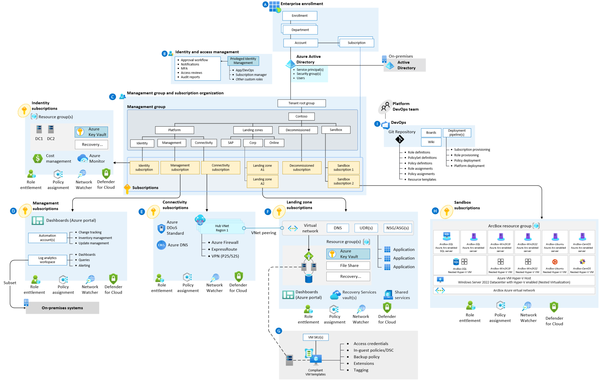

# Azure Arc-enabled servers enterprise-scale sandbox

Working with Azure Arc means that you are onboarding infrastructure assets that are located outside of Azure or deploying Azure services to any infrastructure, either on-premises or in a multi-cloud environment. 

Azure Arc-enabled servers enables you to manage your Windows and Linux physical servers and virtual machines hosted outside of Azure, on your corporate network, or other cloud providers. This management experience is designed to be consistent with how you manage native Azure virtual machines.

To quickly practice your skills with an Azure Arc-enabled servers environment, we created an automated, easy-to-deploy sandbox solution for all things Azure Arc named “ArcBox”, which is powered by the Azure Arc Jumpstart project. ArcBox is designed to be completely self-contained within a single Azure subscription and resource group, which will make it easy for a user to get hands-on with the Azure Arc-enabled servers technology with nothing more than an available Azure subscription.

## Enterprise-Scale landing zone sandbox subscription

The ArcBox solution is designed to run in your enterprise-scale sandbox subscription and will bootstrap all the required Azure resources, contained in a single resource group.

Once deployed, the resource group will contain five Azure Arc-enabled servers resources as well as a "unified operations" resource layer so you will be able to start integrating with Azure services and understand Azure Arc-enabled servers value proposition.

## Deployment options & prerequisites

The ArcBox solution can be deployed using one of the four methods:

- Azure Bicep using the Azure CLI
- Terraform using the Terraform CLI
- Azure Resource Manager (ARM) template using the Azure CLI
- Azure Resource Manager (ARM) template using the Azure portal

Depending on the desired deployment method, you are required to install either [Azure CLI](https://docs.microsoft.com/en-us/cli/azure/install-azure-cli) or [Terraform CLI](https://learn.hashicorp.com/tutorials/terraform/install-cli).

## Next steps

As mentioned, the Azure Arc-enabled servers enterprise-scale sandbox implementation is based on the fully automated Jumpstart ArcBox solution. For more information and guidance on how to get started, open the [Jumpstart ArcBox website page](https://azurearcjumpstart.io/azure_jumpstart_arcbox/).
