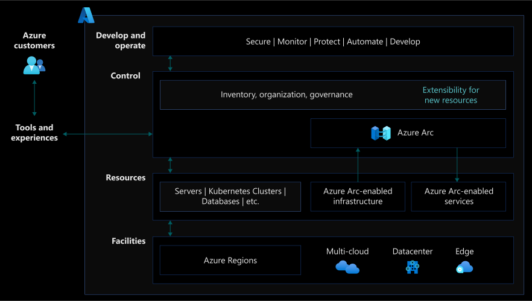

# Introduction to Enterprise Scale Landing Zone for hybrid and multicloud

Enterprises are currently building and running applications across various ecosystems that can be on-premises, in multiple public clouds, and on the edge. On these distributed environments, it is critical to ensure compliance and find an effective way to manage servers, applications, and data at scale, while maintaining agility.

[Enterprise Scale Landing Zone provides a specific architectural approach](../../ready/enterprise-scale/architecture.md), reference architecture, and reference implementations to help prepare your Landing Zones for mission-critical technology platforms and supported workloads.

Enterprise Scale was built with hybrid and multicloud in mind. Supporting hybrid and multicloud requires two simple additions to the reference architecture:

- Hybrid and multicloud connectivity: understand key network design considerations and recommendations when working with Azure Arc.
- Unified operations: include Azure Arc-enabled resources to extend governance and operations support with consistent tooling.

## Why hybrid?

As organizations look to adopt modern cloud services and the benefits they bring, there will be an inevitable period of parallel-running, alongside the legacy on-premises infrastructure.

As cloud services are further evaluated, or as business requirements dictate, organizations may choose to run more than one public cloud service.

A distributed heterogeneous estate requires simplified consolidated management and governance, in order to reduce the operational impact.

Landing Zone concepts introduced as part of the Cloud Adoption Framework guidance, can be used to establish patterns for building out hybrid architectures and introducing standards for connectivity, governance, and monitoring.

This is helpful when the strategic intent is to simplify and combine the infrastructure and services, following migration projects. Setting standards for management processes and tools, means workloads won't have to be retrofitted after moving into Azure.

## Prerequisite

Familiarity with Enterprise Scale Landing Zone is beneficial. For more information on this prerequisite, review the Enterprise Scale [overview](../../ready/enterprise-scale/index.md) and [implementation guidance](../../ready/enterprise-scale/implementation.md).

## Azure Arc

Azure provides organizations with various management tools that enable infrastructure and applications to be monitored and governed at scale. When implementing a hybrid Landing Zone, these Azure tools should be extended to control infrastructure and applications running outside of Azure.

This provides a single management plane and a single view on the entire hybrid estate, in order to make monitoring and management at scale, as straightforward as possible.

[Azure Arc](/azure/azure-arc/) simplifies governance and management by delivering a consistent multicloud and on-premises management platform. Azure Arc enables you to manage your entire environment, with a single pane of glass, by projecting your existing resources into [Azure Resource Manager](/azure/azure-resource-manager/management/overview).

You can now manage virtual machines, Kubernetes clusters, and databases as if they are running in Azure. Regardless of where they live, you can use familiar Azure services and management capabilities. Azure Arc enables you to continue using traditional ITOps, while introducing DevOps practices to support new cloud native patterns in your environment.

## Design guidelines

The design guidelines provide recommendations to the critical decisions that drive the design of the Cloud Adoption Framework for Azure Enterprise Scale Landing Zone, in a hybrid multicloud environment. There are seven critical design areas that need to be considered, as part of your Enterprise Scale Landing Zone implementation, when working with Azure Arc:

| CDA | Description |
|--|--|
| [Identity and access management](../scenarios/hybrid/eslz-identity-and-access-management.md) | Best practices for right access controls design to secure hybrid resources as they are centrally managed from Azure using Azure Arc. |
| [Network connectivity](../scenarios/hybrid/eslz-arc-servers-connectivity.md) | Design considerations when working with Azure Arc-enabled servers and how to securely connect them to your Enterprise Scale Landing Zone. |
| [Resource organization](../scenarios/hybrid/eslz-resource-organization.md) | Best practices for resource consistency and tagging strategy, that includes your hybrid and multicloud resources. |
| [Governance disciplines](../scenarios/hybrid/eslz-security-governance-and-compliance.md) | The [Cloud Adoption Framework's Enterprise Scale Landing Zone architecture](../ready/enterprise-scale/architecture.md) includes patterns for standardizing the deployment of [Azure Policy](/azure/governance/policy/overview) and [role-based access controls (RBAC)](../ready/azure-setup-guide/manage-access.md) through structured use of management groups to segment resources into logical groupings. These patterns can be extended using technologies such as Azure Arc. |
| [Management disciplines](../scenarios/hybrid/eslz-management-and-monitoring-arc-server.md) | Similar to governance techniques, Azure Management services can also be extended out to other environments, such as on-premises and other cloud platforms through Azure Arc. Enterprise Scale provides guidance on how operationally maintain Azure Arc-enabled servers on Azure enterprise estate, with centralized management and monitoring at the platform level. |
| [Platform automation](../scenarios/hybrid/eslz-automation-arc-server.md) | Azure Arc enables organizations to manage their digital state hosted outside of Azure with the same level of experience and automation as a native Azure resource. As part of your Enterprise Scale Landing Zone implementation you should plan for agent onboarding, lifecycle management, and expansion of the Azure control plane capabilities via Azure Arc with as much automation as possible. |
| [Cost governance](../scenarios/hybrid/eslz-cost-governance.md) | Keep track of ungoverned and unmonitored resources that prevent you from to increase accountability with budgets, cost allocation, and chargebacks. |
