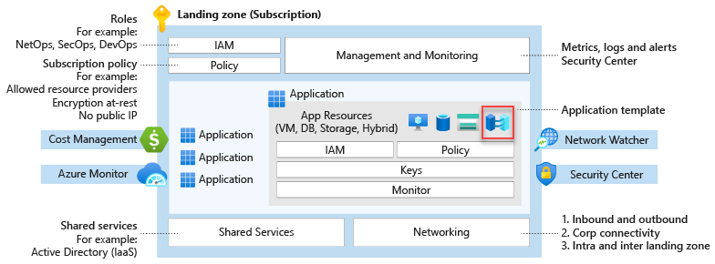
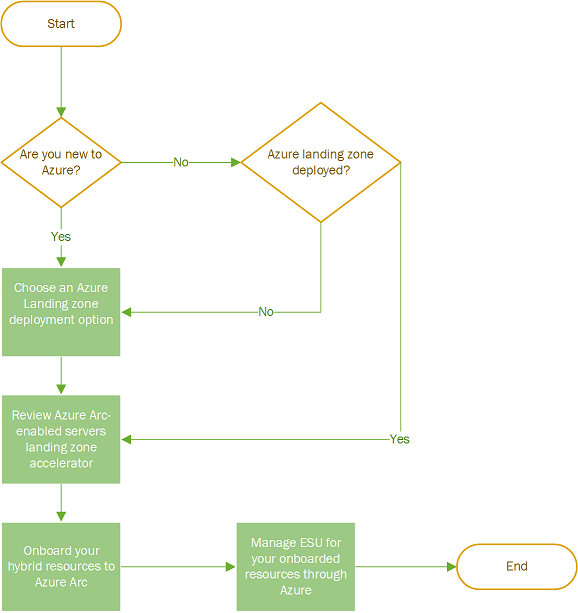

# Implement hybrid and multicloud adoption with Azure Arc and Azure landing zones

The Azure Arc landing zone accelerator enables organizations to implement scalable hybrid and multicloud architectures. Azure Arc projects and manages resources that reside outside Azure, such as on-premises servers, Kubernetes clusters, and multicloud services, into the Azure control plane. The hybrid and multicloud approach provides unified governance, security, and operations across distributed environments.

The guidance in this article helps you integrate Azure Arc resources into your Azure landing zones. The integration defines how to treat these external resources as first-class citizens in Azure, and the approach ensures consistent management and compliance across all environments.

## Build a foundational Azure environment to support hybrid and multicloud operations

A well-structured Azure environment is essential for governance and management of hybrid and multicloud resources. Azure landing zones provide the foundation needed for effective resource management.

1. **Deploy Azure landing zones to support hybrid and multicloud scenarios.** Azure landing zones establish a scalable and secure foundation for your environment. These landing zones include design areas such as identity, network topology, resource organization, and governance. Select a landing zone architecture that aligns with your organization's cloud strategy, whether the strategy is hybrid-first, cloud-first, or multicloud-first. The alignment ensures that your environment scales appropriately as your organization grows.

2. **Design network architectures for hybrid and multicloud connectivity.** Network architectures must support secure and reliable connectivity between Azure and external environments. Consider VPNs, ExpressRoute, and private endpoints to integrate on-premises and multicloud resources with Azure. The network design provides the foundation for secure data transfer and consistent performance across all environments.

3. **Extend governance and operations using Azure Arc.** Azure Arc onboards external resources into Azure Resource Manager (ARM) to enable centralized management. Azure Arc enables centralized policy enforcement, monitoring, and automation using native Azure tools such as Azure Policy, Azure Monitor, and Microsoft Defender for Cloud. The centralized approach reduces operational complexity and ensures consistent governance across all environments.

## Integrate Azure Arc with your application landing zones

Azure Arc resources integrate into any application architecture to provide unified management across environments. Common examples include Azure Arc-enabled servers, VMware vSphere, System Center Virtual Machine Manager, customer-managed Kubernetes clusters, and Azure Arc-enabled data services.

1. **Project on-premises IT assets into Azure using Azure Arc-enabled servers, VMware vSphere, and System Center Virtual Machine Manager.** These Azure Arc services project on-premises IT assets into the Azure control plane. The projection enables centralized management of on-premises infrastructure alongside Azure resources.

2. **Operate customer-managed Kubernetes clusters across multicloud environments with centralized control.** Customer-managed Kubernetes clusters operate across multicloud environments with centralized control through Azure Arc. The centralized approach simplifies cluster management and ensures consistent policy enforcement across all environments.

3. **Extend Azure capabilities to edge locations using Azure Arc-enabled data, application, and machine learning services.** Azure Arc-enabled services extend Azure capabilities to edge locations where data sovereignty or latency requirements exist. The extension provides consistent Azure experiences regardless of physical location.

Application landing zone subscriptions include both native Azure resources and Azure Arc-enabled resources. Azure Arc resources reside outside Azure and appear as metadata resources within the Azure platform. Treat Azure Arc resources like any other Azure resource in your landing zone (whether platform or application) aligned with [subscription democratization and application-centric, archetype-neutral principles](../../ready/landing-zone/design-principles.md).

## Implement common patterns for Azure Arc resources in Azure landing zones

The following examples demonstrate how to project Azure Arc resources as metadata resources in Azure landing zones. Each pattern addresses specific organizational needs while maintaining consistent governance.

### Example one: Project domain controllers outside of Azure

Active Directory Domain Services (AD DS) deployments exist within most customer environments. Domain controllers are critical components of AD DS and the overall architecture that organizations rely on for identity services.

The Azure landing zone conceptual architecture includes a dedicated identity landing zone subscription designed to host identity-based resources. You can host identity resources in Azure using AD DS domain controller (DC) virtual machines (VMs), or you can project identity resources into Azure from any other location via Azure Arc-enabled servers. The flexibility allows organizations to maintain their existing identity infrastructure while gaining centralized management capabilities.

### Example two: Project on-premises datacenters into Azure

On-premises datacenters remain present in most customer environments. The footprints of datacenters vary from single servers to large virtualized environments that require comprehensive management.

Organizations can treat their on-premises datacenters as normal landing zones and place datacenter resources into new or existing landing zones based on organizational needs. Common approaches include:

- Project resources into dedicated landing zone subscriptions for on-premises datacenter resources. In larger environments with multiple datacenters across the globe, organizations establish one landing zone per geopolitical region. These regional landing zones contain the resources from each region to provide logical separation of on-premises datacenters within Azure. The regional approach assists with security, governance, and compliance requirements for different on-premises datacenters.
- Project resources into separate landing zone subscriptions based on other Azure resources that support the same application or service. The application-centric approach ensures that all components of an application are managed together regardless of their physical location.

### Example three: Project remote application resources into Azure

Organizations develop latency-sensitive applications or applications with data sovereignty requirements. These applications require resources to be hosted outside of Azure while maintaining centralized control, governance, security, and operations for all application components. Azure Arc enables organizations to achieve centralized management for distributed applications.

Organizations should project the Azure Arc resources for their applications into the same application landing zone subscription that hosts their Azure resources. Organizations can then apply one set of controls to all resources from a single control plane regardless of where the resources are physically located. The unified approach simplifies operations and ensures consistent governance across all application components.

### Example four: Project on-premises servers that reached end of support into Azure to use Extended Security Updates delivered through Azure Arc

Windows Server versions reach end of support, and organizations cannot always meet end-of-support deadlines while servers need to remain on-premises. Organizations can purchase [Extended Security Updates](/windows-server/get-started/extended-security-updates-overview) enabled by [Azure Arc](https://azure.microsoft.com/products/azure-arc/) to maintain security support for these servers.

If organizations deploy Azure Landing Zones or already have Azure Landing Zones deployed, organizations can treat their on-premises datacenters as normal landing zones and place datacenter resources into new or existing landing zones based on their needs. Common approaches include:

- Project resources into dedicated landing zone subscriptions for on-premises datacenter resources. In larger environments with multiple datacenters across the globe, organizations establish one landing zone per geopolitical region. These regional landing zones contain the resources from each region to provide logical separation of on-premises datacenters within Azure. The regional approach assists with security, governance, and compliance requirements for different on-premises datacenters.
- Project resources into separate landing zone subscriptions based on other Azure resources that support the same application or service.
- Organizations should review the Azure Arc-enabled Servers landing zone accelerator guidance to understand design considerations and recommendations across critical design areas.

If organizations do not have Azure Landing Zones or are not planning to deploy Azure Landing Zones:

- Organizations should review the Azure Arc-enabled Servers landing zone accelerator guidance to understand design considerations and recommendations across critical design areas.

## Explore additional resources for hybrid and multicloud journeys

Additional resources provide comprehensive guidance for hybrid and multicloud implementations with Azure Arc.

- Review the [Introduction to Azure Arc-enabled servers landing zone accelerator for hybrid and multicloud](./enterprise-scale-landing-zone.md).

- Learn how to [Deploy Azure Arc sandbox to accelerate adoption of hybrid or multicloud architectures](./arc-enabled-servers/enterprise-scale-landing-zone-sandbox.md).