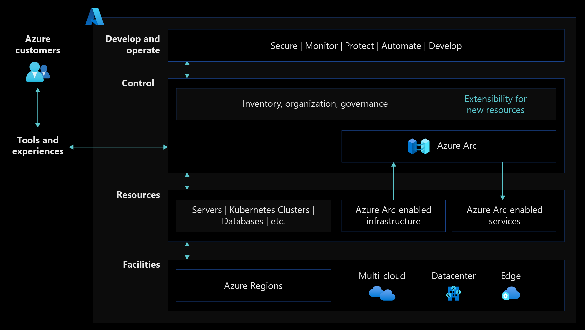

# Introduction to Azure Arc landing zone accelerator for hybrid and multicloud

Enterprises are currently building and running applications across various ecosystems on-premises, in multiple public clouds, and on the edge. When you're working in these distributed environments, it's critical that you find a way to ensure compliance and manage servers, applications, and data at scale while you still maintain agility.

[Enterprise-scale landing zone](/azure/cloud-adoption-framework/ready/landing-zone/) provides a specific architectural approach, reference architecture, and set of reference implementations that help you prepare your landing zones for mission-critical technology platforms and supported workloads.

Enterprise-scale was designed with hybrid and multicloud in mind. To support hybrid and multicloud, the reference architecture requires two simple additions:

- **Hybrid and multicloud connectivity:** Understand key network design considerations and recommendations for working with Azure Arc.
- **Unified operations:** Include Azure Arc-enabled resources to extend your governance and operations support with consistent tooling.

## Why hybrid?

As organizations adopt modern cloud services and their associated benefits, periods of parallel-running alongside the legacy on-premises infrastructure are inevitable. As your organization further evaluates cloud services, or as business requirements dictate, your organization might choose to run more than one public cloud service. Operating a distributed heterogeneous estate requires simplified, consolidated management and governance.

You can use landing zone concepts introduced as part of the Cloud Adoption Framework guidance to establish patterns for building out hybrid architectures and introducing standards for connectivity, governance, and monitoring. These concepts help when your strategic intent is to simplify and combine your infrastructure and services following migration projects. Setting standards for management processes and tools removes any need to retrofit workloads after you move them into Azure.

## Prerequisites

It benefits you to be familiar with the enterprise-scale landing zone. For more information, see the enterprise-scale [overview](../../ready/enterprise-scale/index.md) and enterprise-scale [implementation guidance](../../ready/enterprise-scale/implementation.md).

## Azure Arc

Azure provides various management tools to help you monitor and govern infrastructure and applications at scale. When you implement a hybrid landing zone, you should also extend these Azure tools to control infrastructure and applications running outside of Azure. This creates a single management plane and single view of your entire hybrid estate, which makes monitoring and management at scale as straightforward as possible.

[Azure Arc](/azure/azure-arc/) simplifies governance and management by providing a consistent multicloud and on-premises management platform. Azure Arc lets you manage your entire environment with a single pane of glass by projecting your existing resources into [Azure Resource Manager](/azure/azure-resource-manager/management/overview).

You can now manage virtual machines, Kubernetes clusters, and databases as if they're running in Azure. Regardless of where they live, you can use familiar Azure services and management capabilities. Azure Arc enables you to continue using traditional ITOps, while introducing DevOps practices to support new cloud native patterns in your environment.

## Azure Arc-enabled servers design guidelines

The following design guidelines provide recommendations for critical decisions that drive the design of the Cloud Adoption Framework for Azure enterprise-scale landing zone in a hybrid multicloud environment. There are seven critical design areas you have to consider when working with Azure Arc:

| CDA | Description |
|--|--|
| [Identity and access management](./arc-enabled-servers/eslz-identity-and-access-management.md) | Best practices for access control design to secure your hybrid resources as you use Azure Arc to centrally manage them. |
| [Network topology and connectivity](./arc-enabled-servers/eslz-arc-servers-connectivity.md) | Design considerations for working with Azure Arc-enabled servers, and information explaining how you can securely connect them to your enterprise-scale landing zone. |
| [Resource organization](./arc-enabled-servers/eslz-resource-organization.md) | Best practices for resource consistency and tagging strategy, including for your hybrid and multicloud resources. |
| [Governance and security disciplines](./arc-enabled-servers/eslz-security-governance-and-compliance.md) | The [Cloud Adoption Framework's enterprise-scale landing zone architecture](/azure/cloud-adoption-framework/ready/landing-zone/) includes patterns for standardizing your deployment of [Azure Policy](/azure/governance/policy/overview) and [role-based access control (RBAC)](../../ready/azure-setup-guide/manage-access.md) through structured use of management groups that segment resources into logical groupings. You can extend these patterns with technologies like Azure Arc. |
| [Management disciplines](./arc-enabled-servers/eslz-management-and-monitoring-arc-server.md) |You can use Azure Arc to extend Azure management services out to other environments like on-premises and other cloud platforms. Enterprise-scale provides guidance for operationally maintaining Azure Arc-enabled servers on Azure enterprise estate with centralized management and monitoring at the platform level. |
| [Cost governance](./arc-enabled-servers/eslz-cost-governance.md) | You can use budgets, cost allocation, and chargebacks to keep track of ungoverned and unmonitored resources preventing you from increasing financial accountability. |
| [Automation disciplines](./arc-enabled-servers/eslz-automation-arc-server.md) | Azure Arc helps you manage your digital state hosted outside of Azure using the same level of experience and automation you'd have for a native Azure resource.  Plan for using automation as much as possible for agent onboarding, lifecycle management, and expansion of your Azure control plane capabilities through Azure Arc. |

## Azure Arc-enabled Kubernetes design guidelines

The following design guidelines provide recommendations for critical decisions that drive the design of the Cloud Adoption Framework for Azure landing zone in a hybrid multicloud environment. There are seven critical design areas you have to consider when working with Azure Arc-enabled Kubernetes:

| CDA | Description |
|--|--|
| [Identity and access management](./arc-enabled-kubernetes/eslz-arc-kubernetes-identity-access-management.md) | Best practices for access control design, allowing you to secure hybrid Kubernetes cluster resources as you centrally manage them from Azure using Azure Arc-enabled Kubernetes. |
| [Network topology and connectivity](./arc-enabled-kubernetes/eslz-arc-kubernetes-network-connectivity.md) | Design considerations for when you work with Azure Arc-enabled Kubernetes, plus guidance on how to securely connect it to your Azure landing zone. |
| [Resource organization](./arc-enabled-kubernetes/eslz-arc-kubernetes-resource-organization.md) | Best practices for resource consistency and tagging strategy, including for your hybrid and multicloud Azure Arc-enabled Kubernetes cluster resources. |
| [Governance and security disciplines](./arc-enabled-kubernetes/eslz-arc-kubernetes-governance-disciplines.md) | The [Cloud Adoption Framework's Azure landing zone architecture](/azure/cloud-adoption-framework/ready/landing-zone/) includes patterns for standardizing your deployment of [Azure Policy](/azure/governance/policy/overview) and [role-based access control (RBAC)](../../ready/azure-setup-guide/manage-access.md) through structured use of management groups, which lets you segment resources into logical groupings. You can extend these patterns with technologies like Azure Arc-enabled Kubernetes. |
| [Management disciplines](./arc-enabled-kubernetes/eslz-arc-kubernetes-management-disciplines.md) | Similar to governance techniques, you can use Azure Arc to extend Azure management services out to other environments like on-premises and other cloud platforms. The Azure landing zone provides guidance for operationally maintaining and operating Azure Arc-enabled Kubernetes cluster resources in Azure enterprise estate with centralized management and monitoring at the platform level. |
| [Cost governance](./arc-enabled-kubernetes/eslz-arc-kubernetes-cost-governance.md) | Ungoverned and unmonitored resources prevent you from increasing accountability. Keep track of these resources by using budgets, cost allocation, and chargebacks for Azure Arc-enabled Kubernetes cluster resources. |
| [Automation disciplines](./arc-enabled-kubernetes/eslz-arc-kubernetes-automation-disciplines.md) | Azure Arc lets your organization manage your digital state hosted outside of Azure with the same level of experience and automation as any native Azure resource. As part of your Azure landing zone implementation, use as much automation as possible to plan cluster onboarding, agent and extensions lifecycle automation, and Azure control plane capability expansion for Azure Arc-enabled Kubernetes cluster resources. |
| [Extensions management](./arc-enabled-kubernetes/eslz-arc-kubernetes-extensions-management.md) | Best practices for managing Azure Arc-enabled Kubernetes cluster extensions, which let you expand Azure control plane capabilities for Azure Arc-enabled Kubernetes resources. |
| [CI/CD and GitOps disciplines disciplines](./arc-enabled-kubernetes/eslz-arc-kubernetes-cicd-gitops-disciplines.md) | Because it's a cloud-native construct, Kubernetes requires a cloud-native approach to deployment and operations. Learn key CI/CD and GitOps disciplines for your hybrid and multicloud environment with Azure Arc-enabled Kubernetes cluster resources. |
| [Services observability](./arc-enabled-kubernetes/eslz-arc-kubernetes-services-observability.md) | Service observability allows you to understand performance and issues that occur in distributed and cloud systems based on dynamic architectures. Learn how to design services observability patterns in hybrid and multicloud environments with Azure Arc-enabled Kubernetes cluster resources. |
