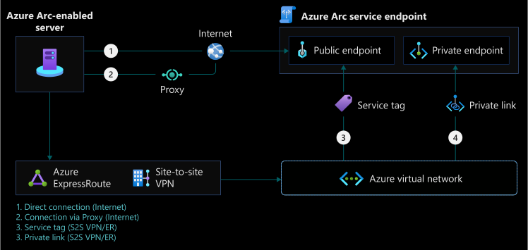
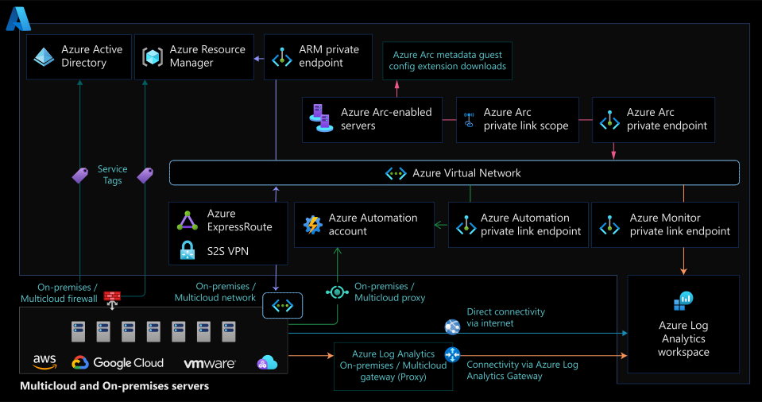

# Network connectivity for Azure Arc-enabled servers

Azure Arc-enabled servers allow you to manage your Windows and Linux physical servers and virtual machines, hosted either in your on-premises environment or by a third-party cloud provider using the Azure control plane. This document walks you through the key design considerations and best practices for Azure Arc-enabled servers connectivity as part of a Cloud Adoption Framework Enterprise Scale landing zone guidance.

This article assumes that Enterprise Scale Landing Zone has been successfully implemented, therefore hybrid network connections have been established and will focus on the Azure Arc-enabled servers Connected Machine agent connectivity. For more information on this prerequisite, review the [Enterprise Scale overview](../../ready/enterprise-scale/index.md) and the [implementation guidance](../../ready/enterprise-scale/implementation.md).

## Architecture

The following diagram shows a conceptual reference architecture for the connectivity of Azure Arc-enabled servers:

## Design considerations

The following list gives an overview of network design considerations for Azure Arc-enabled servers:

- **Define the agent's connectivity method:** Review your existing infrastructure, security requirements, and decide how the Connected Machine agent will [communicate with Azure](/azure/azure-arc/servers/agent-overview#networking-configuration) from your on-premises network or other cloud providers. This connection can go directly over the internet, through a proxy server, or you can implement [Private Link](/azure/azure-arc/servers/private-link-security) for a private connection.
- **Manage Access to Azure Service Tags:** Create an automated process to keep the firewall and proxy network rules updated according to the [Azure Arc network service Tags and IP addresses range](https://www.microsoft.com/en-us/download/details.aspx?id=56519).
- **Secure your network connectivity to Azure Arc:** configure the machine to use Transport Layer Security (TLS) version 1.2. Older versions are not recommended due to known vulnerabilities.
- **Define extensions connectivity method:** Azure extensions deployed on an Azure Arc-enabled server also need to communicate with other Azure Services. This connectivity can go directly using public networks, through a firewall, or through a proxy server. To further secure the extension connectivity, you can implement [Private Endpoints](/azure/azure-arc/servers/private-link-security#how-it-works) for each extension.
- **Review your overall connectivity architecture:** Review the [Network topology and connectivity design area](/azure/cloud-adoption-framework/ready/enterprise-scale/network-topology-and-connectivity) of Azure Landing Zone Enterprise Scale to assess the impact of Arc-enabled servers on your overall connectivity.

## Design recommendations

### Define Azure Arc agent's connectivity method

Azure Arc-enabled servers allows you to connect hybrid machines using the following methods:

- Direct connection, optionally from behind a firewall or a proxy server
- Azure Private Link

#### Direct Connection

Azure Arc-enabled servers offer a [direct connectivity to Azure public endpoints](/azure/azure-arc/servers/agent-overview#networking-configuration). With this connectivity method, all machine agents will open a connection via the internet using a public endpoint. The Connected Machine agent for Linux and Windows communicates outbound to Azure in a secure manner using the HTTPS protocol (TCP/443).

For using the direct connection method you need to review your internet access for the Connected Machine agent. It is a recommended practice to configure the [required network rules](/azure/azure-arc/servers/agent-overview#networking-configuration).

#### Proxy server or Firewall connection (Optional)

If the machine uses a firewall or a proxy server to communicate over the internet, the agent connects outbound using the HTTP protocol.

If outbound connectivity is restricted by your firewall or a proxy server, make sure the [Azure Arc network service Tags and IP addresses range](/azure/azure-arc/servers/agent-overview#networking-configuration) are not blocked by those devices. When you only allow the required IP ranges or domain names for the agent to communicate with the service, use [Service Tags and URLs](https://www.microsoft.com/en-us/download/details.aspx?id=56519) to configure your firewall or proxy server.

Be aware that if you deploy extensions on your Azure Arc-enabled servers every extension has its own endpoint and all corresponding URLs must also be allowed in the firewall or proxy. Adding these endpoints will ensure granular secured network traffic to meet principle of least privilege (PoLP).

#### Private Link

Azure Arc-enabled servers allow you to deploy VM extensions to centrally manage your servers from Azure. These extensions connect to other resources such as Log Analytics Workspaces, Automation Accounts, Key Vault or Azure Storage. You can use Azure Private Link to make this connection private without opening any public network access, all of the data is kept private preventing data exfiltration. The traffic between Azure Arc-enabled servers and Azure Services will go through a Site-to-Site VPN tunnel or an Express Route with Private Peering.

This connection method has specific [restrictions and limitations](/azure/azure-arc/servers/private-link-security#restrictions-and-limitations) you should get familiar with. When you enable any of Arc-enabled servers extensions, those extensions connect to specific Azure services that have their own requirements for configuring Private Link support.

>[!TIP]
>Review [Azure Private Link security](/azure/azure-arc/servers/private-link-security#how-it-works) for more information.

### Manage Access to Azure Service Tags

It is a recommended practice to implement an automated process for keeping the firewall and proxy network rules updated according to the [Azure Arc network service Tags and IP addresses range](https://www.microsoft.com/en-us/download/details.aspx?id=56519).

### Secure your network connectivity to Azure Arc

It is recommended to use [Transport Layer Security 1.2 protocol](/azure/azure-arc/servers/agent-overview#transport-layer-security-12-protocol) to ensure the security of data in transit to Azure. Older versions of TLS/Secure Sockets Layer (SSL) were found to be vulnerable and they are not recommended.

### Define extensions connectivity method

When you enable any of the Azure Arc-enabled servers supported VM extensions, those extensions connect to other Azure services. It is important to determine the connectivity method for those extensions: either directly, behind a proxy server/firewall or using Azure Private Link.

If your Azure Arc enabled-servers use a proxy or a firewall, all URLs required for the extensions must also be allowed, as they will communicate with their own endpoints.

If Private Link is being used, it requires configuring [Private Link for each service](/azure/azure-arc/servers/private-link-security#how-it-works).

## Next Steps

For more guidance for your hybrid cloud adoption journey, please review the following:

- Review [Azure Arc Jumpstart](https://azurearcjumpstart.io/azure_arc_jumpstart/azure_arc_servers/day2/) scenarios
- Review the [prerequisites](/azure/azure-arc/servers/agent-overview#prerequisites) for Azure Arc-enabled servers
- Review the required [network configuration](/azure/azure-arc/servers/private-link-security#network-configuration) for the Private Link connectivity method
- Understand how Azure Arc-enabled servers [Private Link](/azure/azure-arc/servers/private-link-security#how-it-works) works
- Plan an [at-scale deployment](/azure/azure-arc/servers/plan-at-scale-deployment) of Azure Arc-enable servers
- Plan your [Private Link setup](/azure/azure-arc/servers/private-link-security#planning-your-private-link-setup)
- For solving any connectivity issues, review the Troubleshooting Azure Arc-enabled servers agent connection [guide](/azure/azure-arc/servers/troubleshoot-agent-onboard).
