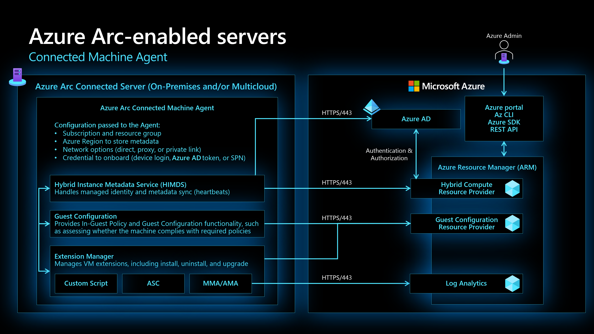
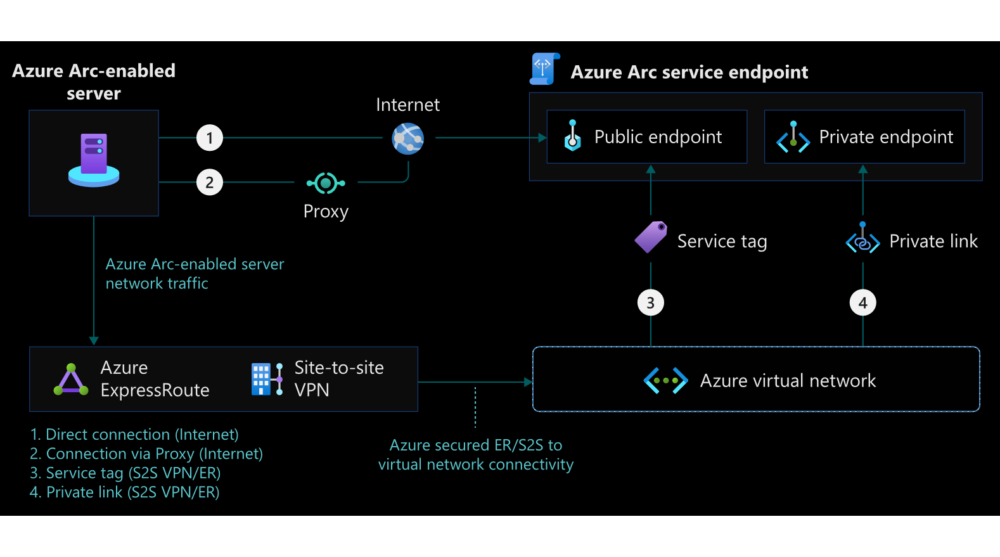
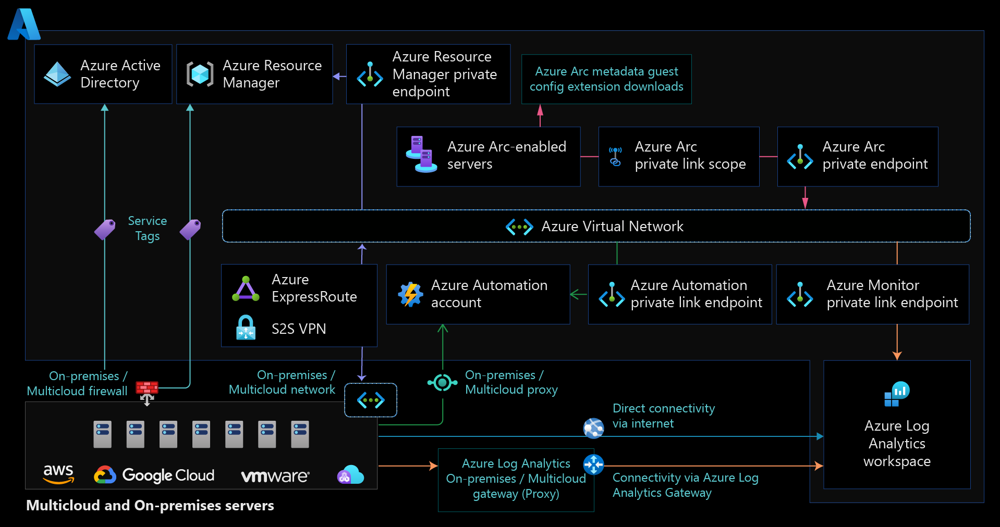

# Network Connectivity for Azure Arc-enabled servers enterprise-scale scenario

Azure Arc-enabled servers allows you to manage your Windows and Linux physical servers and virtual machines hosted outside of Azure, on your corporate network, or other cloud provider using the Azure control plane. This document is written to help you quickly understand key network design considerations and recommendations when working with Azure Arc-enabled servers, and provides links to related documents for in-depth understanding.

## Design considerations

The following are some network design considerations for Azure Arc-enabled servers for Azure:

* Define the connectivity method. Your servers can [connect](/azure/azure-arc/servers/agent-overview#networking-configuration) from your on-premises network or other cloud environment to Azure directly, via a proxy server or [Private Link Scope](/azure/azure-arc/servers/private-link-security).
* For [directly connected (public endpoints)](/azure/azure-arc/servers/onboard-powershell#install-the-agent-and-connect-to-azure) you need to review your internet access for the Connected Machine Agent.
* If the connection from the Azure Arc-enabled server Connect Machine agent to the Azure Arc public endpoints traverses a proxy server [the same URLs](/azure/azure-arc/servers/agent-overview#networking-configuration) need to be allowed for the connection to be successful.
* Consider creating an automated process to keep the firewall and proxy network rules updated according to the [Azure Arc network service Tags and IP addresses range](https://www.microsoft.com/en-us/download/details.aspx?id=56519).
* Considering that the traffic to Azure Arc is already encrypted, the use of a Proxy server doesn't make the Connected Machine agent more secure.
* To further secure your network connectivity to Azure Arc, instead of using public networks and proxy servers, you can implement an Azure Arc Private Link. The Private Endpoint on your VNet allows it to reach Azure Arc-enabled servers endpoints through private IPs from your network's pool, instead of using the public IPs of these endpoints.
* Define extensions connectivity method.  Extensions could also direct communicate using public networks through a firewall or proxy server. To further secure the extension connectivity you can implement a [Private Endpoint](/azure/azure-arc/servers/private-link-security#how-it-works) for each extension.

## Design recommendations

* Use [Transport Layer Security 1.2 protocol](/azure/azure-arc/servers/agent-overview#transport-layer-security-12-protocol) to ensure the security of data in transit to Azure as older versions of TLS/Secure Sockets Layer (SSL) have been found to be vulnerable and while they still currently work to allow backwards compatibility, they are not recommended.
* Familiarize yourself with Connected Machine Agent components and the inter connection with other resources in Azure.

* For the Direct Connection method configure the [required network rules](/azure/azure-arc/servers/agent-overview#networking-configuration).
* [Understand how Azure Arc-enabled servers private link works](/azure/azure-arc/servers/private-link-security#how-it-works)
* [Plan your Private Link setup](/azure/azure-arc/servers/private-link-security#planning-your-private-link-setup)
* [Review the required network configuration for the Private Link connectivity method](/azure/azure-arc/servers/private-link-security#network-configuration)
* [Familiarize yourself with the available troubleshooting Azure Arc-enabled servers agent connection issues](/azure/azure-arc/servers/troubleshoot-agent-onboard)

### Azure Arc-enabled servers connectivity options

Azure Arc-enabled servers allows you to connect hybrid machines using the following methods:

* Direct connection, using internet public endpoint.
* Proxy server connection.
* Private Link, using Site-to-Site VPN or ExpressRoute to a private endpoint.

### Direct connection

Azure Arc-enabled servers offer direct connectivity to Azure public endpoints. In this connectivity method, all the machine agents will open a connection via the internet using public endpoint.

* [Direct connection network configuration](/azure/azure-arc/servers/agent-overview#networking-configuration)

### Proxy connection

The Connected Machine agent for Linux and Windows communicates outbound securely to Azure Arc over TCP port 443. If the machine needs to connect through a firewall or proxy server to communicate over the internet, the agent communicates outbound instead using the HTTP protocol. Proxy servers don't make the Connected Machine agent more secure because the traffic is already encrypted.

If outbound connectivity is restricted by your firewall or proxy server, make sure the URLs listed below are not blocked. When you only allow the IP ranges or domain names required for the agent to communicate with the service, you need to allow access to the Service Tags and URLs listed in the link bellow:

Azure Arc-enabled servers Connected Machine agents and deployed extensions supports Proxy connection.

Note: Every extension has its own endpoint and all corresponding URLs must be allowed in the firewall or proxy.

It's recommended to have a process to keep all required endpoints updated for any firewall or proxy rules. The updated version of all Azure IP Ranges and Service Tags can be downloaded in the link bellow:

[Azure Arc network service Tags and IP addresses range](https://www.microsoft.com/en-us/download/details.aspx?id=56519).

### Private Link

Azure Private Link allows you to securely link Azure PaaS services to your virtual network using private endpoints. For many services, you just set up an endpoint per resource. This means you can connect your on-premises or multi-cloud servers with Azure Arc and send all traffic over an Azure ExpressRoute or site-to-site VPN connection instead of using public networks.

Connectivity to any other Azure resource from an Azure Arc-enabled server requires configuring Private Link for each service, which is optional, but recommended. Azure Private Link requires separate configuration per service. Including and not limited to these extensions such as Azure Automation, Azure Monitor, Azure Key Vault, or Azure Blob storage.

This method has some restrictions and limitations which are described in the link bellow:

[Restrictions and limitations](/azure/azure-arc/servers/private-link-security#restrictions-and-limitations)

## Additional recommendations

When you enable any one of the Azure Arc-enabled servers supported VM extensions, those extensions connect other Azure resources witch require configuring Private Link for each service. [For more information](/azure/azure-arc/servers/private-link-security#how-it-works).
