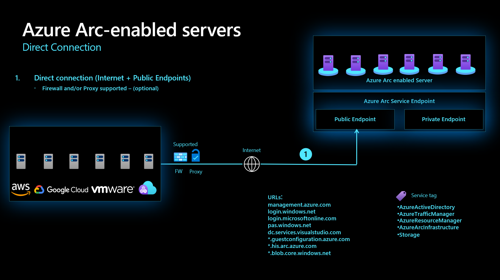

# Azure Arc-enabled servers Network Connectivity overview

Azure Arc-enabled servers allow you to manage your Windows and Linux physical servers and virtual machines, on your corporate network, or other cloud provider using the Azure control plane. This document walks through the key design considerations and best practices for Azure Arc-enabled servers connectivity as part of a Cloud Adoption Framework Enterprise Scale landing zone implementation.

This article assumes that Enterprise Scale Landing Zone has been successfully implemented, therefore hybrid network connections have been established and will focus on the Azure Arc-enabled servers Connected Machine agent connectivity. For more information on this prerequisite, review the [Enterprise Scale overview](../../ready/enterprise-scale/index.md) and [implementation guidance](../../ready/enterprise-scale/implementation.md).

## Architecture

The following diagram shows a conceptual reference architecture for the connectivity of Azure Arc-enabled servers:

## Design considerations

The following are some network design considerations for Azure Arc-enabled servers:

- **Define the agent's connectivity method:** review your existing infrastructure, security requirements and decide how the Connected Machine agent will [communicate to Azure](/azure/azure-arc/servers/agent-overview#networking-configuration) from your on-premises network or other cloud environment. This connection can be over the internet, optionally through a proxy server or you can implement [Private Link](/azure/azure-arc/servers/private-link-security) for a private connection.
- **Manage Access to Azure Service Tags:** create an automated process to keep the firewall and proxy network rules updated according to the [Azure Arc network service Tags and IP addresses range](https://www.microsoft.com/en-us/download/details.aspx?id=56519).
- **Secure your network connectivity to Azure Arc:** configure the machine to use Transport security (TLS) 1.2 older versions are not recommended as data in transit might be vulnerable.
- **Define extensions connectivity method:** Azure extensions deployed on an Azure Arc-enabled server also need to communicate with other Azure Services, this connectivity can be direct using public networks or through a firewall or proxy server. To further secure the extension connectivity you can implement a [Private Endpoint](/azure/azure-arc/servers/private-link-security#how-it-works) for each extension.

## Design recommendations

### Define the agent's connectivity method

Azure Arc-enabled servers allows you to connect hybrid machines using the following methods:

- Direct connection, optionally behind a firewall or proxy server.
- Private Link.

#### Direct Connection

Azure Arc-enabled servers offers [direct connectivity to Azure public endpoints](/azure/azure-arc/servers/agent-overview#networking-configuration). In this connectivity method, all the machine agents will open a connection via the internet using a public endpoint. The Connected Machine agent for Linux and Windows communicates outbound securely to Azure over TCP port 443 using HTTPS protocol.

For direct connections you need to review your internet access for the Connected Machine Agent and it is best practice to configure the [required network rules](/azure/azure-arc/servers/agent-overview#networking-configuration).

#### Proxy server or Firewall connection (Optional)

If the machine uses a firewall or a proxy server to communicate over the internet, the agent connects outbound  using the HTTP protocol.

If outbound connectivity is restricted by your firewall or proxy server, make sure the [Azure Arc network service Tags and IP addresses range](/azure/azure-arc/servers/agent-overview#networking-configuration) are not blocked. When you only allow the required IP ranges or domain names for the agent to communicate with the service, use [Service Tags and URLs](https://www.microsoft.com/en-us/download/details.aspx?id=56519) to configure your firewall or proxy server.

Be aware that if you deploy extensions on your Azure Arc-enabled servers every extension has its own endpoint and all corresponding URLs must also be allowed in the firewall or proxy.

#### Private Link

Azure Arc-enabled servers allow you to deploy VM extensions to centrally manage your servers from Azure, these extensions connect to other resources such as Log Analytics Workspaces, Automation Accounts, Key Vault or Azure Storage. You can use Azure Private Link to make this connection private without opening any public network access, all of the data is kept private preventing data exfiltration. The traffic between  Azure Arc-enabled servers and Azure Services will go through your VPN connection or Express Route and will be kept inside the Microsoft Azure backbone network.

Review this method's [restrictions and limitations](/azure/azure-arc/servers/private-link-security#restrictions-and-limitations) and consider that when you enable any one of the Azure Arc-enabled servers supported VM extensions, those extensions connect other Azure resources which require configuring Private Link for each service. Review [Azure Private Link security](/azure/azure-arc/servers/private-link-security#how-it-works) for more information.

### Manage Access to Azure Service Tags

It is a best practice to implement an automated process to keep the firewall and proxy network rules updated according to the [Azure Arc network service Tags and IP addresses range.](https://www.microsoft.com/en-us/download/details.aspx?id=56519)

### Secure your network connectivity to Azure Arc

It is recommended to use [Transport Layer Security 1.2 protocol](/azure/azure-arc/servers/agent-overview#transport-layer-security-12-protocol) to ensure the security of data in transit to Azure as older versions of TLS/Secure Sockets Layer (SSL) have been found to be vulnerable and they are not recommended.

### Define extensions connectivity method

When you enable any of the Azure Arc-enabled servers supported VM extensions, those extensions connect to other Azure resources. It is important to define a connectivity method for those extensions either directly, behind a proxy server/firewall or using Private Link.

If your Azure Arc enabled-servers use a proxy or firewall all the corresponding URLs for the extension must also be allowed as it will communicate with its own endpoint.

If Private Link is used it requires configuring [Private Link for each service](/azure/azure-arc/servers/private-link-security#how-it-works).

## Next Steps

- [Understand how Azure Arc-enabled servers Private Link works](/azure/azure-arc/servers/private-link-security#how-it-works)
- [Plan your Private Link setup](/azure/azure-arc/servers/private-link-security#planning-your-private-link-setup)
- [Review the required network configuration for the Private Link connectivity method](/azure/azure-arc/servers/private-link-security#network-configuration)
- [Familiarize yourself with the available troubleshooting Azure Arc-enabled servers agent connection issues](/azure/azure-arc/servers/troubleshoot-agent-onboard)
