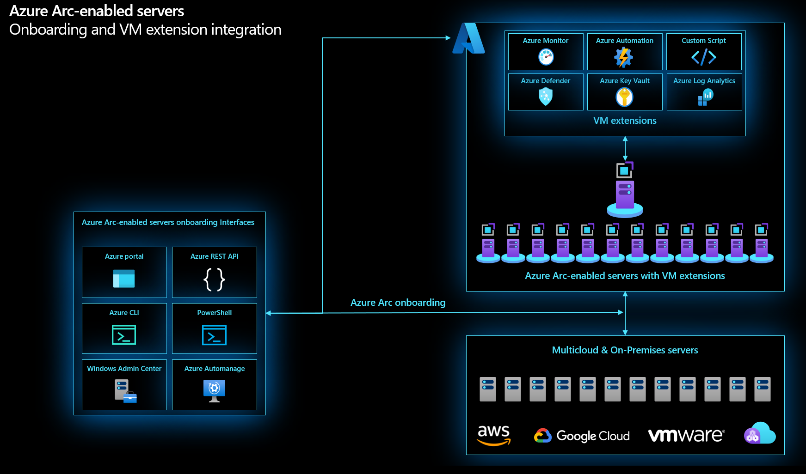

# Automation for Azure Arc-enabled Servers Enterprise-Scale Scenario

Azure Arc-enabled servers enable you to manage your Windows and Linux servers and virtual machines hosted outside of Azure, on your corporate network, or another cloud provider. This document is written to help plan for the automation of onboarding, update management, and expanding the capabilities of Azure Arc-enabled servers through VM extensions. The article presents key recommendations for operations teams to onboard and automate Azure Arc-enabled servers throughout their lifecycle.

 

 

## Plan for Automation

### Design considerations

The following are some design considerations before onboarding Azure Arc-enabled servers to Azure:

* Your machines run a [supported operating system](https://docs.microsoft.com/en-us/azure/azure-arc/servers/agent-overview#supported-operating-systems) for the Azure Connected Machine agent.
* Your machines have the [required software](https://docs.microsoft.com/en-us/azure/azure-arc/servers/agent-overview#software-requirements) installed prior to deploying the Azure Connected Machine agent.
* You have reviewed the [Azure subscription and service limits](https://docs.microsoft.com/en-us/azure/azure-arc/servers/agent-overview#azure-subscription-and-service-limits) for Azure Arc-enabled servers.
* Your machines have [connectivity](https://docs.microsoft.com/en-us/azure/azure-arc/servers/agent-overview#networking-configuration) from your on-premises network or other cloud environment Azure, whether directly connected or via a proxy server or private endpoint. See the [NETWORK TOPOLOGY AND CONNECTIVITY CDA] (Networking for Azure Arc-enabled servers) enterprise-scale scenario for design considerations and recommendations.
* To install and configure the Azure Arc-enabled servers Connected Machine agent, an account with administrator or as root privileges is required on the machines.
* To onboard machines, you have the [required Azure permissions](https://docs.microsoft.com/en-us/azure/azure-arc/servers/agent-overview#required-permissions).
* Prior to onboarding machines, you have [registered the Azure resource providers](https://docs.microsoft.com/en-us/azure/azure-arc/servers/agent-overview#register-azure-resource-providers) for Azure Arc-enabled servers.
* Decide how you will install and configure the Azure Connected Machine Agent across your fleet of servers. Typically, you will deploy the agent using your organization’s standard automation tool(s).
* Determine which Azure capabilities you want to enable on your Azure Arc-enabled servers. Some capabilities require a VM extension to be installed on your server, which can be automated with Azure Policy.

### Design recommendations

The following are some general design recommendations for Azure Arc-enabled servers:

* Create a [dedicated resource group](https://docs.microsoft.com/en-us/azure/azure-resource-manager/management/manage-resource-groups-portal#create-resource-groups) to include only Azure Arc-enabled servers and centralize management and monitoring of these resources.
* Evaluate and develop an IT-aligned [tagging strategy](https://docs.microsoft.com/en-us/azure/cloud-adoption-framework/decision-guides/resource-tagging/) that can help reduce the complexity of managing your Azure Arc-enabled servers and simplify making management decisions.
* Create a [service principal](https://docs.microsoft.com/en-us/azure/azure-arc/servers/onboard-service-principal#create-a-service-principal-for-onboarding-at-scale) to connect machines non-interactively using Azure PowerShell or from the portal.
* Review and customize the [predefined installation script](https://docs.microsoft.com/en-us/azure/azure-arc/servers/onboard-service-principal) for at-scale deployment of the Connected Machine agent to support your automated deployment requirements.
* Enable OS lifecycle automation by configuring [Update Management](https://docs.microsoft.com/en-us/azure/automation/update-management/enable-from-automation-account) in Azure Automation to manage operating system updates for your Windows and Linux virtual machines registered with Azure Arc-enabled servers.
* Simplify the management of your hybrid machines throughout their lifecycle by deploying [VM extensions](https://docs.microsoft.com/en-us/azure/azure-arc/servers/manage-vm-extensions) to your Arc-enabled servers.
* Use Azure Policy to automatically deploy extensions to your Azure Arc-enabled servers and regularly check the policy compliance data to identify and remediate servers that do not the agent installed.

## Onboard Azure Arc-enabled servers

One of your first tasks will be to onboard your fleet of servers and/or virtual machines to Azure. After [generating an installation script](https://docs.microsoft.com/en-us/azure/azure-arc/servers/onboard-portal#generate-the-installation-script-from-the-azure-portal), if you only have a small number of servers, you may opt to run the script directly from your [Windows](https://docs.microsoft.com/en-us/azure/azure-arc/servers/onboard-portal#install-and-validate-the-agent-on-windows) or [Linux](https://docs.microsoft.com/en-us/azure/azure-arc/servers/onboard-portal#install-and-validate-the-agent-on-linux) machines. For larger fleets of servers, there are several options available in Azure to automate the onboarding process. It is recommended to create a [Service Principal](https://docs.microsoft.com/en-us/azure/azure-arc/servers/onboard-service-principal#create-a-service-principal-for-onboarding-at-scale) and leverage one of the following methods:

* Generate a [PowerShell script](https://docs.microsoft.com/en-us/azure/azure-arc/servers/onboard-service-principal) using a Service Principal, and deploy via your organizations existing automation platform
* Connect machines using [Automation Update Management](https://docs.microsoft.com/en-us/azure/azure-arc/servers/onboard-update-management-machines)
* Connect machines using [PowerShell Remoting](https://docs.microsoft.com/en-us/azure/azure-arc/servers/onboard-powershell#install-and-connect-by-using-powershell-remoting) or [PowerShell DSC](https://docs.microsoft.com/en-us/azure/azure-arc/servers/onboard-dsc)
* Connect machines from [Windows Admin Center](https://docs.microsoft.com/en-us/azure/azure-arc/servers/onboard-windows-admin-center)

Afterwards, be sure to [verify your connection](https://docs.microsoft.com/en-us/azure/azure-arc/servers/onboard-portal#verify-the-connection-with-azure-arc) to Azure Arc.

## Lifecycle Automation of Operating System Updates

Once your servers are onboarded to Azure, it is recommended to [enable patch and update management](https://docs.microsoft.com/en-us/azure/cloud-adoption-framework/manage/hybrid/server/best-practices/arc-update-management) to facilitate OS lifecycle management on your Azure Arc-enabled servers. Update Management in Azure Automation allows you to view and schedule operating system updates and patches for your Arc-enabled servers at scale. More information about Update Management for Azure Automation can be found [here](https://docs.microsoft.com/en-us/azure/automation/update-management/overview).

## Using Virtual Machine Extensions with Azure Arc-enabled servers

To simplify the management of hybrid servers throughout their lifecycle, VM extensions can be deployed to Azure Arc-enabled servers from the Azure Portal. Virtual Machine (VM) extensions are small applications that provide post-deployment configuration and automation tasks on Azure VMs. For example, if a virtual machine requires software installation, anti-virus protection, or to run a script in it, a VM extension can be used. Many VM extensions are supported for both [Windows](https://docs.microsoft.com/en-us/azure/azure-arc/servers/manage-vm-extensions#windows-extensions) and [Linux](https://docs.microsoft.com/en-us/azure/azure-arc/servers/manage-vm-extensions#linux-extensions) Azure Arc-enabled servers.

It is recommended to automate the deployment of VM extensions at scale via one of following available methods in Azure:
* Using Azure Policy
    * Create an initiative to deploy VM extensions at scale
    * Use a “[DeployIfNotExists](https://docs.microsoft.com/en-us/azure/governance/policy/concepts/effects#deployifnotexists)” policy effect to ensure the VM extensions get deployed automatically as additional servers are onboarded, as well as remediate any servers where the VM extensions have been removed
    * Additional detail on using policy with Azure Arc-enabled servers can be found [SECURITY, GOVERNANCE, AND COMPLIANCE CDA] (here)
* Using Azure Defender for Servers
    * Enable auto-provisioning for the desired VM extensions from Azure Security Center
    * Select desired VM extensions to be automatically provisioned

## Learn Before you Start

* Review [Azure Jumpstart](https://azurearcjumpstart.io/azure_arc_jumpstart/azure_arc_servers/day2/) scenarios
* Review the [prerequisites](https://docs.microsoft.com/en-us/azure/azure-arc/servers/agent-overview#prerequisites) for Azure Arc-enabled servers
* Plan an [at-scale deployment](https://docs.microsoft.com/en-us/azure/azure-arc/servers/plan-at-scale-deployment) of Azure Arc-enable servers
