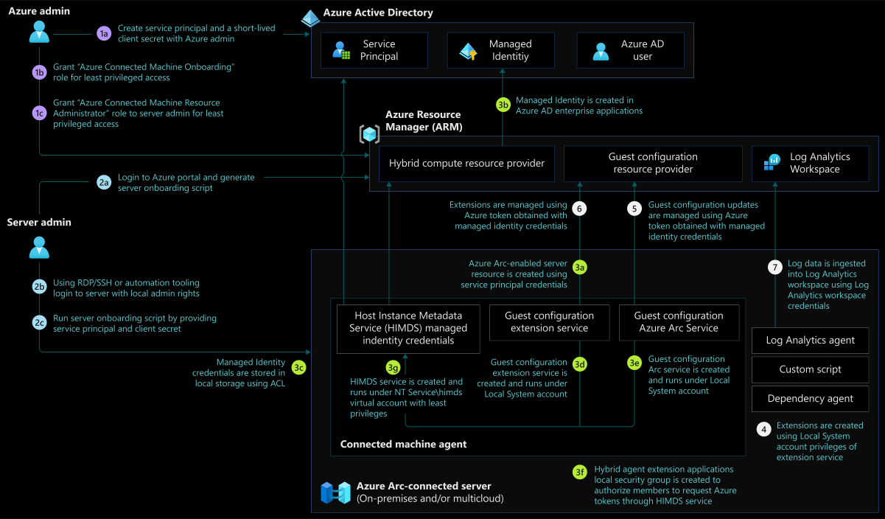

# Identity and access management for Azure Arc-enabled servers

## Overview

Your organization or enterprise needs to design the right access controls to secure hybrid environments using on-premises and cloud identity management systems. On-premises and cloud identity management systems play an important role in designing, and implementing the right access management controls in securing Azure Arc-enabled server infrastructure.

## Architecture

The following image shows reference architecture that demonstrates the roles, permissions and flow of actions for Azure Arc-enabled servers:

## Design considerations

- Decide who has access to onboarding servers from your organization to set up required permissions on the servers and in Azure resource manager.
- Decide who has access to manage Azure Arc-enabled servers and the ability to view their data from Azure services and other cloud environments.
- Decide between single or multiple service principal accounts to onboard servers owned by different business functions/units in an enterprise based on who operates these servers.
- Decide between short-lived or long-lived service principal credentials (client secrets) to onboard servers to Azure Arc.
- Review the [Identity and Access Management design area](/azure/cloud-adoption-framework/ready/enterprise-scale/identity-and-access-management) of Azure Landing Zone Enterprise Scale to assess the impact of Arc-enabled servers on your overall identity and access model.

## Design recommendations

- **Server on-boarding and administration**
  - Use security groups to assign local administrator rights to the identified users or service accounts on the servers to onboard to Azure Arc at scale.
  - Use [Azure AD service principal](/azure/azure-arc/servers/onboard-service-principal#create-a-service-principal-for-onboarding-at-scale) to onboard servers to Azure Arc.
  - Use separate Azure AD service principal accounts to onboard servers when operated by different IT teams.
  - Use short lived Azure AD service principal [client secrets](/azure/active-directory/develop/howto-create-service-principal-portal#option-2-create-a-new-application-secret).
  - Assign the [Azure Connected Machine Onboarding](/azure/azure-arc/servers/onboard-service-principal#create-a-service-principal-for-onboarding-at-scale) role at the resource group level.
  - Use Azure AD security groups and assign [Hybrid Server Resource Administrator](/azure/azure-arc/servers/plan-at-scale-deployment#prerequisites) role to manage Azure Arc-enabled server resources in Azure.
- **Azure AD protected resource access**
  - Use [managed identities](/azure/azure-arc/servers/managed-identity-authentication) from applications running on servers on-premises and other cloud environments to access resources protected by Azure Active Directory.
  - Restrict access to managed identities to [allow applications](/azure/active-directory/develop/v2-permissions-and-consent) that are authorized using Azure Active Directory application permissions.
  - Use [*Hybrid agent extension applications*](/azure/azure-arc/servers/security-overview#using-a-managed-identity-with-azure-arc-enabled-servers) local security group on Windows or *himds* group on Linux to grant access to users to request Azure resource access tokens from the Azure Arc-enabled servers.

## Next steps

For more guidance for your cloud adoption journey, see the following article:

- Review [Azure Arc Jumpstart](https://azurearcjumpstart.io/azure_arc_jumpstart/azure_arc_servers/day2/) scenarios
- Review the [prerequisites](/azure/azure-arc/servers/agent-overview#prerequisites) for Azure Arc-enabled servers
- Plan an [at-scale deployment](/azure/azure-arc/servers/plan-at-scale-deployment) of Azure Arc-enable servers
