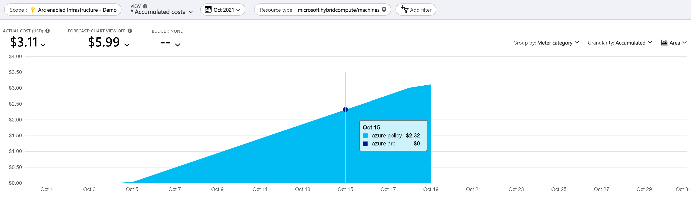
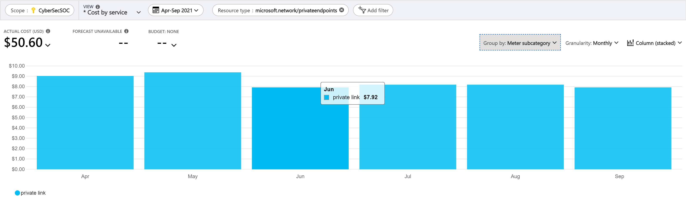

# Cost governance with Azure Arc-enabled servers
Cost governance is the continuous process of implementing policies to control costs of services you are using on Azure. This document will walk you through the various cost governance considerations and recommendations when using Azure Arc-enabled Kubernetes.

## How much does Azure Arc-enabled Kubernetes cost?
Azure Arc-enabled Kubernetes provides two types of services:
1. Azure Arc control plane functionality, which is provided at no extra cost including:
   - Resource organization through Azure management groups and tags.
   - Searching and indexing through Azure Resource Graph.
   - Access control through Azure RBAC at subscription or resource group level.
   - Automation through templates and extensions.

2. Azure services used in conjunction to Azure Arc-enabled Kubernetes (but not limited to), which incur costs according to their usage including:
   - Kubernetes Configuration
   - Azure Policy for Kubernetes
   - Azure Monitor for Containers
   - Microsoft Defender for Kubernetes clusters extension

> [!Note]
> If the Azure Arc-enabled Kubernetes cluster is on Azure Stack Edge, AKS on Azure Stack HCI, or AKS on Windows Server 2019 Datacenter, then Kubernetes configuration is included at no charge

## Design considerations
- **Governance:** Define a governance plan for your hybrid servers that translates into Azure Policies, tags, naming standards and least-privilege controls.
- **Azure Monitor:** [Azure Monitor](/azure/azure-monitor/overview) includes functionality for the collection and analysis of log data of your Azure Arc-enabled servers (billed by data ingestion, retention, and export), collection of metrics, health monitoring, alerts, and notifications. Features of Azure Monitor that are automatically enabled such as the collection of standard metrics, activity logs and insights are provided at no cost.
- **Azure Security Center:**  Azure Security Center is offered in [two modes](/azure/security-center/security-center-pricing):

   **Azure Defender DISABLED (Free)** - [Security Center without Azure Defender](/azure/security-center/security-center-introduction) once enabled, provides security policy, continuous security assessment, and actionable security recommendations to help you protect your Azure Arc-enabled servers and Azure resources. The free tier of Azure Defender for servers does not protect Azure Arc-enabled servers.

   **Azure Defender ENABLED (Paid)** - Enabling [Azure Defender](/azure/security-center/azure-defender) extends the capabilities of Azure Defender for Servers to your Azure Arc-enabled servers and Azure resources, providing unified security management and threat protection.
   
- **Azure Sentinel:**
Azure Sentinel provides intelligent security analytics across your enterprise. The data for this analysis is stored in an Azure Monitor Log Analytics workspace. Azure Sentinel is billed based on the volume of data ingested for analysis in Azure Sentinel and stored in the Azure Monitor Log Analytics workspace for your Azure Arc-enabled servers.
- **Azure Policy guest configuration:** Azure Policy Guest Configuration can audit and enforce operating system and application settings across your fleet of servers. Azure Policy guest configuration is billed per server per month and includes usage rights for Azure Automation state configuration, change tracking and inventory.
- **Azure Automation Configuration Management:** Azure Automation Configuration Management includes software change tracking and inventory for your servers as well as state configuration to configure your servers at-scale with PowerShell Desired State Configuration. Azure Automation Configuration Management is billed per server per month and includes usage rights for Azure Policy Guest Configuration. 
- **Azure Key Vault:** The Azure Key Vault VM extension allows you to manage the certificate lifecycle on [Windows](/azure/virtual-machines/extensions/key-vault-windows) and [Linux](/azure/virtual-machines/extensions/key-vault-linux) Azure Arc-enabled servers. Azure Key Vault is billed by the operations performed on the certificates, keys and secrets.
- **Azure Private Link:** You can use [Azure Private Link](/azure/azure-arc/servers/private-link-security) to ensure data coming from your Azure Arc-enabled servers is only accessed through authorized private networks. Azure Private Link is billed by endpoint and inbound/outbound data processed.
## Design recommendations
Here are some general design recommendations for Azure Arc-enabled servers cost governance:

### Governance
- Ensure that all Azure Arc-enabled servers follow proper [naming and tagging conventions](/azure/cloud-adoption-framework/ready/azure-best-practices/naming-and-tagging).
- Use least privilege RBAC by assigning **Azure Connected Machine Onboarding role** to only administrators who will on-board Azure Arc-enabled servers to avoid unnecessary costs.
- Use least privilege RBAC by assigning **Azure Connected Machine Resource Administrator** to only administrators who need to read, write, delete and re-onboard Azure Connected Machines.

### Azure Monitor 
- Review [recommendations for monitoring](./eslz-management-and-monitoring-arc-server.md) to decide on your monitoring requirements and review [Azure Monitor pricing](https://azure.microsoft.com/pricing/details/monitor/).

-  Decide on the [required logs and events](/azure/azure-monitor/agents/log-analytics-agent#data-collected) for the Azure Arc-enabled Windows and Linux servers to be collected in the Log Analytics workspace.
-  Use the [Azure Pricing Calculator](https://azure.microsoft.com/en-us/pricing/calculator/) to calculate an estimate of the Azure Arc-enabled servers monitoring costs for Azure Log Analytics ingestion, alerts and notifications.
  

- Use [Azure Cost Management and Billing](/azure/azure-monitor/usage-estimated-costs#azure-cost-management--billing) to have visibility on Azure Monitor costs.

- Use [Log Analytics workspaces insights](/azure/azure-monitor/logs/log-analytics-workspace-insights-overview) solution to understand and monitor the collected logs and their ingestion rate on the Log Analytics workspace.

- Evaluate possible data ingestion volume reducing, Refer to this [Tips for reducing data volume](/azure/azure-monitor/logs/manage-cost-storage#tips-for-reducing-data-volume) documentation to help configure data ingestion properly.
- Consider how long to retain data on Log Analytics. Data ingested into Log Analytics workspace can be retained at no additional charge up to first 31 days. Consider general aspects to configure the [Log Analytics workspace level default retention](/azure/azure-monitor/logs/manage-cost-storage#workspace-level-default-retention) and specific needs to configure data [retention by data type](/azure/azure-monitor/logs/manage-cost-storage#retention-by-data-type), that can be as low as 4 days. Example: Usually, performance data doens't need to be retained longer, instead, security logs may need to be retained longer.
- To retain data longer than 730 days, consider using [Log Analytics workspace data export](/azure/azure-monitor/logs/logs-data-export).
- Consider using [Commitment Tier](/azure/azure-monitor/logs/manage-cost-storage#pricing-model) pricing based on your data ingestion volume.

### Azure Security Center
- Review the [recommendations for security and compliance](./eslz-security-governance-and-compliance.md) and [Azure Defender for Servers pricing](https://azure.microsoft.com/pricing/details/azure-defender/).
### Azure Sentinel
- Review [Azure Sentinel pricing](https://azure.microsoft.com/pricing/details/azure-sentinel/).
- Use the Azure Pricing Calculator to estimate [Azure Sentinel costs](/azure/sentinel/azure-sentinel-billing).

- Use [Azure Cost Management and Billing](/azure/sentinel/azure-sentinel-billing#manage-and-monitor-azure-sentinel-costs) to have visibility on Azure Sentinel analysis costs.

- Review [data retention costs](/azure/sentinel/azure-sentinel-billing#data-retention-costs) for data ingested into the Log Analytics workspace used by Azure Sentinel.
- Filter the [right level of logs and events](/azure/azure-monitor/agents/log-analytics-agent#data-collected) for the Azure Arc-enabled Windows and Linux servers to be collected in the Log Analytics workspace.
- Use [Log Analytics queries](/azure/sentinel/azure-sentinel-billing#run-queries-to-understand-your-data-ingestion) and the [Workspace Usage Report workbook](/azure/sentinel/azure-sentinel-billing#deploy-a-workbook-to-visualize-data-ingestion) to understand your data ingestion trends.
- Create a [cost management playbook](/azure/sentinel/azure-sentinel-billing#use-a-playbook-for-cost-management-alerts) to send notification if your Azure Sentinel workspace exceeds your budget.
- Azure Sentinel integrates with other Azure services to provide enhanced capabilities. Review the [pricing details](/azure/sentinel/azure-sentinel-billing#costs-for-other-services) for these services.
- Consider using [Commitment Tier](/azure/sentinel/azure-sentinel-billing#set-or-change-pricing-tier) pricing based on your data ingestion volume.
- Consider [separating non-security](/azure/sentinel/azure-sentinel-billing#separate-non-security-data-in-a-different-workspace) operational data into a different Azure Log Analytics workspace.

### Azure Policy Guest Configuration
- Review the [recommendations for governance and compliance](./eslz-security-governance-and-compliance.md) and [Azure Policy Guest Configuration pricing](https://azure.microsoft.com/pricing/details/azure-arc/).
- Use Azure Cost Management to understand the Azure Policy Guest Configuration costs by filtering by the **Microsoft.HybridCompute/machines** resource type.
- All built-in Guest Configuration policies include a parameter that controls whether the policy will be assigned to Azure Arc-enabled servers machines. Review your policy assignments and set this parameter to "false" for policies that do not need to be evaluated on your hybrid servers.

### Azure Automation Configuration Management:
- Review [recommendations for automation](./eslz-automation-arc-server.md) and [Azure Automation pricing](https://azure.microsoft.com/pricing/details/automation/).
### Azure Key Vault
- Review [Azure Key Vault pricing](https://azure.microsoft.com/pricing/details/key-vault/).
- Use [Azure Key Vault insights](/azure/azure-monitor/insights/key-vault-insights-overview) to monitor certificate renewal and secrets operations on your Azure Arc-enabled servers.

### Azure Private Link
- Review [recommendations for connectivity](./eslz-arc-servers-connectivity.md) and [Azure Private Link pricing](https://azure.microsoft.com/pricing/details/private-link/).
- Use [Azure Cost Management and Billing](/azure/cost-management-billing/cost-management-billing-overview) to monitor the usage of Private Link used with Azure Arc-enabled servers.

## Next steps
Review the Cloud Adoption Framework [best practices and recommendations](/azure/cloud-adoption-framework/get-started/manage-costs) to efficiently manage your cloud costs.