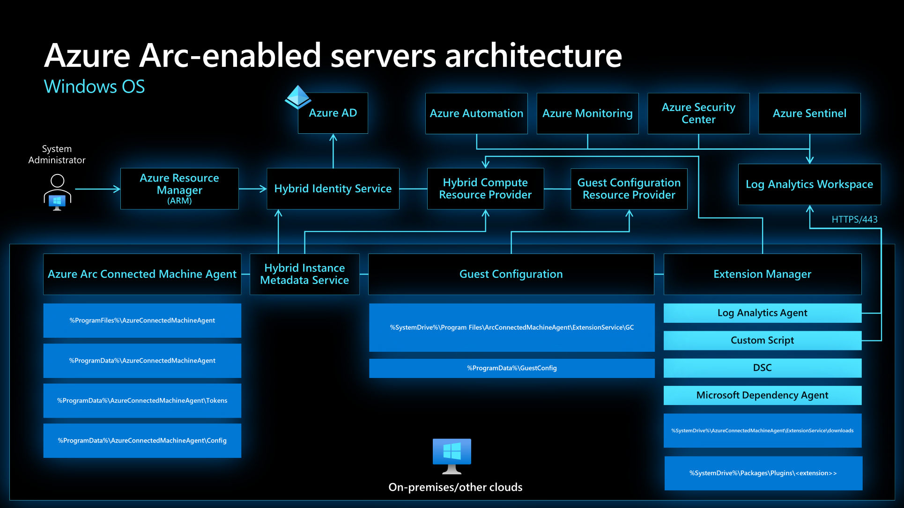
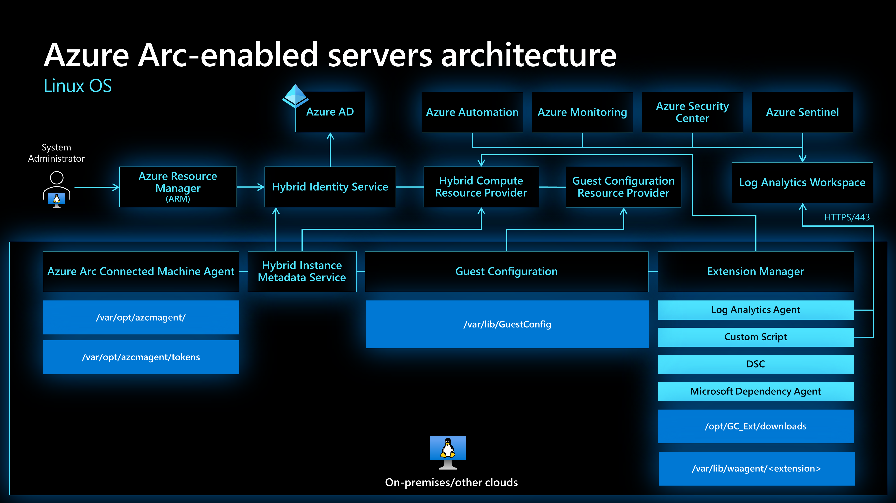
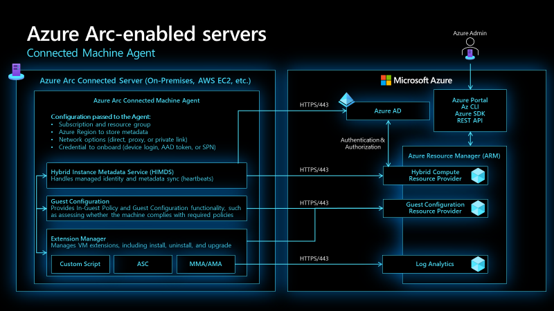

# Management and monitoring for Azure Arc-enabled servers enterprise-scale scenario

Azure Arc-enabled servers allows you to manage your Windows and Linux physical servers and virtual machines hosted outside of Azure, on your corporate network, or other cloud provider.  This document is written to help you operationally maintain Azure Arc-enabled servers on Azure enterprise estate, with centralized management and monitoring at the platform level. The article presents key recommendations for operations teams to maintain Azure Arc-enabled servers.

## Design considerations

Here are some general design considerations for Azure Arc-enabled servers monitoring and management:

- Review the [supported list of operating systems](https://docs.microsoft.com/en-us/azure/azure-monitor/agents/agents-overview#supported-operating-systems) for the monitoring agents.
- Review the [network requirements](https://docs.microsoft.com/en-us/azure/azure-monitor/agents/log-analytics-agent#network-requirements) for the monitoring agents to communicate with Azure Monitor.
- Review the Azure Arc-enabled servers Windows and Linux architecture.

- The Azure Monitor agents should be automatically deployed to Azure Arc-enabled Windows and Linux servers through [Azure Policy](https://docs.microsoft.com/en-us/azure/azure-monitor/deploy-scale) as part of the Enterprise scale landing zone.
- Identify the needed [logs and metrics](https://docs.microsoft.com/en-us/azure/azure-monitor/agents/agent-data-sources) to be collected from your Azure Arc-enabled servers based on your requirements.
- Review the Azure Connected Machine agent architecture.

- The Azure Connected Machine agent should be monitored for heartbeat connectivity to the platform.
- The Azure Connected Machine agent is updated regularly to address bug fixes, stability enhancements, and new functionality. Updates should be monitored and deployed in a timely fashion. Determine whether to upgrade to the latest release manually or automatically depending on your requirements.
- Update management of the Azure Arc-enabled servers should be automated to install the latest operating system and security updates.

## Design recommendations

Here are some general design recommendations for Azure Arc-enabled servers monitoring and management:

### Monitoring:
- Logs should be stored centrally to the dedicated platform Log Analytics workspace and [control log access with Azure Role-based access control](https://docs.microsoft.com/en-us/azure/azure-monitor/platform/design-logs-deployment#access-control-overview) . If there is a requirement for a separate workspace due to management, data sovereignty or compliance requirements, this can affect the ability to have a single pane of glass and event correlation of your Azure Arc-enabled servers across the environment.
- Use VM insights to analyze the performance of your Azure Arc-enabled Windows and Linux servers and monitor their processes and dependencies on other resources and external processes.
- Configure the needed performance counters for the Azure Arc-enabled Windows and Linux servers on the dedicated log analytics workspace.
- Configure the logs that need to be collected for the Azure Arc-enabled Windows and Linux servers on the dedicated log analytics workspace.
- Create a [resource health alert](https://docs.microsoft.com/en-us/azure/azure-arc/servers/plan-at-scale-deployment#phase-3-manage-and-operate) to monitor Azure Arc-enabled servers not sending heartbeats.
- Create [dashboards](https://docs.microsoft.com/en-us/azure/azure-portal/azure-portal-dashboards) or [Azure Monitor workbooks](https://docs.microsoft.com/en-us/azure/azure-monitor/visualize/workbooks-overview) to monitor the relevant metrics and events across your Azure Arc-enabled servers.

### Management:
- Create an [Azure Advisor alert](https://docs.microsoft.com/en-us/azure/azure-arc/servers/plan-at-scale-deployment#phase-3-manage-and-operate) to identify Azure Arc-enabled servers that are not using the latest version of the Azure Connected Machine agent.
- Use [Update Management](https://docs.microsoft.com/en-us/azure/automation/update-management/overview) in Azure Automation as a long-term patching mechanism for both Azure Arc-enabled Windows and Linux servers, which allows you to view and schedule operating system updates and patches for your Arc-enabled servers at scale.
- Update Management will also allow you to automate the Azure Connected Machine agent upgrade via Windows Updates on Azure Arc-enabled Windows servers.
- Review the Azure Connected Machine agent [upgrade methods](https://docs.microsoft.com/en-us/azure/azure-arc/servers/manage-agent#upgrading-agent).
- Understand how to upgrade [virtual machine extensions](https://docs.microsoft.com/en-us/azure/azure-arc/servers/manage-vm-extensions) to keep other agents installed and managed by Azure Arc up to date.
- Monitor [this article](https://docs.microsoft.com/en-us/azure/azure-arc/servers/agent-release-notes) for the latest releases, known issues and bug fixes of the Azure Connected Machine agent.

## Learn before you start

- Check for [Azure Arc Jumpstart](https://aka.ms/AzureArcJumpstart) scenarios that may help you with proof of concept and basic understanding.
