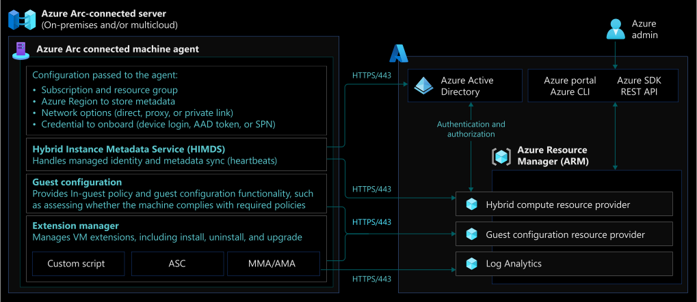

# Management and monitoring for Azure Arc-enabled servers

Azure Arc-enabled servers allow you to manage your Windows and Linux physical servers and virtual machines hosted outside of Azure, on your corporate network, or third-party cloud provider. This article will help you operate Azure Arc-enabled servers on Azure enterprise estate with centralized management and monitoring at the [platform level](/azure/cloud-adoption-framework/ready/enterprise-scale/management-and-monitoring). The article presents key recommendations for operations teams to maintain Azure Arc-enabled servers.

## Architecture

The following diagram shows a conceptual reference architecture that demonstrates how the Azure Connected Machine agent communicates with the different management and monitoring capabilities in Azure.

## Design considerations

Here are some general design considerations for Azure Arc-enabled servers monitoring and management:

- **Azure Monitor requirements:** Azure Monitor can collect data directly from your hybrid machines into a Log Analytics workspace for detailed analysis and correlation. This would entail installing the monitoring agents like the Log Analytics and Dependency agents.
- **Azure Monitor agents deployment:** Review the [deployment options](/azure/azure-arc/servers/concept-log-analytics-extension-deployment) for the Azure Monitor agents.
- **Azure Monitor configuration:** Plan your Azure Arc-enabled servers [monitoring requirements](/azure/azure-monitor/agents/log-analytics-agent#data-collected) including metrics and log collection.
- **Azure Machine agent management:** The Azure Connected Machine Agent plays a critical role in your hybrid operations as it enables you to manage your Windows and Linux machines hosted outside of Azure and enforce governance policies, it is important to implement solutions that keep track of unresponsive agents, monitor for new versions and automate the deployment of upgrades.
- **Update management for your hybrid resources:** Updates should be automated and installed in a timely manner to make sure your Azure Arc-enabled servers have the latest operating system and security updates.

## Design recommendations

### Azure Monitor requirements

- Review and understand how the Log Analytics agent [operates and collects data](/azure/azure-monitor/agents/log-analytics-agent) before deployment.
- Review the [Network connectivity for Azure Arc-enabled servers](./eslz-arc-servers-connectivity.md) section of this guide for network specific design considerations and recommendations.
- Before onboarding any machine to Azure Monitor, it's important to review the [supported list of operating systems](/azure/azure-monitor/agents/agents-overview#supported-operating-systems) and the [network requirements](/azure/azure-monitor/agents/log-analytics-agent#network-requirements) of the monitoring agents.

### Azure Monitor agents deployment

- The Azure Monitor agents should be automatically deployed to Azure Arc-enabled Windows and Linux servers through [Azure Policy](/azure/azure-monitor/deploy-scale) as part of the [Enterprise scale landing zone](/azure/cloud-adoption-framework/ready/enterprise-scale/management-and-monitoring).
- Logs should be stored centrally to the dedicated platform Log Analytics workspace and control log access with Azure [role-based access control (RBAC)](/azure/azure-monitor/platform/design-logs-deployment#access-control-overview). If there is a requirement for a separate workspace due to management, data sovereignty or compliance requirements, using a separate workspace can affect the ability to have a single pane of glass and event correlation of your Azure Arc-enabled servers across the environment.

### Azure Monitor configuration

- Use [VM insights](/azure/azure-arc/servers/learn/tutorial-enable-vm-insights) to analyze the performance of your Azure Arc-enabled Windows and Linux servers and monitor their processes and dependencies on other resources and external processes.
- Create [dashboards](/azure/azure-portal/azure-portal-dashboards) or [Azure Monitor workbooks](/azure/azure-monitor/visualize/workbooks-overview) to monitor the relevant metrics and events across your Azure Arc-enabled servers. Sample to Log Analytics queries to VM insights can be found in this [article](/azure/azure-monitor/vm/vminsights-log-search#performance-records).
- Configure the needed [performance counters](/azure/azure-monitor/agents/data-sources-performance-counters) for the Azure Arc-enabled Windows and Linux servers on the dedicated log analytics workspace.
- Configure the needed [logs](/azure/azure-monitor/agents/log-analytics-agent#data-collected) for the Azure Arc-enabled Windows and Linux servers on the dedicated log analytics workspace.

### Azure Machine agent management

- Monitor the health of the Azure Connected Machine agent by creating a [resource health alert](/azure/azure-arc/servers/plan-at-scale-deployment#phase-3-manage-and-operate) to monitor Azure Arc-enabled servers not sending heartbeats.
- Create an [Azure Advisor alert](/azure/azure-arc/servers/plan-at-scale-deployment#phase-3-manage-and-operate) to identify Azure Arc-enabled servers that are not using the latest version of the Azure Connected Machine agent.
- Review the Azure Connected Machine agent [upgrade methods](/azure/azure-arc/servers/manage-agent#upgrading-agent) and automate the upgrade process of the agent to have the latest fixes and features.
- Understand how to upgrade [virtual machine extensions](/azure/azure-arc/servers/manage-vm-extensions) to keep other agents installed and managed by Azure Arc up to date.
- Monitor [this article](/azure/azure-arc/servers/agent-release-notes) for the latest releases, known issues, and bug fixes of the Azure Connected Machine agent.

### Update management for your hybrid resources

- Use [Update Management](/azure/automation/update-management/overview) in Azure Automation as a long-term patching mechanism for both Azure Arc-enabled Windows and Linux servers, which allows you to view and schedule operating system updates and patches for your Arc-enabled servers at scale.
- Update Management will also allow you to automate the Azure Connected Machine agent upgrade via Windows Updates on Azure Arc-enabled Windows servers.

## Next steps

For more guidance for your hybrid cloud adoption journey, please review the following:

- Review [Azure Arc Jumpstart](https://azurearcjumpstart.io/azure_arc_jumpstart/azure_arc_servers/day2/) scenarios
- Review the [prerequisites](/azure/azure-arc/servers/agent-overview#prerequisites) for Azure Arc-enabled servers
- Plan an [at-scale deployment](/azure/azure-arc/servers/plan-at-scale-deployment) of Azure Arc-enable servers
