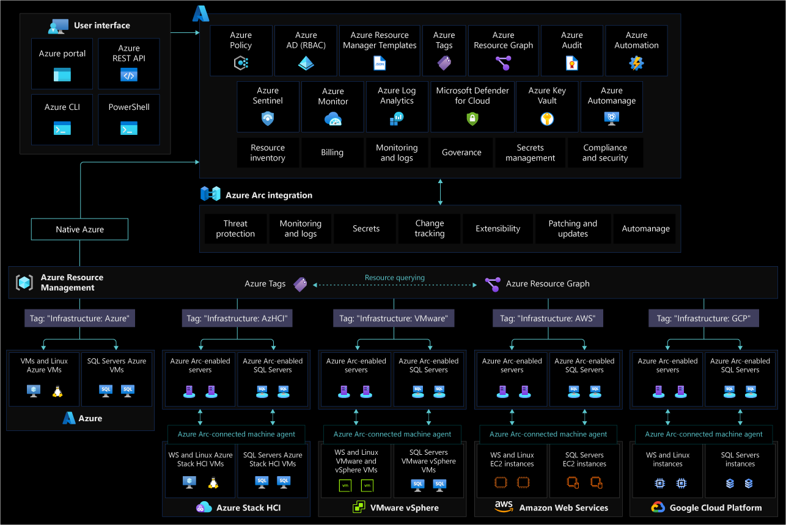

# Resource organization for Azure Arc-enabled servers

To align with the [Ready methodology](../../ready/index.md) of the Cloud Adoption Framework, implement a naming and tagging strategy that includes your hybrid and multicloud resources and add business and operational details as components of resource names and metadata tags.

## Resource consistency and inventory management

Before onboarding any machine onto Azure Arc it is important to define a structure on how these resources will map to Azure management scopes (management groups, subscriptions and resource groups). This mapping is key, as it will determine how you will be able to interact with these resources when applying RBAC roles and while assigning Azure policies as part of your governance model. Review the Cloud Adoption Framework recommendations on how to [organize resources](/azure/cloud-adoption-framework/ready/azure-setup-guide/organize-resources?tabs=AzureManagementGroupsAndHierarchy)

When designing this structure be aware of [Azure Resource Manager service limits](/azure/azure-arc/servers/agent-overview#azure-subscription-and-service-limits), as they are also applicable to Azure Arc-enabled servers and it is important to plan for the number of machines to be connected to an specific [resource group](/azure/azure-resource-manager/management/azure-subscription-service-limits#resource-group-limits) or [subscription](/azure/azure-resource-manager/management/azure-subscription-service-limits#subscription-limits).

After you have created a taxonomy structure and agreed on naming standards it is recommended to apply tags to the Azure Arc-enabled server resources. Once a server is registered in Azure it has a resource ID and becomes part of a resource group within a subscription where it can benefit from standard Azure constructs such as [tags](/azure/cloud-adoption-framework/manage/hybrid/server/best-practices/arc-inventory-tagging). These provide the ability to add metadata to a resource to quickly locate it and automate operational tasks, as such they are relevant to your day to day tasks as described in the [Cloud Adoption Framework tagging strategy](/azure/cloud-adoption-framework/ready/azure-best-practices/naming-and-tagging). However, it is a good practice to include a tag that reflects the `hosting platform` for the Azure Arc-enabled resource.

The following image shows a conceptual reference for resource tagging for Azure Arc-enabled servers:

## Next steps

For more guidance for your cloud adoption journey, see the following article:

- [Manage hybrid and multicloud environments](./manage.md)
- [Resource Tagging](https://azurearcjumpstart.io/azure_arc_jumpstart/azure_arc_servers/day2/arc_inventory_tagging/#apply-inventory-tagging-to-azure-arc-enabled-servers)