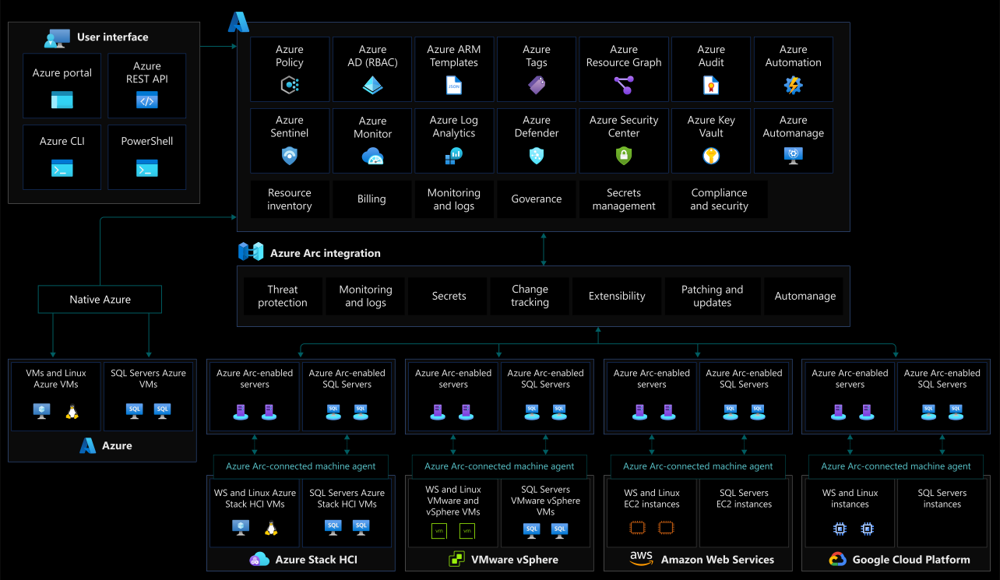
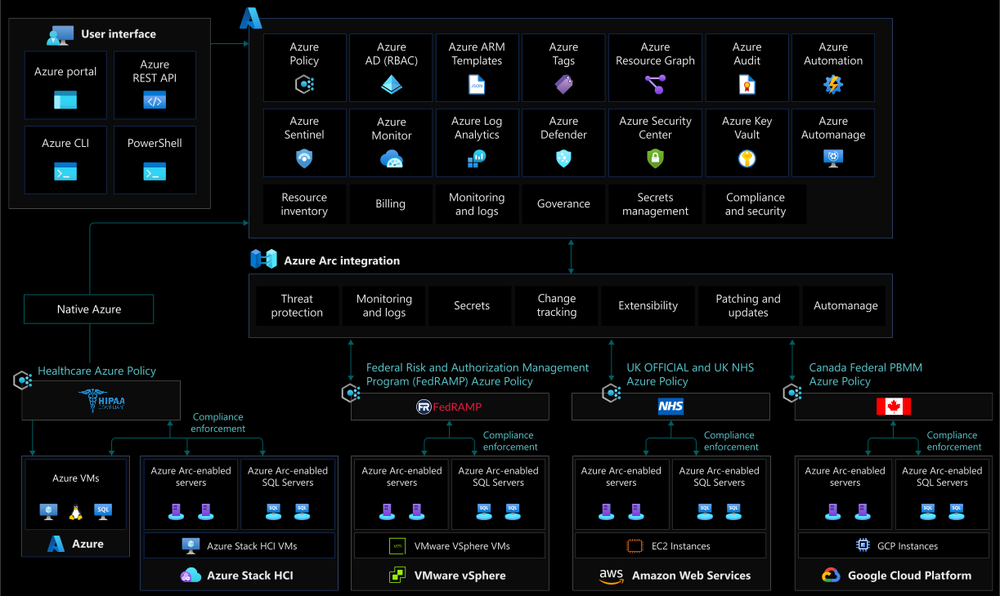

# Security, governance and, compliance baseline for Azure Arc-enabled servers

This article covers the key design considerations and best practices when implementing security, governance, and compliance—in hybrid, multicloud, and edge deployments. Azure Arc manages these deployments and is a part of the CAF enterprise-scale landing zone.

Defining and applying the proper control mechanisms is key in any cloud implementation, as it's the foundational element to stay secured and compliant. In a traditional environment, these mechanisms usually involve review processes and manual controls. However, the cloud has introduced a new approach to IT governance with automated guardrails and checks. [Azure Policy](/azure/governance/policy/overview) and [Microsoft Defender for Cloud](/azure/security-center/defender-for-cloud-introduction) are cloud-native tools that allow the implementation of these controls, reports, and remediation tasks in an automated fashion. By combining them with Azure Arc, your governance policies and security checks are extended to any resource in public or private clouds.

By the end of this article, you'll understand the critical design areas for security, governance, and compliance with clear Microsoft guidance.

## Architecture

The following image displays conceptual reference architecture that demonstrates the security, compliance, and governance design areas for Azure Arc-enabled servers:

## Design considerations

As your hybrid and multicloud resources become a part of Azure Resource Manager, they can be managed and governed with Azure tools, just like Azure native VMs.

### Identity and access management

- **Agent security permissions:** Secure access to the Azure Connected Machine agent by reviewing users with local administrator privileges on the server.
- **Managed Identity:** Use [managed identities with Azure Arc-enabled servers](/azure/azure-arc/servers/managed-identity-authentication). Define a strategy for identifying which applications running on Arc-enabled servers can use an Azure Active Directory (AD) token.
- **Azure Role-based access controls (RBAC):** Define administrative, operations, and engineering roles within the organization. This will help allocate day-to-day operations in the hybrid environment. Mapping each team to actions and responsibilities will determine Azure RBAC roles and configuration. Consider using a [RACI](/azure/cloud-adoption-framework/organize/raci-alignment) matrix, to support this effort and build controls into the management scope hierarchy you define, while following the resource consistency and inventory management guidance. For more information, review [Identity and access management for Azure Arc-enabled servers](./eslz-identity-and-access-management.md).

### Resource organization

- **Change Tracking and Inventory:** [Track changes](/azure/automation/change-tracking/overview) on the operating system, application files, and registry to identify operational and security issues on your on-premises and other cloud environments.

### Governance disciplines

- **Threat protection and cloud security posture management:** Introduce controls to detect security misconfigurations and track compliance. Also, use [Azure's intelligence](/azure/sentinel/overview) to protect your hybrid workloads against threats. [Enable Microsoft Defender for Servers](/azure/security-center/security-center-get-started) for all subscriptions containing Azure Arc-enabled servers for security baseline monitoring, security posture management, and threat protection.
- **Secret and certificate management:** Enable [Azure Key Vault (AKV)](/azure/key-vault/general/basic-concepts) to protect service principal credentials. Consider using [Azure Key Vault](/azure/key-vault/general/basic-concepts) for certificate management on your Arc-enabled servers.
- **Policy management and reporting:** Define a governance plan for your hybrid servers and machines that translates into Azure Policies and remediation tasks.
- **Data Residency:** Consider which Azure region you wish your Azure Arc-enabled servers to be provisioned into, and understand the [metadata that is collected](/azure/azure-arc/servers/data-residency) from these machines.
- **Secure public key:** Secure the Azure Connected Machine agent public key authentication to communicate with the Azure service.
- **Business continuity and disaster recovery:** Review the [business continuity and disaster recovery](/azure/cloud-adoption-framework/ready/enterprise-scale/business-continuity-and-disaster-recovery) guidance for Enterprise scale landing zones to determine if your enterprise requirements are met.
- Review the [Security, Governance, and Compliance design area](/azure/cloud-adoption-framework/ready/enterprise-scale/security-governance-and-compliance) of Azure Landing Zone Enterprise Scale, to assess the impact of Arc-enabled servers on your overall security and governance model.

### Management disciplines

- **Agent Management:** The [Azure Connected Machine agent](/azure/azure-arc/servers/agent-overview) plays a critical role in your hybrid operations. It enables you to manage your Windows and Linux machines, hosted outside of Azure, and enforce governance policies. It's important to implement solutions that keep track of unresponsive agents.
- **Log management strategy:** Plan for metrics and log collection of your hybrid resources into a Log Analytics workspace for further analysis and auditing.

### Platform automation

- **Agent Provisioning:** Define a strategy for provisioning the Azure Arc-enabled servers and protecting access to the onboarding credentials. Consider the level and method of automation for [bulk enrollment](/azure/azure-arc/servers/learn/quick-enable-hybrid-vm). Consider how to structure [pilot and production deployments](/azure/azure-arc/servers/plan-at-scale-deployment) and establish a formal plan. The scope and plan for a deployment should account for objectives, selection criteria, success criteria, training plans, rollback, and risks.
- **Software Updates:** Define a strategy to assess the status of available updates to maintain security compliance, with critical and security updates of your operating systems.

## Design recommendations

### Agent Provisioning

If using a [service principal](/azure/azure-arc/servers/onboard-service-principal) to provision Azure Arc-enabled servers, consider how to securely store and distribute the service principal password.

### Agent Management

The Azure Connected Machine agent is the key piece for Azure Arc-enabled servers. It contains several logical components that play a role in security, governance, and management operations. If the Azure Connected Machine agent stops sending heartbeats to Azure, or goes offline, you will not be able to perform operational tasks on it. Hence, it's necessary to [develop a plan](/azure/azure-arc/servers/plan-at-scale-deployment#phase-3-manage-and-operate) for notifications and responses.

Azure Activity Log can be used to set up [resource health notifications](/azure/service-health/resource-health-alert-monitor-guide). Remain informed on the current and historical health status of the Azure Connected Machine agent by implementing a [query](/azure/azure-arc/servers/plan-at-scale-deployment#phase-3-manage-and-operate).

### Agent Security permissions

Control who has access to the Azure Connected Machine agent on Azure Arc-enabled servers. The services that compose this agent control all communication and interaction for the Arc-enabled servers to Azure. Members of the local administrator group on Windows and users with root privileges on Linux, have permissions to manage the agent.

### Managed Identity

The Azure AD system-assigned identity can only be used to update the status of the Azure Arc-enabled servers (for example, the 'last seen' heartbeat). It's still possible to allow an application on your server to use the system-assigned identity, to access Azure resources (for example, to request secrets from a Key Vault). You should:

- Consider which legitimate use-cases exist for server applications to [obtain access tokens](/azure/azure-arc/servers/managed-identity-authentication) and access Azure resources, while also planning for access control of these resources.
- Control privileged user roles on Azure Arc-enabled servers (members of the local administrators or Hybrid Agent Extensions Applications group on Windows and members of the [himds](/azure/azure-arc/servers/agent-overview#agent-component-details) group on Linux) to avoid system-managed identities being misused to gain unauthorized access to Azure resources.
- Use Azure RBAC to control and manage the permission for Azure Arc-enabled servers managed identities and perform periodic access reviews for these identities.

### Secret and certificate management

Consider using [Azure Key Vault (AKV)](/azure/key-vault/general/basic-concepts) to manage certificates on your Azure Arc-enabled servers. Azure Arc-enabled servers have managed identity, that is used by the Connected Machine and other Azure agents, to authenticate back to their respective services. The Key Vault VM extension allows you to manage the certificate lifecycle on [Windows](/azure/virtual-machines/extensions/key-vault-windows) and [Linux](/azure/virtual-machines/extensions/key-vault-linux) machines.

The following image displays conceptual reference architecture that demonstrates the Azure Key Vault integration for Azure Arc-enabled servers:

> [!TIP]
> Learn how to use Key Vault managed certificates with Arc-enabled Linux servers in the [Azure Arc Jumpstart](https://azurearcjumpstart.io/azure_arc_jumpstart/azure_arc_servers/day2/arc_keyvault#deploy-azure-key-vault-extension-to-azure-arc-enabled-ubuntu-server-and-use-a-key-vault-managed-certificate-with-nginx) project.

### Policy management and reporting

Policy-driven governance is a foundational principle of cloud-native operations and the Cloud Adoption Framework. [Azure Policy](/azure/governance/policy/) provides the mechanism to enforce corporate standards and to assess compliance at-scale. You can implement governance for consistency of deployments, compliance, control costs, and improve your security posture. With its compliance dashboard, you will get an aggregated view of the overall state, and remediation capabilities.

Azure Arc-enabled servers support [Azure Policy](/azure/governance/policy/overview) at the Azure Resource Management layer, and also within the individual server machine using [Guest Configuration Policies](/azure/governance/policy/concepts/guest-configuration).

Understand the [scope of Azure policy](/azure/role-based-access-control/scope-overview) and where it can be applied (Management Group, subscription, resource group, or individual resource level). Create a Management Group design in accordance with the recommended practices outlined in the [Cloud Adoption Framework Enterprise Scale](/azure/cloud-adoption-framework/ready/enterprise-scale/management-group-and-subscription-organization)

- Determine what Azure policies are required by defining business, regulatory, and security requirements for Azure Arc-enabled servers.
- Enforce tagging and implement [remediation tasks](/azure/governance/policy/how-to/remediate-resources).
- Understand and evaluate the [Azure Policy built-in definitions for Azure Arc-enabled servers](/azure/azure-arc/servers/policy-reference).
- Understand and evaluate the built-in [Guest Configuration policies](/azure/governance/policy/samples/built-in-policies#guest-configuration) and [initiatives](/azure/governance/policy/samples/built-in-initiatives#guest-configuration).
- Evaluate the need for creating [custom Guest configuration policies](/azure/governance/policy/how-to/guest-configuration-create).
- Define a monitoring and alerting policy that identifies [unhealthy Azure arc-enabled servers](/azure/azure-arc/servers/plan-at-scale-deployment#phase-3-manage-and-operate).
- Enable Azure Advisor alerts to identify Azure arc-enabled servers with [outdated agents installed](/azure/azure-arc/servers/plan-at-scale-deployment#phase-3-manage-and-operate).
- [Enforce organization standards and assess compliance at-scale](/azure/azure-arc/servers/security-controls-policy).
- Use Azure Policy and Remediation tasks to onboard management service agents via the extension management feature.
- Enable [Azure Monitor](/azure/azure-arc/servers/learn/tutorial-enable-vm-insights) for compliance and operational monitoring of Azure Arc-enabled servers.

The following image displays conceptual reference architecture that demonstrates the policy and compliance reporting design areas for Azure Arc-enabled servers:

### Log management strategy

Design and plan your Log Analytics workspace deployment. It will be the container where data is collected, aggregated, and later analyzed. A Log Analytics workspace represents a geographical location of your data, data isolation, and scope for configurations like data retention. You'll have to identify the number of workspaces needed and how it maps to your organizational structure. It's recommended you use a single Azure Monitor Log Analytics workspace to manage RBAC centrally, for visibility, and reporting—as described in the [Management and monitoring best practices of Cloud Adoption Framework](/azure/cloud-adoption-framework/ready/enterprise-scale/management-and-monitoring).

Review the best practices in [designing your Azure Monitor Logs deployment](/azure/azure-monitor/logs/design-logs-deployment).

### Threat protection and cloud security posture management

Microsoft Defender for Cloud provides a unified security-management platform segmented as a [Cloud Security Posture Management (CSPM)](/cloud-app-security/tutorial-cloud-platform-security) and cloud workload protection platform (CWPP). To increase security on your hybrid landing zone, it's important to protect the data and assets hosted in Azure and elsewhere. [Microsoft Defender for servers](/azure/security-center/defender-for-servers-introduction) extend these capabilities to Azure Arc-enabled servers and [Microsoft Defender for Endpoint](/microsoft-365/security/defender-endpoint/microsoft-defender-endpoint?view=o365-worldwide) provides [Endpoint Detection and Response (EDR)](/mem/intune/protect/endpoint-security-edr-policy). To strengthen the security of your hybrid landing zone, consider the following:

- Use Azure Arc-enabled servers to onboard hybrid resources in [Microsoft Defender for Cloud](/azure/security-center/quickstart-onboard-machines?pivots=azure-portal).
- Implement an [Azure Policy guest configuration](/azure/azure-arc/servers/learn/tutorial-assign-policy-portal) to make sure all resources are compliant and its security data is collected into the Log Analytics workspaces.
- Enable Microsoft Defender for all subscriptions and use Azure Policy to ensure compliance.
- Use security information and event management integration with Microsoft Defender for Cloud and [Microsoft Sentinel](/azure/azure-arc/servers/scenario-onboard-azure-sentinel).
- Protect your endpoints with Microsoft Defender for Cloud's integration with Microsoft Defender for Endpoint.
- For securing the connectivity between Arc-enabled servers and Azure, review the [Network connectivity for Azure Arc-enabled servers](./eslz-arc-servers-connectivity.md) section of this guide.

### Change Tracking and Inventory

Centralizing logs drives reports that can be used as additional layers of security and reduces the chances for gaps in observability. [Change Tracking and Inventory in Azure Automation](/azure/automation/change-tracking/overview) forwards and collects the data in a Log Analytics workspace. When using Microsoft Defender for Servers, you get File Integrity Monitoring (FIM) to examine and track software changes, for Windows services and Linux daemons on your Azure Arc-enabled servers.

### Software Updates

With Azure Arc-enabled servers, you can manage your enterprise estate with centralized management and monitoring at-scale. More specifically, it provides alerts and recommendations to IT teams, with full operational visibility that includes managing the updates of your Windows and Linux VMs.

Assessing and updating your operating systems should be a part of your overall management strategy, to maintain security compliance with critical and security updates as they are released. Use Update Management in Azure Automation as a long-term patching mechanism for both Azure and hybrid resources. Use Azure Policy to ensure and enforce the Update Management configurations to all VMs, including your [Azure Arc-enabled servers](/azure/cloud-adoption-framework/manage/hybrid/server/best-practices/arc-update-management).

You can also use [Azure Automanage](/azure/automanage/automanage-virtual-machines), so there is no need to worry about the details of onboarding and maintaining best practices for Update Management on your Arc resources.

### Role-Based Access Controls (RBAC)

Following the [least privilege principle](/security/benchmark/azure/baselines/arc-enabled-security-baseline#pa-7-follow-just-enough-administration-least-privilege-principle)—users, groups, or applications assigned with roles like "Contributor" or "Owner" or "Azure Connected Machine Resource Administrator" are able to execute operations like deploying extensions, which basically has root access on Azure Arc-enabled servers. These roles should be used with caution, to limit the possible blast radius or eventually replaced by custom roles.

To limit the privilege of a user and only allow them to onboard servers to Azure, the "Azure Connected Machine Onboarding" role is suitable. This role can only be used to onboard servers and cannot re-onboard or delete the server resource.  Make sure to review the [Azure Arc-enabled servers security overview](/azure/azure-arc/servers/security-overview) for more information about access controls.

Review the [Identity and access management for Azure Arc-enabled servers](./eslz-identity-and-access-management.md) section of this guide for more identity and access related content.

Also consider the sensitive data that is sent to the Azure Monitor Log Analytics workspace, the same RBAC principle should be applied to the data itself. Azure Arc-enabled servers provides RBAC access to log data collected by the Log Analytics agent, stored in the Log Analytics workspace the machine is registered to. Review how to implement granular Log Analytics workspace access in the [designing your Azure Monitor Logs deployment documentation](/azure/azure-monitor/logs/design-logs-deployment#access-control-overview).

### Secure public key

The Azure Connected Machine agent uses public key authentication to communicate with the Azure service. After you onboard a server to Azure Arc, a private key is saved to the disk and used whenever the agent communicates with Azure.

If stolen, the private key can be used on another server to communicate with the service and act as if it were the original server. This includes getting access to the system-assigned identity and any resources that identity has access to.

The private key file is protected to only allow the Hybrid Instance Metadata service (HIMDS) account access to read it. To prevent offline attacks, we strongly recommend the use of full disk encryption (for example, BitLocker, dm-crypt, etc.) on the operating system volume of your server. We recommend using Azure Policy guest configuration to [audit Windows and/or Linux machines](/azure/virtual-machines/policy-reference#microsoftcompute), that have the specified applications installed, such as the one's mentioned.

## Next steps

For more guidance for your hybrid cloud adoption journey, please review the following:

- Review [Azure Arc Jumpstart](https://azurearcjumpstart.io/azure_arc_jumpstart/azure_arc_servers/day2/) scenarios
- Review the [prerequisites](/azure/azure-arc/servers/agent-overview#prerequisites) for Azure Arc-enabled servers
- Plan an [at-scale deployment](/azure/azure-arc/servers/plan-at-scale-deployment) of Azure Arc-enable servers
- Understand how to [manage hybrid and multicloud environments](./manage.md)
- To learn more about Azure Arc, check out the [Azure Arc learning path on Microsoft Learn](/learn/paths/manage-hybrid-infrastructure-with-azure-arc/)
