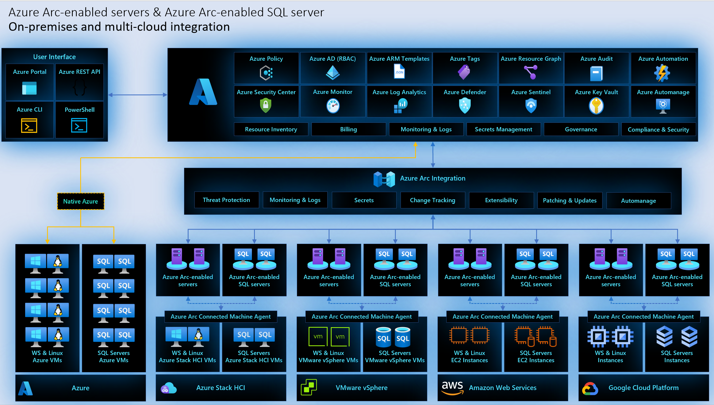
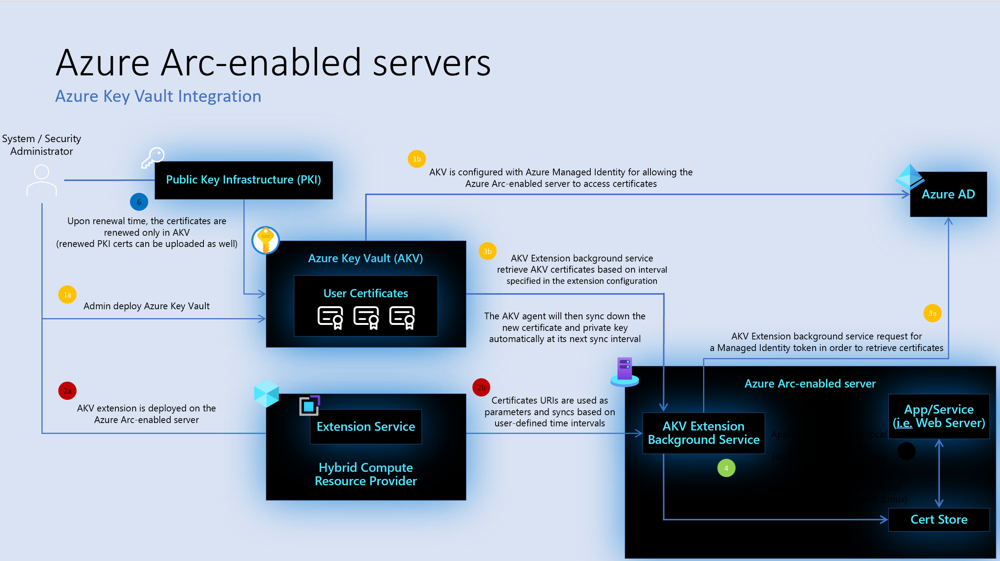
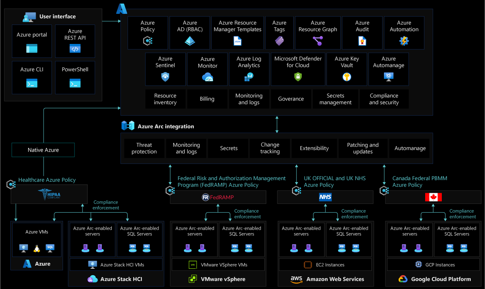

# Security, governance and compliance baseline for hybrid, multicloud, and edge deployments

This article walks through the key design considerations and best practices for security, governance, and compliance in hybrid, multicloud and edge deployments managed by Azure Arc that should be in place as part of a CAF enterprise-scale landing zone implementation.

Defining and applying the proper control mechanisms is key in any cloud implementation as it is the foundational element to stay secured and compliant. In a traditional environment these mechanisms usually involve review processes and manual controls, however the cloud has introduced a new approach to IT governance with automated guardrails and checks. Azure Policy and Microsoft Defender for Cloud are cloud native tools that allow the implementation of these controls, reports, and remediation tasks in an automated fashion. By combining them with Azure Arc, your governance policies and security checks are extended to any resource in public or private clouds.

By the end of this article, you will understand the critical design areas for security, governance, and compliance with clear Microsoft guidance.

## Architecture

The following image shows a conceptual reference architecture that demonstrates the security, compliance and governance design areas for Azure Arc-enabled servers:

## Design considerations

As your hybrid and multicloud resources become part of Azure Resource Manager, they can be managed and governed with Azure tools just as Azure native VMs.

- **Resource consistency and inventory management:** Group your hybrid resources using [Azure scopes of management](/azure/role-based-access-control/scope-overview) into a [taxonomy](/azure/azure-resource-manager/management/tag-resources?tabs=json) that matches your organization. Apply tags to your Azure Arc-enabled servers to add additional context that is relevant for your operations.
- **Agent Provisioning:** Define a strategy for provisioning the Azure Arc-enabled servers and protecting access to the onboarding credentials. Consider the level and method of automation for [bulk enrollment](/azure/azure-arc/servers/learn/quick-enable-hybrid-vm). Consider how to structure [pilot and production deployments](/azure/azure-arc/servers/plan-at-scale-deployment) and establish a formal plan that takes into account the scope and plan for a deployment including objectives, selection criteria, success criteria, training plans, rollback and risks.
- **Agent Management:** The Connected Machine Agent plays a critical role in your hybrid operations as it enables you to manage your Windows and Linux machines hosted outside of Azure and enforce governance policies, it is important to implement solutions that keep track of unresponsive agents.
- **Agent Security permissions:** Secure access to the Azure Connected Machine agent by reviewing users with local administrator privileges on the server.
- **Managed Identity:** Use the [managed identity with Azure Arc-enabled servers](/azure/azure-arc/servers/managed-identity-authentication) and define a strategy for identifying which applications running on Arc-enabled servers can use the Azure service assigned identity to request an Azure AD token.
- **Secret and certificate management:** Enable Azure Key Vault to protect service principal credentials. Consider using [Azure Key Vault](/azure/key-vault/general/basic-concepts) for certificate management on your Arc-enabled servers.
- **Policy management and reporting:** Define a governance plan for your hybrid servers and machines that translates into Azure Policies and remediation tasks.
- **Data Residency:** Consider which Azure region you wish your Azure Arc-enabled servers to be provisioned into, and understand the [metadata that is collected](/azure/azure-arc/servers/data-residency) from these machines.
- **Log management strategy:** Plan for metrics and log collection of your hybrid resources into a Log Analytics workspace for further analysis and auditing.
- **Threat protection and cloud security posture management:** Introduce controls to detect security misconfigurations and track compliance. Also, use [Azure's intelligence](/azure/sentinel/overview) to protect your hybrid workloads against threats. [Enable Azure Defender for Servers](/azure/security-center/security-center-get-started) for all subscriptions containing Azure Arc-enabled servers for security baseline monitoring, security posture management and threat protection.
- **Change Tracking and Inventory:** [Track changes](/azure/automation/change-tracking/overview) on the operating system, application files and registry to identify operational and security issues on your on-premises and other cloud environments.
- **Software Updates:** Define a strategy to assess the status of available updates to maintain security compliance with critical and security updates of your operating systems.
- **Role based access controls:** Define administrative, operations, and engineering roles within the organization that will take care of day-to-day operations in the hybrid environment. Mapping each team to actions and responsibilities will determine Azure role-based access control (RBAC) roles and configuration. Consider using a [RACI](/azure/cloud-adoption-framework/organize/raci-alignment) matrix to support this effort and build controls into the management scope hierarchy that you define following the resource consistency and inventory management guidance. See [PLACEHOLDER TO IAM CDA](IAM CDA) for more guidance.
- **Business continuity and disaster recovery:** Review the [business continuity and disaster recovery](/azure/cloud-adoption-framework/ready/enterprise-scale/business-continuity-and-disaster-recovery) guidance for Enterprise scale landing zones to determine if your enterprise requirements are met.
- **Secure public key:** Secure the Connected Machine agent public key authentication to communicate with the Azure service.

## Design recommendations

### Resource consistency and inventory management

Before onboarding any machine onto Azure Arc it is important to define a structure on how these resources will map to Azure management scopes (management groups, subscriptions and resource groups). This mapping is key, as it will determine how you will be able to interact with these resources when applying RBAC roles and while assigning Azure policies as part of your governance model. Review the Cloud Adoption Framework recommendations on how to [organize resources](/azure/cloud-adoption-framework/ready/azure-setup-guide/organize-resources?tabs=AzureManagementGroupsAndHierarchy)

When designing this structure be aware of [Azure Resource Manager service limits](/azure/azure-arc/servers/agent-overview#azure-subscription-and-service-limits), as they are also applicable to Azure Arc-enabled servers and it is important to plan for the number of machines to be connected to an specific [resource group](/azure/azure-resource-manager/management/azure-subscription-service-limits#resource-group-limits) or [subscription](/azure/azure-resource-manager/management/azure-subscription-service-limits#subscription-limits).

After you have created a taxonomy structure and agreed on naming standards it is recommended to apply tags to the Azure Arc-enabled server resources. Once a server is registered in Azure it has a resource ID and becomes part of a resource group within a subscription where it can benefit from standard Azure constructs such as [tags](/azure/cloud-adoption-framework/manage/hybrid/server/best-practices/arc-inventory-tagging). These provide the ability to add metadata to a resource to quickly locate it and automate operational tasks, as such they are relevant to your day to day tasks as described in the [Cloud Adoption Framework tagging strategy](/azure/cloud-adoption-framework/ready/azure-best-practices/naming-and-tagging). However, it is a good practice to include a tag that reflects the `hosting platform` for the Azure Arc-enabled resource.

The following image shows a conceptual reference for resource tagging for Azure Arc-enabled servers:

### Agent Provisioning

If using a [service principal](/azure/azure-arc/servers/onboard-service-principal) to provision Azure Arc-enabled servers, consider how to securely store and distribute the service principal secret.

### Agent Management

The Connected Machine agent is the key piece for Azure Arc-enabled servers, it contains several logical components that play a role in security, governance and management operations. If a Connected Machine agent stops sending heartbeats to Azure or goes offline you will not be able to perform operational tasks on it. Hence, it is necessary to develop a plan to get notified and how you will respond.

Azure Activity Log can be used to set up [resource health notifications](/azure/service-health/resource-health-alert-monitor-guide) and remain informed on current and historical health status of the Connected Machine agent by implementing a [query](/azure/azure-arc/servers/plan-at-scale-deployment#phase-3-manage-and-operate).

### Agent Security permissions

Control who has access to the Azure connected machine agent on Azure Arc-enabled servers. The services that compose this agent control all communication and interaction for the Arc-enabled server to Azure. On Windows, members of the local administrator group, and on Linux users with root privileges have permissions to manage the agent.

### Managed Identity

Whilst the Azure Active Directory system assigned identity can only be used to update the status of the Azure Arc-enabled server (for example, the 'last seen' heartbeat), it is possible to allow an application on your server to use the system assigned identity to access Azure resources (for example, to request secrets from a Key Vault.) Consider which legitimate use-cases exist for server applications to access Azure resources and plan to control access for to these resources.

[Control which server applications can obtain access tokens](/azure/azure-arc/servers/managed-identity-authentication)

- Control privileged user roles on Azure Arc-enabled servers (On Windows, members of the local administrators or Hybrid Agent Extensions Applications group, on Linux, members of the himds group) to avoid system managed identities being misused to gain unauthorized access to Azure resources.

- Use Azure RBAC to control and manage the permission for Azure Arc-enabled servers managed identities and perform periodic access reviews for these identities.

### Secret and certificate management

Consider using Azure Key Vault to manage certificates on your Azure Arc-enabled servers. Azure Arc-enabled servers has a managed identity which is used by the Connected Machine and other Azure agents to communicate back to their respective services. The Key Vault VM extension allows you to manage the certificate lifecycle on [Windows](/azure/virtual-machines/extensions/key-vault-windows) and [Linux](/azure/virtual-machines/extensions/key-vault-linux) machines. [PLACEHOLDER](Secret management)

The following image shows a conceptual reference architecture that demonstrates the Azure Key Vault integration for Azure Arc-enabled servers:

### Policy management and reporting

Having a policy-driven governance is a foundational principle of cloud-native operations and Cloud Adoption Framework. [Azure Policy](/azure/governance/policy/) provides the mechanism to enforce corporate standards and to assess compliance at scale. Through it, you can implement governance for consistency of deployments, compliance, control costs, and improve your security posture; with its compliance dashboard, you will get an aggregated view of the overall state as well as remediation capabilities. Azure Arc-enabled servers support [Azure Policy](/azure/governance/policy/overview) at the Azure Resource Management layer, and also within the individual server machine using [Guest Configuration Policies](/azure/governance/policy/concepts/guest-configuration).

Understand the [scope of Azure policy](/azure/role-based-access-control/scope-overview) and where it can be applied (Management Group, subscription, resource group or individual resource level). Create a Management Group design in accordance with the recommended practices outlined in the [Cloud Adoption Framework Enterprise Scale](/azure/cloud-adoption-framework/ready/enterprise-scale/management-group-and-subscription-organization)

- Determine what Azure policies are required by defining business, regulatory and security requirements for Azure Arc-enabled servers.
- Enforce tagging and implement [remediation tasks](/azure/governance/policy/how-to/remediate-resources).
- Understand and evaluate the [Azure Policy built-in definitions for Azure Arc-enabled servers](/azure/azure-arc/servers/policy-reference)
- Understand and evaluate the built-in [Guest Configuration policies](/azure/governance/policy/samples/built-in-policies#guest-configuration) and [initiatives](/azure/governance/policy/samples/built-in-initiatives#guest-configuration).
- Evaluate the need for creating [custom Guest configuration policies](/azure/governance/policy/how-to/guest-configuration-create)
- Define a monitoring and alerting policy that identifies [unhealthy Azure arc-enabled servers](/azure/azure-arc/servers/plan-at-scale-deployment#phase-3-manage-and-operate).
- Enable Azure Advisor alerts to identify Azure arc-enabled servers with [outdated agents installed](/azure/azure-arc/servers/plan-at-scale-deployment#phase-3-manage-and-operate).
- [Enforce organization standards and assess compliance at scale](/azure/azure-arc/servers/security-controls-policy).
- Use an Azure Policy and Remediation tasks to onboard management services agents via the extension management feature.
- Enable [Azure Monitor](/azure/azure-arc/servers/learn/tutorial-enable-vm-insights) for compliance and operational monitoring of Azure Arc-enabled servers.

The following image shows a conceptual reference architecture that demonstrates the policy and compliance reporting design areas for Azure Arc-enabled servers:

### Log management strategy

Design and plan your Log Analytics Workspace deployment, as it will be the container where data is collected, aggregated and later analyzed. As the Log Analytics Workspace represents a geographical location of your data, a level of isolation and a scope for configurations like data retention you will have to identify the number of workspaces needed and how it maps to your organizational structure. It is recommended to use a single Azure Monitor Log Analytics workspace to manage centrally RBAC, visibility and reporting as it is described in the [Management and monitoring best practices of Clouf Adoption Framework](/azure/cloud-adoption-framework/ready/enterprise-scale/management-and-monitoring).

Review the best practices in [designing your Azure Monitor Logs deployment](/azure/azure-monitor/logs/design-logs-deployment).

### Threat protection and cloud security posture management

Microsoft Defender for Cloud provides an unified security-management platform segmented as a cloud security posture management (CSPM) and cloud workload protection platform (CWPP). To increase security on your hybrid landing zone it is important to protect the data and assets hosted in Azure and elsewhere, Azure Defender for servers extends these capabilities to Azure Arc-enabled servers and together with Microsoft Defender for Endpoint provide a comprehensive EDR.  To heighten security on your hybrid landing zone consider:

- Use Azure Arc-enabled servers to onboard hybrid resources in Azure Defender.
- Implement an Azure Policy to make sure all resources are compliant and its security data is collected into the Log Analytics workspaces.
- Enable Azure Defender for all subscriptions and use Azure Policy to ensure compliance.
- Leverage security information and event management integration with Microsoft Defender for Cloud and Azure Sentinel.
- Protect your endpoints with AMicrosoft Defender for Cloud's integration with Microsoft Defender for Endpoint.

[Connect your non-Azure machines to Microsoft Defender for Cloud](/azure/security-center/quickstart-onboard-machines?pivots=azure-portal)

[PLACEHOLDER](Network Security)

### Change Tracking and Inventory

Centralizing logs drives additional reports that can be leveraged as additional layers of security and reduces the chances for gaps in observability. [Change Tracking and Inventory in Azure Automation](/azure/automation/change-tracking/overview) forwards and collects the data in a Log Analytics workspace. When using  Azure Defender for servers you get File Integrity Monitoring (FIM) to examine and track software changes, Windows services and Linux daemons on your Azure Arc-enabled servers.

### Software Updates

With Azure Arc-enabled server it is possible to manage in Azure your enterprise estate with centralized management and monitoring at scale. More specifically, it provides alerts and recommendations to IT teams with full operational visibility that includes managing the updates of your Windows and Linux VM.

Assessing and updating your operating systems should be part of your overall management strategy to maintain security compliance with Critical and Security updates as they are released. Use Update Management in Azure Automation as a long-term patching mechanism for both Azure and hybrid resources and use Azure Policy to ensure and enforce the Update Management configurations to all VMs, including your [Azure Arc-enabled servers](/azure/cloud-adoption-framework/manage/hybrid/server/best-practices/arc-update-management).

You can also use [Azure Automanage](/azure/automanage/automanage-virtual-machines), so there is no need to worry about the details of onboarding and maintaining best practices for Update Management on your Arc resources.

### Role based access controls

Follow the [least privilege principle](/security/benchmark/azure/baselines/arc-enabled-security-baseline#pa-7-follow-just-enough-administration-least-privilege-principle) users, groups or applications assigned with roles like "Contributor" or "Owner" or "Azure Connected Machine Resource Administrator" are able to execute operations like deploying extensions which basically has the power to do anything on Arc-enabled server. These roles should be used with caution to limit possible blast radius or eventually replaced by custom roles.

To limit the privilege of a user and only limit them to onboard servers to Azure, the "Azure Connected Machine Onboarding" role is suitable, though this role can only be used to onboard servers and cannot re-onboard or delete the server resource.  Make sure to review the [Azure Arc-enabled servers security overview](/azure/azure-arc/servers/security-overview) for more information about access controls.

Also consider the sensitive data that is sent to the Azure Monitor Log Analytics workspace, the same RBAC principle should be applied to the data itself. Azure Arc-enabled servers provides RBAC access to log data collected by the Log Analytics agent, stored in the Log Analytics workspace the machine is registered to. Review how to implement granular Log Analytics Workspace access in the [designing your Azure Monitor Logs deployment documentation](/azure/azure-monitor/logs/design-logs-deployment#access-control-overview).

### Secure public key

The Azure Connected Machine agent uses public key authentication to communicate with the Azure service. After you onboard a server to Azure Arc, a private key is saved to the disk and used whenever the agent communicates with Azure. If stolen, the private key can be used on another server to communicate with the service and act as if it were the original server. This includes getting access to the system assigned identity and any resources that identity has access to. The private key file is protected to only allow the himds account access to read it. To prevent offline attacks, we strongly recommend the use of full disk encryption (for example, BitLocker, dm-crypt, etc.) on the operating system volume of your server.

## Next steps

For more guidance for your cloud adoption journey, see the following article:

- [Manage hybrid and multicloud environments](./manage.md)
- [Resource Tagging](https://azurearcjumpstart.io/azure_arc_jumpstart/azure_arc_servers/day2/arc_inventory_tagging/#apply-inventory-tagging-to-azure-arc-enabled-servers)
- [Agent security permissions](/azure/azure-arc/servers/agent-overview)
- [Secret and certificate management](https://azurearcjumpstart.io/azure_arc_jumpstart/azure_arc_servers/day2/arc_keyvault#deploy-azure-key-vault-extension-to-azure-arc-enabled-ubuntu-server-and-use-a-key-vault-managed-certificate-with-nginx)
- [Threat protection and cloud security posture management](/azure/security-center/)
- [Threat protection with Azure Defender](https://azurearcjumpstart.io/azure_arc_jumpstart/azure_arc_servers/day2/arc_securitycenter/#onboarding-azure-defender)
