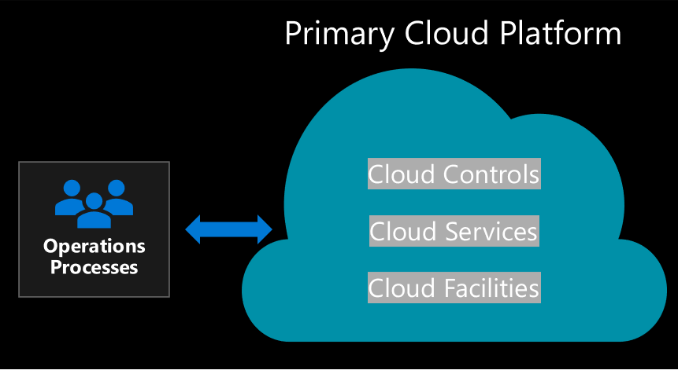

# Hybrid and multicloud migration

In the [Migrate methodology](../../migrate/index.md) of the Cloud Adoption Framework for Azure, migration to the cloud is already considered to be a hybrid or multicloud process. Most of the guidance in that methodology will remain relevant when you migrate to a hybrid and multicloud environment. The biggest shift from that methodology is related to the long-term objective of migrations.

Typically, migration efforts have been seen as a one-way street. Assets move up to the cloud, or to a new cloud, and stay there. In a hybrid and multicloud environment, migration efforts are more like a multilane highway. Assets move between multiple public and private clouds based on shifting business or technical requirements. This shift in migration strategy has minimal impact on the migration process, but it can directly affect the work that comes before and after migration.

## Effect on migration-specific processes

The direct effect of divergences on migration processes is minor, but awareness of them can increase your organization's likelihood of success. The act of migrating workloads consists of three high-level processes repeated in waves, or sprints, until the migration is complete. Here's a brief look at how these processes change:

- **Assess workloads:** A few considerations will shape how you assess workloads before migration.
- **Deploy workloads:** Deployment of the waves of workloads is largely unchanged. But you might want to use more of the [Azure Migrate](/azure/migrate/) ecosystem to accelerate specific types of migrations.
- **Release workloads:** After workloads are deployed, the biggest shift is seen in testing cycles before release to production traffic.

More information on how to assess, deploy, or release workloads within your migration processes is discussed later on in this article. First, review the next section on the bigger changes to upstream and downstream processes that will affect your migration.

## Effect on upstream and downstream processes

When you migrate workloads in a hybrid and multicloud environment, the real effect is on the efforts that come before and after the migration. Before you migrate workloads in a hybrid and multicloud approach, see [Introduction to hybrid and multicloud](./index.md) and [Introduction to unified operations](./unified-operations.md) to understand what else changes outside of your migration effort.

> [!WARNING]
> The preceding links provide high-level insights that will set you up for success. Within those articles are links to vital technical changes and effects. Don't proceed with a migration under a hybrid and multicloud strategy without a basic understanding of the impact on your [plan](./plan.md), [environmental readiness](./ready.md), and [operations management](./manage.md). Failure to prepare for those activities will result in greater operational costs and might create unintended vendor lock-in.

## Assess workloads for hybrid and multicloud migration

Azure products used in a standard migration are still applicable to a hybrid and multicloud migration. Specifically, Azure Migrate and Service Map can be used to understand your digital estate and outline your dependencies. For more information on both tools, see the [Getting started guide for assessing workloads](../../migrate/azure-migration-guide/assess.md). When you build out your plan or assess waves of hybrid and multicloud workloads, the [best practices for digital estate assessment in Azure](../../plan/contoso-migration-assessment.md) still apply.

Hybrid and multicloud migrations that come across assessment challenges indicate a lack of maturity within their migration team's assessment processes. Factor the following considerations into your assessment plans:

- Consider compatibility with Azure and Azure landing zones when you evaluate your workloads. During workload evaluation, you'll also need to consider compatibility with any hybrid networking, hybrid identity, hybrid security, or hybrid management or governance constraints established in other hybrid or multicloud environments.
- Place a more thorough emphasis on dependencies because a larger percentage of assets might be hosted in other clouds.
- Understand the reason behind the hybrid and multicloud decision to evaluate compatibility of the various workloads with tools that support:

  - **Azure Stack HCI compatibility**, which is important if you're modernizing your datacenter to allow for cloud native solutions on-premises.
  - **Kubernetes compatibility**, which is important if you're maintaining portability through container-based infrastructure.
  - **Azure Edge compatibility**, which might be important to extend workloads and reduce latency at the point of interaction.
  - **Regulatory, compliance, or business requirements**, which might dictate that some assets or data remain on-premises. To monitor assets that are migrated, you might need to add more monitoring tools.

These articles will help you to develop the most impactful processes required for this type of migration:

- [Responsibilities](../../migrate/migration-considerations/assess/index.md#accountability-during-assessment)
- [Workload classification](../../migrate/migration-considerations/assess/classify.md)
- [Cloud compatibility](../../migrate/migration-considerations/assess/evaluate.md)
- [Agile change management](../../migrate/migration-considerations/assess/release-iteration-backlog.md)
- [Building a well-defined migration backlog](../../plan/plan-intro.md)

## Deploy migrated workloads for hybrid and multicloud

When you migrate to the cloud, have a clear inventory of all dependent assets and network paths to ensure that those assets are deployed in the correct cloud. A clear inventory, or digital estate assessment, is even more important in hybrid environments before you migrate workloads. See the preceding *Assess workloads* section before you try to migrate workloads to a hybrid and multicloud environment.

[Azure Migrate](/azure/migrate/migrate-services-overview) is the principal solution for migrating workloads from your private cloud to Azure. Best practices for migrating to Azure from other public clouds will vary. You also might need to add a few other tools when you migrate to Azure Stack HCI. See the following tutorials:

- [Migrate from AWS to Azure](/azure/migrate/tutorial-migrate-aws-virtual-machines)
- [Migrate from GCP to Azure](/azure/migrate/tutorial-migrate-gcp-virtual-machines)
- [Migrate to Azure Stack HCI](../../scenarios/azure-stack/migrate-deploy.md#deploy-workloads)

## Release migrated workloads for hybrid and multicloud

Testing, benchmarking and sizing, and promotion plans are important when you migrate to the cloud. Hybrid and multicloud workloads have greater dependencies on decentralized assets and the networks that connect them. They're more prone to latency, connectivity, and routing issues, which could appear to be cloud platform performance issues. Testing and debugging of hybrid and multicloud workloads need a greater time allocation than workloads deployed to a single cloud provider for the added layers in identity and networking.

Here are a few considerations to include in your testing plan when you migrate to a hybrid and multicloud environment:

- [Align business and IT testing](../../migrate/migration-considerations/optimize/business-test.md)
- [Benchmark and resize assets](../../migrate/migration-considerations/optimize/optimize.md)
- [Cost and resizing best practices](../../migrate/azure-best-practices/migrate-best-practices-costs.md)
- [Promote to production](../../migrate/migration-considerations/optimize/promote.md)
- [Prepare for unified operations](./unified-operations.md)

## Next steps

For more guidance for your cloud adoption journey, see the following articles:

- [Govern hybrid and multicloud environments](./govern.md)
- [Manage hybrid and multicloud environments](./manage.md)
