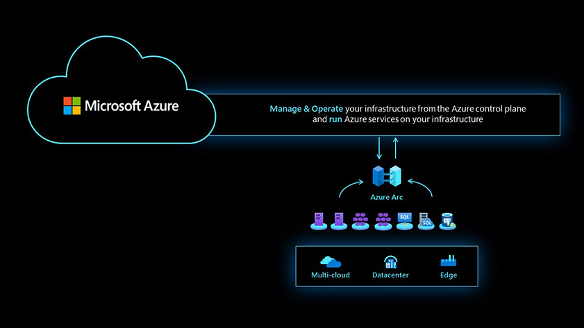

# Plan for hybrid and multicloud

Most cloud adoption scenarios assume common rationalization of workload assets that are rehosted, rearchitected, or rebuilt to fit IaaS lift-and-shift scenarios, modernization to PaaS services, or new innovation using cloud-native workloads. When planning for hybrid and multicloud, additional rationalization options should be considered to address the management of assets across all hybrid and multicloud platforms.

## Corporate strategy for hybrid and multicloud scenarios

Hybrid and multicloud connectivity, container hosting, and hyperconverged infrastructure can accelerate your strategy. But the following technical considerations should be included in your overall strategy and cloud adoption plan.

How will you:

- Maintain governance, management, and compliance across a hybrid and multicloud scenario?
- Consistently manage identity and security?
- Manage and govern data safely?
- Safely transfer data across distributed environments?
- Integrate disparate environments?

## Hybrid and multicloud digital estate

The current assumption in today's enterprise landscape is that most organizations will adopt the cloud. A complete enterprise migration could take days or even years, depending on what assets are included as migration candidates in the digital estate. Consider an enterprise environment with thousands of VMs and hundreds of applications, where the human effort required can easily exceed 1,500 FTE hours and nine months of planning. With standard (unidirectional) migration efforts, the assumption is that you will look for standard opportunities for rehost or rearchitect (assets that surface as standard migration candidates when rationalizing your digital estate).

In moving to a hybrid and multicloud scenario, where we assume unified operations for all resources in the digital estate, certain rationalization decisions will surface. Because on-premises assets are added to the enterprise control plane for unified operations and management, we commonly see the following rationalizations:

- Workloads recommended to remain on-premises (for example, limited by regulatory or compliance reasons)
- New application development for the enterprise requiring support by workloads that haven't been migrated, or can't be migrated.
- Business requirements to build new on-premises applications that have speed of light, connectivity, or regulatory requirements.

### Expanding digital estate rationalization

Hybrid and multicloud adoption efforts will change your rationalization criteria, so it's necessary to develop a plan for expanded rationalization options:

- Working with assets that will **remain** unchanged in the on-premises datacenter.
- Modernize to PaaS services that will **remain** in the datacenter.
- **Replatform** assets to other cloud platforms.
- **Rehost portability** allowing workloads to move smoothly between hybrid and multicloud platforms.

These changes will affect the work required to reach your hybrid and multicloud strategy. This article outlines a number of impacts to the plans currently defined in the [Cloud Adoption Framework's Plan methodology](../../plan/index.md).

## Planning your cloud mix

Your hybrid and multicloud strategy for applications and data will drive the answers to the following questions. Clearly identify what intended cloud mix is required, then consider the best configuration for your environments:

- What mixture of hybrid, edge, and multicloud environments do you support today?
- What mixture best aligns with your strategy for the future?
- Do you want to operate each platform independently or through a unified operations approach?

Consider the best configuration for your environments, with a clear understanding of your intended cloud mix.

Review the range of decisions in the following chart, with examples of cloud mixes, and confirm what Azure landing zone option you have chosen. Before you configure any cloud environment, identify how it will support your specific mix of cloud hosting decisions.

Each dark blue dot represents a workload, and each light blue circle a business process, supported by a distinct environment. Each cloud mix requires a different Azure environment configuration for each customer.

- **Hybrid-first customer:** Most workloads stay on-premises, often in a mixture of traditional, hybrid, and portable asset-hosting models. A few specific workloads are deployed to the edge, Azure, or to other cloud providers.

- **Azure-first customer:** Most workloads have been moved to Azure. A few workloads stay on-premises. Strategic decisions have led to a few workloads living on the edge or in multicloud environments.

- **Multicloud-first customer:** Most workloads are currently hosted on a different public cloud, like GCP or AWS. Strategic decisions have led to a few workloads living in Azure or on the edge. You may be moving from a *hybrid-first* mix to an *Azure-first* mix as your cloud strategy matures. We also support customers making strategic decisions to prioritize hybrid or multicloud mixes, and Azure plays a role in each mix.

## Corporate strategy decisions for hybrid and multicloud

When planning most cloud adoption scenarios, we assume customers want to rehost (IaaS VMs), rearchitect (PaaS services), or rebuild (cloud-native) workloads, with Azure as a target platform. The standard assumption is that you undergo a unidirectional migration to Azure using these standard rationalizations to identify assets for possible migration assumes a one-way *migrate everything to the cloud* migration.

When executing a hybrid and multicloud scenario, you operate under the premise of a multiplatform cloud services model that is no longer limited to one on-premises environment, but shifts to a distributed on-premises, multicloud, and edge model of cloud computing. Rationalization decisions are now expanded, and migration goals that were unidirectional now fit into this distributed services model for cloud environments: considering whether to **retain** workloads or assets on-premises, **replatform** workloads to multiple cloud platforms, and have **rehost portability** allowing workloads to move smoothly into any hosting environments.

Most migration planning efforts have focused on the legacy, unidirectional migration model&mdash;the *migrate everything* approach. In this model, retain, replatform, and reverse rehosting were viewed as antipatterns that should be minimized. Because the migration effort was focused on a one-way migration effort, these options did not fit the approach that began with more expansive asset rationalization, and the migration of assets from on-premises environments to a single public cloud solution like Azure, in addition to multicloud and edge solutions.

The expansion of available deployment options remains the biggest change in planning for unified operations. In planning for a truly distributed model, you open up options for deploying workloads to on-premises as well as public cloud environments, and the risk of dependencies is eliminated for workloads across your planned deployments. In an on-premises, multicloud, and edge deployment model, you no longer need to minimize dependencies on retained (hybrid or on-premises) workloads or replatformed (multicloud) workloads. And, since custom locations are now viable for deploying with a single enterprise control plane (given rehost portability), IaaS and PaaS workloads can be reverse-rehosted on-premises.

## Azure tools for your hybrid and multicloud strategy

Hybrid and multicloud planning efforts include assets beyond VMs and PaaS services in migration efforts, widening the availability of form factors to stretch innovation benefits beyond the private cloud to any location. [Azure Arc](/azure/azure-arc/overview) and [Azure Stack](https://azure.microsoft.com/overview/azure-stack/) drive digital transformation efforts under unified operations and management across private cloud, public cloud and the edge.

**Azure Stack** is a hardware solution that enables you to run an Azure environment on-premises, and on the edge. Because Azure Stack uses an integrated system with cloud services on-premises via [Azure Stack Hub](https://azure.microsoft.com/products/azure-stack/hub/), or runs edge-computing workloads with a cloud-managed appliance via [Azure Stack Edge](https://azure.microsoft.com/products/azure-stack/edge/), retaining assets on-premises is no longer a barrier to extending cloud benefits on-premises, or the edge. Such unified operations and management enables consistent operations management and governance across environments. This eliminates the need to resolve dependencies that are no longer locked to platform-restrictive configurations or policies.

**Azure Arc** is a software solution providing one enterprise control plane that manages all your digital assets across environments by projecting your on-premises and other cloud resources into Azure, extending simplified management, faster application development, and consistent Azure services to any infrastructure, anywhere.

A hybrid and multicloud strategy that follows a unified operations approach, integrates uniform visibility of on-premises assets with Azure Arc, and can facilitate Azure-consistent migration efforts, extending to and projecting resources into Azure as first-class citizens. Azure Arc implements unified cloud operations management across on-premises, multicloud and edge, and enables Azure services anywhere, so migration efforts can standardize management and governance for your entire digital estate, right from Azure.

Implementing a unified operations approach changes the model of how you're:

- Considering asset inventory (expanding rationalization of your estate).
- Deploying your cloud adoption plan.
- Considering your readiness plan (with expanded platform options).
- Implementing a specific DevOps plan to manage deployment pipelines.
- Specific skilling that supports your hybrid and multicloud strategy.

Hybrid, multicloud, and edge deployment strategies with a unified operations approach can **accelerate cloud adoption and migration efforts for your organization**, deploying a consistent operational and management framework for organizations to move forward and adopt modern cloud technologies. This optimizes cloud operations management and governance processes across on-premises-designated as well as migration-candidate workloads.

Planning for unified operations accelerates innovation across resources with an operational framework for simplified management, faster application development, and consistent Azure services across sprawling on-premises, multicloud, and edge environments, and can strengthen your organization's overall cloud adoption and migration effort. Developing necessary cloud skilling, and building cloud processes that support the overall migration readiness effort helps increase the consistency and speed of cloud adoption efforts across the enterprise.

### One control plane, expanded deployment options

Because Azure Arc extends a single enterprise control plane of Azure services and management to existing on-premises infrastructure, it provides platform flexibility for customers who want to continue to use existing systems and toolsets. You have the freedom to bring innovative cloud technologies to *any* location across your distributed environment. And, because your workload deployments are not limited to one hosting environment, they can be reverse rehosted on-premises, with the same cloud benefits.

Opening deployment options across on-premises and public cloud enables organizations to bring the consistency and innovation of uniform cloud practices to on-premises workloads (for example, keeping highly sensitive data on-premises to meet client needs or regulatory requirements) and still prepare other workloads for migration with the same benefits of cloud practices and technologies.

The biggest change in planning unified operations with expanded deployment options is the process of evaluating deployment decisions against **Retain**, **Replatform**, and **Rehost** portability, the primary 3 Rs of migration. With expanded deployment options across truly distributed cloud environments, cloud practices and technologies can be brought to any location, allowing reverse rehosting of IaaS and PaaS workloads on-premises, reversing the unidirectional migration model that operated under the assumption of *migrate everything to the cloud*.

In many cases, we start by assuming that every asset fits a **Retain** pattern, proactively adding each asset to the enterprise control plane for unified cloud operations and management efforts. Adopting a consistent cloud dashboard **can speed up cloud adoption and migration efforts for your organization** by deploying consistent cloud practices and technologies across assets designated for on-premises workloads, and cloud-ready skilling and processes to support workloads with migration-designated assets.

## Unified dashboard hybrid and multicloud dashboard

Azure Arc is a multicloud and on-premises management platform at the core of unified operations that enables standardized visibility, operations, and compliance across scattered resources in on-premises, multicloud, and edge environments. Adopting a single enterprise control plane **accelerates cloud adoption and migration** and enables a consistent framework for organizations to adopt modern cloud technologies and processes for on-premises-designated, as well as migration-candidate workloads across heterogeneous environments.

**Manage and operate all your resources as native Azure resources with a single pane of glass, consistently and at scale across disparate infrastructure, placing you in control** of resources across on-premises, multicloud, and edge environments, providing a single dashboard for your management, data services, governance, security, and identity. Azure Arc's unified operations approach offers you a **consistent visibility framework across distributed environments, reaching outside Azure and projecting your existing resources into Azure Resource Manager as first-class citizens.**

## Unified operations considerations

**Organize and govern across environments:** Get databases, Kubernetes clusters, and servers sprawling across on-premises, edge and multicloud environments under control by centrally organizing and governing from a single place.

**Manage Kubernetes applications at scale:** Deploy and manage Kubernetes applications across environments using DevOps techniques. Ensure that applications are deployed and configured consistently from source control.

**Run data services anywhere:** Get automated patching, upgrades, security and scale on-demand across on-premises, edge and multicloud environments for your data estate.

Planning efforts for unified operations and management assume that most assets fit a **Retain** pattern, adding each to the enterprise control plane, and expanding available form factors, with cross-platform visibility across environments:

- **Speeds up cloud adoption and migration efforts**, extending consistent cloud practices and technologies across on-premises and migration-candidate workloads.
- **Controls sprawling IT assets** with unified operations and management across on-premises and public cloud.
- **Maintains regulatory and data sovereignty compliance** with standardized data governance, security, and Cost Management policies.
- **Ensures uniform deployments and configuration** with consistent workload deployments, configured at scale.

### Technical considerations for infrastructure in your cloud mix

- **Reach out, onboard, and manage any server, anywhere, from Azure** (Windows, Linux, VM, bare-metal) with Azure Arc enabled servers.
- **Use your existing SQL servers with Azure Arc with no migration necessary**, with inventory, governance, security, and proactive SQL Database assessments.
- **Connect, manage, and operate Kubernetes clusters and applications running anywhere**, and deploy applications with GitOps.
- **Ensure compliance with your organization's security baseline with Azure Policy**, and enable cluster health monitoring with Azure Monitor for containers.
- **Organize, inventory, and unify server management experience** with simplified management of hybrid machines with Azure VM extensions for non-Azure Windows, and Linux VMs.
- **Apply unified governance and security baselines across disparate environments**, cross-platform compliance, and centralized agent management.
- **Apply [RBAC (role-based access control)](/azure/role-based-access-control/) at-scale**, with central IT and at workload-level owner level.
- **Deploy familiar Azure governance, security, inventory tracking and patch management tools** on auto-enrolled Azure Arc enabled servers.
- **Monitor your full telemetry** across your cloud-native and on-premises resources in a single place with Azure Monitor.

### Technical considerations for data services in your cloud mix

- **Bring Azure data services to any infrastructure**, across on-premises, edge and multicloud using Kubernetes on any hardware.
- **Remain current with fully automated updates, upgrades and policy-controlled deployments** like evergreen SQL and hyperscale deployment option of [Azure Database for PostgreSQL](/azure/postgresql/).
- **Optimize performance of data workloads, and dynamically scale up/scale out, without application downtime with cloud elasticity on-premises.**
- **Gain unified management and consistent visibility over on-premises and native Azure data workloads** using familiar tools (Azure portal, Azure data studio, and Azure CLI).
- **Protect your on-premises data workloads using Azure security and governance toolsets** including [Azure Security Center](/azure/security-center/security-center-introduction), [Azure Policy](/azure/governance/policy/overview), and [Azure RBAC](/azure/role-based-access-control/).
- **Increase cost-efficiencies across your hybrid infrastructure** with a modern cloud billing model.

## Guidance for inventory analysis

If unified operations is a core part of your strategy, you should start by lighting up Azure Arc for all resources before starting your Azure Migrate integration.

Do you have to look at the existing estate differently? Or is a simple VM to VM migration sufficient? Review this article when you are [gathering inventory for your digital estate](../hybrid/ready.md).

## Hybrid and multicloud adoption plan

Do you have a specific DevOps backlog the customer should use? Or is the standard adoption plan template still sufficient? Check out the strategy and plan template in the [Tools and templates](../../reference/tools-templates.md) section.

## Hybrid and multicloud readiness plan

Are there specific skills or extra training this team should take before getting started? To prepare for the readiness phase of your hybrid and multicloud migration journey, consider a [skills readiness path](../../ready/suggested-skills.md) to add skills in organizational and technical readiness.

## Next step: Review your environment or Azure landing zone

The following list of articles will take you to guidance found at specific points throughout the cloud adoption journey to help you be successful in the cloud adoption scenario.

- [Review your environment or Azure landing zones](./ready.md)
- [Hybrid and multicloud migration](./migrate.md)
- [Govern hybrid and multicloud environments](./govern.md)
- [Manage hybrid and multicloud environments](./manage.md)
