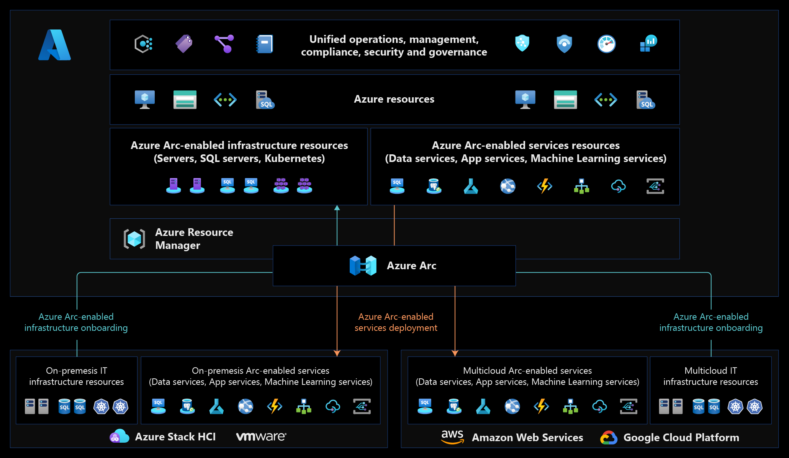

<!-- docutune:casing "Harry's Harvesters" "Angie's Applications" "Mary's Markets" -->

# Prepare your environment for a hybrid and multicloud scenario

The [Ready methodology](../../ready/index.md) of the Cloud Adoption Framework for Azure guides customers through environment readiness for cloud adoption. The readiness section includes technical accelerators like Azure landing zones, which are the basic building blocks in any cloud adoption environment. Review your choice of what landing zone to deploy. If you need help with choosing the right one to deploy, this guide can help you get started. If you're considering what landing zone would best fit your organization's operating model, see [Choose the landing zone for your organization](../../ready/landing-zone/choose-landing-zone-option.md) to help you get started.

## Hybrid and multicloud in various landing zones

[Azure landing zones](/azure/cloud-adoption-framework/ready/landing-zone/) are the output of a multisubscription Azure environment that accounts for:

- Scale
- Security governance
- Networking
- Identity

When preparing for a hybrid and multicloud deployment, environment configurations might be slightly different.

The following key considerations are necessary to prepare a consistent environment for any hybrid and multicloud deployment:

- Network topology and connectivity
- Unified operational process controls for operations, governance, security, and compliance
- Unified and consistent automation disciplines, development experience, and DevOps practices across heterogeneous environments

Azure Arc enables hybrid and multicloud architectures and holds a set of technologies. Each architecture includes the critical design areas and considerations to create a successful deployment.

## Evaluate your cloud mix

Choosing a hybrid and multicloud environment isn't a binary decision, it's closer to a range of decisions. Before you configure your Azure environment or any other cloud environment, it's important to identify how your cloud environment will support your specific mix of cloud-hosting decisions. Here are some examples of common cloud mixes:

Each dark blue dot is a workload, and each light blue circle is a business process, supported by a distinct environment. Each cloud mix requires a different Azure environment configuration, as seen with our three reference customers:

- **Hybrid-first customer:** Most workloads stay on-premises, often in a mixture of traditional, hybrid, and portable asset-hosting models. A few specific workloads are deployed to the edge, Azure, or to other cloud providers.

  **Fabrikam** is a *hybrid-first* customer, with a heavy investment in aging datacenters. Cost and governance are its highest priorities. Legacy IT priorities and aging technology infrastructure hindered innovation, which drove some early cloud adoption.

- **Azure-first customer:** Most workloads have been moved to Azure. A few workloads stay on-premises. Strategic decisions have led to a few workloads living on the edge or in multicloud environments.

  **Contoso** is an *Azure-first* customer. Like Fabrikam, it completed its first wave of digital transformation, acquired a few companies, and added customers in regulated industries. Innovation is still its priority. But with its multicloud environment, it's focused on operations management, and efficient, scalable operations are required to continue its acquisition strategy.

- **Multicloud-first customer:** Most workloads are currently hosted on a different public cloud, like Google Cloud Platform (GCP) or Amazon Web Services (AWS). Strategic decisions have led to a few workloads living in Azure or on the edge. Each month, we see customers move from a hybrid-first mix to an Azure-first mix as their cloud strategy matures. But, we also support customers who decide to make hybrid or multicloud mixes their priority. Azure plays a role in each mix.

  **Tailwind Traders** is a *multicloud-first* customer. Like Contoso, it moved to the cloud, but didn't choose Azure. It also has some local datacenter assets and edge devices. Tailwind Traders is an early adopter of other clouds in an early startup phase, and growth is its biggest priority. Driving growth in hybrid and multicloud are the retail requirements of its customers and the need to improve operations to scale efficiently.

The following considerations are most important when preparing any of your cloud environments for hybrid and multicloud. Your hybrid and multicloud strategy for applications and data will drive the answers to the following questions. Clearly identify what intended cloud mix is required, then consider the best configuration for your environments:

- What mixture of hybrid, edge, and multicloud environments do you support today?
- What mixture best aligns with your strategy for the future?
- Do you want to operate each platform independently or through a unified operations and a single pane of glass approach?

## Azure Arc overview

Some customers might want to simplify complex and distributed environments across on-premises, edge, and multicloud. [Azure Arc](https://azure.microsoft.com/services/azure-arc/) enables deployment of Azure services anywhere and extends Azure management to any infrastructure.

- **Organize and govern across environments** - Get databases, Kubernetes clusters, and servers sprawling across on-premises, edge, and multicloud environments under control by centrally organizing and governing from a single place.

- **Manage Kubernetes Apps at scale** - Deploy and manage Kubernetes applications across environments using DevOps techniques. Ensure that applications are deployed and configured from source control consistently.

- **Run Azure services anywhere** - Get automated patching, upgrades, security, and scale on-demand across on-premises, edge, and multicloud environments for your data estate.

## Azure Arc customer snapshot

All three reference customers run workloads on different hardware. They also run workloads across on-premises datacenters and multiple public cloud providers, and support IoT workloads deployed on the edge. These workloads include various services and are based on either bare-metal servers, virtual machines, managed platform-as-a-service (PaaS) services, and cloud-native, container-based applications.

All three customers realized the need to have hybrid and multicloud established practices is essential for business success. Also, the need for modernized workloads is becoming crucial to all three customers' relevancy in their respected areas.

With Azure Arc as their hybrid and multicloud control plane, these customers can use existing IT investments and current operational practices in a non-distributive fashion. Customers use their current practices by onboarding Azure Arc-enabled servers, SQL servers, and Kubernetes clusters. They're also able to modernize workloads while still meeting data sovereignty requirements by using Azure Arc-enabled data services, application services, and machine-learning services.

Azure Arc extends the Azure Resource Manager (ARM) APIs so any workload can be represented as a first-class citizen in Azure. This extension is the foundation to implement unified operations, management, compliance, security, and governance at scale. It's implemented using:

- Centralized monitoring
- Logging
- Telemetry
- Policies
- Update management
- Change tracking
- Inventory management
- Threat detection
- Security vulnerability management and auditing

## Configure your initial Azure environment

For each cloud mix above, you'll need an Azure environment to support, govern, and manage your cloud resources. The Ready methodology of the Cloud Adoption Framework helps prepare your environment by using a few steps:

- Review [What is an Azure Landing Zone?](/azure/cloud-adoption-framework/ready/landing-zone/)
- Consider each of the [Azure landing zone design areas](../../ready/landing-zone/design-areas.md) to properly evaluate your technical requirements.
- Compare your requirements to the [Azure landing zone implementation options](../../ready/landing-zone/implementation-options.md) to find and implement the most suitable template to start your configuration.
- Review the [Transition existing Azure environments to the Azure landing zone conceptual architecture](../../ready/enterprise-scale/transition.md) article.

## Azure Arc as a landing zone accelerator

Azure Arc resources can be part of any application. For example:

- Azure Arc-enabled servers representing IT assets deployed outside of Azure
- Customer-managed Kubernetes clusters in a multicloud environment
- Azure Arc-enabled data, application, and machine-learning services working at the edge

As such, the application landing zone subscriptions can also contain Azure Arc resources and regular Azure resources.

Since Azure Arc resources are located outside of Azure, they can be considered a *metadata resource* in the way they're represented in Azure. So, Azure Arc resources can be treated as any other Azure resource that can be part of a landing zone. It doesn't matter if it's a platform or application, and follows the [Subscription democratization and Application-centric and archetype-neutral](/azure/cloud-adoption-framework/ready/enterprise-scale/design-principles) design principles.

:::image type="content" source="./media/lz-design-revised.png" alt-text="Diagram that shows a landing zone design." lightbox="./media/lz-design-revised.png":::

### Common examples of Azure Arc resources in Azure landing zones

Review these examples to learn how to project Azure Arc resources as metadata resources in Azure landing zones.

#### Example one: Projecting Domain Controllers outside of Azure

Many customers have Active Directory Domain Services (AD DS) deployments within their environments of which Domain Controllers (DCs) are a critical component of AD DS and the customers overall architecture.

Within the Azure Landing Zone conceptual architecture, there's a dedicated identity landing zone subscription that's designed to host identity-based resources. This subscription can be hosted in Azure, for example using AD DS DC Virtual Machines (VMs). It can also be projected into Azure via Azure Arc-enabled servers from any other location.

It's the recommended pattern for Arc-enabled identity resources located outside of Azure. Then it can be projected into the identity Azure landing zone via Azure Arc.

#### Example two: Projecting On-Premises Data Centers into Azure

Most customers are likely to still have on-premises data centers present in their environments. The footprint can vary. They might have single servers or large virtualized environments.

Customers can treat these on-premises data centers as normal landing zones and then place them into new or existing landing zones as they see fit. Some common approaches for this example are:

1. Move project resources into dedicated landing zone subscriptions for on-premises data center resources.
    - In larger environments that have multiple data centers across the globe, customers might have one landing zone per country. These landing zones also contain the resources from that country to provide a logical separation of the on-premises data centers into Azure.
    - This approach might also assist with the security, governance, and compliance requirements for different on-premises datacenters.
2. Move project resources into separate landing zone subscriptions based on other Azure resources that support the same application or service.

#### Example three: Projecting Remote Application Resources into Azure

A customer might develop latency-sensitive applications, or applications with data sovereignty requirements. These applications might need to host some resources that are part of their application outside of Azure. With these types of development, customers still want to control, govern, secure, and operate all of the resources that build up their application from a central point. By using Azure Arc, customers can achieve this goal.

Customers in this scenario should project their Azure Arc resources for their application into the same application landing zone subscription they deploy Azure resources into. This method ensures that a single set of controls can be applied to all resources from a single control plane. No matter what location the resources are in.

## Next steps

For more information about your hybrid and multicloud cloud journey, see the following articles:

- [Introduction to Azure Arc-enabled servers Landing Zone accelerator for hybrid and multicloud](./enterprise-scale-landing-zone.md)

- [Learn how to deploy Azure Arc sandbox to accelerate adoption of hybrid or multi-cloud architectures](./enterprise-scale-landing-zone-sandbox.md)
