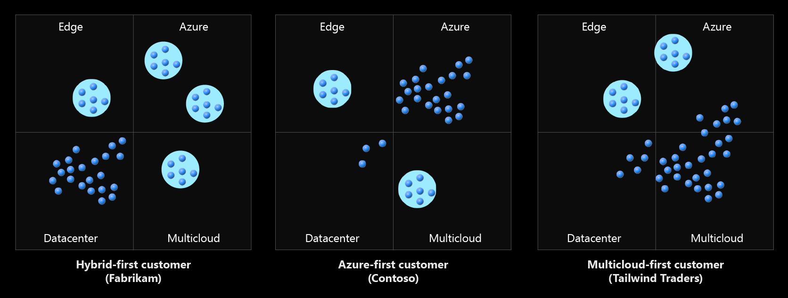
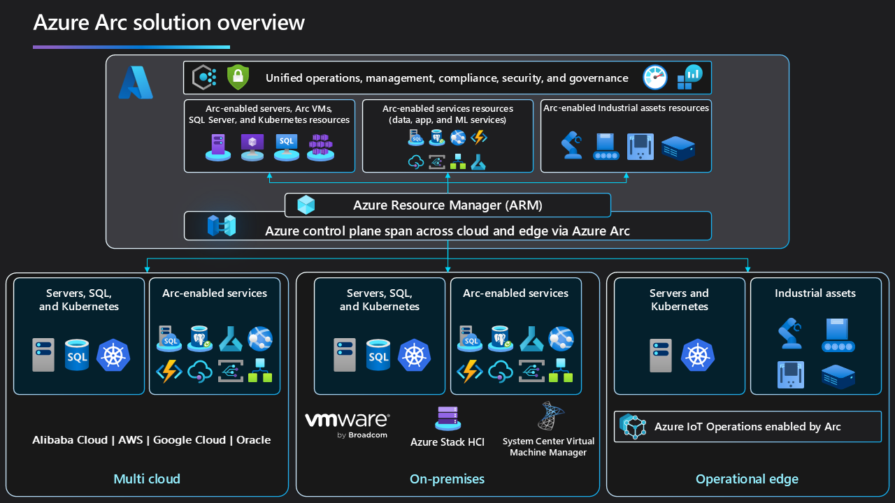
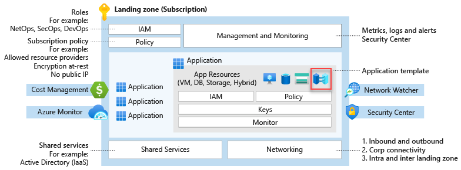
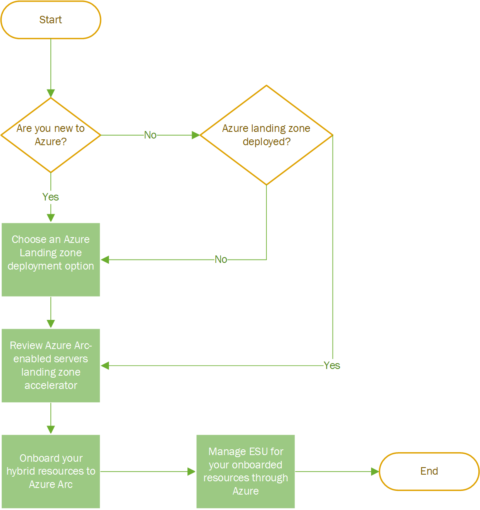

<!-- docutune:casing "Harry's Harvesters" "Angie's Applications" "Mary's Markets" -->

# Prepare your environment for a hybrid and multicloud scenario

The Cloud Adoption Framework [Ready methodology](../../ready/index.md) guides customers as they prepare their environment for cloud adoption. The methodology includes technical accelerators like Azure landing zones, which are the building blocks of any Azure cloud adoption environment.

If you need help with choosing the right landing zone to deploy for your organization, this guide can help you get started. When considering which landing zone best fits your organization's operating model, review [Choose the landing zone for your organization](../../ready/landing-zone/choose-landing-zone-option.md).

## Hybrid and multicloud in landing zones

[Azure landing zones](../../ready/landing-zone/index.md) are the output of a multisubscription Azure environment that accounts for:

- Scale
- Security governance
- Networking
- Identity
- Cost management
- Monitoring

Your environment considerations might be slightly different when you're preparing for a hybrid and multicloud deployment. A consistent environment for any hybrid and multicloud deployment requires you to consider:

- Network topology and connectivity
- Unified operational process controls for operations, governance, security, and compliance
- Unified and consistent automation disciplines, development experience, and DevOps practices across heterogeneous environments

Azure Arc enables hybrid and multicloud architectures and contains a set of technologies. Each architecture it enables includes all the critical design areas and considerations you need to create a successful deployment.

## Evaluate your cloud mix

Choosing a hybrid and multicloud environment involves a range of decisions rather than a single binary decision. Before you configure your Azure environment, identify how your cloud environment will support your specific mix of cloud-hosting choices. The following diagram contains some examples of common cloud mixes:

In this diagram, each dark blue dot is a workload, and each light blue circle is a business process supported by a distinct environment.

Every cloud mix requires a different Azure environment configuration. You can see this with our three reference customers:

- **Hybrid-first customer:** Most workloads stay on-premises, often in a mixture of traditional, hybrid, and portable asset-hosting models. A few specific workloads are deployed to the edge, Azure, or to other cloud providers.
  - **Fabrikam** is a *hybrid-first* customer with a heavy investment in aging datacenters. Its highest priorities are cost and governance. Legacy IT priorities and aging technology infrastructure hinder Fabrikam's innovation, which drives some early cloud adoption.

- **Azure-first customer:** Most workloads move to Azure, while a few workloads stay on-premises. Strategic decisions lead to a few workloads living on the edge or in multicloud environments.
  - **Contoso** is an *Azure-first* customer. Like Fabrikam, it's completed its first wave of digital transformation, acquired a few companies, and added customers in regulated industries. Its highest priority is still innovation, but with its multicloud environment, it's focused on operations management. It needs efficient, scalable operations in order to continue its acquisition strategy.

- **Multicloud-first customer:** Most workloads are hosted on a different public cloud, like Google Cloud Platform (GCP) or Amazon Web Services (AWS). Strategic decisions lead to a few workloads living in Azure or on the edge. Customers frequently move from a hybrid-first mix to an Azure-first mix as their cloud strategy matures, but we also support customers who decide to make hybrid or multicloud mixes their priority. Azure plays a role in each type of mix.
  - **Tailwind Traders** is a *multicloud-first* customer. Like Contoso, it has moved to the cloud, but didn't use Azure to do so. It has some local datacenter assets and edge devices. Tailwind Traders is an early adopter of other clouds in an early startup phase, and its biggest priority is growth. Customer retail requirements and the need for improved operations that enable efficient scaling drive hybrid and multicloud growth.

A few considerations are critical for preparing any cloud environment for hybrid and multicloud. Your hybrid and multicloud strategy for applications and data drives your answers to the following questions. Clearly identify what cloud mix you require, then consider the best configuration for your environments.

- What mixture of hybrid, edge, and multicloud environments do you support today?
- What mixture best aligns with your strategy for the future?
- Do you want to operate each platform independently or through unified operations and a single pane of glass approach?

## Azure Arc overview

You might want to simplify complex and distributed environments across on-premises, edge, and multicloud. [Azure Arc](https://azure.microsoft.com/services/azure-arc/) lets you deploy Azure services anywhere and extends Azure management to any infrastructure.

- **Organize and govern across environments**: Get databases, Kubernetes clusters, and servers that sprawl across on-premises, edge, and multicloud environments under control through central organization and governance from a single place.
- **Manage Kubernetes applications at scale**: Use DevOps techniques to deploy and manage Kubernetes applications across environments. Ensure that you consistently deploy and configure applications from source control.
- **Run Azure services anywhere**: Get automated patching, upgrades, security, and scaling on-demand across on-premises, edge, and multicloud environments for your data estate.

## Azure Arc customer snapshot

All three previously mentioned reference customers run workloads on different hardware. They also run workloads across on-premises datacenters and multiple public cloud providers and support IoT workloads deployed on the edge. Their workloads include various services, and are based on bare-metal servers, virtual machines, managed platform as a service (PaaS) services, or cloud-native, container-based applications.

All three customers realize they need to have hybrid and multicloud established practices to achieve business success. The need for modernized workloads is becoming crucial to all three customers' relevancy in their respected areas.

With Azure Arc as their hybrid and multicloud control plane, these customers can use existing IT investments and current operational practices in a non-distributive fashion. To continue using their current practices, the customers onboard Azure Arc-enabled servers, SQL servers, and Kubernetes clusters. They use Azure Arc-enabled data services, application services, and machine-learning services to modernize their workloads while ensuring they still meet data sovereignty requirements.

Azure Arc extends Azure Resource Manager (ARM) APIs so you can represent any workload as a first-class citizen in Azure. This extension provides the foundation for you to implement unified operations, management, compliance, security, and governance at scale. It's implemented with:

- Centralized monitoring
- Logging
- Telemetry
- Policies
- Update management
- Change tracking
- Inventory management
- Threat detection
- Security vulnerability management and auditing

## Configure your initial Azure environment

For each cloud mix, you'll need an Azure environment to support, govern, and manage your cloud resources. The Ready methodology of the Cloud Adoption Framework provides a few steps to help you prepare your environment:

- Review [What is an Azure landing zone?](../../ready/landing-zone/index.md)
- Consider each of the [Azure landing zone design areas](../../ready/landing-zone/design-areas.md) and properly evaluate your technical requirements.
- Compare your requirements to the [Azure landing zone implementation options](../../ready/landing-zone/implementation-options.md) to find and implement the most suitable template for your configuration.
- Learn how to [Transition existing Azure environments to the Azure landing zone conceptual architecture](../../ready/enterprise-scale/transition.md).

## Azure Arc as a landing zone accelerator

Azure Arc resources can be part of any application. Examples include:

- Azure Arc-enabled servers representing IT assets deployed outside of Azure.
- Customer-managed Kubernetes clusters in a multicloud environment.
- Azure Arc-enabled data, application, and machine-learning services working at the edge.

Application landing zone subscriptions can also contain both Azure Arc resources and regular Azure resources.

Since Azure Arc resources are located outside of Azure, you can consider them considered a *metadata resource* in the way they're represented in Azure. Treat Azure Arc resources as any other Azure resource that can be part of your landing zone. It doesn't matter if it's a platform or application, and it follows the [subscription democratization and application-centric and archetype-neutral](../../ready/landing-zone/design-principles.md) design principles.

### Common examples of Azure Arc resources in Azure landing zones

The following examples show how you can project Azure Arc resources as metadata resources in Azure landing zones.

#### Example one: Projecting domain controllers outside of Azure

Many customers have Active Directory Domain Services (AD DS) deployments within their environments. Domain controllers are a critical component of AD DS and the customers overall architecture.

Within the Azure landing zone conceptual architecture, there's a dedicated identity landing zone subscription designed to host identity-based resources. You can host this subscription in Azure using AD DS domain controller (DC) virtual machines (VMs). You can also project it into Azure from any other location via Azure Arc-enabled servers.

#### Example two: Projecting on-premises datacenters into Azure

Most customers still have on-premises datacenters present in their environments. The footprints of these datacenters can vary from single servers to large virtualized environments.

Customers can treat their on-premises datacenters as normal landing zones and place them into new or existing landing zones as they see fit. Some common approaches include:

- Moving project resources into dedicated landing zone subscriptions for on-premises datacenter resources.
  - In larger environments with multiple datacenters across the globe, customers might have one landing zone per geopolitical region. These landing zones also contain the resources from that region to provide a logical separation of the on-premises datacenters into Azure.
  - This approach can also assist with the security, governance, and compliance requirements for different on-premises datacenters.
- Moving project resources into separate landing zone subscriptions based on other Azure resources that support the same application or service.

#### Example three: Projecting remote application resources into Azure

Customers might develop latency-sensitive applications or applications with data sovereignty requirements. These applications can need to host resources that are part of their application outside of Azure. Customers still want to centrally control, govern, secure, and operate all of the resources that build up their application. Azure Arc lets customers achieve this goal.

In this scenario, customers should project the Azure Arc resources for their application into the same application landing zone subscription that they deploy Azure resources into. Customers can then apply one set of controls to all resources from a single control plane no matter where the resources are.

#### Example four: Projecting on-premises servers that reached end of support into Azure to use Extended Security Updates delivered through Azure Arc

Many customers have Windows Server versions that are nearing end of support and can't meet the end-of-support deadline but need to stay on-premises. In this scenario they would look to purchase [Extended Security Updates](/windows-server/get-started/extended-security-updates-overview) enabled by [Azure Arc](https://azure.microsoft.com/products/azure-arc/).

If customers are deploying an Azure Landing Zone or already have one deployed, customers can treat their on-premises datacenters as normal landing zones and place them into new or existing landing zones as they see fit. Some common approaches include:

- Moving project resources into dedicated landing zone subscriptions for on-premises datacenter resources.

- In larger environments with multiple datacenters across the globe, customers might have one landing zone per geopolitical region. These landing zones also contain the resources from that region to provide a logical separation of the on-premises datacenters into Azure.

- This approach can also assist with the security, governance, and compliance requirements for different on-premises datacenters.

- Moving project resources into separate landing zone subscriptions based on other Azure resources that support the same application or service.

- Customers should review the Azure Arc-enabled Servers landing zone accelerator guidance to review the design considerations and recommendations across critical design areas.

If customers don't have or aren't planning to deploy an Azure Landing Zone at the moment:

- Customers should review the Azure Arc-enabled Servers landing zone accelerator guidance to review the design considerations and recommendations across critical design areas.

## Next steps

For more information about your hybrid and multicloud cloud journey, see the following articles.

- Review the [Introduction to Azure Arc-enabled servers landing zone accelerator for hybrid and multicloud](./enterprise-scale-landing-zone.md).

- Learn how to [Deploy Azure Arc sandbox to accelerate adoption of hybrid or multicloud architectures](./arc-enabled-servers/enterprise-scale-landing-zone-sandbox.md).
