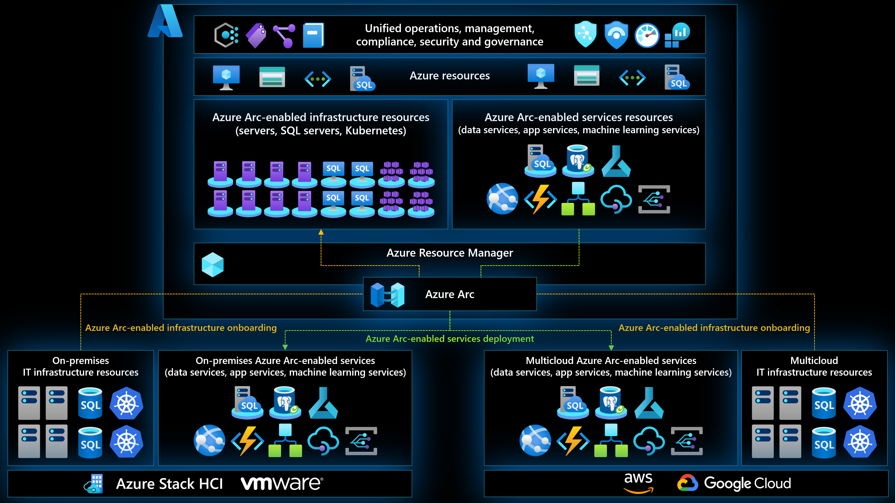
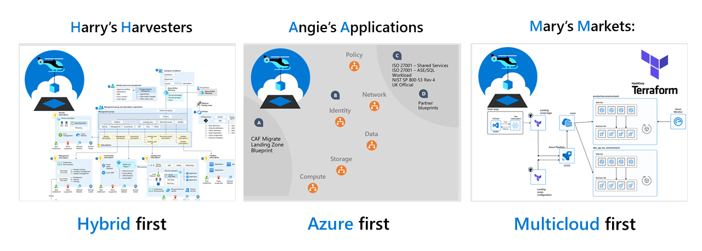
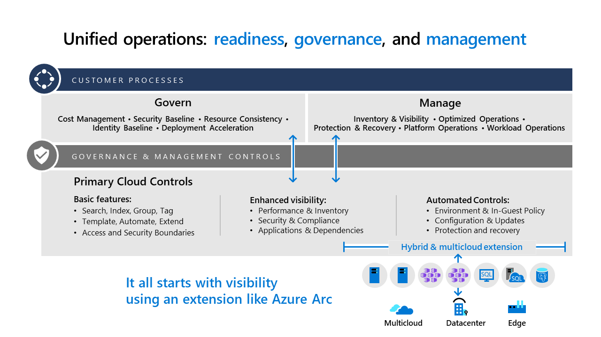

<!-- docutune:casing "Harry's Harvesters" "Angie's Applications" "Mary's Markets" -->

# Ready: Prepare your environment for a hybrid and multicloud scenario

The [Ready methodology](../../ready/index.md) of the Cloud Adoption Framework for Azure guides customers through environment readiness to prepare for cloud adoption. The readiness section includes technical accelerators (Azure landing zones), which are the basic building block in any cloud adoption environment. Review your choice of what landing zone to deploy. If you need help choosing the right one to deploy, this guide can help you get started. If you are considering what landing zone would best fit your organization's operating model, [this article](../../ready/landing-zone/choose-landing-zone-option.md) can help you get started with this alignment.

## Hybrid and multicloud in various landing zones

Landing zones automate the configuration of your Azure environment, and align with best practices guidance in the Cloud Adoption Framework. When you prepare for a hybrid and multicloud deployment, environment configurations might be slightly different.

These are the key changes necessary to prepare a consistent environment for any hybrid and multicloud deployment:

- Hybrid and multicloud network connectivity
- Common identity management
- Integrated management
- Unified operational process controls for operations, governance, security and compliance
- Unified and consistent automation disciplines, development experience and DevOps practices across heterogeneous environments

This article guides you through the considerations required for these environment configurations.

## Evaluate your cloud mix

Choosing a hybrid and multicloud environment isn't a binary decision. It's closer to a range of decisions, as seen in the following chart. Confirm what Azure landing zone option you have chosen.

Before you configure your Azure environment or any other cloud environment, it's important to identify how your cloud environment will support your specific mix of cloud hosting decisions. Here are some examples of common cloud mixes.

Each dark blue dot represents a workload, and each light blue circle a business process, supported by a distinct environment. Each cloud mix requires a different Azure environment configuration, as seen with our three reference customers:

- **Hybrid-first customer:** Most workloads stay on-premises, often in a mixture of traditional, hybrid, and portable asset-hosting models. A few specific workloads are deployed to the edge, Azure, or to other cloud providers.

  **Fabrikam** is a *hybrid-first* customer, with a heavy investment in aging datacenters. Cost and governance are its highest priorities. Legacy IT priorities and aging technology infrastructure hindered innovation, which drove some early cloud adoption.

- **Azure-first customer:** Most workloads have been moved to Azure. A few workloads stay on-premises. Strategic decisions have led to a few workloads living on the edge or in multicloud environments.

  **Contoso** is an *Azure-first* customer. Like Fabrikam, it completed its first wave of digital transformation, acquired a few companies, and added customers in regulated industries. Innovation is still its priority. But with its multicloud environment, it's focused on operations management, and efficient, scalable operations required to continue its acquisition strategy.

- **Multicloud-first customer:** Most workloads are currently hosted on a different public cloud, like GCP or AWS. Strategic decisions have led to a few workloads living in Azure or on the edge. Each month, we see a steady flow of customers moving from a hybrid-first mix to an Azure-first mix as their cloud strategy matures. But, we also support customers who have made strategic decisions to prioritize hybrid or multicloud mixes. Azure plays a role in each mix.

  **Tailwind Traders** is a *multicloud-first* customer. Like Contoso, it moved to the cloud, but didn't choose Azure. It also has some local datacenter assets and edge devices. Tailwind Traders is an early adopter of other clouds in an early startup phase, and growth is its big priority. Driving growth in hybrid and multicloud are the retail requirements of its customers, and the need to improve operations in order to scale efficiently.

The following considerations are most important when preparing any of your cloud environments for hybrid and multicloud. Your hybrid and multicloud strategy for applications and data will drive the answers to the following questions. Clearly identify what intended cloud mix is required, then consider the best configuration for your environments:

- What mixture of hybrid, edge, and multicloud environments do you support today?
- What mixture best aligns with your strategy for the future?
- Do you want to operate each platform independently or through a unified operations and a single pane of glass approach?

## Azure Arc overview

For customers who want to simplify complex and distributed environments across on-premises, edge and multicloud, [Azure Arc](https://azure.microsoft.com/services/azure-arc/) enables deployment of Azure services anywhere and extends Azure management to any infrastructure.

- **Organize and govern across environments** - Get databases, Kubernetes clusters, and servers sprawling across on-premises, edge and multicloud environments under control by centrally organizing and governing from a single place.

- **Manage Kubernetes Apps at scale** - Deploy and manage Kubernetes applications across environments using DevOps techniques. Ensure that applications are deployed and configured from source control consistently.

- **Run Azure services anywhere** - Get automated patching, upgrades, security and scale on-demand across on-premises, edge and multicloud environments for your data estate.

## Azure Arc customer snapshot

Whether it's Fabrikam, Contoso, or Tailwind Traders, all three reference customers run workloads on different hardware, across on-premises datacenters, and multiple public cloud providers as well as supporting IoT workloads deployed on the edge. These workloads include various services and are based on either bare-metal servers, virtual machines, managed Platform-as-a-Service (PaaS) services, and cloud-native, container-based applications.

In their modernization journey, all three customers realized that the need for having hybrid and multicloud established practices is essential for the business success and market demand. Also, the need for modernized workloads is becoming crucial to all three customers' relevancy in their respected areas.

Having Azure Arc as their hybrid and multicloud control plane will allow these customers to leverage existing IT investments and current operational practices in a non-distributive fashion by onboarding Azure Arc-enabled servers, SQL servers, and Kubernetes clusters as well as being able to modernize workloads while still meeting data sovereignty requirements by using Azure Arc-enabled data services, application services, and machine learning services.

Azure Arc extends the Azure Resource Manager (ARM) APIs so any workload can be represented as a first-class citizen in Azure. This is the foundation of implementing unified operations, management, compliance, security, and governance at scale by using centralized monitoring, logging, and telemetry, policies, update management, change tracking, inventory management, threat detection, and security vulnerability management and auditing.

## Configure your initial Azure environment

For each cloud mix above, you'll need an Azure environment to support, govern, and manage your cloud resources. The Ready methodology of the Cloud Adoption Framework helps prepare your environment by using a few steps:

- Review [What is an Azure Landing Zone?](/azure/cloud-adoption-framework/ready/landing-zone/)
- Consider each of the [Azure landing zone design areas](../../ready/landing-zone/design-areas.md) to properly evaluate your technical requirements.
- Compare your requirements to the [Azure landing zone implementation options](../../ready/landing-zone/implementation-options.md) to find and implement the most suitable template to start your configuration.
- Review [Transition existing Azure environments to the Azure landing zone conceptual architecture](../../ready/enterprise-scale/transition.md)

## Azure Arc as a landing zone accelerator

Azure Arc resources can be part of any application! Whether it's Azure Arc-enabled servers representing IT assets deployed outside of Azure, customer own-managed Kubernetes clusters in a multicloud environment, or Azure Arc-enabled data, application and machine learning services working at the edge.

[Azure landing zones](/azure/cloud-adoption-framework/ready/landing-zone/) are the output of a multisubscription Azure environment that accounts for scale, security governance, networking, and identity. The application landing zone subscriptions can also contain Azure Arc resources as well as regular Azure resources.

Since Azure Arc resources are physically located outside of Azure and therefore can be considered a "metadata resource" in the way they are represented in Azure. Consequently, this means that Azure Arc resources can be treated as any other Azure resource that can be part of any landing zone (platform or application) following the [Subscription democratization and Application-centric and archetype-neutral](/azure/cloud-adoption-framework/ready/enterprise-scale/design-principles) design principles.

<!-- ## Modify your environment to reflect your cloud mix

All three customers will have to deliver on slightly different *strategic* requirements to succeed in their digital transformation.

- **Harry's Harvesters** will need to focus on a **migration and governance** strategy to achieve cost controls, while ensure continued compliance.
- **Angie's Applications** will continue to invest in **innovation** but also needs to focus on a strategy to **optimize operations**, as they innovate.
- **Mary's Markets** will need to focus on **migration** and **scaling operations** to continue to grow their market share.

These customer all have different strategic, operational, governance, and environmental requirements. There is no one-size-fits-all solution to prepare them for their unique journeys to hybrid and multicloud. But they do all have one common need before they make impactful decisions: visibility.

Starting on different paths, each customer's first step in its cloud journey is the same: to onboard hybrid and multicloud assets into Azure Arc at no costs, and **gain visibility across workloads and cloud providers**. While their strategic focus will differ, **the starting point remains the Cloud Adoption Framework**, each accomplishing its strategic objective by following guidance in different methodologies.

- **Harry's Harvesters** needs visibility into inventory and costs. Following guidance in the Strategy and Govern methodologies, it will focus on governance and cloud migration to reduce cost and shift to OPEX cost models.
- **Angie's Applications** needs connectivity between clouds and new operational innovations. It will follow guidance in the Innovate and Manage methodologies, with a focus on cloud-native innovation and Azure landing zones for cross-cloud connectivity.
- **Mary's Markets** needs to scale workloads, and support demand from retail customers. It will follow guidance in the Migrate and Manage methodologies, focusing first on the operations baseline to prepare for scale, then a limited migration to Azure.

Each customer now needs to address network, identity, governance, and operations management to ensure proper environmental configuration. With their slightly different requirements for operations and environmental configuration, they'll use different implementation options with Azure landing zones:

- **Harry's Harvesters**' operational requirement is to modernize existing operations into new environments, and quickly build a compliant environment for its entire datacenter in Azure. It's ambitious plan is to migrate out of its organization's local datacenters, requiring compliance from day 1. The fastest path to its objectives is via enterprise-scale landing zones.
- **Angie's Applications**' operational requirement is to ensure consistent environmental configuration and control, adding hybrid and multicloud configuration to existing environments. It started with a smaller landing zone footprint and grew over time, and it's now in the *expand* phase of the *start small and expand* approach to Azure landing zones. The company will use the operations baseline in the Manage methodology and the decision trees in the Ready methodology to move forward.
- **Mary's Markets** has an operational goal to configure Azure and a hybrid environment to work with existing cloud configurations, using third-party options to extend its multicloud expertise to Azure and a hybrid environment configuration. The organization has invested heavily in Terraform to build their multicloud environments. It will start with the CAF Terraform modules to start small and expand into the hybrid environment, integrating with their existing cloud solutions.

## Support the most appropriate cloud mix

After establishing your Azure environment, consider modifications to:

- **Identity:** Which cloud will host your primary identity provider? If that provider is outside of Azure, you might need to integrate your identity provider with Azure Active Directory. For more information, see [Identity providers for external identities](/azure/active-directory/external-identities/identity-providers).
- **Public network connectivity:** Best practices suggest that all ingress and egress traffic should route through one cloud platform when possible. But your requirements or cloud mix might require more of a peer model. This arrangement is especially common if your cloud mix is used to satisfy redundancy and reliability requirements. How will you configure connectivity between each cloud platform and the public internet?
- **Backup and recovery:** It's common for customers to centralize their backup and recovery strategy around the most reliable provider in their cloud mix. Often the result is that one of the cloud providers serves as a shared recovery center. Azure Backup and Azure Site Recovery can help in each case.
- **Cloud platform connectivity:** If your cloud platforms will share common recovery, operations, or governance resources, you might require connectivity between each cloud platform. How will you configure connectivity between each cloud platform?

### The most important consideration

**Will you operate each cloud independently or through a unified central operations approach?**

Independent operations can double or triple your total cost of ownership (TCO). For some customers, TCO cost increases can be multiplied by over 10 times. To minimize costs and demands on your staff, a unified operations approach is best for all cloud mixes for your hybrid and multicloud strategy.

To learn more about unified operations and your cloud operations, see the articles on [unified operations](./unified-operations.md), [governance](./govern.md), and [operations management](./manage.md) for hybrid and multicloud solutions.

## Next steps

For more guidance for your cloud adoption journey, see the following articles:

- [Hybrid and multicloud migration](./migrate.md)
- [Govern hybrid and multicloud environments](./govern.md)
- [Manage hybrid and multicloud environments](./manage.md)
- [Enterprise-scale support for hybrid and multicloud](../hybrid/enterprise-scale-landing-zone.md) -->
