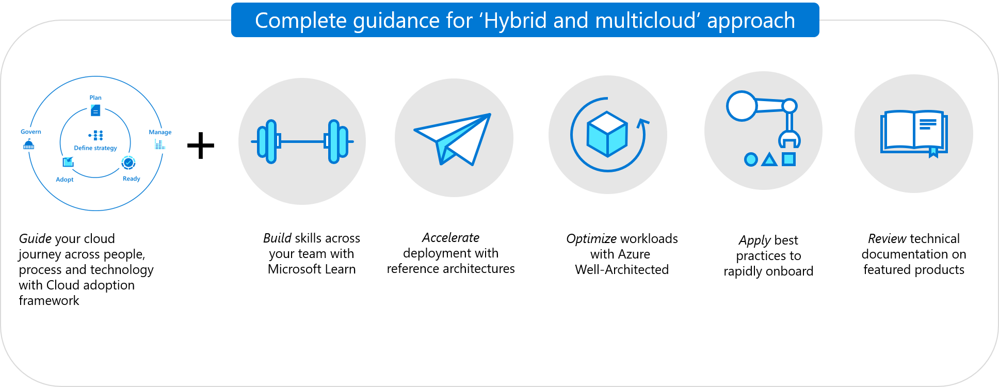

# Introduction to the hybrid and multicloud scenario

As customers address larger, more sophisticated forms of cloud adoption, their journey to the cloud becomes slightly more complex. This article series consolidates various technical and non-technical considerations required to prepare for a hybrid and multicloud adoption scenario.

This scenario focuses on enabling two targeted outcomes:

- [Hybrid and multicloud adoption](./index.md): Building, deploying, and/or migrating solutions that are portable, allowing for ease of movement between cloud platforms with minimum vendor lock-in.
- [Unified operations](./unified-operations.md): Streamlining operations to support those solutions across each cloud, through a central set of governance and management processes which share common operations processes, regardless of where the solution is currently deployed.

## Scenario components

This scenario is designed to guide the end-2-end customer journey during the cloud adoption lifecycle.

Delivery of the full journey requires certain key components, or guidance sets:

| &nbsp; | &nbsp; |
|--|--|
|   :::image type="icon" source="../../_images/hybrid/cloud-journey.png"::: |   [Microsoft Cloud Adoption Framework for Azure](../../get-started/index.md): These articles walk through the smallest set of considerations and implementations of each CAF methodology. Use these articles to prepare decision makers, central IT, and the cloud center of excellence for adoption of hybrid and multicloud workloads across your portfolio. |
|   :::image type="icon" source="../../_images/hybrid/hybrid-well-architected.png"::: |   [Microsoft Azure Well-Architected Framework](/azure/architecture/framework/): These articles outline the considerations that each workload owner should make when their workloads need to be deployed across hybrid and multicloud environments. |
|   :::image type="icon" source="../../_images/hybrid/hybrid-architectures.png"::: |   [Reference architectures](/azure/architecture/browse/): These reference solutions aid in accelerating deployment for a number of common hybrid and multicloud scenarios. |
|   :::image type="icon" source="../../_images/hybrid/hybrid-best-practices.png"::: |   Best practices: These level 300+ articles help central IT teams onboard assets to a unified operations solution using Azure Arc, ARM templates, and other relevant Azure products. |
|   :::image type="icon" source="../../_images/hybrid/hybrid-product-docs.png"::: |   Feature Azure products: Learn more about the products that support your hybrid and multicloud strategy in Azure. |
|   :::image type="icon" source="../../_images/hybrid/hybrid-skills.png"::: |   [Microsoft Learn modules](/learn/azure/): Gain the hands-on skills required to implement, maintain, and support hybrid and multicloud solutions. |

## Common customer challenges and supporting guidance

**Prepare for centralized operations of hybrid and multicloud:** Review the seven [Cloud Adoption Framework](../../get-started/index.md) articles in the table of contents to the right. Establish the processes and approaches required to support an entire portfolio of workloads across hybrid and multicloud environments.

**Monitor assets across an existing hybrid and multicloud portfolio:** Focus on the unified operations, govern, and manage articles to integrate unified operations into your existing operations processes. Use the ready article to deploy those improvements across all of your cloud environments.

**Influence changes to individual workloads (central IT):** As hybrid and multicloud controls improve, the central IT teams will encounter requirements that depend on knowledge of the architecture behind individual workloads. Use the [Azure Well-Architected Framework](/azure/architecture/framework/) guidance to help workload owners understand potential improvements to their workloads that will improve hybrid and multicloud operations.

**Optimize individual workloads (workload teams):** Workload owners should start with the [Microsoft Azure Well-Architected Review](/assessments/?id=azure-architecture-review&mode=pre-assessment) guidance to understand the best ways to integrate hybrid and multicloud strategies into their workloads. If the team is also supported by central IT or a CCoE team, this guidance will provide insights into best practices and architectures (that the central IT team is typically responsible to deliver) to accelerate your workload development.

**Processes to onboard individual assets:** Use best practices section to execute a series of processes to onboard all of your hybrid assets.

**Implement specific Azure products:** Accelerate and improve hybrid and multicloud capabilities using a variety of Azure products outlined in the featured products section.
