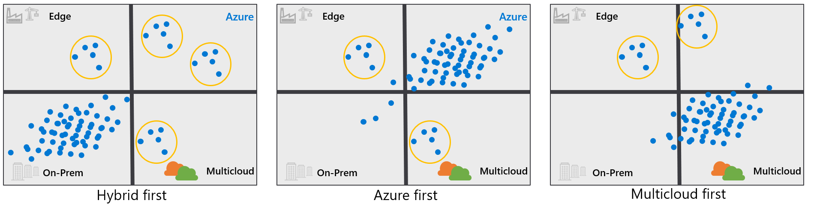

# Strategic considerations of hybrid and multicloud operations

Best practices encourage customers to create a single centralized cloud adoption strategy by using the [Cloud Adoption Framework for Azure Strategy methodology](../../strategy/index.md). If you haven't already, use the [strategy and plan template](https://raw.githubusercontent.com/microsoft/CloudAdoptionFramework/master/plan/cloud-adoption-framework-strategy-and-plan-template.docx) to record your cloud adoption strategy. This article introduces some technical considerations about hybrid and multicloud operations that might affect your strategy.

## Common motivations for a hybrid and multicloud scenario

A hybrid and multicloud scenario isn't a strategy. It's a technical approach with dependencies on specific architectures and tools that can accelerate business and technology strategies. The following common strategic motivations can be affected by using a hybrid and multicloud scenario:

- **Critical business events:** Responding to critical business events is a common driver for hybrid and multicloud adoption. The ability to *connect multiple environments with hybrid networks and move workloads between platforms* allows technology staff to respond rapidly and more effectively to:

  - Business changes from a datacenter exit.
  - Merger/acquisition events.
  - Changes to regulatory compliance.

- **Migration motivations:** Looking beyond immediate and critical events, migration and modernization motivations strive for midterm optimization of technology costs, operational complexity, and business agility. Connectivity between the current environment and the cloud provider allows for one-way migration capabilities. Use of abstraction layers, like containers, Kubernetes, or Azure Kubernetes Service (AKS), streamlines the migration process.

- **Innovation motivations:** When you build solutions to drive long-term innovation, a hybrid and multicloud scenario might accelerate development efforts. Containers, Kubernetes, and AKS allow developers to build solutions with fewer dependencies on the features of any one cloud platform. Azure Stack HCI, Azure Stack Hub, and Azure Stack Edge allow developers to continue innovating with cloud native solutions, even in the local, on-premises datacenter. Conversely, connectivity across multiple clouds allows developers to maximize the use of cloud native services on their chosen platform while they integrate across those clouds for holistic enterprise environments.

Review a detailed list of [common motivations](../../strategy/motivations.md) to see which of the preceding motivations most closely maps to your organization's strategy.

## Hybrid and multicloud outcomes

Before you execute on any cloud strategy, the cloud strategy team should establish a clear set of [measurable business outcomes to track progress](../../strategy/business-outcomes/index.md). A hybrid and multicloud scenario alone is unlikely to deliver any of the common business outcomes. But enabling a hybrid and multicloud approach is often a required milestone and is often tracked as a key result required to unlock business outcomes.

A hybrid and multicloud scenario is also commonly used as a tactic to accelerate the following business outcomes:

- **Agility, global reach, and customer outcomes:** The ability to move between cloud providers allows businesses to more easily deploy to the cloud platform that can best address these business outcomes.
- **Application innovation, data innovation, and data democratization outcomes:** Each outcome is accelerated by allowing development and analytics teams to manage and work with applications and data, regardless of the chosen cloud platform.

## Impact of cloud mix on your strategy

Your hybrid and multicloud strategy for applications and data will drive the answers to the following questions. Clearly identify what intended cloud mix is required, then consider the best configuration for your environments:

- What mixture of hybrid, edge, and multicloud environments do you support today?
- What mixture best aligns with your strategy for the future?
- Do you want to operate each platform independently or through a unified operations approach?

Consider the best configuration for your environments, with a clear understanding of your intended cloud mix.

Review the range of decisions in the following chart, with examples of cloud mixes, and confirm what Azure landing zone option you have chosen. Before you configure any cloud environment, identify how it will support your specific mix of cloud hosting decisions.

Each dark blue dot represents a workload, and each light blue circle a business process, supported by a distinct environment. Each cloud mix requires a different Azure environment configuration for each customer.

- **Hybrid-first customer:** Most workloads stay on-premises, often in a mixture of traditional, hybrid, and portable asset-hosting models. A few specific workloads are deployed to the edge, Azure, or to other cloud providers.

- **Azure-first customer:** Most workloads have been moved to Azure. A few workloads stay on-premises. Strategic decisions have led to a few workloads living on the edge or in multicloud environments.

- **Multicloud-first customer:** Most workloads are currently hosted on a different public cloud, like GCP or AWS. Strategic decisions have led to a few workloads living in Azure or on the edge. You may be moving from a *hybrid-first* mix to an *Azure-first* mix as your cloud strategy matures. We also support customers making strategic decisions to prioritize hybrid or multicloud mixes, and Azure plays a role in each mix.

## Unified operations key considerations

There might be diverse strategic impacts as a result of various hybrid and multicloud decisions. But there's one constant consideration in any strategy that involves a hybrid and multicloud scenario. Investments in unified operations and a single cloud control plane will reduce roadblocks to your hybrid and multicloud projects. The following key considerations are important for unified operations:

- **Improved visibility and control over the IT estate:** Organizations might need the ability to see all their resources in a single location and be able to query through them to gain insights.
- **Cloud-based management:** Organizations might want the ability to modernize operations across platforms with the same cloud management services on resources in locations that are outside of Azure.
- **Governance:** Organizations might want to ensure consistent configurations across all resources from one central location.
- **DevOps and flexible, cloud-native application deployments:** Organizations gain the agility to deploy application infrastructure through templates and application configurations through GitOps.
- **Increased flexibility with platform as a service (PaaS):** Organizations also benefit from the ability to run PaaS services on their infrastructures of choice.

Deploying a single enterprise control plane can accelerate hybrid and multicloud adoption. Organizations can develop cloud readiness with cloud skill-building efforts and process improvements that assume unified operations. Bring innovative cloud practices and technologies to on-premises environments, while you prepare other workloads for migration to the cloud. A single cloud operations management dashboard can help you to manage and govern your operations consistently across on-premises, multicloud, and edge environments. You gain greater visibility into assets scattered across environments, cross-team accountability, and faster, consistent, and at-scale deployments for developers.

## Accelerate hybrid and multicloud adoption with unified operations

Starting comprehensive cloud readiness and skill-building initiatives can accelerate cloud adoption and migration efforts across your organization. Assess and advance cloud readiness, implement innovative cloud practices in your workloads that will remain on-premises, and adopt cloud technologies to prepare other workloads that you might move to the cloud. Work with your cloud strategy team to build the necessary cloud skills and processes to prepare for your migration effort to a hybrid and multicloud environment.

How can unified operations transform your organization's cloud adoption and migration effort?

Azure Arc extends a single enterprise control plane with Azure management and services across hybrid, multicloud, and edge environments. Azure Arc allows for a consistent state across heterogeneous resource environments and infrastructures to:

- **Address data sovereignty and sensitivity.** Deliver data in the private and public cloud with minimal changes per platform.
- **Practice frictionless development.** Support both disconnected and connected use cases.
- **Bring innovative Azure services to any location.** Deploy faster and more consistently, and achieve elastic scale based on capacity.
- **Empower developer teams across the enterprise with the ability to build cloud applications anywhere, at scale.** Code and ship applications to container and Kubernetes clusters anywhere.
- **Consistently speed up development, at scale.** Use templatized deployment, configuration, and security, and reduce errors with policy-driven deployment and operations.
- **Promote greater accountability for enterprise IT teams.** Extend a uniform enterprise control plane from Azure Arc by centralizing visibility, operations, and compliance across resources and locations.
- **Organize, govern, and secure across on-premises, multicloud, and edge environments.** Support Windows, Linux, SQL Server, and Kubernetes.
- **Maintain standardized management and security with unified operations.** Ensure consistency across data workloads.

A combination of hybrid and multicloud environments is the most common scenario found across today's enterprise IT landscape. For most customers, moving to a hybrid and multicloud scenario embraces market reality and is motivated by a sound business strategy. The next decision for your organization is to commit to a distributed cloud computing model that can increase the speed of your cloud adoption and migration efforts.

Initiating a cross-team effort to increase your cloud readiness with innovative cloud practices and technologies is the first step toward implementing a single enterprise control plane. You can consistently protect and monitor resources, standardize governance and security, and manage your operational processes in on-premises, multicloud, and edge environments. Consider a hybrid and multicloud environment to manage your overall digital estate if you're planning a hybrid strategy by design for the next 12 months or longer.

Work with your [cloud strategy team](../../get-started/team/cloud-strategy.md) to build the necessary skill levels and processes to prepare the move to an enterprise control plane across a hybrid, multicloud, and edge environment that encourages greater accountability within IT teams, empowers developer teams, and extends Azure services to any infrastructure, anywhere.

## Unified operations motivations

Various [motivations](../../strategy/motivations.md) might steer customers to adopt a hybrid and multicloud approach. Adopting the right cloud strategy depends on documenting what classification most these motivations are associated with. Are they related to critical business events, migration, or innovation?

Customers might have a digital estate that's bound by specific regulatory requirements and data localization laws that constrain in which geographic location it must reside. A particular industry might require low latency and high connectivity for efficient operational capacity, such as financial services. Low-latency and high-connectivity are common requirements for other industries like media, healthcare, education, and government.

A multinational organization, for example, might have globally distributed, legacy datacenters, with an aging infrastructure that's not compatible with a company-wide migration effort. Or, there might be corporations with even larger cloud estates that are sprawled across several cloud environments, where visibility and control of IT operations is challenging.

## What are the overall benefits of a multicloud control plane?

### Uniform governance and compliance

Azure Arc provides:

- A dashboard view of all your resources to capture and track an accurate inventory of IT assets. Resources include Windows, Linux, SQL servers, and Kubernetes containers.
- A reduced risk in your organization by establishing a unified governance framework and applying a standard set of policies for all workloads.
- For server and application owners, a view of the compliance status of servers, an ability to take necessary remediation steps from the Azure portal, and removal of management overhead from central IT departments for tracking and ensuring adherence to compliance standards.

### Consistent deployments, change control, and DevOps everywhere

With Azure Arc, you can adopt cloud practices on-premises. You can deploy applications by using a consistent approach with familiar tools and practices across your Kubernetes clusters, on any infrastructure. Standardize change control with declarative configuration management systems like GitOps. Easily adopt DevOps techniques like infrastructure as code (IaC), and empower developers with self-service access to a rich selection of tools.

### Deploy and manage Azure data services anywhere

Azure Arc enabled data services provide you with the flexibility to deploy fully managed Azure services on-premises or in the cloud. You can extend cloud benefits everywhere to provide scalability, fast deployment, and always up-to-date cloud innovation, while you adhere to regulatory requirements. Deploy and manage data services within on-premises environments or in customer regions, and reduce latency. Access the latest Azure features and capabilities for on-premises data workloads. Join our public preview to deploy evergreen SQL (SQL Managed Instance) and PostgreSQL hyperscale on any infrastructure. You can also benefit from automatic updates, patches, and upgrades with no application downtime.

## What are the benefits of a multicloud control plane for IT departments?

For IT administrators, Azure Arc brings consistency and a unified dashboard with a consistent view into thousands of servers across customer environments. Use existing tools on-premises to seamlessly interact with resources, without interfering with existing management tools.

### Inventory management and resource organization

Control resources at organizational, team, and personal levels. Bring them into a single system to organize and inventory through Azure scopes like management groups, subscriptions, and resource groups. Create, apply, and enforce standardized and custom tags to keep track of resources. Build powerful queries and search global portfolios by using Azure Resource Graph.

### Extend cloud practices on-premises

Easily adopt DevOps techniques like IaC. Empower developers with self-service access to a variety of tools and centralized IT governance and guidance. Standardize change control with declarative configuration management systems like GitOps.

### Easily implement Azure security anywhere

Access Azure Security Center's system of unified infrastructure security management. Strengthen your security posture with advanced threat protection across hybrid workloads in the cloud, no matter whether in Azure, multicloud, or on-premises environments. Centrally access and manage all resources with Azure role-based access control (RBAC). Centrally manage and enforce policy compliance, and simplify audit reporting with Azure Policy.

### Governance and configuration of resources anywhere

Standardize activities by creating, applying, and enforcing policies to Kubernetes applications, data, and infrastructure anywhere. Set guardrails across all resources with Azure Policy. Ensure consistent configurations to a single server, cluster, or data service, or at scale by using inheritance capabilities. Standardize RBAC across systems and different types of resources. Automate and delegate remediation of incidents to service teams without IT intervention. Enforce runtime conformance and audit resources with Azure Policy.

### Unified tools and experiences across platforms

Create a shared application and infrastructure lifecycle within teams traditionally siloed by location, skill, and job description. Simplify work with a unified, consistent view of resources across datacenters, edge locations, and multicloud environments through the Azure portal and Azure API Management. Connect and gain access to Windows and Linux virtual machines, physical servers, and any Kubernetes distribution within the Kubernetes ecosystem. Bring Azure data services to on-premises, multicloud, and edge environments with Azure Arc enabled data services. Establish clear roles and responsibilities for team members with clear separation of concerns, without losing visibility and access.

### Integrated DevOps and management capabilities

Select another Azure Arc enabled service, Azure development, and operational tools that are developer tooling-agnostic. Access a unified enterprise dashboard that grants you a consistent view across environments via GitHub, Azure Monitor, Security Center, Azure update integration, and more. Deploy common templates to automate configurations, and deploy IaC to make safe and repeatable production deployments. Manage end-to-end identity and access across all users and resources with Azure Active Directory, enterprise identity service, and Azure Resource Manager.

## Next steps

For more guidance for your cloud adoption journey, see the following articles:

- [Plan for hybrid and multicloud](./plan.md)
- [Review your environment or Azure landing zones](./ready.md)
- [Hybrid and multicloud migration](./migrate.md)
- [Govern hybrid and multicloud environments](./govern.md)
- [Manage hybrid and multicloud environments](./manage.md)
