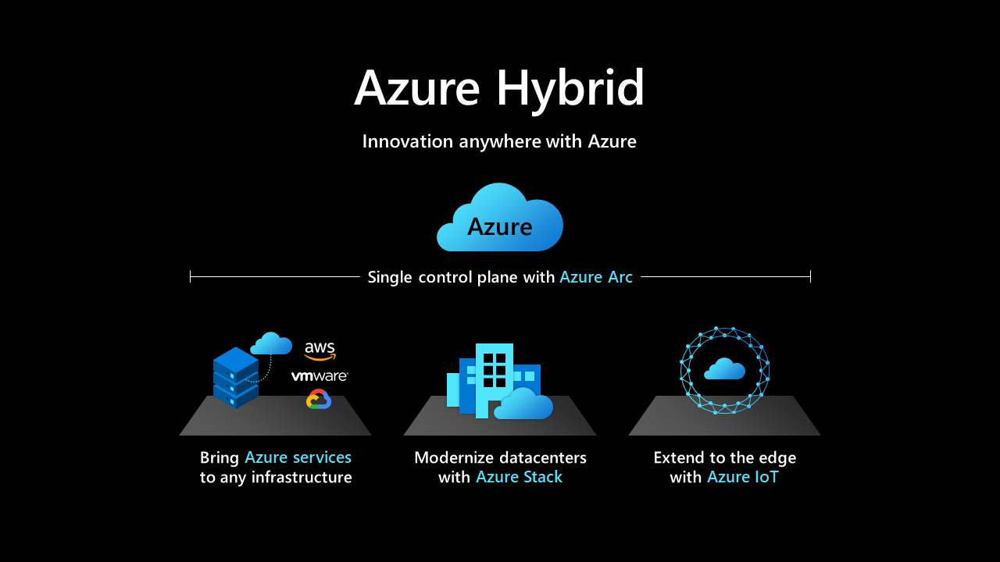

# Introduction to hybrid and multicloud products on Azure

Relying on an effective multicloud, multiedge hybrid approach is more important than ever. Azure focuses on supporting the hybrid needs of customers with hybrid integration across Azure products.

Customers have grown more sophisticated in their adoption of multiple clouds. Several Azure products have broadened that perspective to support the on-premises, multicloud, edge, and unified operations requirements of customers. Hybrid integration means customers can consistently build and deploy applications and databases, operate seamlessly, and deliver integrated cloud security across heterogeneous environments, with unified governance and management.

This article introduces a few of the Azure products with hybrid and multicloud capabilities that can provide this capability across your cloud portfolio.

For a deeper look at what you can do with Azure's hybrid and multicloud products, see the [Azure hybrid and multicloud hub](/hybrid/).

This article series helps to integrate these tools into relevant processes that range from initial business strategy to workload optimization, and long into your operations management cycles.

## Manage hybrid and multicloud environments with unified operations tools

- [Azure Arc](/azure/azure-arc/?toc=/azure/cloud-adoption-framework/toc.json&bc=/azure/cloud-adoption-framework/_bread/toc.json) is a cloud-based service that extends the Azure Resource Manager-based management model to non-Azure resources like virtual machines, Kubernetes clusters, and containerized databases.
- [Azure Arc-enabled servers](/azure/azure-arc/servers/overview?toc=/azure/cloud-adoption-framework/toc.json&bc=/azure/cloud-adoption-framework/_bread/toc.json) is a hybrid service you can use to manage your Windows and Linux machines, hosted outside of Azure, on your corporate network or other cloud provider. This capability is similar to how you manage native Azure VMs.
- [Azure Arc-enabled Kubernetes](/azure/azure-arc/kubernetes/overview?toc=/azure/cloud-adoption-framework/toc.json&bc=/azure/cloud-adoption-framework/_bread/toc.json) is a hybrid service you can use to streamline deployment and management of Kubernetes clusters inside or outside of Azure.
- [Azure Arc-enabled SQL Server](/sql/sql-server/azure-arc/overview?toc=/azure/cloud-adoption-framework/toc.json&bc=/azure/cloud-adoption-framework/_bread/toc.json) is a part of the Azure Arc-enabled servers that extends Azure services to SQL Server instances, hosted outside of Azure in the customer's datacenter, on the edge or in a multicloud environment.
- [Azure Arc-enabled data services](/azure/azure-arc/data/overview?toc=/azure/cloud-adoption-framework/toc.json&bc=/azure/cloud-adoption-framework/_bread/toc.json) is a hybrid service that makes it possible to run Azure data services on-premises, at the edge, and in public clouds by using Kubernetes and the infrastructure of your choice.
- [Azure Arc-enabled SQL Managed Instance](/azure/azure-arc/data/managed-instance-overview?toc=/azure/cloud-adoption-framework/toc.json&bc=/azure/cloud-adoption-framework/_bread/toc.json) is an Azure SQL Database data service that can be created on your choice of infrastructure that hosts Azure Arc-enabled data services.
- Azure Arc-enabled application services is a hybrid service that makes it possible to run Azure application services on-premises, at the edge, and in public clouds by using Kubernetes and the infrastructure of your choice.
  - [Web Apps](/azure/app-service/overview-arc-integration?toc=/azure/cloud-adoption-framework/toc.json&bc=/azure/cloud-adoption-framework/_bread/toc.json)
  - [Functions](/azure/app-service/overview-arc-integration?toc=/azure/cloud-adoption-framework/toc.json&bc=/azure/cloud-adoption-framework/_bread/toc.json)
  - [Logic Apps](/azure/app-service/overview-arc-integration?toc=/azure/cloud-adoption-framework/toc.json&bc=/azure/cloud-adoption-framework/_bread/toc.json)
  - [Event Grid](/azure/event-grid/kubernetes/?toc=/azure/cloud-adoption-framework/toc.json&bc=/azure/cloud-adoption-framework/_bread/toc.json)
  - [Azure API Management gateway](/azure/api-management/how-to-deploy-self-hosted-gateway-azure-arc?toc=/azure/cloud-adoption-framework/toc.json&bc=/azure/cloud-adoption-framework/_bread/toc.json)

## Deploy hybrid and multicloud solutions

- [Azure Stack HCI (20h2)](/azure-stack/hci/overview?toc=/azure/cloud-adoption-framework/toc.json&bc=/azure/cloud-adoption-framework/_bread/toc.json) is a hyperconverged infrastructure (HCI) cluster solution that hosts virtualized Windows and Linux operating system workloads and their storage in a hybrid on-premises environment. A cluster consists of 2 to 16 physical nodes.
- [Azure Kubernetes Service (AKS) on Azure Stack HCI](/azure-stack/aks-hci/overview?toc=/azure/cloud-adoption-framework/toc.json&bc=/azure/cloud-adoption-framework/_bread/toc.json) is an implementation of AKS, which automates running containerized applications at scale on Azure Stack HCI.
- [Azure Kubernetes Service](/azure/aks/intro-kubernetes?toc=/azure/cloud-adoption-framework/toc.json&bc=/azure/cloud-adoption-framework/_bread/toc.json) makes it simple to deploy a managed Kubernetes cluster in Azure.
- [Azure IoT Edge](/azure/iot-edge/?toc=/azure/cloud-adoption-framework/toc.json&bc=/azure/cloud-adoption-framework/_bread/toc.json) deploys cloud-based solutions to the edge of your local environment, with full support from Azure to manage those devices and the IoT data they produce.

## Connect your hybrid and multicloud environments

- [Azure Virtual WAN](/azure/virtual-wan/?toc=/azure/cloud-adoption-framework/toc.json&bc=/azure/cloud-adoption-framework/_bread/toc.json) connects to a secure, global branching solution.
- [Azure ExpressRoute](/azure/expressroute/?toc=/azure/cloud-adoption-framework/toc.json&bc=/azure/cloud-adoption-framework/_bread/toc.json) establishes a fast, private connection to Microsoft cloud services.
- [Azure VPN Gateway](/azure/vpn-gateway/vpn-gateway-about-vpngateways?toc=/azure/cloud-adoption-framework/toc.json&bc=/azure/cloud-adoption-framework/_bread/toc.json) sends encrypted traffic to Azure.
- [Azure Firewall](/azure/firewall/overview?toc=/azure/cloud-adoption-framework/toc.json&bc=/azure/cloud-adoption-framework/_bread/toc.json) is a fully stateful firewall as a service with built-in high availability and unrestricted cloud scalability.
